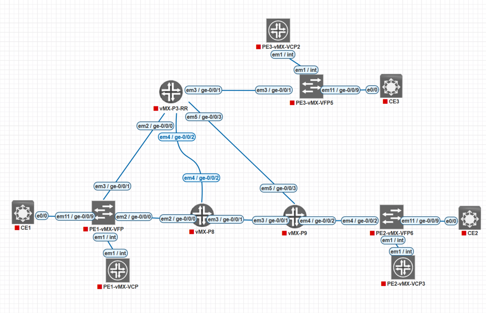

# Junos Layer 2 VPNs

**BGP-signaled L2VPNs and LDP-signaled L2Circuits on Junos OS, from concepts to configuration and troubleshooting**

> Study notes by [Nazirul Roslan](https://www.linkedin.com/in/nazirulroslan) · JNCIP-SP

These notes cover the Layer 2 VPN portion of my JNCIP-SP studies: how service providers carry a customer's Ethernet frames across an MPLS core as point-to-point pseudowires. They start with a refresher on VPNs and MPLS, go deep on BGP-signaled L2VPNs (Kompella: site IDs, label blocks, multihoming, route target filtering), then cover LDP-signaled L2Circuits (Martini). Each note has Junos configuration, lab output from the same vMX topology, packet captures, exam tips, practice questions and a recall section.

> [!TIP]
> Before starting, you should be comfortable with MPLS and BGP. The [Junos MPLS Fundamentals](../../Junos-MPLS-Fundamentals/README.md) and [JNCIS-SP BGP](../../JNCIS-SP/notes/007-bgp.md) notes cover what you need.



---

## 📚 Contents

### Foundations

| # | Topic | What's inside |
|---|---|---|
| 001 | [Introduction to Junos Layer 2 VPNs](notes/001-introduction-to-junos-l2vpns.md) | Course scope, the L2VPN technologies covered, prerequisites |
| 002 | [Refresher: VPNs and MPLS](notes/002-refresher-vpns-and-mpls.md) | VPN types, PE/P/CE roles, the MPLS data plane, the two-label stack, L3VPN vs. L2VPN |
| 003 | [The Different Flavors of Layer 2 VPN](notes/003-flavors-of-layer-2-vpn.md) | Virtual wire vs. virtual switch: pseudowires, signaling options, VPLS, EVPN |

### BGP-signaled L2VPN (Kompella)

| # | Topic | What's inside |
|---|---|---|
| 004 | [L2VPN: BGP-Signaled Pseudowires](notes/004-bgp-signaled-l2vpn.md) | Attachment circuits, RDs and RTs, control and data planes, BGP packet capture |
| 005 | [L2VPN Configuration](notes/005-l2vpn-configuration.md) | Port-based and VLAN-based L2VPNs, verification, evolving to VPLS, full lab |
| 006 | [L2VPN Troubleshooting](notes/006-l2vpn-troubleshooting.md) | Bottom-up method, status codes, transport, BGP, attachment-circuit and site ID faults |
| 007 | [L2VPN Site IDs, the Label Base and Overprovisioning](notes/007-site-ids-label-base-overprovisioning.md) | Label block maths, implicit vs. explicit remote site IDs, hub-and-spoke lab |
| 008 | [L2VPN Advanced Concepts](notes/008-l2vpn-advanced-concepts.md) | Multihoming and site preference, control word, VLAN normalization, route target filtering, routing tables |

### LDP-signaled L2Circuit (Martini)

| # | Topic | What's inside |
|---|---|---|
| 009 | [L2Circuit: LDP-Signaled Pseudowires](notes/009-l2circuit-ldp-signaled-pseudowires.md) | Targeted LDP, configuration, FEC 128 packet capture, L2VPN vs. L2Circuit |
| 010 | [L2Circuit Troubleshooting](notes/010-l2circuit-troubleshooting.md) | Pseudowire Status TLV, `show l2circuit connections` codes, failure scenarios |

---

## 🗂️ Folder layout

```
JunosL2-VPNs/
├── README.md          ← you are here
└── notes/             ← study guides 001–010
    └── images/        ← topologies, diagrams, packet captures and lab screenshots
```

---

> [!NOTE]
> Personal study notes, not official Juniper material. Commands and output can vary between Junos releases and platforms, so check against the Juniper documentation and your own lab.
