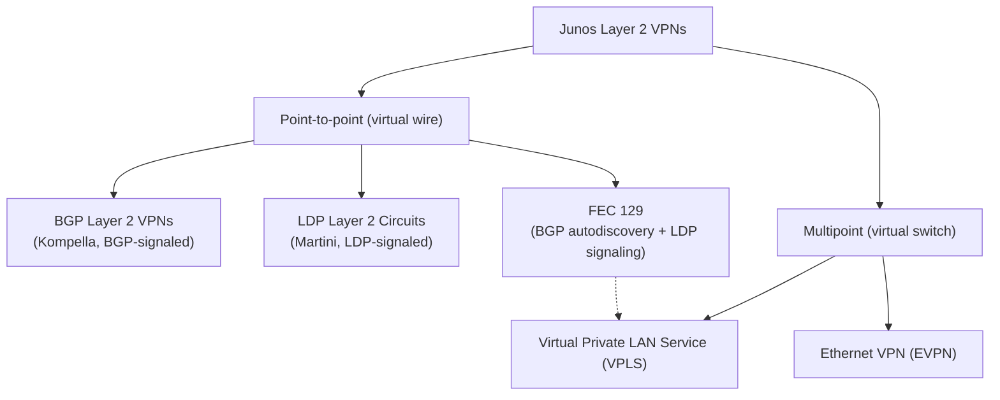

# Introduction to Junos Layer 2 VPNs

**Course scope, the Layer 2 VPN technologies covered, and the prerequisites you need**

> Study notes by [Nazirul Roslan](https://www.linkedin.com/in/nazirulroslan) · JNCIP-SP · Junos Layer 2 VPNs · Part 001

[Index](../README.md) · [Next: Refresher: VPNs and MPLS](002-refresher-vpns-and-mpls.md) →

**Contents:** [1 Course Overview](#module-1-course-overview) · [2 Prerequisites](#module-2-prerequisites) · [3 Practice](#module-3-exam-practice-questions) · [4 Glossary](#module-4-glossary)

---

## Module 1: Course Overview

**Objectives:**
- Understand the scope and main topics of the Junos Layer 2 VPNs (JL2V) course.
- Identify the different types of Layer 2 VPN technologies covered.
- Recognize the target audience for this course.

### 1.1 What are Junos Layer 2 VPNs?

This course focuses on the Junos OS-specific implementations of various Layer 2 VPN technologies. The primary goal is to provide services that extend a customer's Layer 2 network (like an Ethernet LAN) across a service provider's IP/MPLS core network. From the customer's perspective, their remote sites appear to be connected to the same local Ethernet switch, even though they may be hundreds of miles apart.

*Course overview: the Layer 2 VPN technologies covered in this series. FEC 129 applies to both point-to-point pseudowires and VPLS.*

### 1.2 Key technologies covered

The course material is structured around several key technologies, each providing a different way to achieve Layer 2 extension:

| Technology | Topology | Signaling | Summary |
|---|---|---|---|
| **BGP Layer 2 VPNs (Kompella L2VPNs)** | Point-to-point | BGP | Uses BGP as the signaling protocol to establish pseudowires between PE routers. Known for its scalability in large networks. |
| **LDP Layer 2 Circuits (Martini L2Circuits)** | Point-to-point | LDP (targeted sessions) | Another point-to-point solution, but using LDP for signaling. Often considered simpler to configure for smaller-scale deployments. |
| **Forwarding Equivalence Class (FEC) 129** | Point-to-point or multipoint | BGP autodiscovery, LDP signaling | An enhancement that allows autodiscovery of VPLS neighbors (and point-to-point pseudowire endpoints), simplifying configuration by removing the need for a full mesh of manual neighbor statements. |
| **Virtual Private LAN Service (VPLS)** | Point-to-multipoint | BGP or LDP | Creates a virtual Ethernet switch across the provider's core. All customer sites connected to the VPLS instance can communicate as if they were on the same LAN segment. |
| **Ethernet VPN (EVPN)** | Multipoint (also point-to-point with EVPN-VPWS) | BGP | The modern, next-generation solution for Layer 2 extension. EVPN uses BGP to advertise MAC addresses, providing superior scalability, multihoming capabilities and better integration with Layer 3 VPNs compared to VPLS. |

> [!NOTE]
> A clarification on FEC 129: the FEC 129 (Generalized PWid) element is the LDP signaling part. The autodiscovery itself is done by **BGP** (BGP autodiscovery, BGP-AD), which tells each PE which remote PEs belong to the same VPN; LDP then signals the pseudowires to them. In Junos, FEC 129 is used for both VPLS and point-to-point (VPWS) pseudowires. For reference, the standards behind the names: BGP L2VPN (Kompella) is RFC 6624, LDP pseudowires (Martini) are RFC 4447 (now RFC 8077) with Ethernet encapsulation in RFC 4448.

### 1.3 Audience profile

This course is designed for network professionals who are responsible for configuring, monitoring and troubleshooting devices running Junos OS in complex environments. This includes:
- Service provider network engineers
- Data center engineers working with MPLS-based fabrics
- Enterprise network engineers managing large-scale networks

---

## Module 2: Prerequisites

**Objectives:**
- Identify the required foundational knowledge for this course.
- Understand why a strong grasp of IGPs, BGP and MPLS is essential.

### 2.1 Foundational knowledge

To succeed in this course, a solid foundation in several key areas is required. Layer 2 VPNs are an advanced topic that builds directly on core routing, switching and MPLS principles.

- **Intermediate-level networking knowledge:** you should be comfortable with the OSI model, IP addressing and basic network operations.
- **Understanding of OSPF, IS-IS and BGP:** all L2VPN solutions rely on an IGP (like OSPF or IS-IS) to provide core reachability, and on BGP for signaling in BGP L2VPN, VPLS with BGP signaling or autodiscovery, and EVPN. You must understand how these protocols work (refresher: [BGP](../../../JNCIS-SP/notes/007-bgp.md)).
- **Junos routing policy:** policies are used extensively to control routing information and are critical for proper VPN operation.
- **Experience configuring MPLS LSPs:** the provider core is an MPLS network. You must know how to configure and verify basic LSPs using both LDP and RSVP (refresher: [MPLS mechanics](../../../Junos-MPLS-Fundamentals/notes/02-mpls-mechanics.md)).
- **Familiarity with Junos OS, switching and routing:** prior experience with the Junos CLI and concepts from introductory Juniper courses is assumed.

> [!TIP]
> **Exam tip: don't neglect the fundamentals.** The JNCIP-SP exam will not only test you on L2VPN configuration but also on troubleshooting scenarios where the underlying IGP or MPLS transport is broken. A strong understanding of these prerequisites is non-negotiable for success.

---

## Module 3: Exam Practice Questions

**Question 1.** Which Layer 2 VPN technology is considered the modern, next-generation solution due to its superior scalability and multihoming features?

- A) LDP Layer 2 Circuits
- B) VPLS
- C) EVPN
- D) BGP Layer 2 VPNs

Answer

**C.** EVPN (Ethernet VPN) is the successor to VPLS, using BGP for MAC address learning and offering significant improvements in scalability, redundancy and integration with Layer 3 services.

**Question 2.** A network engineer needs to set up a simple point-to-point Layer 2 connection between two sites and prefers to use LDP for signaling. Which technology should they choose?

- A) VPLS
- B) EVPN
- C) BGP Layer 2 VPN
- D) LDP Layer 2 Circuit

Answer

**D.** LDP Layer 2 Circuits (also known as Martini pseudowires) are specifically designed for point-to-point services using LDP as the signaling protocol.

---

## Module 4: Glossary

| Term | Definition |
|---|---|
| **Layer 2 VPN (L2VPN)** | A service that connects two or more customer sites at Layer 2 over a provider's Layer 3 network, making them appear as if they are on the same local network segment. |
| **Pseudowire (PW)** | A virtual point-to-point connection that emulates a physical wire across an IP/MPLS network. It is the fundamental building block of point-to-point L2VPNs. |
| **VPLS** | Virtual Private LAN Service. A point-to-multipoint L2VPN technology that emulates an Ethernet switch, allowing multiple sites to connect to the same broadcast domain. |
| **EVPN** | Ethernet VPN. A next-generation L2VPN technology that uses BGP to exchange MAC address information, offering enhanced scalability, multihoming and flexibility over VPLS. |
| **Signaling** | The process PE routers use to communicate with each other to establish and maintain the L2VPN service. Common signaling protocols are BGP and LDP. |
| **PE router** | Provider Edge router. A router at the edge of the service provider's network that connects directly to the customer's equipment (CE router). |

---

[Index](../README.md) · [Next: Refresher: VPNs and MPLS](002-refresher-vpns-and-mpls.md) →
