# L2VPN: BGP-Signaled Pseudowires

**Attachment circuits, route targets and distinguishers, and the L2VPN control and data planes, down to the packet capture**

> Study notes by [Nazirul Roslan](https://www.linkedin.com/in/nazirulroslan) · JNCIP-SP · Junos Layer 2 VPNs · Part 004

← [Previous: The Different Flavors of Layer 2 VPN](003-flavors-of-layer-2-vpn.md) · [Index](../README.md) · [Next: L2VPN Configuration](005-l2vpn-configuration.md) →

**Contents:** [1 Fundamentals](#module-1-l2vpn-fundamentals-and-attachment-circuits) · [2 RTs and RDs](#module-2-bgp-building-blocks-route-targets-and-distinguishers) · [3 Control Plane](#module-3-the-l2vpn-control-plane) · [4 Data Plane](#module-4-the-l2vpn-data-plane) · [5 Packet Capture](#module-5-deep-dive-bgp-packet-capture-analysis) · [6 Glossary](#module-6-glossary) · [7 Dynamic Recall](#module-7-dynamic-recall)

---

## Module 1: L2VPN Fundamentals and Attachment Circuits

**Objectives:**
- Introduce BGP-signaled pseudowires (Kompella circuits).
- Define the attachment circuit.
- Differentiate between Ethernet (raw) and Ethernet-VLAN pseudowire encapsulation modes.
- Clarify how service provider and enterprise engineers see VLAN tags differently.

### 1.1 Introduction to BGP L2VPNs

With the two L2VPN models (virtual wires and virtual switches) covered, it's time for the first specific technology: the BGP-signaled virtual wire. In Junos it's configured with the `l2vpn` protocol, which is why it's usually just called an "L2VPN".

It's one of the oldest pseudowire technologies, documented in **RFC 6624** and often called a **"Kompella circuit"** after the author of the original IETF draft. Because it's mature, it's well understood and widely deployed. For new deployments, though, EVPN is increasingly preferred for its richer feature set.

> [!NOTE]
> Strictly, the `l2vpn` protocol lives inside a routing instance: `set routing-instances <name> instance-type l2vpn` plus `set routing-instances <name> protocols l2vpn ...` (encapsulation type, site, interfaces). There's no global `[edit protocols l2vpn]` for this service. The BGP side is enabled separately with `family l2vpn signaling`.

**Decoding the terminology:**

| Term | Meaning |
|---|---|
| **l2vpn (generic)** | The general category of all Layer 2 VPN services (pseudowires, VPLS, EVPN). |
| **L2VPN (Junos-specific)** | Only a BGP-signaled, point-to-point pseudowire (Kompella). |

From here on, "L2VPN" means the Junos-specific term.

### 1.2 Attachment circuits

The connection from a customer's CE to the provider's PE is an **attachment circuit (AC)**. Think of it as a *logical* connection, not just a physical one. As RFC 6624 describes, one physical link can host several virtual circuits, each a separate AC.

Junos implements this with logical units. One physical interface (for example `xe-1/0/1`) can be split into several units (`.100`, `.200`, `.300`), each one a separate attachment circuit. A pseudowire always maps **one** AC on one PE to **one** AC on another PE.

#### VLANs: enterprise vs. service provider view

For an enterprise engineer, a VLAN tag usually represents an IP subnet ("VLAN 10 is the voice subnet"). For a service provider engineer, a VLAN tag is mainly a **multiplexing tool**. Its only job is to tell customers or services apart on a shared physical interface. The VLAN ID on the CE-PE link is locally significant and arbitrary: it just identifies which logical attachment circuit the traffic belongs to.

### 1.3 Encapsulation types

When you configure the customer-facing interface on the PE, you decide how to treat incoming VLAN tags. There are two main modes.

#### Ethernet (raw mode)

The PE treats the entire incoming frame as payload, including any customer VLAN tags. The provider is completely transparent to the customer's VLANs. A single logical interface on the PE accepts all traffic (tagged or untagged) and tunnels it over one pseudowire. The customer can use any VLANs they like without telling the provider.


#### Ethernet-VLAN mode

Here the VLAN tag is not just payload: it selects which pseudowire the traffic goes down. One physical interface can host several attachment circuits, each a logical unit tied to a VLAN tag. A hub site can then have separate point-to-point connections to several remote sites over one physical link.


> [!NOTE]
> **How this maps to Junos configuration.** The mode is set per instance with `encapsulation-type ethernet` or `encapsulation-type ethernet-vlan` under `routing-instances <name> protocols l2vpn`, and must match the interface encapsulation:
>
> | Mode | Interface side (typical) | Pseudowire type advertised |
> |---|---|---|
> | Ethernet (raw) | Physical `encapsulation ethernet-ccc`, `unit 0 family ccc` | 5 (Ethernet) |
> | Ethernet-VLAN | `vlan-tagging` or `flexible-vlan-tagging`, per-unit `encapsulation vlan-ccc` (or `extended-vlan-ccc`), `vlan-id`, `family ccc`; physical `encapsulation` set to `vlan-ccc`, `extended-vlan-ccc` or `flexible-ethernet-services` | 4 (Ethernet VLAN) |
>
> `flexible-ethernet-services` is the usual choice when one port mixes CCC units with normal Layer 3 units. The configuration part (005) walks through a full example.

### Knowledge check

**What factors differentiate the Ethernet encapsulation from the Ethernet-VLAN encapsulation when you configure a customer-facing interface on your PE? (Choose two.)**

- A) The incoming VLAN tags are a part of the payload.
- B) The VLAN tags indicate the specific pseudowire used to forward the frame.
- C) A customer interface can host many attachment circuits.
- D) A customer interface accepts all incoming traffic, tagged or untagged.

<details><summary>Answer</summary>

**A and B.** In Ethernet (raw) mode, VLAN tags are just payload (A). In Ethernet-VLAN mode, the VLAN tag selects the pseudowire (B). These two statements are the defining difference: how each mode treats the VLAN tag. C and D are side effects of that choice (hosting many ACs on one port follows from B; accepting everything, tagged or untagged, follows from A) rather than the factor itself.

</details>

> [!NOTE]
> The original explanation said "both modes can have multiple attachment circuits" and "only Ethernet (raw) mode accepts all traffic (D is not a differentiator)", which contradicts itself. The answer (A and B) stands; the explanation above says why C and D aren't picked.

### Key takeaways

> [!IMPORTANT]
> A BGP L2VPN builds a virtual wire between logical attachment circuits. The key interface choice is **Ethernet** mode, which tunnels all customer traffic transparently, vs. **Ethernet-VLAN** mode, which uses VLAN tags to multiplex several pseudowires onto one physical interface. Next: the BGP components that signal and identify these virtual wires across the core.

---

## Module 2: BGP Building Blocks: Route Targets and Distinguishers

**Objectives:**
- Explain the function, syntax and importance of route targets (RTs).
- Explain the purpose of route distinguishers (RDs), their formats, and their impact on multihoming.

### 2.1 Route targets (RTs): defining VPN membership

One of the most important parts of any BGP-signaled MPLS VPN is the **route target (RT)**. An RT is a BGP extended community that works like a tag, identifying which VPN an advertisement belongs to. PEs export routes with a given RT and import routes tagged with the same RT.

This is the key to **PE autodiscovery**. A PE doesn't need to know the remote PE's IP address. It just advertises its local L2VPN site information with the right RT. Any other PE configured for the same customer VPN sees the RT, imports the route and signals the pseudowire automatically. This greatly simplifies configuration and migrations.

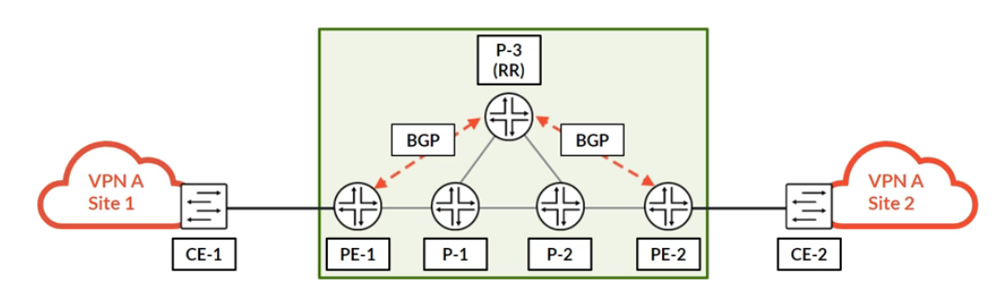

In this example, PE-1 advertises Site 1 with RT `64512:111`. PE-2 is configured to import RT `64512:111`, so it learns about Site 1 and builds the pseudowire.

### 2.2 Route distinguishers (RDs): ensuring uniqueness

RTs handle VPN membership. **Route distinguishers (RDs)** solve a different problem: uniqueness. Imagine two customers who both use the same private IP range (or, for L2VPN, the same site IDs). If a PE advertises both, how can BGP tell them apart? One advertisement would simply overwrite the other.

An RD is a 64-bit value prepended to the customer's advertisement, making it unique within the provider network. A PE can then advertise identical-looking information for two different customers without conflict.

| Attribute | Route Distinguisher (RD) | Route Target (RT) |
|---|---|---|
| **Purpose** | Makes an advertisement unique. | Controls VPN membership (import/export). |
| **Analogy** | A unique apartment number (e.g. Apt #123). | The mailing list you're subscribed to. |
| **Scope** | Must be unique per VPN per PE router. | Must be consistent for all sites in the same VPN. |

> [!TIP]
> A handy pair of analogies: the **RD** is the apartment number that makes your letter unique; the **RT** is the mailing list that decides who receives it.

### 2.3 RD formats and use cases

Junos supports three RD formats. All are valid, but Type 1 has a real advantage for multihoming.

| RD type | Format | Example |
|---|---|---|
| Type 0 | 2-byte AS number : 4-byte number | `64512:1234567` |
| **Type 1** | **4-byte IP address : 2-byte number** | **`192.168.1.1:12345`** |
| Type 2 | 4-byte AS number : 2-byte number | `4200000000:12345` |

> [!NOTE]
> In Junos configuration, a 4-byte AS value in an RD or route target is usually written with an `L` suffix (for example `4200000000L:12345`) so it's encoded as the 4-byte-AS type. Check the exact syntax on your release.

#### When to use which RD type: the multihoming advantage

**Use Type 1 for multihomed sites.** When a customer site connects to two PEs for redundancy, a Type 1 RD built from each PE's loopback makes the advertisements from the two PEs unique. The route reflector then doesn't hide one path behind the other, and both paths are advertised. With BGP multipath also enabled, this allows true load balancing and gives immediate fast failover.

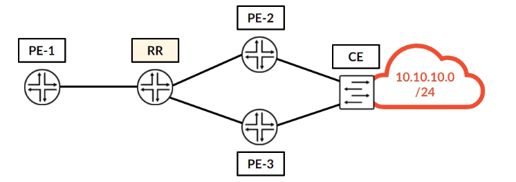

> [!NOTE]
> The load-balancing part applies to IP (L3VPN-style) prefixes like the 10.10.10.0/24 in the diagram. A BGP L2VPN pseudowire is point-to-point, so with a multihomed L2VPN site the remote PE builds the pseudowire to **one** PE at a time (chosen by BGP path selection, typically influenced with `site-preference`) and keeps the other as a backup. Unique RDs still matter there: they make sure the remote PE learns both advertisements, which is what makes quick failover possible. Multihoming is covered in the advanced concepts part (008).

### Knowledge check

**What advantages does the Type 1 route distinguisher offer when a site is multihomed to different PE routers? (Choose two.)**

- A) Load balancing
- B) Fast failover
- C) Unique advertisements
- D) Different route targets

<details><summary>Answer</summary>

**A and B.** By making each PE's advertisement unique (C, the mechanism rather than the advantage), a Type 1 RD lets a remote PE learn both paths. That enables load balancing (A) and gives an immediate backup path for fast failover (B). For a BGP L2VPN pseudowire specifically, the practical benefit is fast failover; see the note above.

</details>

### Key takeaways

> [!IMPORTANT]
> Route targets control VPN membership; route distinguishers make advertisements unique. These two BGP attributes are the basic building blocks of all MPLS VPNs. Next: how they're used in the L2VPN control plane to signal a pseudowire into existence.

---

## Module 3: The L2VPN Control Plane

**Objectives:**
- List the prerequisites for an L2VPN control plane.
- Describe the step-by-step BGP signaling process for an L2VPN pseudowire.

### 3.1 Prerequisites

Before a BGP-signaled L2VPN can come up, three pieces of infrastructure must be in place in the provider network:

| Prerequisite | Why |
|---|---|
| **IGP reachability** | An IGP (IS-IS or OSPF) provides loopback reachability between all PE routers. |
| **MPLS transport** | An MPLS signaling protocol (LDP or RSVP) builds the transport LSPs that carry VPN traffic between PE loopbacks. |
| **IBGP peering** | An IBGP session between the PEs (directly or via a route reflector) with the L2VPN address family enabled: `family l2vpn signaling`. |

> [!NOTE]
> Junos resolves the BGP next hop of an L2VPN route (the remote PE's loopback) in `inet.3`, which is where LDP and RSVP install their LSPs. If there's no LSP to the remote PE, the pseudowire can't come up even though BGP is fine. Route reflectors are covered in the [BGP notes](../../../JNCIS-SP/notes/007-bgp.md).

### 3.2 The signaling process

Once the prerequisites are met, the control plane comes up in a series of steps:

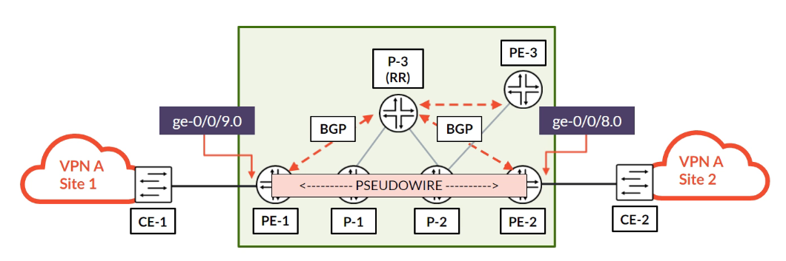

1. **Advertisement:** PE-1 sends a BGP UPDATE for its local site to the route reflector (RR). The update carries the L2VPN NLRI (RD, site ID and label block) and is tagged with the customer's route target.
2. **Reflection:** the RR reflects the update to all its clients, including PE-2 and any other PEs.
3. **Import/discard:** PE-2 receives the update and checks the RT. Because it matches a locally configured VPN, PE-2 accepts it and stores it in a special table, `bgp.l2vpn.0`. Any PE without a matching RT simply discards the update.
4. **Validation and installation:** PE-2 validates the advertisement (for example encapsulation type and MTU) and calculates the VPN label it must use to send traffic to PE-1. If all checks pass, it installs the information in the customer's instance table (for example `VPN-A.l2vpn.0`).
5. **Symmetric process:** PE-2 does the same in the other direction, advertising its own site to PE-1. Once both PEs have processed each other's advertisements, the pseudowire is **Up**.

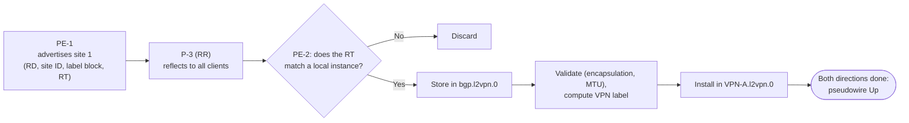

> [!NOTE]
> The "same table" rule has one exception worth knowing: a route reflector (or any router with `keep all`) keeps every L2VPN route in `bgp.l2vpn.0` even with no local instance, because it must reflect them. A normal PE keeps only routes whose RTs match a local instance.

### Knowledge check

**What does the `bgp.l2vpn.0` table contain in a control plane?**

- A) Every L2VPN advertisement that matches a route target configured on the PE.
- B) All the locally configured routing instances in the network.
- C) The VPN labels and site IDs of the L2VPN advertisement.
- D) The L2VPN instance names that match the route targets.

<details><summary>Answer</summary>

**A.** `bgp.l2vpn.0` is the main store for every incoming L2VPN advertisement the local PE has accepted because of a matching route target. From there, routes are imported into the specific customer instances (`<instance>.l2vpn.0`).

</details>

### Key takeaways

> [!IMPORTANT]
> The L2VPN control plane uses BGP, route targets and route distinguishers to discover remote endpoints automatically and signal the pseudowire. Once it's **Up**, the network is ready to forward customer traffic. Next: a frame's journey through the data plane.

---

## Module 4: The L2VPN Data Plane

**Objectives:**
- Follow a customer frame hop by hop across the MPLS core.
- Explain the job of the two-label stack at each step.

### 4.1 A frame's journey from CE-2 to CE-1

With the control plane up, follow one Ethernet frame from HOST-2 at Site 2 (192.168.10.52/24) to HOST-1 at Site 1 (192.168.10.50/24). The key point: the PEs handle the MPLS complexity, while the P routers just do fast label swapping.

**Step 1: CE-2 to PE-2.** A standard Ethernet frame arrives at PE-2 from the customer. PE-2 knows from its configuration that anything arriving on this attachment circuit belongs to the pseudowire towards PE-1.

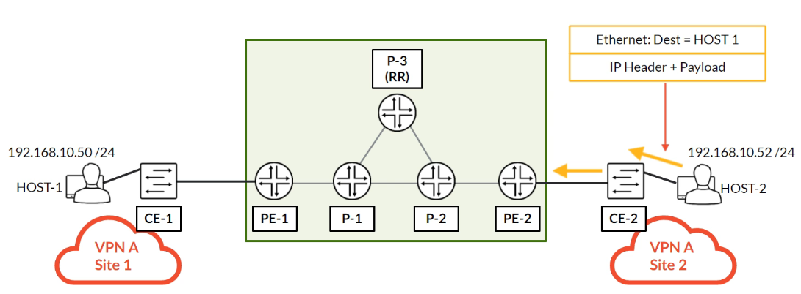

**Step 2: PE-2 to P-2 (PUSH).** PE-2 encapsulates the whole original Ethernet frame and **pushes** two MPLS labels: an inner **VPN label** (calculated from PE-1's BGP advertisement) and an outer **transport label** (from LDP/RSVP, to reach PE-1).

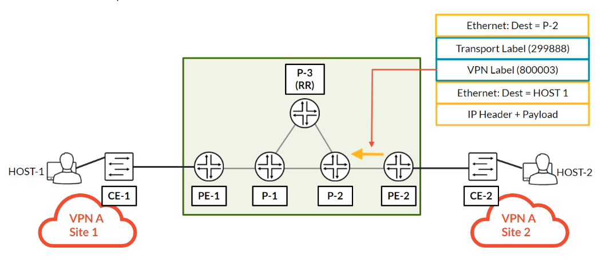

**Step 3: P-2 to P-1 (SWAP).** P-2, a transit P router, looks only at the outer transport label. It **swaps** it for the label P-1 expects. The inner VPN label is untouched.

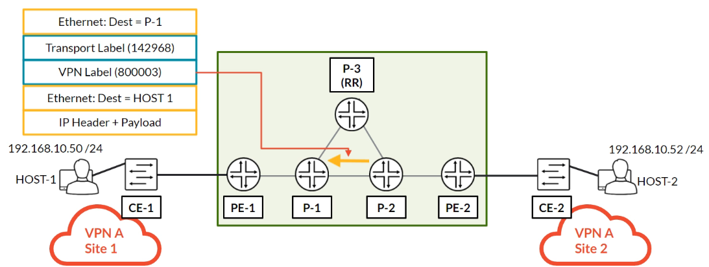

**Step 4: P-1 to PE-1 (POP, PHP).** P-1 is the penultimate hop. It **pops** the outer transport label and forwards the frame to PE-1 with only the inner VPN label left.

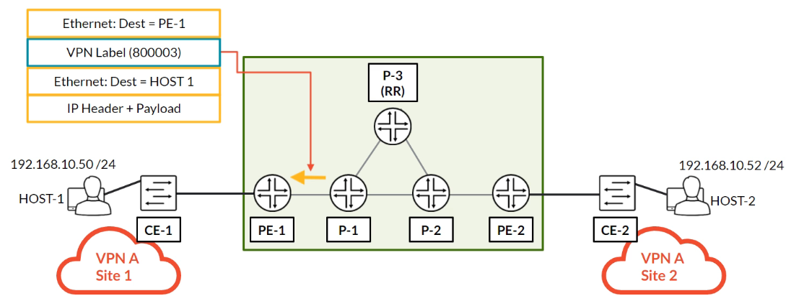

**Step 5: PE-1 to CE-1 (POP).** PE-1 looks at the remaining label, the VPN label. Its `mpls.0` table says to pop it and send the original, unlabeled Ethernet frame out of the attachment circuit towards CE-1.

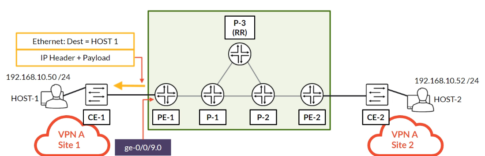

Summary of the label stack on each hop (label values from the diagrams):

| Hop | Operation | Stack on the wire |
|---|---|---|
| CE-2 → PE-2 | none | Original frame |
| PE-2 → P-2 | PUSH two labels | Transport 299888 · VPN 800003 · original frame |
| P-2 → P-1 | SWAP transport label | Transport 142968 · VPN 800003 · original frame |
| P-1 → PE-1 | POP transport label (PHP) | VPN 800003 · original frame |
| PE-1 → CE-1 | POP VPN label | Original frame |

> [!NOTE]
> P-1 pops because PE-1 advertised implicit null (label 3) for its loopback, which is the Junos default. See [MPLS mechanics](../../../Junos-MPLS-Fundamentals/notes/02-mpls-mechanics.md) for PHP. The VPN label 800003 ties back to PE-1's advertisement in Module 5: label base 800002, offset 1. PE-2 sends to PE-1 using *PE-1's* label block and *its own* site ID: 800002 + 2 − 1 = 800003, assuming PE-2's site ID is 2 (as in the lab). The label calculation is covered in detail in part 007.

### Knowledge check

**There is an L2VPN from Site 2 to Site 1. On which device will the transport label be popped?**

- A) PE-2
- B) PE-1
- C) P-1
- D) P-2

<details><summary>Answer</summary>

**C.** The transport label is popped by the penultimate hop, which is P-1 on the path from PE-2 to PE-1. This is penultimate hop popping (PHP).

</details>

### Key takeaways

> [!IMPORTANT]
> The L2VPN data plane uses the standard MPLS two-label stack. The outer transport label moves the packet across the core through simple swaps; the inner VPN label rides along untouched until the egress PE uses it to pick the right customer circuit. Next: what these advertisements look like on the wire.

---

## Module 5: Deep Dive: BGP Packet Capture Analysis

**Objectives:**
- Break down a BGP UPDATE message to find the L2VPN-specific attributes.
- Analyze the Layer 2 Info and route target extended communities.
- Examine the structure of the L2VPN NLRI.

Reading a packet capture is the best way to see how the theory turns into bytes on the wire. The sections below break down a BGP UPDATE sent by PE-1 (192.168.1.1) for its end of the pseudowire.

### 5.1 Part 1: standard BGP attributes

The UPDATE starts with the usual path attributes: ORIGIN, AS_PATH and LOCAL_PREF. This part is identical to a regular IPv4 BGP update.

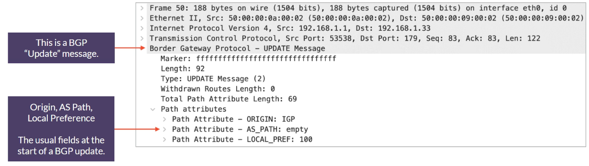

```
Internet Protocol Version 4, Src: 192.168.1.1, Dst: 192.168.1.33
Transmission Control Protocol, Src Port: 53538, Dst Port: 179, Seq: 83, Ack: 83, Len: 122
Border Gateway Protocol - UPDATE Message
    Marker: ffffffffffffffffffffffffffffffff
    Length: 92
    Type: UPDATE Message (2)
    Withdrawn Routes Length: 0
    Total Path Attribute Length: 69
    Path attributes
        Path Attribute - ORIGIN: IGP
        Path Attribute - AS_PATH: empty
        Path Attribute - LOCAL_PREF: 100
```

### 5.2 Part 2: extended communities

This is where the L2VPN-specific information starts. The capture shows two key extended communities:

- **Route Target:** RT `64512:111`, which controls VPN membership.
- **Layer2 Info:** carries Layer 2 parameters, most importantly the **Encaps Type** (5 = Ethernet raw mode) and the **Layer-2 MTU**.

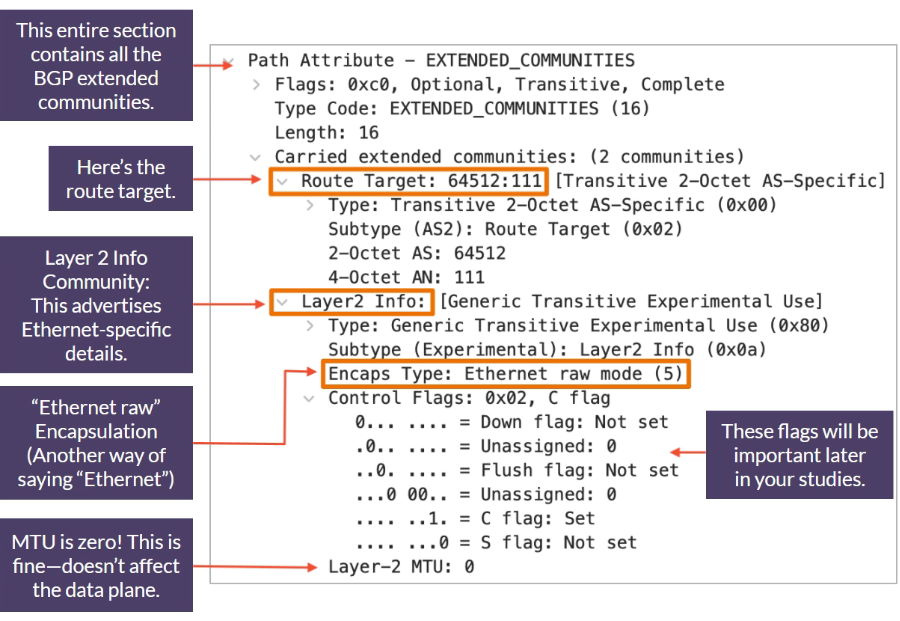

```
Path Attribute - EXTENDED_COMMUNITIES
    Flags: 0xc0, Optional, Transitive, Complete
    Type Code: EXTENDED_COMMUNITIES (16)
    Length: 16
    Carried extended communities: (2 communities)
        Route Target: 64512:111 [Transitive 2-Octet AS-Specific]
            Type: Transitive 2-Octet AS-Specific (0x00)
            Subtype (AS2): Route Target (0x02)
            2-Octet AS: 64512
            4-Octet AN: 111
        Layer2 Info: [Generic Transitive Experimental Use]
            Type: Generic Transitive Experimental Use (0x80)
            Subtype (Experimental): Layer2 Info (0x0a)
            Encaps Type: Ethernet raw mode (5)
            Control Flags: 0x02, C flag
                0... .... = Down flag: Not set
                .0.. .... = Unassigned: 0
                ..0. .... = Flush flag: Not set
                ...0 00.. = Unassigned: 0
                .... ..1. = C flag: Set
                .... ...0 = S flag: Not set
            Layer-2 MTU: 0
```

Points the diagram calls out:
- "Ethernet raw" is just another way of saying the `ethernet` encapsulation type. With `ethernet-vlan` you'd see type 4 instead.
- The control flags will matter later in your studies.
- The MTU is zero here. That's fine: it doesn't affect the data plane.

> [!NOTE]
> **About those flags and the MTU.**
> - **C flag set** means this PE wants the **control word** on the pseudowire. Junos uses the control word by default for BGP L2VPNs (it can be disabled with `no-control-word`). **S** is sequenced delivery, not set here. The **D** (down) flag is set when the local circuit is down. Part 008 covers the control word.
> - **Layer-2 MTU:** a PE uses this field to check that both ends of the circuit agree on MTU. A value of 0 means no MTU was advertised, so the remote PE skips the check. When both ends advertise a non-zero MTU and they differ, the circuit doesn't come up (an MTU mismatch) unless you configure `ignore-mtu-mismatch`. Whether Junos advertises 0 or the interface MTU depends on the release and configuration (for example a `mtu` statement in the instance), so treat the 0 in this capture as specific to this lab.

### 5.3 Part 3: the NLRI (Network Layer Reachability Information)

This is the actual "prefix" being advertised. For an L2VPN, it isn't an IP address. The key fields:

- **AFI/SAFI:** the Address Family Identifier is **25 (L2VPN)** and the Subsequent AFI is **65 (VPLS)**. That's not a mistake: BGP L2VPN and BGP VPLS share the same SAFI.
- **Route Distinguisher:** RD `192.168.1.1:111` (a Type 1 RD) makes the advertisement unique.
- **CE-ID:** the site ID (`1`) identifies the local endpoint.
- **Label block:** the **base**, **size** and **offset**, used by the remote PE to calculate the right VPN label.

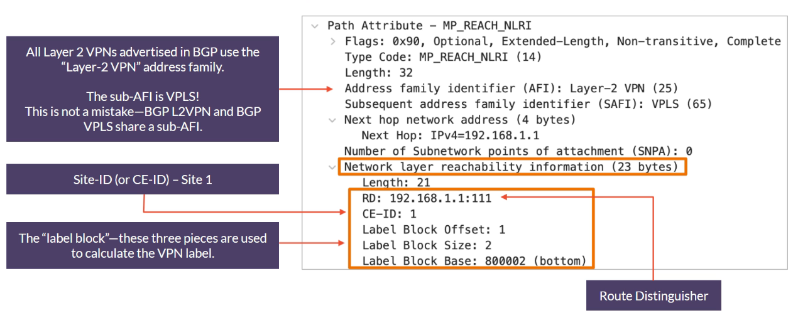

```
Path Attribute - MP_REACH_NLRI
    Flags: 0x90, Optional, Extended-Length, Non-transitive, Complete
    Type Code: MP_REACH_NLRI (14)
    Length: 32
    Address family identifier (AFI): Layer-2 VPN (25)
    Subsequent address family identifier (SAFI): VPLS (65)
    Next hop network address (4 bytes)
        Next Hop: IPv4=192.168.1.1
    Number of Subnetwork points of attachment (SNPA): 0
    Network layer reachability information (23 bytes)
        Length: 21
        RD: 192.168.1.1:111
        CE-ID: 1
        Label Block Offset: 1
        Label Block Size: 2
        Label Block Base: 800002 (bottom)
```

> [!NOTE]
> **Reading the label block.** The block starts at label 800002 (base) and holds 2 labels (size), covering remote sites starting at site ID 1 (offset). So PE-1 has set aside 800002 for traffic from site 1 and 800003 for traffic from site 2. A remote PE with site ID *N* picks its label as **base + N − offset**, as long as *N* falls inside the block (offset ≤ N < offset + size). PE-2 (site 2) therefore sends with 800002 + 2 − 1 = **800003**, the VPN label seen in the data plane walk-through. Junos documents the default `label-block-size` as 8 (valid values 2, 4, 8, 16); a size of 2 in this capture points to a non-default setting or release behavior in the lab. Part 007 goes deeper into site IDs, label blocks and overprovisioning.

### Knowledge check

**What does a BGP message contain? (Choose three.)**

- A) BGP headers
- B) BGP communities
- C) NLRI
- D) MTU
- E) Site ID

<details><summary>Answer</summary>

**A, B and C.** The message has standard headers (A), path attributes including communities (B), and the NLRI or "prefix" (C). The MTU (D) and site ID (E) are carried *inside* the communities and the NLRI respectively; they aren't top-level parts of the message.

</details>

### Key takeaways

> [!IMPORTANT]
> A packet capture makes the abstract concrete: route targets, route distinguishers, the Layer2 Info community and the label block are all visible fields. Knowing this structure gives you the depth needed for advanced configuration and troubleshooting. You now have the full theory of BGP-signaled pseudowires.

---

## Module 6: Glossary

| Term | Definition |
|---|---|
| **Attachment circuit (AC)** | The logical Layer 2 connection between a CE device and a PE router, often identified by a VLAN tag. |
| **Pseudowire** | A point-to-point L2VPN service that acts as a virtual wire across a provider network. Also known as VPWS. |
| **Kompella** | The common industry nickname for BGP-signaled pseudowires, after the author of the IETF draft. |
| **L2VPN (Junos)** | A pseudowire signaled with BGP (Kompella). |
| **Route distinguisher (RD)** | A 64-bit value prepended to a VPN advertisement to make it unique, allowing overlapping addresses or site IDs between customers. |
| **Route target (RT)** | A BGP extended community that controls import and export of routes for a VPN, defining VPN membership. |
| **Site ID** | A number identifying a site (a CE's connection point) within an L2VPN; it must be unique within the VPN except when the same site is multihomed. It's used in the VPN label calculation. In Junos it must be non-zero. |
| **Label block** | The parameters (base, size, offset) advertised in BGP that let a PE advertise a range of VPN labels, one per remote site, in a single update. |
| **FEC 128 vs. FEC 129** | FEC 128 is the original LDP signaling method for pseudowires (Martini) and needs neighbors configured manually. FEC 129 adds BGP autodiscovery of endpoints while still using LDP for signaling, mainly used for VPLS. |
| **`bgp.l2vpn.0` vs. `<instance>.l2vpn.0`** | `bgp.l2vpn.0` is the main table on a PE holding **all** L2VPN advertisements that match any locally configured route target. `<instance-name>.l2vpn.0` is the table for a single customer VPN, holding only the routes imported into that instance. |

> [!NOTE]
> The original glossary described the site ID as identifying "a specific attachment circuit". More precisely, it identifies a **site** (in the RFC, a CE). One site can have several attachment circuits, and each circuit is matched to a particular remote site (by interface order or by `remote-site-id`), which is covered in part 007.

---

## Module 7: Dynamic Recall

### Part 1: Recall

**What is an attachment circuit (AC)?**

<details><summary>Answer</summary>

An AC is the **logical Layer 2 connection** between a CE and a PE router. One physical link can be multiplexed with VLANs to host several separate ACs.

</details>

**What is the difference between Ethernet (raw) and Ethernet-VLAN encapsulation?**

<details><summary>Answer</summary>

**Ethernet (raw)** mode treats every incoming frame, including any VLAN tags, as payload to tunnel. **Ethernet-VLAN** mode uses the incoming VLAN tag to select which pseudowire the frame goes down.

</details>

**What is the primary function of a route target (RT)?**

<details><summary>Answer</summary>

An RT is a BGP extended community that controls **VPN membership**. PEs export their L2VPN routes with an RT, and other PEs import routes with a matching RT, which gives autodiscovery.

</details>

**What is the primary function of a route distinguisher (RD)?**

<details><summary>Answer</summary>

An RD is a 64-bit value prepended to an advertisement to make it **unique**. BGP can then tell apart identical-looking advertisements from different customers or sites.

</details>

**Why is a Type 1 RD the best choice for a multihomed customer site?**

<details><summary>Answer</summary>

A Type 1 RD uses each PE's unique loopback IP. Advertisements from two PEs for the same site are then unique, so the route reflector advertises both paths. That enables load balancing (for IP services) and fast failover.

</details>

**What are the three essential prerequisites for a BGP-signaled L2VPN?**

<details><summary>Answer</summary>

1. An **IGP** for core reachability.
2. An **MPLS** protocol (LDP/RSVP) for transport LSPs.
3. An **IBGP** session between PEs with the L2VPN address family enabled (`family l2vpn signaling`).

</details>

### Part 2: Fusion

> [!TIP]
> **The dark second path.**
>
> Naz was onboarding a new multihomed customer. "This is strange," he said to his mentor. "I configured both PE routers, but the customer's traffic only uses one path. The other one is completely dark."
>
> His mentor, Maria, glanced at the config. "What **route distinguisher** type did you use?" Naz checked. "Type 0. For simplicity, I used the same one, `64512:100`, on both PE-2 and PE-3."
>
> "There's your problem," Maria explained. "Think of the route reflector as a mail sorter. It received two identical letters: same **RD**, same prefix. BGP's rules say to keep only one 'best' letter and throw the other away. So the rest of the network, including PE-1, never learns about the path through PE-3. Your **route target** was correct (everyone got the mail), but the RD made the letters look like duplicates."
>
> "So if I use a **Type 1 RD**," Naz realized, "I'm putting a different return address, the PE's loopback, on each letter. The mail sorter sees two unique letters and delivers both. Then PE-1 can see both paths!" He made the change, and the second path lit up. It wasn't just about uniqueness; it was about enabling real redundancy.

### Part 3: Chunk and collapse

| Chunk | One-line summary | Memory hooks |
|---|---|---|
| **Attachment circuit (AC)** | The logical L2 link between a customer (CE) and the provider (PE), often defined by a VLAN tag. | #LogicalLink #Multiplexing #VLANsForACs |
| **Route target (RT)** | A BGP community that acts like a mailing list for a VPN, controlling which PEs import and export routes. | #VPN-Membership #AutoDiscovery #ImportExport |
| **Route distinguisher (RD)** | A value prepended to a route to make it unique, preventing conflicts and enabling multihoming. | #Uniqueness #Type1-for-Multihoming #RDvsRT |
| **Control vs. data plane** | The control plane (BGP) builds the pseudowire; the data plane (MPLS) forwards customer frames with a two-label stack. | #BGPSignals #MPLSForwards #TwoLabels #PushSwapPop |

---

← [Previous: The Different Flavors of Layer 2 VPN](003-flavors-of-layer-2-vpn.md) · [Index](../README.md) · [Next: L2VPN Configuration](005-l2vpn-configuration.md) →
