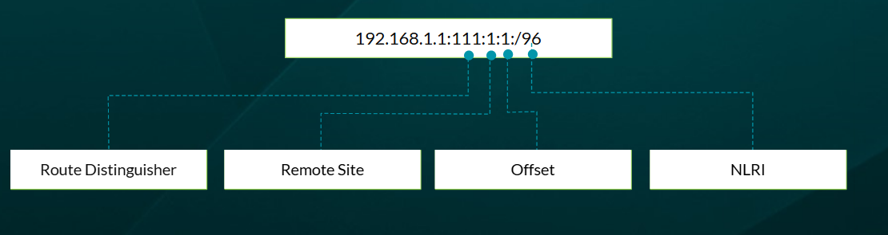
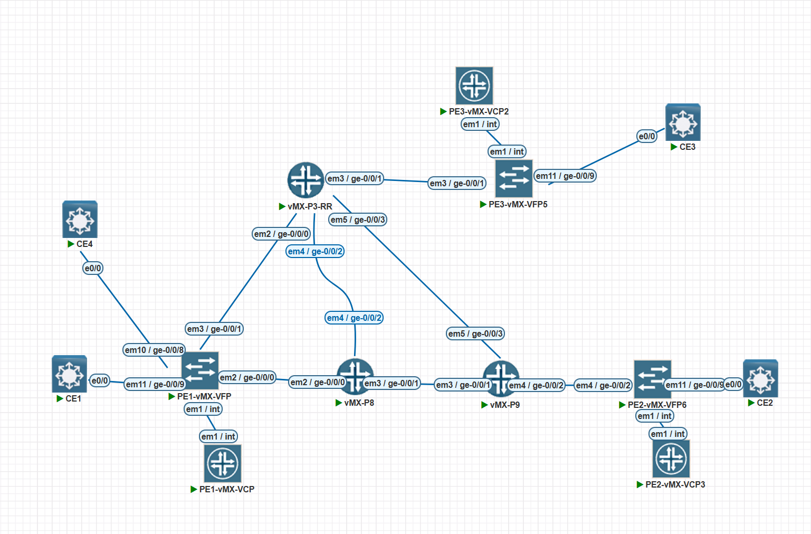
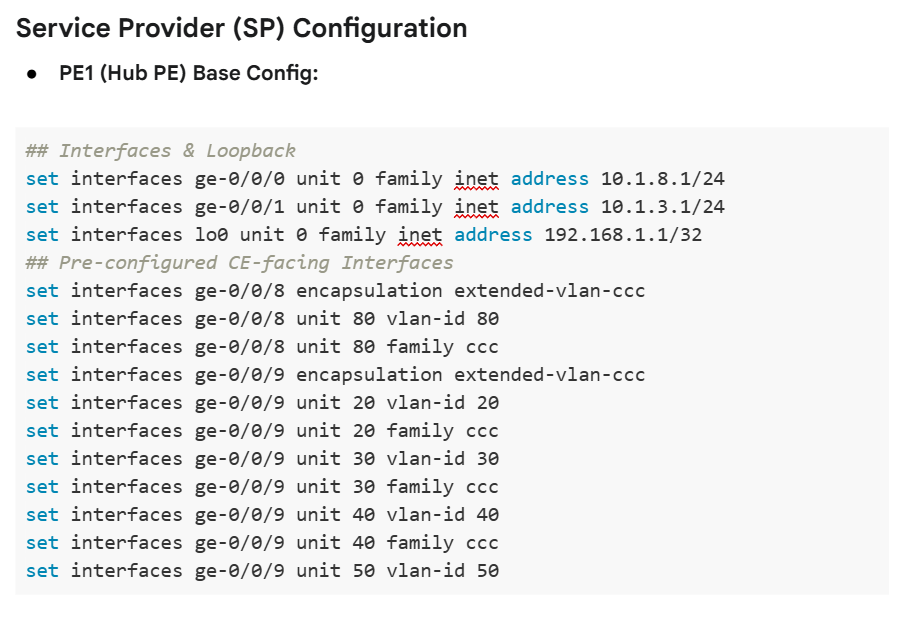

# L2VPN Configuration

**Building and verifying port-based and VLAN-based BGP L2VPNs, then evolving them into VPLS**

> Study notes by [Nazirul Roslan](https://www.linkedin.com/in/nazirulroslan) · JNCIP-SP · Junos Layer 2 VPNs · Part 005

← [Previous: L2VPN: BGP-Signaled Pseudowires](004-bgp-signaled-l2vpn.md) · [Index](../README.md) · [Next: L2VPN Troubleshooting](006-l2vpn-troubleshooting.md) →

**Contents:** [1 Prerequisites](#module-1-prerequisites-and-foundational-setup) · [2 Ethernet L2VPN](#module-2-configuring-an-ethernet-port-based-l2vpn) · [3 Ethernet-VLAN L2VPN](#module-3-configuring-an-ethernet-vlan-l2vpn) · [4 VPLS](#module-4-configuring-and-verifying-vpls) · [5 Lab](#module-5-comprehensive-lab-configuring-vpws-and-vpls) · [6 Glossary](#module-6-glossary) · [7 Dynamic Recall](#module-7-dynamic-recall)

---

## Module 1: Prerequisites and Foundational Setup

**Objectives:**
- Detail the essential prerequisite configurations for any BGP-signaled L2VPN.
- Highlight critical production considerations like BGP session flaps and MTU sizing.

### 1.1 Underlay and transport

Before configuring any VPN service, a solid foundation must be in place. BGP L2VPNs need three core components working inside the service provider network:

- **IGP reachability:** an Interior Gateway Protocol such as IS-IS or OSPF must be configured and operational. Its main job is to make sure every Provider Edge (PE) router can reach every other PE's loopback address.
- **MPLS transport:** a label signaling protocol such as LDP or RSVP builds the transport Label Switched Paths (LSPs) between PE routers. These LSPs are the tunnels that carry the encapsulated customer VPN traffic.
- **iBGP peering:** an internal BGP session must exist between all PE routers, usually through a Route Reflector (RR) for scale. This session carries the L2VPN advertisements. In the lab diagrams, the RR is `192.168.1.33`.


> [!TIP]
> Need a refresher on the transport pieces? See [MPLS mechanics](../../../Junos-MPLS-Fundamentals/notes/02-mpls-mechanics.md) for labels and PHP, and the [BGP guide](../../../JNCIS-SP/notes/007-bgp.md) for iBGP and route reflectors.

### 1.2 Activating the L2VPN address family

For BGP to carry L2VPN information, you must activate the right address family on the iBGP sessions between the PEs and the RR.

This command enables the L2VPN address family for BGP signaling:

```
[edit protocols bgp group INTERNAL]
naz@R1# set family l2vpn signaling
```

> [!WARNING]
> **Production impact: BGP flaps.** Adding a new address family (like `family l2vpn signaling`) to an established BGP session makes the session flap (go down and come back up) to renegotiate capabilities. This is service-impacting. In a production network this change **must** be scheduled in a maintenance window.

> [!NOTE]
> The family must be enabled on **both** ends of each session, so on the RR as well as on the PEs. The same family (AFI 25, SAFI 65) also carries BGP VPLS routes, so Module 4 needs no extra BGP configuration.

### 1.3 Production best practice: MTU considerations

MPLS and L2VPN headers add overhead to the original customer packet (the guide's figure was "typically 8-12 bytes or more"). If a customer sends a full-size 1500-byte Ethernet frame, the encapsulated packet is larger than 1500 bytes.

To stop these larger packets being dropped or fragmented in the core, it's a critical best practice to configure a larger MTU on all service provider core-facing interfaces (the P-to-P and PE-to-P links). A common value is `9192` bytes. This lab omits MTU configuration for simplicity, but it's an essential concept for both the exam and real deployments.

> [!NOTE]
> **Doing the maths.** The 8-12 bytes is only the label stack and control word: two labels (transport + VPN) are 8 bytes, and the control word adds 4. On top of that, the **whole customer Ethernet frame** is now payload, so its own 14-byte Ethernet header (plus 4 bytes per VLAN tag) counts too. A 1500-byte customer IP packet therefore needs roughly 1500 + 14 (+4 per tag) + 8 + 4 bytes of MPLS MTU on every core link. MPLS packets can't simply be fragmented, so an undersized core MTU means silent drops.

> [!IMPORTANT]
> **MTU also matters at the edge.** A BGP L2VPN advertises the MTU of the local CE-facing interface (in the Layer 2 Info extended community). If the two PEs advertise different MTUs, Junos won't bring the pseudowire up, and `show l2vpn connections` shows `MM` (MTU mismatch). Fix it by matching the CE-facing MTUs, or, where you must, use the `mtu` or `ignore-mtu-mismatch` options under the instance's `protocols l2vpn` hierarchy.

> [!IMPORTANT]
> **Key takeaways.** A working L2VPN needs a stable underlay of IGP and MPLS, plus iBGP sessions enabled for `family l2vpn signaling`. Production networks must also allow for operational realities like BGP session flaps and larger core MTU. With this foundation in place, we can configure the customer-facing services, starting with a simple port-based pseudowire.

---

## Module 2: Configuring an Ethernet (Port-Based) L2VPN

**Objectives:**
- Explain how to configure a BGP-signaled L2VPN that accepts all Ethernet traffic from a customer port.
- Detail the configuration steps for the CE-facing interface and the L2VPN routing instance.
- Demonstrate the key verification commands for the control plane and data plane.

### 2.1 Configuring the CE-facing interface

The first step is the physical interface on the PE that connects to the customer's CE device. For a port-based service, where all traffic (tagged and untagged) is tunneled, use `encapsulation ethernet-ccc`.

This configuration dedicates the whole physical interface `ge-0/0/9` to the L2VPN service:

```
[edit interfaces ge-0/0/9]
naz@R1# set encapsulation ethernet-ccc
naz@R1# set unit 0
```

> [!NOTE]
> Many Juniper examples also add `set unit 0 family ccc`. With `ethernet-ccc` the port carries a single unit 0 for the circuit; adding `family ccc` explicitly does no harm and makes the intent obvious.

> [!TIP]
> **Untangling the "CCC" terminology.** The `ccc` keyword can be confusing, so keep the two meanings apart:
> - **Original meaning (Circuit Cross-Connect):** a legacy, non-scalable pseudowire technology that needed dedicated RSVP LSPs.
> - **Modern meaning (in `encapsulation`):** a keyword on the interface that enables it for the various pseudowire types (L2VPN, L2Circuit and so on). It keeps things simple because the data plane is the same for all of them.
>
> **Takeaway:** seeing `encapsulation ethernet-ccc` in the configuration does **not** mean you're configuring the old CCC protocol. It just prepares the interface for a pseudowire service.

### 2.2 Creating the routing instance

Next, create a dedicated routing instance of type `l2vpn`. It isolates the customer's service and holds all the L2VPN-specific parameters.

This configuration creates the L2VPN instance, links the interface to the service and defines the BGP attributes:

```
[edit routing-instances L2VPN_JOHNS_ICE_CREAM]
naz@R1# set instance-type l2vpn
naz@R1# set interface ge-0/0/9.0
naz@R1# set route-distinguisher 192.168.1.1:111
naz@R1# set vrf-target target:64512:111

[edit routing-instances L2VPN_JOHNS_ICE_CREAM protocols l2vpn]
naz@R1# set encapsulation-type ethernet
naz@R1# set site ONE site-identifier 1
naz@R1# set site ONE interface ge-0/0/9.0
```

> [!TIP]
> **Exam tip: implied site IDs.** Notice we only configure the local `site-identifier 1`. In a simple point-to-point pseudowire, Junos implies the remote site ID: if the local site is 1 the remote is assumed to be 2, and vice versa. Explicitly configuring the remote site ID is needed in more complex topologies such as hub-and-spoke.

> [!NOTE]
> **How the implied remote site ID really works.** When `remote-site-id` isn't configured, Junos numbers the site's interfaces in the order they're listed: the first interface is paired with remote site 1, the next with 2, and so on, **skipping the local site ID**. So local site 1 pairs its first interface with remote site 2, and local site 2 pairs it with remote site 1. You also need `remote-site-id` whenever the far end isn't the number Junos would guess (for example, sites 1 and 9: see [L2VPN Troubleshooting](006-l2vpn-troubleshooting.md#module-5-fault-module-signaling-and-id-failures-site-id)). Site ID 0 isn't valid; IDs start at 1.

### 2.3 Production best practice: using apply-groups

As you configure more L2VPNs, much of the configuration repeats (for example `instance-type l2vpn`). To keep it consistent and save time, use `apply-groups`: a template of common statements that other parts of the configuration inherit.

First, define a group with the common configuration. The wildcard `<L2VPN*>` makes the group apply to any instance whose name starts with "L2VPN":

```
[edit]
root@PE-1# set groups L2VPN_GROUP routing-instances <L2VPN*> instance-type l2vpn
```

Then apply the group at the global level:

```
[edit]
root@PE-1# set apply-groups L2VPN_GROUP
```

Now a new L2VPN instance no longer needs its own `instance-type`. Verify the inheritance with `display inheritance`:

```
root@PE-1> show configuration routing-instances L2VPN_SUSANS_CAKE_FACTORY | display inheritance
##
## Inherited from group L2VPN_GROUP
##
instance-type l2vpn;
interface ge-0/0/5.0;
route-distinguisher 192.168.1.1:222;
vrf-target target:64512:222;
protocols {
    l2vpn {
        encapsulation-type ethernet;
        site ONE {
            site-identifier 1;
            interface ge-0/0/5.0;
        }
    }
}
```

> [!NOTE]
> If the CLI complains about the wildcard, put it in quotes: `routing-instances "<L2VPN*>"`. Remember the match is purely by name, so every instance whose name starts with `L2VPN` becomes type `l2vpn`, and anything named differently (such as `VPLS-ALL-SITES` later) doesn't inherit it.

### 2.4 Verification and status

After configuring both PE routers, check the pseudowire's status.

`show l2vpn connections` is the most important tool for verifying the control plane. Look for `St Up`:

```
naz@R2> show l2vpn connections instance L2VPN_JOHNS_ICE_CREAM
Layer-2 VPN connections:
Instance: L2VPN_JOHNS_ICE_CREAM
  Local site: TWO (2)
    connection-site           Type  St     Time last up          # Up trans
    1                         rmt   Up     Jun 5 13:17:17 2021         1
      Remote PE: 192.168.1.1, Negotiated control-word: Yes (Null)
      Incoming label: 800002, Outgoing label: 800003
      Local interface: ge-0/0/8.0, Status: Up, Encapsulation: ETHERNET
```

On the remote PE (PE-1), check the `mpls.0` table to see what it does with the incoming VPN label. R2's outgoing label 800003 is R1's incoming label:

```
naz@R1> show route table mpls.0 label 800003
mpls.0: 8 destinations, 8 routes (8 active...)
+ = Active Route, - = Last Active, * = Both
800003           *[L2VPN/7] 00:55:10
                    > via ge-0/0/9.0, Pop
```

> [!NOTE]
> `Negotiated control-word: Yes (Null)` means both PEs agreed to insert the 4-byte control word, and "Null" means its fields (such as the sequence number) aren't being used. Junos uses the control word for BGP L2VPN unless you disable it (for example with `no-control-word`), which is why the lab output later shows `No` for a different setup.

### 2.5 Routing table flow and status codes

Knowing how control-plane routes flow between routing tables is crucial for troubleshooting and the exam. Junos uses several tables for L2VPN signaling, membership and forwarding.

**Routing table flow.** The path of an L2VPN advertisement:

```
Remote PE → bgp.l2vpn.0 → <instance-name>.l2vpn.0
```

| Table | Role |
|---|---|
| `bgp.l2vpn.0` | Stores all L2VPN advertisements received and accepted from BGP peers. The master table for this address family. |
| `<instance-name>.l2vpn.0` | The per-VPN table. It holds only the routes imported into that instance, decided by whether the route's Route Target (RT) matches the instance's `vrf-target`. |

**Reading an L2VPN route prefix.** Routes in these tables look like `192.168.1.1:111:1:1/96`:



| Part | Value in the example | Meaning |
|---|---|---|
| Route Distinguisher | `192.168.1.1:111` | Makes the route unique in `bgp.l2vpn.0` (PE-1's RD for L2VPN_JOHNS_ICE_CREAM). |
| Site ID | `1` | The **advertising** PE's local site ID. The diagram calls it "Remote Site" because that's how the receiving PE sees it. |
| Label-block offset | `1` | The first site ID covered by this label block (a block of 8 labels by default covers sites 1-8). |
| `/96` | NLRI length | 64-bit RD + 16-bit site ID + 16-bit offset = 96 bits. |

> [!NOTE]
> The label base and label-block size also travel in the NLRI but aren't part of the displayed prefix. Use `show route table bgp.l2vpn.0 detail` (or `extensive`) to see them. The remote PE works out the label to use as: remote label base + (its own site ID − the block's offset). [Part 007](007-site-ids-label-base-overprovisioning.md) covers this in depth.

> [!TIP]
> **Exam tip: the Route Target mismatch.** If you see routes in `bgp.l2vpn.0` but **not** in `<instance-name>.l2vpn.0`, it's almost always a **Route Target mismatch**. Make sure the `vrf-target` configuration is identical on both PE routers.

**Common status codes.** `show l2vpn connections` and `show vpls connections` report the state of each pseudowire. The `St` (Status) field is key for quick diagnosis:

| Code | Meaning | Typical fix |
|---|---|---|
| `Up` | Pseudowire is established and operational. Labels have been exchanged. | No action needed. |
| `Dn` | Down. The connection isn't operational. | Check BGP session status, RD/RT mismatch, or remote PE configuration. |
| `EM` | Encapsulation mismatch. | Match `encapsulation-type` on both PEs. |
| `LD` / `RD` | Local / remote site signaled down. | Check the CE-facing interface and its binding on that PE. |
| `OR` | Out of range (site ID outside the remote label block). | Check site IDs and `remote-site-id`. |
| `MM` | MTU mismatch. | Match CE-facing MTUs (see 1.3). |
| `VC-Dn` | Virtual circuit down. | Often transport (LSP) or signaling; start there. |

> [!NOTE]
> The original table listed `Idle` and `Restarting`. Those aren't `show l2vpn connections` status codes (they sound like BGP states). The table above uses codes from the command's own legend; [Part 006](006-l2vpn-troubleshooting.md#13-status-code-pocket-table) goes through them in detail. A missing remote route (for example an RT mismatch) often doesn't produce a code at all: you just see `No connections found.`

> [!TIP]
> **Best practice: go `extensive`.** Use `show l2vpn connections extensive` to see the label-base details, historical state changes and detailed error messages. It's essential for debugging a connection that stays down or keeps flapping.

**Knowledge check.** You have a working L2VPN. If you remove the `vrf-target` statement from one of the PE routers, what will the status (`St`) be in `show l2vpn connections`?

- A. Up
- B. Dn
- C. Idle
- D. Restarting

<details><summary>Answer</summary>

**B. Dn.** Without a matching `vrf-target`, the PE won't import the L2VPN route from its BGP peer and the control-plane signaling fails, so the connection is down.

> [!NOTE]
> In practice, Junos usually refuses to commit an `l2vpn` instance with no `vrf-target` (or `vrf-import`/`vrf-export`) at all. With a **mismatched** RT, the remote route never reaches the instance table, and the output often shows `No connections found.` rather than a specific code. Of the choices given, B is the intended answer.

</details>

> [!IMPORTANT]
> **Key takeaways.** A port-based L2VPN needs the interface encapsulation set to `ethernet-ccc` and a routing instance that defines the RD, RT and site ID. Verification is two steps: `show l2vpn connections` for control-plane status, and the `mpls.0` table for the data-plane action. Next, we adapt this for a more flexible VLAN-based service.

---

## Module 3: Configuring an Ethernet-VLAN L2VPN

**Objectives:**
- Explain how to configure a BGP-signaled L2VPN that maps specific VLAN tags to pseudowires.
- Compare the interface encapsulation options for VLAN-based services.

### 3.1 Interface configuration options

In Ethernet-VLAN mode, specific VLANs are mapped to specific pseudowires, so the interface configuration is more flexible. The recommended approach on modern hardware is `flexible-ethernet-services`, which lets one physical interface host a mix of service types (L2VPN, VPLS, L3VPN and so on) on different logical units.

This configuration prepares the physical port for multiple service types, then defines a logical unit for an L2VPN on VLAN 100:

```
[edit interfaces ge-0/0/9]
naz@R1# set flexible-vlan-tagging
naz@R1# set encapsulation flexible-ethernet-services

[edit interfaces ge-0/0/9 unit 100]
naz@R1# set encapsulation vlan-ccc
naz@R1# set vlan-id 100
```

**Encapsulation type comparison:**

| Encapsulation type | TPID / EtherType support | Notes |
|---|---|---|
| `ethernet-ccc` | Most standard values (IPv4, ARP, VLAN tags) | Accepts any frame as payload (port-based). |
| `vlan-ccc` | `0x8100` only (single-tag VLAN) | Legacy, restricted. |
| `extended-vlan-ccc` | `0x8100`, `0x9100`, `0x9901` | Supports Q-in-Q; modern method for dedicated L2VPN ports. |

> [!NOTE]
> `ethernet-ccc` and `extended-vlan-ccc` are **physical** interface encapsulations. `vlan-ccc` can be set on the physical interface (with `vlan-tagging`) or, as above, on a **logical unit** of a `flexible-ethernet-services` port. Any unit with a `vlan-id` needs `vlan-tagging` or `flexible-vlan-tagging` on the physical interface.

### 3.2 Routing instance configuration

The routing instance is almost identical to port-based mode. The only changes are pointing to the new logical interface and changing the encapsulation type to match:

```
[edit routing-instances L2VPN_JOHNS_ICE_CREAM]
naz@R1# set interface ge-0/0/9.100

[edit routing-instances L2VPN_JOHNS_ICE_CREAM protocols l2vpn]
naz@R1# set encapsulation-type ethernet-vlan
naz@R1# set interface ge-0/0/9.100
```

> [!NOTE]
> The last line is shown at `protocols l2vpn` level in the original; the interface actually belongs under the site: `set site ONE interface ge-0/0/9.100`. If you're converting the Module 2 instance, also delete the old `ge-0/0/9.0` from both the instance and the site, since unit 0 no longer exists.

**Knowledge check.** What advantage do service providers get from the encapsulation type `flexible-ethernet-services`?

- A. Faster transmission of frames between physical interfaces.
- B. The ability to alter a service without making a lot of configuration changes.
- C. The ability to configure different services on the logical units of the same physical interface.
- D. The ability to configure Layer 2 and Layer 3 logical interfaces.

<details><summary>Answer</summary>

**C.** `flexible-ethernet-services` is the key to offering a mix of VPN services (L2VPN, VPLS, L3VPN and so on) on different logical units of a single physical port, giving maximum service flexibility.

</details>

> [!IMPORTANT]
> **Key takeaways.** A VLAN-based L2VPN just needs the interface encapsulation changed to handle VLANs (preferably `flexible-ethernet-services`) and the routing instance pointed at the right logical unit. The BGP signaling stays the same. This model scales far better and is more flexible than port-based. Next, the multipoint VPLS service.

---

## Module 4: Configuring and Verifying VPLS

**Objectives:**
- Explain how to configure a BGP-signaled VPLS instance.
- Verify multipoint connectivity and dynamic MAC learning.

### 4.1 VPLS configuration

A VPLS instance is configured much like an L2VPN instance, with a few key differences that give it point-to-multipoint "virtual switch" behavior.

This configuration creates a VPLS instance that forms a full mesh with the other PEs using the same VRF target:

```
[edit interfaces ge-0/0/9]
naz@R1# set encapsulation ethernet-vpls

[edit routing-instances VPLS-ALL-SITES]
naz@R1# set instance-type vpls
naz@R1# set interface ge-0/0/9.0
naz@R1# set route-distinguisher 192.168.1.1:100
naz@R1# set vrf-target target:123:100

[edit routing-instances VPLS-ALL-SITES protocols vpls]
naz@R1# set site CUST-SITE-1 site-identifier 1
naz@R1# set no-tunnel-services
```

**The `no-tunnel-services` command.** VPLS needs a way to associate traffic arriving from each remote PE with the right instance so it can learn MAC addresses against it. By default Junos does this with a tunnel services (`vt-`) interface, which needs tunnel services hardware or tunnel services enabled on an FPC/PIC. `no-tunnel-services` tells Junos to use label-switched interfaces (`lsi`) instead, which are handled in the Packet Forwarding Engine (PFE) without any tunnel services resources. On MX Series routers (and vMX labs) without tunnel services configured, this is what lets VPLS work.

> [!NOTE]
> The original said that without this command "the router would require a dedicated services PIC or card". On MX (Trio), tunnel services can also be enabled on the line card itself (`chassis fpc <n> pic <n> tunnel-services`), so it's not strictly a separate card. The practical point stands: without `vt-` interfaces or `no-tunnel-services`, VPLS pseudowires won't come up. Point-to-point L2VPNs don't need either.

### 4.2 VPLS verification

Verifying VPLS means checking the control-plane mesh and the data-plane MAC learning.

Use `show vpls connections` to verify the full mesh of pseudowires. In a 3-PE VPLS, each PE should show 2 `Up` connections:

```
naz@R3> show vpls connections instance VPLS-ALL-SITES
Instance: VPLS-ALL-SITES
  Local site: CUST-SITE-3 (3)
    connection-site           Type  St     Time last up          # Up trans
    1                         rmt   Up     Sep 05 15:00:00 2025        1
      Remote PE: 192.168.1.1, ...
    2                         rmt   Up     Sep 05 15:00:00 2025        1
      Remote PE: 192.168.1.2, ...
```

Use `show vpls mac-table` to verify dynamic MAC learning. The local CE's MAC shows as Local and the remote CEs' MACs as Remote:

```
naz@R1> show vpls mac-table instance VPLS-ALL-SITES
MAC flags: D - Dynamic, S - Static, L - Local, R - Remote
VPLS-ALL-SITES:
Routing instance        VLAN/Trunk  MAC address         MAC flags   Logical interface
VPLS-ALL-SITES          NA          00:1c:c0:xx:xx:01   D,L         ge-0/0/9.0
VPLS-ALL-SITES          NA          00:1c:c0:xx:xx:02   D,R         lsi.1048576
VPLS-ALL-SITES          NA          00:1c:c0:xx:xx:03   D,R         lsi.1048577
```

Remote MACs are learned against `lsi` interfaces, one per remote PE, because `no-tunnel-services` is in use.

**Knowledge check.** Why is the `no-tunnel-services` command considered a best practice on modern routers?

- A. It disables tunnel services to improve security.
- B. It allows VPLS traffic to be processed on the high-performance PFE chipset instead of a slower services card.
- C. It is a legacy command required for backward compatibility.
- D. It enables automatic tunneling for VPLS instances.

<details><summary>Answer</summary>

**B.** The command uses the hardware forwarding plane (PFE) and `lsi` interfaces for VPLS, which is more scalable than depending on tunnel services (`vt-`) resources.

</details>

> [!IMPORTANT]
> **Key takeaways.** VPLS extends the L2VPN model into a multipoint virtual switch. The key differences are `instance-type vpls`, `encapsulation ethernet-vpls` and the `no-tunnel-services` command. Verification focuses on the full mesh of connections and the dynamic MAC table. Now let's put it all into practice.

---

## Module 5: Comprehensive Lab: Configuring VPWS and VPLS

This lab walks through the complete configuration and verification of point-to-point (VPWS/L2VPN) and point-to-multipoint (VPLS) Layer 2 VPN services. You'll build a transparent port-based virtual wire, a VLAN-based virtual wire, and finally turn the network into a fully working multipoint virtual switch.

### Lab topology and addressing plan


The lab as built in EVE-NG, including a fourth CE used in later labs (CE4 on PE1 `ge-0/0/8`):



| Link | Side A | Side B |
|---|---|---|
| CE1 – PE1 | CE1 e0/0 | PE1 ge-0/0/9 |
| CE4 – PE1 | CE4 e0/0 | PE1 ge-0/0/8 |
| PE1 – P8 | PE1 ge-0/0/0 | P8 ge-0/0/0 |
| PE1 – P3-RR | PE1 ge-0/0/1 | P3 ge-0/0/0 |
| P3-RR – P8 | P3 ge-0/0/2 | P8 ge-0/0/2 |
| P3-RR – P9 | P3 ge-0/0/3 | P9 ge-0/0/3 |
| P3-RR – PE3 | P3 ge-0/0/1 | PE3 ge-0/0/1 |
| P8 – P9 | P8 ge-0/0/1 | P9 ge-0/0/1 |
| P9 – PE2 | P9 ge-0/0/2 | PE2 ge-0/0/2 |
| PE2 – CE2 | PE2 ge-0/0/9 | CE2 e0/0 |
| PE3 – CE3 | PE3 ge-0/0/9 | CE3 e0/0 |

**Loopback IPs**
- Format: `192.168.1.x/32`, where `x` is the device number (for example, PE1 is `192.168.1.1`).
- The Route Reflector uses `192.168.1.33/32`.

**Point-to-point IPs**
- Format: `10.x.y.z/24`, where `x` is the lower device ID and `y` the higher device ID. The host part `z` is the device's own ID.
- Example: on the link between P8 and PE1 (vMX-P8 and PE1-vMX-VFP), P8's IP is `10.1.8.8` and PE1's IP is `10.1.8.1`.

> [!NOTE]
> The original text says "The Route Reflector (PE3) uses `192.168.1.33/32`", but the topology shows the RR role on **vMX-P3-RR**, and Module 1 calls the RR `192.168.1.33`. Part 2 of the lab also uses `192.168.1.33:30` as PE3's RD. An RD only has to be unique, so the lab still works, but check your own loopback plan and use each PE's real loopback in its RD.

**PE1 (hub PE) base config.** Interfaces, loopback and pre-configured CE-facing units used in the later labs:



```
## Interfaces & Loopback
set interfaces ge-0/0/0 unit 0 family inet address 10.1.8.1/24
set interfaces ge-0/0/1 unit 0 family inet address 10.1.3.1/24
set interfaces lo0 unit 0 family inet address 192.168.1.1/32
## Pre-configured CE-facing Interfaces
set interfaces ge-0/0/8 encapsulation extended-vlan-ccc
set interfaces ge-0/0/8 unit 80 vlan-id 80
set interfaces ge-0/0/8 unit 80 family ccc
set interfaces ge-0/0/9 encapsulation extended-vlan-ccc
set interfaces ge-0/0/9 unit 20 vlan-id 20
set interfaces ge-0/0/9 unit 20 family ccc
set interfaces ge-0/0/9 unit 30 vlan-id 30
set interfaces ge-0/0/9 unit 30 family ccc
set interfaces ge-0/0/9 unit 40 vlan-id 40
set interfaces ge-0/0/9 unit 40 family ccc
set interfaces ge-0/0/9 unit 50 vlan-id 50
```

> [!NOTE]
> The screenshot ends at `unit 50 vlan-id 50`; unit 50 presumably also has `family ccc` like the others. Units with a `vlan-id` also need `vlan-tagging` (or `flexible-vlan-tagging`) on `ge-0/0/8` and `ge-0/0/9`; add it if your base config doesn't already have it. The core-facing interfaces also need `family mpls` for the transport LSPs.

> [!TIP]
> **Why this matters.** This lab gives you the hands-on skills to deploy and manage the two most common Layer 2 VPN services in a service provider network. Mastering VPWS (point-to-point) and VPLS (multipoint) is a core competency for the JNCIP-SP exam and for real network engineering roles.

### Part 1: Configuring a port-based (Ethernet) VPWS

**Goal:** create a transparent, port-based virtual wire between CE1 and CE2.

**Reasoning:** this is the most basic L2VPN service. It validates the underlay (IGP, MPLS, BGP) and tests the core `instance-type l2vpn` configuration in its simplest form.

**Configuration (on PE1 and PE2).** On PE1:

```
set interfaces ge-0/0/9 encapsulation ethernet-ccc
set interfaces ge-0/0/9 unit 0
set routing-instances L2VPN-CE1-CE2 instance-type l2vpn
set routing-instances L2VPN-CE1-CE2 interface ge-0/0/9.0
set routing-instances L2VPN-CE1-CE2 route-distinguisher 123:1
set routing-instances L2VPN-CE1-CE2 vrf-target target:123:1
set routing-instances L2VPN-CE1-CE2 protocols l2vpn site CUST-SITE-1 site-identifier 1
```

On PE2:

```
set interfaces ge-0/0/9 encapsulation ethernet-ccc
set interfaces ge-0/0/9 unit 0
set routing-instances L2VPN-CE1-CE2 instance-type l2vpn
set routing-instances L2VPN-CE1-CE2 interface ge-0/0/9.0
set routing-instances L2VPN-CE1-CE2 route-distinguisher 123:2
set routing-instances L2VPN-CE1-CE2 vrf-target target:123:1
set routing-instances L2VPN-CE1-CE2 protocols l2vpn site CUST-SITE-2 site-identifier 2
```

> [!WARNING]
> The lab config above leaves out two statements that Module 2 uses, and the connection needs both. Add them on each PE (use `CUST-SITE-2` on PE2):
> ```
> set routing-instances L2VPN-CE1-CE2 protocols l2vpn encapsulation-type ethernet
> set routing-instances L2VPN-CE1-CE2 protocols l2vpn site CUST-SITE-1 interface ge-0/0/9.0
> ```
> Without the site's `interface`, the site has no attachment circuit, so there's nothing to connect. Also, if PE1's `ge-0/0/9` still has the extended-vlan-ccc base config above, delete that first: a port is either port-based (`ethernet-ccc`) or VLAN-based, not both.

**Verification and troubleshooting.** Check the control-plane status on either PE:

```
naz@R1> show l2vpn connections instance L2VPN-CE1-CE2
Instance: L2VPN-CE1-CE2
Local site: CUST-SITE-1 (1)
  connection-site           Type  St     Time last up          # Up trans
  2                         rmt   Up     Sep 05 14:30:00 2025        1
    Remote PE: 192.168.1.2, Negotiated control-word: No
```

**Troubleshooting:** if `St` isn't `Up`, check the BGP session to the RR, make sure the `vrf-target` values match exactly, and look for the remote route in the `bgp.l2vpn.0` table.

Test data-plane connectivity from CE1:

```
user@CE1> ping 10.11.11.2 count 5
PING 10.11.11.2 (10.11.11.2): 56 data bytes
64 bytes from 10.11.11.2: icmp_seq=0 ttl=64 time=... ms
...
--- 10.11.11.2 ping statistics ---
5 packets transmitted, 5 packets received, 0% packet loss
```

**Troubleshooting:** if pings fail, check physical connectivity and make sure the CE port is correctly configured (for example, an access port in the right VLAN if applicable).

### Part 2: Configuring a VLAN-based VPWS

**Goal:** create a virtual wire for VLAN 30 between CE1 and CE3 on a shared physical link.

**Reasoning:** this is the more flexible and common deployment model, where one physical port is multiplexed to carry several point-to-point services for different customers or destinations.

**Configuration (on PE1 and PE3).** On PE1:

```
set interfaces ge-0/0/9 vlan-tagging
set interfaces ge-0/0/9 unit 30 encapsulation vlan-ccc
set interfaces ge-0/0/9 unit 30 vlan-id 30
set routing-instances L2VPN-VLAN30 instance-type l2vpn
set routing-instances L2VPN-VLAN30 interface ge-0/0/9.30
set routing-instances L2VPN-VLAN30 route-distinguisher 192.168.1.1:30
set routing-instances L2VPN-VLAN30 vrf-target target:123:30
set routing-instances L2VPN-VLAN30 protocols l2vpn site CUST-SITE-1-VLAN30 site-identifier 1
```

On PE3:

```
set interfaces ge-0/0/9 vlan-tagging
set interfaces ge-0/0/9 unit 30 encapsulation vlan-ccc
set interfaces ge-0/0/9 unit 30 vlan-id 30
set routing-instances L2VPN-VLAN30 instance-type l2vpn
set routing-instances L2VPN-VLAN30 interface ge-0/0/9.30
set routing-instances L2VPN-VLAN30 route-distinguisher 192.168.1.33:30
set routing-instances L2VPN-VLAN30 vrf-target target:123:30
set routing-instances L2VPN-VLAN30 protocols l2vpn site CUST-SITE-3-VLAN30 site-identifier 2
```

> [!WARNING]
> Three fixes make this config commit and come up:
> 1. **Physical encapsulation.** A unit with `encapsulation vlan-ccc` needs a matching physical encapsulation, such as `set interfaces ge-0/0/9 encapsulation vlan-ccc` (with `vlan-tagging`) or `flexible-ethernet-services` (with `flexible-vlan-tagging`) as in Module 3. On PE1 you must first remove Part 1's `ethernet-ccc` and `unit 0` (for example, `delete interfaces ge-0/0/9` then reapply), because a port can't be both.
> 2. **Encapsulation type:** `set routing-instances L2VPN-VLAN30 protocols l2vpn encapsulation-type ethernet-vlan` on both PEs.
> 3. **Site interface:** `set routing-instances L2VPN-VLAN30 protocols l2vpn site CUST-SITE-1-VLAN30 interface ge-0/0/9.30` on PE1 (and the equivalent for `CUST-SITE-3-VLAN30` on PE3).

**Verification and troubleshooting.** From CE1, test connectivity. Pings to CE3 (VLAN 30) should succeed, while pings to CE2 (from Part 1) now fail because PE1's port is no longer part of the port-based service:

```
user@CE1> ping 10.30.30.3 count 5
...
5 packets transmitted, 5 packets received, 0% packet loss

user@CE1> ping 10.11.11.2 count 5
...
5 packets transmitted, 0 packets received, 100% packet loss
```

**Troubleshooting:** if pings fail, make sure the CE ports are configured as 802.1Q trunks (or tagged subinterfaces) and that VLAN 30 is allowed.

### Part 3: Evolving to multipoint VPLS

**Goal:** turn the network into a multipoint virtual switch that connects all three sites (CE1, CE2 and CE3) in a single broadcast domain.

**Reasoning:** this part introduces `instance-type vpls` and its key verification commands: checking the full-mesh connections and the dynamic MAC learning table. These are basic skills for managing multipoint L2 services.

**Configuration (on PE1, PE2 and PE3).** On all three PEs, update the interface and routing instance configuration for VPLS:

```
# On PE1 (repeat similar config on PE2 and PE3 with correct RD/site-id)
set interfaces ge-0/0/9 encapsulation ethernet-vpls
set interfaces ge-0/0/9 unit 0
set routing-instances VPLS-ALL-SITES instance-type vpls
set routing-instances VPLS-ALL-SITES interface ge-0/0/9.0
set routing-instances VPLS-ALL-SITES route-distinguisher 192.168.1.1:100
set routing-instances VPLS-ALL-SITES vrf-target target:123:100
set routing-instances VPLS-ALL-SITES protocols vpls site CUST-SITE-1 site-identifier 1
set routing-instances VPLS-ALL-SITES protocols vpls no-tunnel-services
```

> [!WARNING]
> Clean up first. Remove the `vlan-tagging`, `unit 30` and `ethernet-ccc` leftovers on `ge-0/0/9`, and delete or deactivate the `L2VPN-CE1-CE2` and `L2VPN-VLAN30` instances that still reference those interfaces, or the commit fails. As with `ethernet-ccc`, many examples add `unit 0 family vpls` explicitly. Give each PE its own site ID (1, 2 and 3) and RD.

**Verification and troubleshooting.** On any PE, verify the full mesh of VPLS connections. Each PE should show connections to the other two:

```
naz@R3> show vpls connections instance VPLS-ALL-SITES
Instance: VPLS-ALL-SITES
Local site: CUST-SITE-3 (3)
  connection-site           Type  St     Time last up          # Up trans
  1                         rmt   Up     Sep 05 15:00:00 2025        1
    Remote PE: 192.168.1.1, ...
  2                         rmt   Up     Sep 05 15:00:00 2025        1
    Remote PE: 192.168.1.2, ...
```

After sending traffic, check the VPLS MAC table on a PE for learned MAC addresses:

```
naz@R1> show vpls mac-table instance VPLS-ALL-SITES
MAC flags: D - Dynamic, S - Static, L - Local, R - Remote
VPLS-ALL-SITES:
Routing instance        VLAN/Trunk  MAC address         MAC flags   Logical interface
VPLS-ALL-SITES          NA          00:1c:c0:xx:xx:01   D,L         ge-0/0/9.0
VPLS-ALL-SITES          NA          00:1c:c0:xx:xx:02   D,R         lsi.1048576
VPLS-ALL-SITES          NA          00:1c:c0:xx:xx:03   D,R         lsi.1048577
```

**Troubleshooting:** if remote MACs aren't learned, it's a data-plane issue. Verify the control plane (`show vpls connections`) first, then check for MTU issues in the core.

### Troubleshooting toolkit

| Tool | Use |
|---|---|
| `show l2vpn connections extensive` / `show vpls connections extensive` | Your primary tool. `extensive` shows control-plane logs, label details and historical flap information. Essential for diagnosing a connection that won't come up. |
| `show vpls connections` | The VPLS equivalent. Confirms the full mesh is established. |
| `show vpls mac-table` | Crucial for VPLS data-plane verification. Confirms remote MAC addresses are being learned. |
| `show route table bgp.l2vpn.0` | Confirms L2VPN/VPLS routes are being received from remote PEs. If a route is missing, check BGP peering and export policies. |
| `show route table <instance>.l2vpn.0` | Verifies a route from the main table was imported into the specific L2VPN instance. Missing here but present in `bgp.l2vpn.0` means a Route Target mismatch. |
| `show route table mpls.0` | Checks the data-plane action for a given VPN label. Verifies the PE knows to `Pop` the label and forward to the right CE-facing interface. |
| CE-side checks | Don't forget the customer side. Verify physical connectivity, duplex settings and especially VLAN tagging. A mismatch between the PE logical unit's `vlan-id` and the CE's trunk configuration is very common. |
| `ping ...` from the CE | The ultimate data-plane test. If the control plane is up but pings fail, check CE-PE connectivity (physical link, VLANs). |

### Verification command reference

| Command | What to check for | Good output example |
|---|---|---|
| `show bgp summary` | The iBGP session is `Established` and the `bgp.l2vpn.0` table is active. | `State: Establ`, `bgp.l2vpn.0: 1/1/1/0` |
| `show route table bgp.l2vpn.0` | Routes from remote PEs are being received. | The remote PE's RD and site ID prefix is present. |
| `show l2vpn connections` | Pseudowire control-plane status. | `St Up` |
| `show vpls mac-table` | Dynamic MAC learning in a VPLS. | Both `D,L` (Dynamic, Local) and `D,R` (Dynamic, Remote) MAC addresses. |

### Lab completion checklist

- [ ] Port-based VPWS configured and verified.
- [ ] VLAN-based VPWS configured and verified.
- [ ] Multipoint VPLS configured and verified.
- [ ] Control plane and data plane for all services tested.

> [!IMPORTANT]
> **Lab outcome.** This lab took you from simple point-to-point Layer 2 services to a multipoint service. You configured and verified port-based and VLAN-based VPWS, learning the differences in interface configuration, then evolved the service into a VPLS instance and used the commands that verify its full-mesh control plane and dynamic data-plane MAC learning. These are essential skills for any engineer in a Junos-based service provider network.

---

## Module 6: Glossary

| Term | Definition |
|---|---|
| **L2VPN (Junos)** | Specifically a pseudowire signaled with BGP (Kompella, RFC 6624). |
| **`ethernet-ccc`** | Interface encapsulation for a port-based pseudowire that transparently carries all frames, including any customer VLAN tags. |
| **`vlan-ccc`** | Interface encapsulation for a VLAN-based pseudowire, where traffic for a specific VLAN is mapped to the service. |
| **`flexible-ethernet-services`** | A flexible physical interface encapsulation that lets one port host several logical units with different service types (L2VPN, L3VPN, VPLS and so on). |
| **`ethernet-vpls`** | Interface encapsulation for VPLS, dedicating the port to the multipoint L2VPN service. |
| **`no-tunnel-services`** | A VPLS instance option that uses `lsi` interfaces processed in the PFE instead of tunnel services (`vt-`) interfaces. |
| **`lsi` interface** | Label-switched interface. Junos creates one per remote PE in a VPLS instance using `no-tunnel-services`, so traffic from each pseudowire can be tied to the instance and its source MACs learned. |

> [!NOTE]
> The original glossary called `lsi` "a logical tunnel service interface". It stands for **label-switched interface**, and it's the alternative to the tunnel services `vt-` interface.

---

## Module 7: Dynamic Recall

### Part 1: Recall

**1. What is the critical BGP command needed to enable L2VPN signaling?**

<details><summary>Answer</summary>

`set protocols bgp group ... family l2vpn signaling`. Adding it to an existing session causes a service-impacting flap.

</details>

**2. What is the purpose of `encapsulation ethernet-ccc` on a CE-facing interface?**

<details><summary>Answer</summary>

It configures the port for a **port-based** pseudowire, accepting all incoming frames (tagged or untagged) and treating them as a single payload.

</details>

**3. What is the recommended interface encapsulation for offering multiple, mixed services on a single physical port?**

<details><summary>Answer</summary>

`encapsulation flexible-ethernet-services` on the physical interface, which lets different logical units use different encapsulations such as `vlan-ccc` or `vlan-vpls`.

</details>

**4. What is the most important verification command for the control-plane status of a BGP L2VPN?**

<details><summary>Answer</summary>

`show l2vpn connections`. The key status to look for is **St Up**.

</details>

**5. What is the key configuration difference between an L2VPN instance and a VPLS instance?**

<details><summary>Answer</summary>

The `instance-type` changes from `l2vpn` to `vpls`, the interface encapsulation becomes `ethernet-vpls`, and the `no-tunnel-services` command is added.

</details>

**6. How do you verify that a VPLS instance has formed a full mesh?**

<details><summary>Answer</summary>

Use `show vpls connections`. In a VPLS with N PEs, each PE should show N-1 remote PE connections in the `Up` state.

</details>

### Part 2: Fusion

**Story 1: the missing command.**

"The VPLS isn't coming up!" Naz exclaimed, staring at the output of `show vpls connections`. "I've configured everything on all three PEs: the instance type, the RD, the RT. But they're not forming a full mesh."

His mentor, Maria, walked over. "Let's check the basics. Is BGP happy?" Naz ran `show bgp summary`. "The `l2vpn` family is active," he confirmed. "And `show route table bgp.l2vpn.0` shows I'm receiving routes from the other PEs. The control plane seems fine."

"Ah, but is the *hardware* happy?" Maria asked. "Remember, VPLS needs to do a lot of encapsulation work. On an MX, the PFE is powerful enough to handle it, but you have to explicitly tell it to. Did you add `no-tunnel-services`?"

Naz's eyes widened. He had forgotten the single most important command for VPLS on his lab routers. He quickly added `set routing-instances VPLS-ALL-SITES protocols vpls no-tunnel-services` and committed. Instantly, `show vpls connections` showed two `Up` remote sites. He learned a crucial lesson: the control plane can be perfect, but without the data-plane resources, the service never comes to life.

**Story 2: the typo.**

A junior engineer, Alex, was troubleshooting a new point-to-point VPWS service that refused to come up. "This is weird," he said to his colleague. "My BGP session is up, and I can see the remote PE's advertisement when I run `show route table bgp.l2vpn.0`."

He showed the output: the route was there, clear as day. "But when I check my instance with `show route table L2VPN-CE1-CE2.l2vpn.0`, it's empty. And `show l2vpn connections` just shows `St Dn`."

"You're seeing the classic symptom of a **Route Target mismatch**," his colleague explained. "The route gets into the main `bgp.l2vpn.0` table because it's a valid L2VPN route. But it's only imported into your routing instance if the RT on the route matches the `vrf-target` configured in your instance. If they don't match, the route never makes it into the instance."

Alex checked his configuration again. Sure enough, he had a typo: `target:123:1` on one side and `target:123:11` on the other. After he corrected it, the connection came `Up` immediately. He learned a valuable lesson: seeing a route in the global table isn't enough; it has to be imported into the local instance to be used.

> [!NOTE]
> Depending on the Junos release, an RT mismatch like Alex's may show `No connections found.` instead of `St Dn`, because the local PE has no remote route to build a connection from. Either way, the `bgp.l2vpn.0` vs `<instance>.l2vpn.0` comparison is the giveaway.

### Part 3: Chunk and collapse

| Chunk | One-sentence summary | Tags |
|---|---|---|
| **BGP family** | Enabling `family l2vpn signaling` is the first step, but remember it flaps existing BGP sessions. | #BGP #L2VPN-Family #MaintenanceWindow |
| **Interface encapsulation** | Use `ethernet-ccc` for a whole port, `vlan-ccc` for a specific VLAN, and `ethernet-vpls` for a VPLS port. | #Encapsulation #PortVsVlan #CCC #VPLS |
| **Routing instance** | The `instance-type` (`l2vpn` or `vpls`) is where you define the RD, RT and site ID, and bind the customer interface. | #Instance-Type #RD-RT #SiteID #HeartOfConfig |
| **VPLS verification** | Verify VPLS with `show vpls connections` for the control-plane mesh and `show vpls mac-table` for data-plane MAC learning. | #VPLS-Check #FullMesh #MACTable #lsi-interface |

---

← [Previous: L2VPN: BGP-Signaled Pseudowires](004-bgp-signaled-l2vpn.md) · [Index](../README.md) · [Next: L2VPN Troubleshooting](006-l2vpn-troubleshooting.md) →
