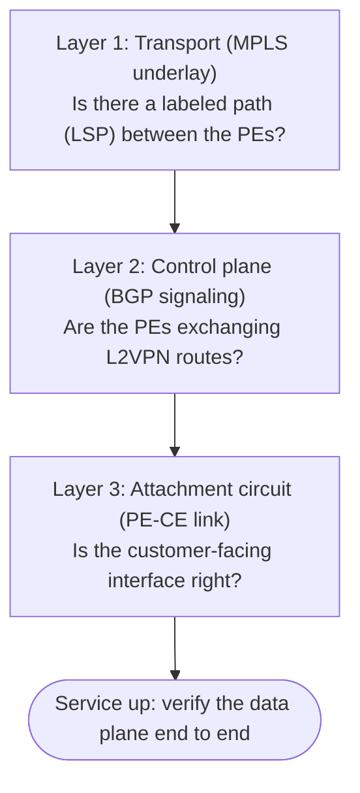
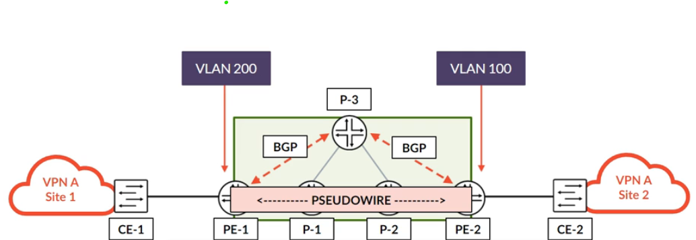
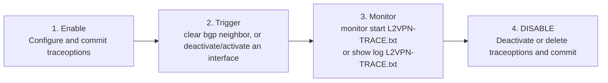

# L2VPN Troubleshooting

**A bottom-up method, status codes, and the common transport, control-plane, attachment-circuit and site ID faults**

> Study notes by [Nazirul Roslan](https://www.linkedin.com/in/nazirulroslan) · JNCIP-SP · Junos Layer 2 VPNs · Part 006

← [Previous: L2VPN Configuration](005-l2vpn-configuration.md) · [Index](../README.md) · [Next: L2VPN Site IDs, the Label Base and Overprovisioning](007-site-ids-label-base-overprovisioning.md) →

**Contents:** [1 Method](#module-1-a-methodical-approach-to-l2vpn-troubleshooting) · [2 Transport](#module-2-fault-module-transport-layer-failures-no-lsp-to-pe) · [3 Control Plane](#module-3-fault-module-control-plane-failures-missing-bgp-afi) · [4 Attachment Circuit](#module-4-fault-module-attachment-circuit-failures) · [5 Site ID](#module-5-fault-module-signaling-and-id-failures-site-id) · [6 OAM](#module-6-advanced-diagnostics-and-oam) · [7 Lab](#module-7-comprehensive-troubleshooting-lab) · [8 Recap](#module-8-best-practices-recap-and-glossary) · [9 Dynamic Recall](#module-9-dynamic-recall)

---

## Module 1: A Methodical Approach to L2VPN Troubleshooting

**Objectives:**
- Introduce a structured, three-layer troubleshooting method.
- Provide a quick-reference checklist and a detailed status code table for common L2VPN errors.

### 1.1 The troubleshooting flow

Effective L2VPN troubleshooting follows a logical path that mirrors the service's architecture. Instead of checking commands at random, start at the bottom layer and work up. That avoids wasted time and quickly isolates the fault domain.



- **Layer 1: Transport (the MPLS underlay).** Is there a valid, labeled path (LSP) between the PE routers? Without it, no VPN traffic can be tunneled.
- **Layer 2: Control plane (BGP signaling).** Are the PEs successfully exchanging L2VPN information? Check the BGP session and the `l2vpn` address family.
- **Layer 3: Attachment circuit (the PE-CE link).** Is the customer-facing interface configured correctly? This covers physical status, encapsulation and VLAN tagging.

### 1.2 Quick-reference checklist

| Layer | Key command(s) | What to check |
|---|---|---|
| Transport | `show route table inet.3` | A labeled route to the remote PE's loopback must exist. |
| Control plane | `show bgp summary` | The BGP session to the RR/peer must be `Established` with an active `bgp.l2vpn.0` table. |
| Attachment circuit | `show l2vpn connections` | Primary command. Look for `St Up`. Any other status code points to a specific issue. |

### 1.3 Status code pocket table

The status codes from `show l2vpn connections` are invaluable for quick diagnosis. The most common codes and their likely causes:

| Status code | Meaning | Likely cause and where to look |
|---|---|---|
| `EM` | Encapsulation mismatch | `encapsulation-type` in `[protocols l2vpn]` doesn't match between the PEs. |
| `OR` | Out of range | A `site-identifier` is wrong or doesn't fit the remote PE's label block (see Module 5). |
| `LD` / `RD` | Local / remote site signaled down | The PE-CE interface is down, or the wrong interface is bound in `[routing-instances ... site]`. |
| `VC-Dn` | Virtual circuit down | Generic error. Often a transport (LSP) or BGP signaling issue. Start here if no other code is shown. |
| No connections | -- | Vague but serious. Could be a missing LSP, a missing BGP `l2vpn signaling` family, or a mismatched RT. |

> [!NOTE]
> The original tied `OR` to `site-range`. `site-range` is a VPLS option; for a BGP L2VPN, "out of range" means the local site ID falls outside the label block the remote PE advertised (its offset plus block size, 8 labels by default). Junos can normally allocate extra label blocks to cover higher site IDs, which Part 007 explains.

The command prints a legend at the top of its output. Other codes you'll meet there, useful for the exam:

| Code | Meaning | Code | Meaning |
|---|---|---|---|
| `EI` | Encapsulation invalid | `NC` | Interface encapsulation not CCC/TCC/VPLS |
| `WE` | Interface and instance encapsulations not the same | `NP` | Interface hardware not present |
| `CM` | Control-word mismatch | `CN` | Circuit not provisioned |
| `OL` | No outgoing label | `IL` | No incoming label |
| `MM` | MTU mismatch | `SC` | Local and remote site ID collision |
| `LN` / `RN` | Local / remote site not designated (multihoming) | `BK` | Backup connection |
| `Dn` | Down | `XX` | Unknown connection status |
| `->` / `<-` | Only the outbound / only the inbound direction is up | `Up` | Operational |

> [!TIP]
> **Best practice: use `extensive`.** For transient issues (for example, a connection that flaps), the standard `show l2vpn connections` may show `Up`. `show l2vpn connections extensive` reveals a history of status changes and error messages, so you can catch problems that happened in the past.

> [!IMPORTANT]
> **Key takeaways.** L2VPN troubleshooting becomes manageable with a structured, bottom-up approach. Verify the MPLS transport first, then the BGP control plane, and finally the PE-CE attachment circuit to isolate and fix faults systematically. The status codes from `show l2vpn connections` are your most direct clues. Now let's apply the method to specific failures.

---

## Module 2: Fault Module: Transport Layer Failures (No LSP to PE)

**Objectives:**
- Diagnose L2VPN failures caused by a missing MPLS transport path (LSP).
- Identify and understand the "one-sided up" symptom, a distinctive indicator of transport failure.

### 2.1 Symptom and diagnosis

The most basic prerequisite for an L2VPN is a labeled path to the remote PE. If the LSP is missing in one direction (for example, PE1 to PE2), PE1 can't resolve the BGP next hop of PE2's L2VPN route, and the connection fails. The main diagnostic command is to check the `inet.3` routing table.

On PE1, after deliberately deleting the RSVP LSP to PE2, there's no labeled route to PE2's loopback (`192.168.1.2`):

```
root@PE-1> show route table inet.3
inet.3: 1 destinations, 1 routes (1 active, 0 holddown, 0 hidden)
+ = Active Route, - = Last Active, * = Both
192.168.1.33/32    *[RSVP/7/1] 01:30:15, metric 20
                    > to 10.1.8.8 via ge-0/0/0.0
```

So `show l2vpn connections` on PE1 shows a vague "No connections found", because PE1 has no path to build the connection over:

```
root@PE-1> show l2vpn connections instance L2VPN_JOHNS_ICE_CREAM
Instance: L2VPN_JOHNS_ICE_CREAM
  Local site: ONE (1)
    No connections found.
```

> [!TIP]
> PE2's route is still received, but its next hop can't be resolved in `inet.3`, so BGP keeps it as a **hidden** route. `show route table bgp.l2vpn.0 hidden` (add `extensive` for the reason, such as an unusable next hop) is a quick way to confirm this.

> [!TIP]
> **Exam tip: the "one-sided up" state.** A one-way transport failure creates a distinctive and confusing symptom. In this scenario the LSP from PE2 to PE1 may still be up, so PE2 can resolve its next hop and reports its side of the L2VPN as `Up`, while PE1's side is down. This is one of the few common scenarios where an L2VPN is up at one end but down at the other. If you see it, the problem is almost certainly a one-way transport issue (LSP, LDP or IGP).

### 2.2 Resolution

Fixing a transport failure means troubleshooting the underlying label signaling protocol:

1. **Verify the IGP.** Can you `ping` the remote PE's loopback address? If not, fix the underlying OSPF or IS-IS issue.
2. **Verify the label protocol.** Check the status of the signaling protocol:
   - For RSVP: `show rsvp session`
   - For LDP: `show ldp session` and `show ldp neighbor`
3. **Check the MPLS interfaces.** Make sure `family mpls` is configured on the core-facing interfaces and that they're enabled under `protocols mpls` (`show mpls interface`).

> [!IMPORTANT]
> **Key takeaways.** An L2VPN depends completely on its MPLS transport underlay. A missing LSP, usually spotted as a missing route in `inet.3`, stops the connection from establishing and can cause a confusing "one-sided up" state. Always check both ends of the connection. With transport verified, move up the stack to the control plane.

---

## Module 3: Fault Module: Control Plane Failures (Missing BGP AFI)

**Objective:** troubleshoot L2VPN failures caused by a missing BGP `l2vpn` address family, a common oversight in new deployments.

### 3.1 Symptom and diagnosis

Another common mistake, especially in new deployments, is forgetting to enable the `l2vpn signaling` address family on the iBGP session between the PE and the Route Reflector (RR). Without it, BGP won't advertise or accept L2VPN routes, and the service can't establish.

After removing `family l2vpn signaling` from the BGP group on PE1, the connection status again becomes "No connections found":

```
root@PE-1> show l2vpn connections instance L2VPN_JOHNS_ICE_CREAM
Instance: L2VPN_JOHNS_ICE_CREAM
  Local site: ONE (1)
    No connections found.
```

The key diagnostic step is checking the BGP session details. There's no `bgp.l2vpn.0` table for the neighbor, showing the family isn't active:

```
root@PE-1> show bgp summary group INTERNAL
Groups: 1 Peers: 1 Down peers: 0
Table          Tot Paths  Act Paths Suppressed    History Damp State    Pending
inet.0                 0          0          0          0          0          0
Peer                     AS      InPkt     OutPkt    OutQ   Flaps Last Up/Dwn State|#Active/Received/Accepted/Damped...
192.168.1.33         64512       1234       1235       0       1 2d 10:05:11 Establ
  inet.0: 0/0/0/0
```

### 3.2 Resolution

The fix is simple: add the required address family to the BGP configuration. Re-enable `l2vpn signaling` on the BGP group that points to the RR or iBGP peer:

```
[edit protocols bgp group INTERNAL]
root@PE-1# set family l2vpn signaling
```

> [!WARNING]
> **Common mistake: maintenance windows.** Adding a new address family makes the BGP session flap. That's service-impacting for any other address families (like `inet-vpn`) running on the session. In a production network, always make this change in a scheduled maintenance window.

> [!NOTE]
> Once you configure any `family` explicitly on a BGP group, only the listed families are negotiated. If the group previously carried only the default `inet unicast`, add `family inet unicast` too if you still need it. The RR must also have `family l2vpn signaling`, or the session won't negotiate it.

> [!IMPORTANT]
> **Key takeaways.** A missing BGP address family is a simple but critical configuration error that completely breaks L2VPN signaling. "No connections found" is a vague symptom, but `show bgp summary` quickly shows the missing `bgp.l2vpn.0` table and points straight to the cause. Next, failures at the final layer: the PE-CE attachment circuit.

---

## Module 4: Fault Module: Attachment Circuit Failures

**Objectives:**
- Diagnose failures related to the PE-CE interface, including encapsulation and VLAN mismatches.
- Understand how a VLAN mismatch can cause a "control plane up, data plane down" scenario.

### 4.1 Encapsulation mismatch (status: `EM`)

One of the most common and easily spotted errors is an encapsulation mismatch: the `encapsulation-type` under `[protocols l2vpn]` differs between the two PEs. For example, PE1 is configured for `ethernet-vlan` while PE2 is configured for `ethernet`.

`show l2vpn connections` clearly shows `EM` (encapsulation mismatch) on both ends:

```
root@PE-1> show l2vpn connections instance L2VPN_JOHNS_ICE_CREAM
Legend for connection status (St)
EM -- encapsulation mismatch      WE -- interface and instance encaps not same
(snip)
Instance: L2VPN_JOHNS_ICE_CREAM
  Edge protection: Not-Primary
  Local site: ONE (1)
    connection-site           Type  St     Time last up          # Up trans
    2                         rmt   EM       
```

**Resolution:** make the `encapsulation-type` statement identical in the routing instance on both PEs.

> [!NOTE]
> Don't confuse `EM` with `WE`, shown right next to it in the legend. `EM` compares the two **PEs**' `encapsulation-type` values. `WE` is a local problem: the instance's `encapsulation-type` doesn't suit the interface encapsulation (for example, `ethernet-vlan` in the instance but `ethernet-ccc` on the port).

### 4.2 Wrong CE interface bound (status: `LD` / `RD`)

This error happens when the routing instance uses an interface that's down, not configured for L2VPN, or simply the wrong port. The PE knows its local attachment circuit isn't viable and signals that to the remote PE.

On PE2, an incorrect interface (`ge-0/0/8.200`) is placed in the instance. PE2 reports `LD` (local site signaled down):

```
root@PE-2> show l2vpn connections instance L2VPN_JOHNS_ICE_CREAM
Instance: L2VPN_JOHNS_ICE_CREAM
  Edge protection: Not-Primary
  Local site: TWO (2)
    connection-site           Type  St     Time last up          # Up trans
    1                         rmt   LD
```

**Symptom on the remote PE:** the other side (PE1) reports `RD` (remote site signaled down), which tells you the problem is the remote attachment circuit. `LD` or `RD` immediately tells you to check the interface binding and status on the corresponding PE.

**Resolution:** correct the `interface` statement in the `[routing-instances ...]` and `[... protocols l2vpn site ...]` hierarchies so it points to the correct, active PE-CE interface.

### 4.3 VLAN mismatch (data-plane failure)

This is a subtle but critical failure mode. The BGP L2VPN control plane does **not** exchange VLAN ID information. So if PE1 is configured for VLAN 200 and PE2 for VLAN 100, `show l2vpn connections` shows `St Up`, because as far as BGP is concerned everything is fine.



Traffic fails, though. A frame tagged VLAN 200 arrives at PE2, which can't send it out of an interface configured only for VLAN 100. The frame is silently dropped.

> [!NOTE]
> Exactly where the frame dies depends on the platform and configuration. By default Junos doesn't rewrite the tag on a `vlan-ccc` circuit, so PE2 may forward the frame still tagged 200 and CE2 discards it because it only expects VLAN 100. Either way the result is the same: control plane up, traffic lost. (The legend's `VM` "VLAN ID mismatch" code applies to pseudowires that signal the VLAN, not to the BGP L2VPN case here.)

> [!TIP]
> **Exam tip: control plane up, data plane down.** A classic exam scenario: the L2VPN connection is `Up`, but pings fail. That points straight to a data-plane issue, and a VLAN ID mismatch on the attachment circuits is the most likely cause. The VLAN tag is a local property of the interface and isn't part of the BGP signaling.

**Resolution:**
- The simplest fix is to align the `vlan-id` on the logical units on both PEs.
- Where the tags must differ, configure VLAN translation (covered in a later module).

> [!IMPORTANT]
> **Key takeaways.** Attachment circuit failures are common and can mislead. `EM` and `LD`/`RD` point directly to configuration errors, but a VLAN mismatch creates a tricky "control plane up, data plane down" situation. Always verify data-plane connectivity even when the control plane says `Up`. Next, errors in the signaling and identification of sites.

---

## Module 5: Fault Module: Signaling and ID Failures (Site ID)

**Objectives:**
- Resolve issues caused by mismatched or out-of-range site identifiers.
- Understand the role of the `site-identifier` in VPN label calculation.

### 5.1 Symptom (status: `OR`)

The `site-identifier` matters because it's used as an index into a label block (starting at the "label base") to work out the VPN label for that site. If the PEs have mismatched expectations about site IDs, the connection fails.

> [!NOTE]
> **The label maths, precisely.** Each PE advertises a label block: a label base, a block offset (the first site ID it covers) and a block size (8 by default). A PE sending towards that remote site picks its outgoing label as **remote label base + (its own local site ID − remote block offset)**, which only works if its local site ID falls within offset to offset + size − 1. In this example PE1 (site 1) advertises a block covering sites 1-8. PE2 is changed to site 9, which is outside PE1's block, so PE2 can't derive a label and reports `OR`.

Here PE2's site ID is changed from 2 to 9. PE1 expects site 2, so the negotiation fails. PE2 reports `OR` (out of range):

```
root@PE-2> show l2vpn connections instance L2VPN_JOHNS_ICE_CREAM
Legend for connection status (St)
OR -- out of range                Up -- operational
(snip)
Instance: L2VPN_JOHNS_ICE_CREAM
  Edge protection: Not-Primary
  Local site: TWO (9)
    connection-site           Type  St     Time last up          # Up trans
    1                         rmt   OR
```

At the other end, PE1 expects an advertisement for site 2 but never receives one, so it shows the generic "No connections found":

```
root@PE-1> show l2vpn connections instance L2VPN_JOHNS_ICE_CREAM
Instance: L2VPN_JOHNS_ICE_CREAM
  Local site: ONE (1)
    No connections found.
```

### 5.2 Resolution

There are two ways to fix a site ID mismatch:

1. **Correct the site ID.** The most straightforward fix: change the `site-identifier` on PE2 back to 2 so it matches PE1's expectation.
2. **Use a static override.** If you can't change the remote site's ID, tell the local PE explicitly what to expect with `remote-site-id`. This overrides the default (implied) remote site.

On PE1, configure the remote site's ID as 9. This fixes the mismatch without any change on PE2:

```
[edit routing-instances L2VPN_JOHNS_ICE_CREAM]
root@PE-1# set protocols l2vpn site ONE interface ge-0/0/9.100 remote-site-id 9
```

> [!NOTE]
> With `remote-site-id 9`, PE1 now needs a label block that covers site 9 as well. Junos handles this by advertising an additional label block for PE1 (Part 007 covers label blocks and overprovisioning). Use the interface name that's actually bound to the site; `ge-0/0/9.100` assumes the VLAN-based version of the service.

> [!IMPORTANT]
> **Key takeaways.** Site ID mismatches break L2VPN connections by preventing correct VPN label negotiation, showing `OR` (out of range). Correcting the ID is the standard fix, and `remote-site-id` provides an override for specific operational cases. That covers the most common L2VPN faults. Next, advanced diagnostic tools like `ping mpls` and `traceoptions`.

---

## Module 6: Advanced Diagnostics and OAM

**Objectives:**
- Use `ping mpls l2vpn` for data-plane verification.
- Apply a safe and effective `traceoptions` workflow for deep-dive debugging.

### 6.1 Verification with `ping mpls l2vpn`

Once the control plane shows `St Up`, use `ping mpls l2vpn` to verify the data-plane path works. It sends an MPLS echo request down the pseudowire itself, using the transport and VPN labels, and the remote PE replies. It's a powerful way to confirm both labels work correctly.

> [!NOTE]
> The original said the echo request is "processed and replied to by the remote PE's Packet Forwarding Engine (PFE)". MPLS echo requests (LSP ping, RFC 8029) are punted to the remote PE's **Routing Engine**, which builds the reply. The test still proves the forwarding path, because the request travels through the same labels as customer traffic. It doesn't test the PE-CE link.

This command pings the L2VPN instance, specifying the local and remote site IDs to test a specific pseudowire:

```
root@PE-1> ping mpls l2vpn instance L2VPN_JOHNS_ICE_CREAM local-site-id 1 remote-site-id 2
!!!
--- l2vpn ping statistics ---
3 packets transmitted, 3 packets received, 0% packet loss
```

### 6.2 A safe traceoptions workflow

`traceoptions` give extremely detailed logs but can badly affect router performance if left running. Use them carefully and always within a structured workflow.

> [!WARNING]
> **Best practice: scope your trace.** Never configure `traceoptions` at the global `[edit protocols l2vpn]` level on a busy production router. That traces every L2VPN and can overwhelm the Routing Engine. Always apply traceoptions inside the specific routing instance you're troubleshooting: `[edit routing-instances <INSTANCE> protocols l2vpn traceoptions]`.

A safe, targeted `traceoptions` configuration for debugging connection and routing issues:

```
set routing-instances L2VPN_JOHNS_ICE_CREAM protocols l2vpn traceoptions file L2VPN-TRACE.txt size 5m files 3
set routing-instances L2VPN_JOHNS_ICE_CREAM protocols l2vpn traceoptions flag error detail
set routing-instances L2VPN_JOHNS_ICE_CREAM protocols l2vpn traceoptions flag connections detail
set routing-instances L2VPN_JOHNS_ICE_CREAM protocols l2vpn traceoptions flag route detail
set routing-instances L2VPN_JOHNS_ICE_CREAM protocols l2vpn traceoptions flag state detail
```

**The workflow:**



1. **Enable:** configure and commit the `traceoptions`.
2. **Trigger:** do something that triggers the event you want to log (for example, `clear bgp neighbor`, or deactivate and reactivate an interface).
3. **Monitor:** watch the log file in real time with `monitor start L2VPN-TRACE.txt`, or review it with `show log L2VPN-TRACE.txt`.
4. **DISABLE:** the most important step. When you're done, deactivate or delete the `traceoptions` stanza and commit. (Stop a real-time view with `monitor stop`.)

> [!WARNING]
> `clear bgp neighbor` resets the session and every service on it. On a production router, prefer a narrower trigger, such as bouncing just the CE-facing interface of the circuit you're tracing.

> [!IMPORTANT]
> **Key takeaways.** For advanced diagnostics, `ping mpls l2vpn` is the go-to data-plane check, and a careful `traceoptions` workflow lets you inspect control-plane behavior in depth. Always scope traceoptions narrowly and disable them afterwards. Now let's apply these skills in a lab.

---

## Module 7: Comprehensive Troubleshooting Lab

This lab builds on the configuration from the previous guide. You're given a pre-configured but broken L2VPN environment and must diagnose and fix a series of common faults using the method and commands from this part.


**Loopback IPs**
- Format: `192.168.1.x/32`, where `x` is the device number (for example, PE1 is `192.168.1.1`).
- The Route Reflector uses `192.168.1.33/32`.

**Point-to-point IPs**
- Format: `10.x.y.z/24`, where `x` is the lower device ID and `y` the higher device ID. The host part `z` is the device's own ID.
- Example: on the link between P8 and PE1 (vMX-P8 and PE1-vMX-VFP), P8's IP is `10.1.8.8` and PE1's IP is `10.1.8.1`.

> [!NOTE]
> As in [Part 005](005-l2vpn-configuration.md#lab-topology-and-addressing-plan), the original text labels the RR "(PE3)", but the topology shows the RR role on **vMX-P3-RR**. The full link table is in Part 005.

### Part 1: Initial state and pre-flight checks

**Goal:** establish a baseline of the network's (broken) state.

On PE1, check the L2VPN status:

```
naz@R1> show l2vpn connections instance L2VPN-CE1-CE2
Instance: L2VPN-CE1-CE2
  Local site: CUST-SITE-1 (1)
    No connections found.
```

Start the methodical check with the transport layer. Can PE1 reach PE2?

```
naz@R1> show route table inet.3 192.168.1.2
inet.3: 2 destinations, 2 routes (2 active, 0 holddown, 0 hidden)
+ = Active Route, - = Last Active, * = Both
192.168.1.2/32     *[RSVP/7/1] 00:10:05, metric 20
                    > to 10.1.8.8 via ge-0/0/0.0, label-switched-path PE1-TO-PE2
```

**Analysis:** the transport layer is fine; there's an active LSP to PE2. The problem must be in the control plane or the attachment circuit.

> [!TIP]
> A healthy LSP from PE1 to PE2 doesn't prove the reverse direction. Remember the "one-sided up" case from Module 2: on PE2, check `show route table inet.3 192.168.1.1` too.

### Part 2: Fixing the control plane

**Goal:** diagnose and fix the BGP signaling issue.

Check the BGP session on PE1:

```
naz@R1> show bgp summary group INTERNAL | match l2vpn
```

**Analysis:** the command returns no output, confirming the `l2vpn signaling` family is missing.

Fix the BGP configuration:

```
[edit protocols bgp group INTERNAL]
naz@R1# set family l2vpn signaling
```

After committing, re-check the connection status:

```
naz@R1> show l2vpn connections instance L2VPN-CE1-CE2
Instance: L2VPN-CE1-CE2
  Local site: CUST-SITE-1 (1)
    connection-site           Type  St     Time last up          # Up trans
    2                         rmt   EM
```

**Analysis:** progress. The vague "No connections" error is gone, replaced by a specific `EM` code, which points to an encapsulation issue on the service configuration.

### Part 3: Fixing the attachment circuit

**Goal:** resolve the encapsulation mismatch and verify connectivity.

Check the encapsulation configuration on both PEs:

```
# On PE1
naz@R1> show configuration routing-instances L2VPN-CE1-CE2 | display set | match encapsulation
set routing-instances L2VPN-CE1-CE2 protocols l2vpn encapsulation-type ethernet
# On PE2
naz@R2> show configuration routing-instances L2VPN-CE1-CE2 | display set | match encapsulation
set routing-instances L2VPN-CE1-CE2 protocols l2vpn encapsulation-type ethernet-vlan
```

**Analysis:** mismatch confirmed. PE1 is configured for port-based (`ethernet`) and PE2 for VLAN-based (`ethernet-vlan`).

Correct the configuration on PE2 to match PE1:

```
[edit routing-instances L2VPN-CE1-CE2 protocols l2vpn]
naz@R2# set encapsulation-type ethernet
```

> [!NOTE]
> Also check that PE2's CE-facing interface matches the new type (for a port-based `ethernet` service, `encapsulation ethernet-ccc` on the port). If the instance and interface encapsulations disagree, the connection moves from `EM` to `WE` instead of `Up`.

The final check should now show `St Up`:

```
naz@R1> show l2vpn connections instance L2VPN-CE1-CE2
Instance: L2VPN-CE1-CE2
  Local site: CUST-SITE-1 (1)
    connection-site           Type  St     Time last up          # Up trans
    2                         rmt   Up     Sep 08 11:45:00 2025        1
```

Verify the data plane with `ping mpls`:

```
naz@R1> ping mpls l2vpn instance L2VPN-CE1-CE2 local-site-id 1 remote-site-id 2
!!!
--- l2vpn ping statistics ---
3 packets transmitted, 3 packets received, 0% packet loss
```

> [!IMPORTANT]
> **Lab outcome.** Following a methodical flow, you diagnosed several layered faults. You confirmed the transport layer was healthy, which let you focus on the control plane. Fixing the missing BGP address family revealed the next issue, an encapsulation mismatch, which you fixed in the service configuration. A structured approach, guided by specific CLI outputs and status codes, is the key to efficient L2VPN troubleshooting.

---

## Module 8: Best Practices Recap and Glossary

### Troubleshooting best practices

- **Follow the flow.** Always troubleshoot bottom-up: Transport → Control plane → Attachment circuit.
- **Check both ends.** Many parameters must be symmetrical. Always verify the configuration on both PE routers of the pseudowire.
- **Trust the status codes.** The codes in `show l2vpn connections` are your best friend. Learn what `EM`, `OR`, `LD` and `RD` mean to identify the fault domain quickly.
- **Use `extensive`.** For flapping or historical issues, `show l2vpn connections extensive` is invaluable.
- **Disable traceoptions.** `traceoptions` are powerful but resource-intensive. Always disable them as soon as you've finished troubleshooting.

### Glossary

| Term | Definition |
|---|---|
| **Attachment circuit** | The logical connection between a CE and a PE device. |
| **Autodiscovery** | The ability of BGP-signaled L2VPNs to discover remote PE routers automatically, without configuring each one manually. |
| **Circuit cross-connect (CCC)** | A legacy pseudowire method, and also a modern interface encapsulation keyword (`ethernet-ccc`). |
| **Label-switched path (LSP)** | An MPLS-labeled path between routers, used to tunnel traffic across the service provider core. |
| **Pseudowire** | A mechanism that emulates a point-to-point Layer 2 connection over a packet-switched network such as MPLS. |
| **Route Distinguisher (RD)** | An 8-byte value prepended to a route to make it unique in the BGP table. In L3VPNs it allows overlapping IP addresses between VPNs; in L2VPNs it keeps each PE's site advertisements distinct. |
| **Route Target (RT)** | A BGP extended community that controls the import and export of routes into VPN routing instances (VRFs). |
| **Site ID** | A unique number for a site within an L2VPN, used to calculate the VPN label. |
| **VPN label** | The inner MPLS label that identifies which VPN (or pseudowire) the traffic belongs to at the egress PE. |

---

## Module 9: Dynamic Recall

### Part 1: Recall

**1. What is the first layer to check when troubleshooting an L2VPN?**

<details><summary>Answer</summary>

The **transport layer**. Use `show route table inet.3` to make sure there's an LSP to the remote PE.

</details>

**2. What does the `EM` status code in `show l2vpn connections` indicate?**

<details><summary>Answer</summary>

**Encapsulation mismatch.** The `encapsulation-type` in the routing instance doesn't match between the PEs.

</details>

**3. A VPLS connection is `Up`, but pings fail. What is a likely cause?**

<details><summary>Answer</summary>

A **VLAN mismatch** on the attachment circuits. It's a data-plane failure that the control plane doesn't detect.

</details>

**4. What does the `LD` status code mean?**

<details><summary>Answer</summary>

**Local site signaled down.** The local PE's attachment circuit is down or incorrectly configured in the instance.

</details>

**5. What is the safest way to use `traceoptions` on a production router?**

<details><summary>Answer</summary>

Apply them within the specific **routing instance**, not globally, and always deactivate them after troubleshooting.

</details>

### Part 2: Fusion

Naz stared at the screen, puzzled. "The L2VPN is `Up`," he said, showing his mentor, Maria, the output of `show l2vpn connections`. "Pings from the PE with `ping mpls l2vpn` work perfectly. But the customer insists their servers can't talk to each other."

"Classic data-plane problem," Maria replied. "The control plane is perfect: BGP is happy, labels are exchanged. The fault isn't in the service provider core. It's at the edge. What's different about the two customer sites?"

Naz checked the interface configurations. "Ah," he sighed. "Site A is on `ge-0/0/1.100` with `vlan-id 100`, but Site B is on `ge-0/0/5.200` with `vlan-id 200`. The VLANs don't match."

"Exactly," said Maria. "PE2 receives the frame with a VLAN 100 tag, but it can't send it out of an interface that's only configured for VLAN 200. The frame is silently dropped. It's a perfect example of a 'control plane up, data plane down' fault, and it's almost always an attachment circuit issue."

> [!TIP]
> This is also why `ping mpls l2vpn` succeeding isn't the end of the story: it tests PE to PE across the core, not the PE-CE links. Always finish with an end-to-end test from the CEs.

### Part 3: Chunk and collapse

| Chunk | One-sentence summary | Tags |
|---|---|---|
| **Troubleshooting flow** | Always check in order: transport (LSP), control plane (BGP), then attachment circuit (PE-CE link). | #Methodology #BottomUp #IsolateFault |
| **Status codes are key** | Learn codes like `EM`, `OR`, `LD` and `VC-Dn` to know instantly where to start looking. | #StatusCodes #Diagnostics #ShowL2VPN |
| **One-sided up** | If one PE shows `Up` and the other shows `No connections`, it's almost always a one-way transport (LSP) failure. | #Asymmetric #Transport #LSP-Failure |
| **Ping MPLS** | Use `ping mpls l2vpn` to test the data plane across the core once the control plane shows the connection `Up`. | #DataPlane #Verification #OAM |

---

← [Previous: L2VPN Configuration](005-l2vpn-configuration.md) · [Index](../README.md) · [Next: L2VPN Site IDs, the Label Base and Overprovisioning](007-site-ids-label-base-overprovisioning.md) →
