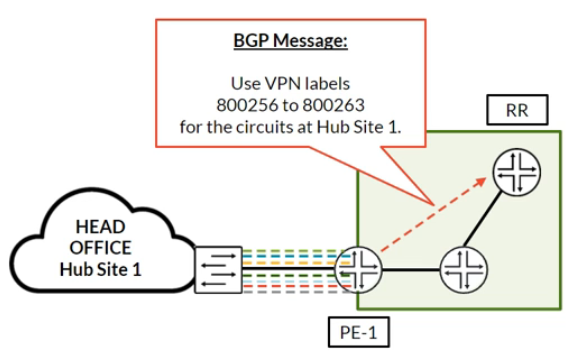
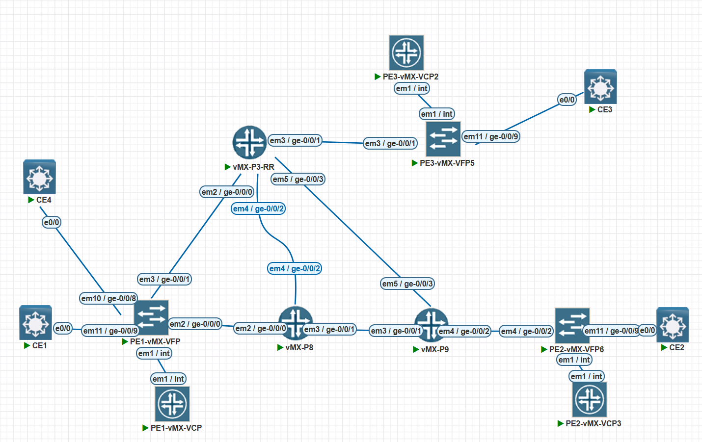
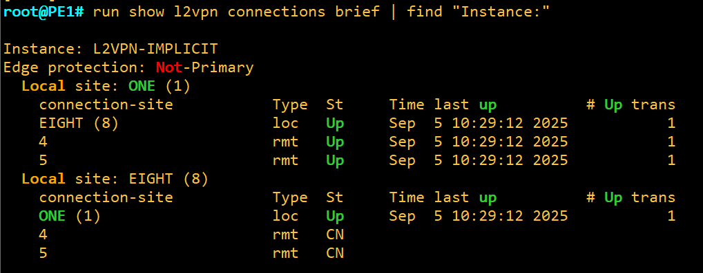
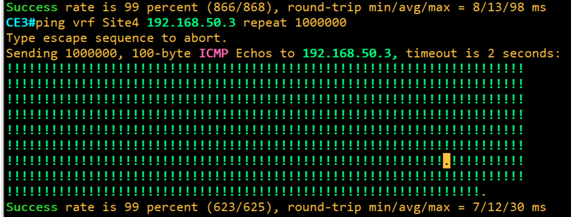
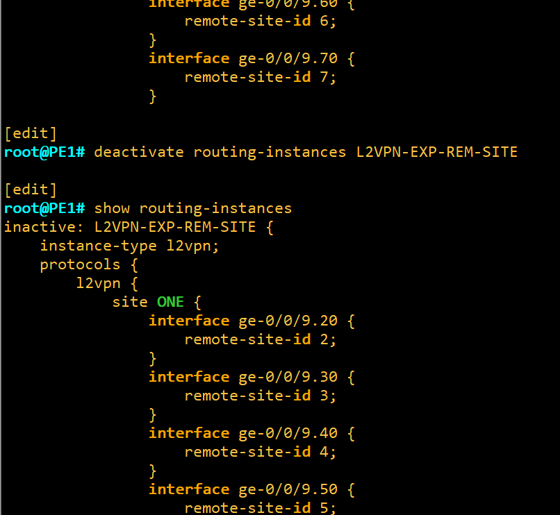
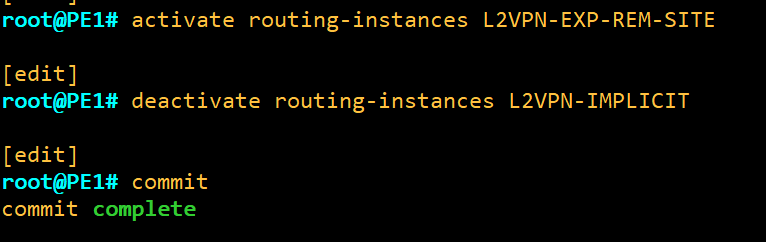

# L2VPN Site IDs, the Label Base and Overprovisioning

**How site IDs and label blocks turn one BGP advertisement into many pseudowires, and why explicit remote site IDs are safer**

> Study notes by [Nazirul Roslan](https://www.linkedin.com/in/nazirulroslan) · JNCIP-SP · Junos Layer 2 VPNs · Part 007

← [Previous: L2VPN Troubleshooting](006-l2vpn-troubleshooting.md) · [Index](../README.md) · [Next: L2VPN Advanced Concepts](008-l2vpn-advanced-concepts.md) →

**Contents:** [1 Prerequisites](#module-1-prerequisites-and-foundational-concepts) · [2 Site IDs and Label Base](#module-2-the-role-of-site-ids-and-the-label-base) · [3 Implicit vs. Explicit](#module-3-overprovisioning-implicit-vs-explicit-site-ids) · [4 Production](#module-4-production-considerations-and-best-practices) · [5 Lab](#module-5-comprehensive-lab-building-and-troubleshooting-a-hub-and-spoke-l2vpn) · [6 Glossary](#module-6-glossary) · [7 Dynamic Recall](#module-7-dynamic-recall)

---

## Module 1: Prerequisites and Foundational Concepts

**Objectives:**
- Recap the core underlay and overlay components required for any L2VPN service.
- Provide a quick reference for essential L2VPN terminology.

### 1.1 Previously in L2VPNs...

Before diving into advanced topics, a quick recap of the foundation. A functional BGP-signaled L2VPN (VPWS) needs a stable underlay and a correctly configured overlay.

| Layer | Component | Role |
|---|---|---|
| **Underlay (transport)** | IGP (OSPF/IS-IS) | Provides loopback reachability between all P and PE routers. |
| | MPLS/LDP | Builds the Label Switched Paths (LSPs) that act as tunnels to carry VPN traffic. (RSVP-TE LSPs work just as well.) |
| **Overlay (service)** | iBGP | Carries the L2VPN control plane information between PE routers. |
| | `family l2vpn signaling` | The BGP address family that enables L2VPN advertisements. |

### 1.2 Reminder of concepts

| Term | Definition |
|---|---|
| **Pseudowire** | A point-to-point Layer 2 circuit emulated over an MPLS network. |
| **Attachment circuit** | The logical connection (for example a specific VLAN) between the CE and the PE. |
| **Route Distinguisher (RD)** | An 8-byte value that makes an L2VPN route globally unique. |
| **Route Target (RT)** | A BGP extended community that controls which PEs import which L2VPN routes. |
| **VPN label** | The inner MPLS label that identifies the specific attachment circuit at the egress PE. |

> [!IMPORTANT]
> **Key takeaways:** L2VPNs are a service built **on top** of the core network. With the underlay and the BGP overlay refreshed, the next module deconstructs how Junos uses site IDs and a label base to manage many pseudowires efficiently.

---

## Module 2: The Role of Site IDs and the Label Base

**Objectives:**
- Explain the purpose of the `site-identifier` and its role in distinguishing attachment circuits.
- Detail how the label base and site ID are used to calculate the final VPN label.
- Define the concept of "overprovisioning" an L2VPN instance.

### 2.1 Overprovisioning: many circuits, one instance

A key feature of BGP-signaled L2VPNs is the ability to place multiple attachment circuits into a single routing instance. This is known as **overprovisioning**. Instead of creating a separate routing instance for every pseudowire, you create one instance that acts as a container for all the pseudowires of a single customer or service type. This greatly simplifies configuration and management.


In this scenario PE-1 has a single L2VPN instance, but it hosts several attachment circuits, each connecting to a different remote site on the other PEs. This creates a hub-and-spoke topology.

### 2.2 The `site-identifier`

If multiple attachment circuits exist within one instance, how does the router tell them apart? That's the job of the site ID. Each site in the VPN gets a unique number (`site-identifier`), and on the local site each attachment circuit is tied to one **remote** site ID. The site ID has two critical functions:

1. It gives each site a unique identity within the L2VPN, so every attachment circuit can be matched to exactly one remote site.
2. It acts as an **offset** into a label block when the VPN label for a specific pseudowire is calculated.

> [!NOTE]
> `site-identifier` must be 1 or higher; 0 is not valid. The value is only unique per L2VPN: every site in the same VPN needs a different ID, except multihomed sites, which deliberately share one (see [008](008-l2vpn-advanced-concepts.md)).

### 2.3 The label base and VPN label calculation

When an L2VPN site is configured, Junos doesn't advertise a separate label for each pseudowire. Instead it advertises a **label block**: a **label base**, a **label-block offset** and a **label-block size** (Junos default size 8). One BGP route per block covers every remote site that falls in the block, and each side calculates the exact VPN label with a simple formula.



In the picture, PE-1 advertises the block 800256 to 800263: label base 800256, block size 8, offset 1. Label 800256 is for traffic from remote site 1, 800257 for site 2, and so on up to 800263 for site 8.

**The formula** (with the Junos default offset of 1):

```
Label a PE expects to RECEIVE from remote site N = its own label base + (N - 1)
```

Written generally (RFC 6624), with the offset included:

| Direction | Label |
|---|---|
| **Incoming** label on PE X for traffic from remote site N | `LB(X) + N - offset(X)` |
| **Outgoing** label PE X pushes toward PE Y | `LB(Y) + (PE X's own site ID) - offset(Y)` |

> [!NOTE]
> **Correction.** The original guide wrote the formula as "VPN label = label base + (remote site ID − 1)" and then applied it to the **remote** PE's label base with the **remote** site ID to get the **outgoing** label. That mixes the two directions. The remote PE's block is indexed by **your own** site ID (the sender's), because that PE has to identify which site the traffic came from. "Label base + (remote site ID − 1)" is correct only for the label a PE **receives**, calculated from its **own** label base. The block must also cover the site ID: a block with offset 1 and size 8 covers sites 1 to 8; for a site outside that range, Junos advertises an additional label block (for example with offset 9).

> [!TIP]
> **Exam tip: the label calculation formula is testable.** You may be given `show l2vpn connections extensive` output and asked to find the label base, or be given the label base and a site ID and asked to calculate the final VPN label. Always ask: whose label block is it, and whose site ID indexes into it?

**Worked example.** In the picture below, PE-1 is VPN A site 1 and uses `remote-site-id 9` because the far site (PE-2) was given the new site ID 9.


The same example worked with the formula:

- **Incoming label on PE-1** (traffic from site 9): PE-1's own block must cover site 9. If PE-1's block has label base 800010 and offset 1 (so it covers at least 9 sites), the label PE-1 expects is `800010 + (9 - 1) = 800018`.
- **Outgoing label on PE-1** (traffic to site 9): PE-1 looks at the block PE-2 advertised and indexes it with **its own** site ID 1. If PE-2's block has offset 1, the outgoing label is `PE-2's label base + (1 - 1)`, which is simply PE-2's label base.

The original guide showed this output as confirmation:

```
root@PE-1> show l2vpn connections instance L2VPN-EXP-REM-SITE extensive
...
    Remote PE: 192.168.1.2, Negotiated control-word: No
    Incoming label: 800018, Outgoing label: 800018
    Label-base: 800010, Site-range: 10
...
```

> [!NOTE]
> Read this output as illustrative. 800018 matches PE-1's **incoming** label if 800010 is PE-1's **own** label base, which is how the formula above works. Identical incoming and outgoing values would be a coincidence, since the two labels come from different routers' label blocks. In real `show l2vpn connections extensive` output, the local label block is shown in the local site header as columns (`Label-base`, `Offset`, `Size`, `Range`, `Preference`), and each connection lists its own `Incoming label` and `Outgoing label`. Check the exact layout on your Junos release.

> [!IMPORTANT]
> **Key takeaways:** Overprovisioning lets many pseudowires live in one L2VPN instance. The site ID uniquely identifies each site and acts as the offset into a label block, so one BGP advertisement covers many pseudowires. Next: the two ways Junos works out remote site IDs.

---

## Module 3: Overprovisioning: Implicit vs. Explicit Site IDs

**Objectives:**
- Explain the default "implicit" method of remote site ID determination.
- Configure and verify L2VPNs using the "explicit" `remote-site-id` statement.
- Compare the use cases, benefits and drawbacks of each method.

### 3.1 The implicit method (default)

By default, Junos uses an **implicit** method to work out the remote site ID of each interface. Remote site IDs are handed out in the **order the interfaces are listed under the site**, starting at 1, counting up, and **skipping the local site's own ID**.

- Simple point-to-point pseudowire: if the local site is 1, its one interface connects to remote site 2. If the local site is 2, its one interface connects to remote site 1.
- Overprovisioned (hub-and-spoke) setup with hub site 1: the first interface connects to remote site 2, the second to remote site 3, and so on.

> [!NOTE]
> The original guide said "the first interface is assumed to connect to remote site 2". That's only true when the local site ID is 1. The counting always starts at 1 and skips the local ID, so for local site 8, the first interface maps to remote site 1 (you can see exactly this in the lab screenshots in Module 5).

On the hub (PE1) we list the interfaces to the spokes. Junos assumes `ge-0/0/9.10` connects to remote site 2, and `ge-0/0/9.20` to remote site 3.

```
[edit routing-instances L2VPN-IMPLICIT protocols l2vpn]
site HUB {
    site-identifier 1;
    interface ge-0/0/9.10;  # <-- Assumed remote-site-id 2
    interface ge-0/0/9.20;  # <-- Assumed remote-site-id 3
}
```

> [!WARNING]
> **The implicit method is brittle.** It's simple but dangerous in production. If you `insert` a new interface before the others in the list, or `delete` one from the middle, Junos **recalculates the remote site IDs for all the following interfaces**, causing an outage on several pseudowires at once. Use it only for simple, static point-to-point pseudowires.

### 3.2 The explicit method (best practice)

The **explicit** method is the recommended best practice for every multi-site L2VPN. You set the remote site ID for each interface yourself with `remote-site-id`. This decouples the configuration from the interface order and makes it far more stable and readable. The configuration is more verbose, but unambiguous and operationally safe.

```
[edit routing-instances L2VPN-EXPLICIT protocols l2vpn]
site HUB {
    site-identifier 1;
    interface ge-0/0/9.10 {
        remote-site-id 2;
    }
    interface ge-0/0/9.20 {
        remote-site-id 3;
    }
}
```

### 3.3 Comparison: implicit vs. explicit

| Feature | Implicit method | Explicit method |
|---|---|---|
| **Configuration** | Less typing, simpler for P2P. | More verbose, but clearer intent. |
| **Stability** | Very low. Changing the interface order is service-impacting. | Very high. Immune to interface ordering changes. |
| **Flexibility** | Low. Only supports sequential remote site IDs. | High. Supports any remote site ID, so non-sequential or complex topologies work. |
| **Best use case** | Simple, static, point-to-point L2VPNs only. | **All** hub-and-spoke or multi-site deployments. |

> [!IMPORTANT]
> **Key takeaways:** The implicit method is the default, but it's fragile and not recommended for multi-site production deployments. The explicit `remote-site-id` statement gives the stability, flexibility and clarity that scalable, operationally safe L2VPN services need. Always prefer the explicit method.

---

## Module 4: Production Considerations and Best Practices

**Objectives:**
- Highlight the impact of MPLS and L2VPN overhead on core network MTU.
- Discuss operational best practices such as maintenance windows and configuration staging.
- Explain the importance of proper label block planning.

### 4.1 MTU and service overhead

L2VPNs add overhead to customer frames. To prevent drops, every core-facing interface (P-P and PE-P links) **must** have its MTU raised. A common value is `9192` to accommodate jumbo frames.

> [!TIP]
> **Best practice: increase the core MTU.** Make sure the MTU on all core-facing interfaces is larger than the customer-facing MTU plus all possible MPLS/VPN overhead. Forgetting this is a common cause of mysterious problems for frames near the 1500-byte limit.

> [!NOTE]
> **How big is the overhead?** The original guide said "typically 8–12 bytes" and "at least 1512". The labels (4 bytes each, so 8 bytes for transport + VPN label) and the optional 4-byte control word are only part of it: the pseudowire carries the **whole customer Ethernet frame**, including its own 14-byte header and any 4-byte VLAN tag. A 1500-byte customer IP packet in a tagged frame becomes about 1518 + 8 + 4 = 1530 bytes of MPLS payload, and more with extra labels (for example with fast reroute or a transport label stack). Junos interface `mtu` (media MTU) also counts the core link's own Layer 2 header. That's why a jumbo value like 9192 in the core is the practical answer.
>
> Don't confuse this with the **attachment circuit** MTU: BGP L2VPN signals the local circuit's MTU to the remote PE (in the Layer 2 info extended community), and a mismatch keeps the pseudowire down unless you configure `ignore-mtu-mismatch`.

### 4.2 Operational best practices

- **Use maintenance windows.** Any change to a BGP address family (such as adding `family l2vpn signaling`) resets the BGP sessions, and a significant change to an L2VPN instance (such as a cutover from implicit to explicit) is service-impacting. Do these in a scheduled maintenance window.
- **Stage and verify configurations.** Before committing, stage the change and use `commit check` to validate it. Have a rollback plan ready (`rollback 1`) in case of surprises. A safe cutover coordinates changes across several PEs, as the lab shows.
- **Plan your label blocks.** Plan site IDs so that they stay compact and each block covers the sites you expect to add later. Keep growth in mind so you don't need to re-provision the service.

> [!NOTE]
> The original guide said the optional `site-range` statement "defines the size of the label block". In Junos, `site-range` sets the **highest remote site ID** a site will accept for bringing up a pseudowire; the size of each label block is a separate setting (default 8; `label-block-size` accepts 2, 4, 8 or 16 on releases that support it). When a remote site ID falls outside the current block, Junos simply advertises another label block, so a small block doesn't stop the service from growing, it just means more BGP routes.

> [!IMPORTANT]
> **Key takeaways:** Advanced L2VPNs need more than the VPN configuration. Physical considerations such as MTU, and disciplined operations (maintenance windows, staging, planning for growth), are essential for stable, well-performing services.

---

## Module 5: Comprehensive Lab: Building and Troubleshooting a Hub-and-Spoke L2VPN

**Lab overview:** you'll configure a hub-and-spoke L2VPN. First you build the service with the default implicit remote site ID method, then you do a safe cutover to the more robust explicit method. Finally you inject common faults to practice troubleshooting.



> [!TIP]
> **Why this matters.** Hub-and-spoke L2VPNs and the operational difference between implicit and explicit site IDs are core JNCIP-SP skills. This lab gives hands-on practice with scalable configuration, safe migration procedures, and failure scenarios common in real service provider networks.

### Part 1: Foundation and pre-flight checks

**Goal:** configure the underlay and the CE devices to give the L2VPN service a stable foundation.

**Reasoning:** a stable underlay is non-negotiable. Make sure core reachability and label distribution work perfectly before adding the L2VPN service layer.

Configuration (Juniper core, all PEs and P routers):

```
set system host-name <DEVICE_NAME>
set system root-authentication plain-text-password
set interfaces lo0 unit 0 family inet address <LOOPBACK_IP/32>
set interfaces <CORE_FACING_INT> unit 0 family inet address <P2P_IP/24>
set interfaces <CORE_FACING_INT> unit 0 family mpls
set protocols ospf area 0.0.0.0 interface all
set protocols mpls interface all
set protocols ldp interface all
# On PEs only
set protocols bgp group to_RR type internal
set protocols bgp group to_RR local-address <LOOPBACK_IP>
set protocols bgp group to_RR family l2vpn signaling
set protocols bgp group to_RR neighbor <RR_LOOPBACK_IP>
```

> [!NOTE]
> The route reflector also needs a matching group with `family l2vpn signaling`, a `cluster` ID and the PEs as neighbors. Also consider `set protocols ospf area 0.0.0.0 interface fxp0.0 disable` (or naming the core interfaces instead of `all`) so OSPF doesn't run on the management interface.

Configuration (Cisco CEs). CE1 connects to PE1 (VLAN 10) and PE2 (VLAN 20). CE2 connects to PE3 (VLAN 30).

```
! On CE1
interface GigabitEthernet0/1
 encapsulation dot1Q 10
 ip address 10.1.1.1 255.255.255.0
 no shutdown
!
interface GigabitEthernet0/2
 encapsulation dot1Q 20
 ip address 10.1.2.1 255.255.255.0
 no shutdown
! On CE2
interface GigabitEthernet0/1
 encapsulation dot1Q 30
 ip address 10.1.3.2 255.255.255.0
 no shutdown
```

**Verification:** from each PE, ping the loopback addresses of all the other PEs. From each CE, ping the PE's directly connected interface. This confirms the underlay is healthy.

> [!NOTE]
> The CE ping check only works if the PE-facing unit has an IP address. Once the unit is changed to `vlan-ccc` for the L2VPN it no longer has `family inet`, so do this check before converting it, or skip it.

### Part 2: Implicit site ID configuration

**Goal:** build a hub-and-spoke L2VPN with the default, order-dependent implicit method.

**Reasoning:** this is the simplest way to configure a multi-site L2VPN, and gives a baseline to compare with the safer explicit method.

Configuration (hub: PE1):

```
set interfaces ge-0/0/1 vlan-tagging
set interfaces ge-0/0/1 unit 10 encapsulation vlan-ccc
set interfaces ge-0/0/1 unit 10 vlan-id 10
set interfaces ge-0/0/2 vlan-tagging
set interfaces ge-0/0/2 unit 30 encapsulation vlan-ccc
set interfaces ge-0/0/2 unit 30 vlan-id 30
set routing-instances L2VPN-IMPLICIT instance-type l2vpn
set routing-instances L2VPN-IMPLICIT interface ge-0/0/1.10
set routing-instances L2VPN-IMPLICIT interface ge-0/0/2.30
set routing-instances L2VPN-IMPLICIT route-distinguisher 192.168.1.1:100
set routing-instances L2VPN-IMPLICIT vrf-target target:123:100
set routing-instances L2VPN-IMPLICIT protocols l2vpn encapsulation-type ethernet-vlan
set routing-instances L2VPN-IMPLICIT protocols l2vpn site HUB site-identifier 1
set routing-instances L2VPN-IMPLICIT protocols l2vpn site HUB interface ge-0/0/1.10
set routing-instances L2VPN-IMPLICIT protocols l2vpn site HUB interface ge-0/0/2.30
```

Configuration (spokes: PE2 and PE3). On PE2 (spoke 1), which connects to CE1 on VLAN 20:

```
set interfaces ge-0/0/1 vlan-tagging
set interfaces ge-0/0/1 unit 20 encapsulation vlan-ccc
set interfaces ge-0/0/1 unit 20 vlan-id 20
set routing-instances L2VPN-IMPLICIT instance-type l2vpn
set routing-instances L2VPN-IMPLICIT interface ge-0/0/1.20
set routing-instances L2VPN-IMPLICIT route-distinguisher 192.168.1.2:100
set routing-instances L2VPN-IMPLICIT vrf-target target:123:100
set routing-instances L2VPN-IMPLICIT protocols l2vpn encapsulation-type ethernet-vlan
set routing-instances L2VPN-IMPLICIT protocols l2vpn site SPOKE-1 site-identifier 2
set routing-instances L2VPN-IMPLICIT protocols l2vpn site SPOKE-1 interface ge-0/0/1.20
```

On PE3 (spoke 2), use a similar config for its VLAN 30 interface, with `site-identifier 3`.

> [!NOTE]
> **Corrections to the lab config:**
> - The original spoke config left out `site SPOKE-1 interface ge-0/0/1.20`. Without an interface under the site, the site has no attachment circuit and no pseudowire comes up. It's added above. With the implicit method that single interface maps to remote site 1 (the hub), which is what we want.
> - With `encapsulation-type ethernet-vlan` the customer's VLAN tag is carried across the pseudowire, so plan the VLAN IDs so both ends of each pseudowire agree (hub `ge-0/0/1.10` pairs with spoke `ge-0/0/1.20` here), or normalize them with VLAN maps (see [008](008-l2vpn-advanced-concepts.md) and the mismatched-VLAN case in [006](006-l2vpn-troubleshooting.md)).
> - Likewise, the CE IP addresses at both ends of a pseudowire must be in the same subnet for an end-to-end ping to work. Adjust the CE addressing so each pseudowire's two CE interfaces share a subnet.

**Verification:** on the hub (PE1), check that both connections are `Up`.

```
naz@R1> show l2vpn connections instance L2VPN-IMPLICIT
Instance: L2VPN-IMPLICIT
  Local site: HUB (1)
    connection-site           Type  St     Time last up          # Up trans
    2                         rmt   Up     Sep 12 13:00:00 2025        1
    3                         rmt   Up     Sep 12 13:00:00 2025        1
```

### Part 3: The safe cutover to explicit site IDs

**Goal:** migrate the configuration to the explicit `remote-site-id` method without a prolonged outage.

**Reasoning:** this simulates a real maintenance task and teaches a disciplined approach to changing a live service, making it more robust and scalable for future additions.

**Sequence and safe cutover checklist:**
1. Configure the explicit `remote-site-id` on the hub PE first.
2. Commit the change on the hub. The pseudowires may go down briefly.
3. Configure the matching explicit `remote-site-id` on each spoke PE.
4. Commit the changes on the spokes. The pseudowires come back up.

Configuration (hub: PE1):

```
delete routing-instances L2VPN-IMPLICIT protocols l2vpn site HUB interface ge-0/0/1.10
delete routing-instances L2VPN-IMPLICIT protocols l2vpn site HUB interface ge-0/0/2.30
set routing-instances L2VPN-IMPLICIT protocols l2vpn site HUB interface ge-0/0/1.10 remote-site-id 2
set routing-instances L2VPN-IMPLICIT protocols l2vpn site HUB interface ge-0/0/2.30 remote-site-id 3
```

Configuration (spokes: PE2 and PE3):

```
# On PE2
set routing-instances L2VPN-IMPLICIT protocols l2vpn site SPOKE-1 interface ge-0/0/1.20 remote-site-id 1
# On PE3
set routing-instances L2VPN-IMPLICIT protocols l2vpn site SPOKE-2 interface ge-0/0/2.30 remote-site-id 1
```

> [!NOTE]
> The original spoke commands were `set ... site SPOKE-1 remote-site-id 1`. `remote-site-id` is configured **per interface**, under `site <name> interface <ifl>`, so the commands above put it there. (PE3's interface name is an example; use whichever unit carries VLAN 30.) Also note that the delete-then-set on the hub isn't strictly needed: `set ... interface ge-0/0/1.10 remote-site-id 2` simply adds the option to the existing interface. If the explicit values match what the implicit method already calculated (as they do here), the pseudowires should stay on the same labels and the cutover is close to hitless.

**Verification:** re-run `show l2vpn connections` on all PEs to confirm the service is restored. Then ping end to end between the CEs at each end of a pseudowire to verify the data plane.

### Part 3a: What the implicit to explicit cutover looked like in the author's lab

The author ran the same idea on the EVE-NG lab above with a bigger hub: instance `L2VPN-IMPLICIT` on PE1 has hub site `ONE` (ID 1) with seven attachment circuits on `ge-0/0/9`, plus a second local site `EIGHT` (ID 8) on `ge-0/0/8.80` towards CE4.

**Step 1: the running implicit configuration.**


```
L2VPN-IMPLICIT {
    instance-type l2vpn;
    protocols {
        l2vpn {
            site ONE {
                interface ge-0/0/9.20;
                interface ge-0/0/9.30;
                interface ge-0/0/9.40;
                interface ge-0/0/9.50;
                interface ge-0/0/9.60;
                interface ge-0/0/9.70;
                interface ge-0/0/9.80;
                site-identifier 1;
            }
            site EIGHT {
                interface ge-0/0/8.80;
                site-identifier 8;
            }
            encapsulation-type ethernet-vlan;
        }
    }
    interface ge-0/0/8.80;
    interface ge-0/0/9.10;
    interface ge-0/0/9.20;
    interface ge-0/0/9.30;
    interface ge-0/0/9.40;
    interface ge-0/0/9.50;
    interface ge-0/0/9.60;
    interface ge-0/0/9.70;
    interface ge-0/0/9.80;
    route-distinguisher 192.168.1.1:111;
    vrf-target target:123:111;
}
```

Using the implicit rule (count from 1 in interface order, skipping the local ID), the mapping is:

| Site | Interface | Implicit remote site ID |
|---|---|---|
| ONE (1) | ge-0/0/9.20 | 2 |
| ONE (1) | ge-0/0/9.30 | 3 |
| ONE (1) | ge-0/0/9.40 | 4 |
| ONE (1) | ge-0/0/9.50 | 5 |
| ONE (1) | ge-0/0/9.60 | 6 |
| ONE (1) | ge-0/0/9.70 | 7 |
| ONE (1) | ge-0/0/9.80 | 8 |
| EIGHT (8) | ge-0/0/8.80 | 1 (the first ID that isn't 8) |

**Step 2: check the connections.**



```
root@PE1# run show l2vpn connections brief | find "Instance:"

Instance: L2VPN-IMPLICIT
Edge protection: Not-Primary
  Local site: ONE (1)
    connection-site           Type  St     Time last up          # Up trans
    EIGHT (8)                 loc   Up     Sep  5 10:29:12 2025           1
    4                         rmt   Up     Sep  5 10:29:12 2025           1
    5                         rmt   Up     Sep  5 10:29:12 2025           1
  Local site: EIGHT (8)
    connection-site           Type  St     Time last up          # Up trans
    ONE (1)                   loc   Up     Sep  5 10:29:12 2025           1
    4                         rmt   CN
    5                         rmt   CN
```

What this shows:
- **`loc` connections.** Sites ONE and EIGHT are both on PE1, so the pseudowire between them (ONE's `ge-0/0/9.80` ↔ EIGHT's `ge-0/0/8.80`) is a **local** connection switched inside PE1. It's `Up` in both directions because ONE's 7th interface maps to 8, and EIGHT's only interface maps to 1.
- **`rmt` connections to sites 4 and 5** are `Up` from site ONE: other PEs advertise sites 4 and 5, and site ONE has interfaces mapped to them (`ge-0/0/9.40` and `ge-0/0/9.50`).
- **`CN` = circuit not provisioned.** Site EIGHT also learns the advertisements for sites 4 and 5, but it has no local interface mapped to remote site 4 or 5 (its only interface goes to site 1). The remote sites exist, but there's no circuit on this site for them.
- Remote sites 2, 3, 6 and 7 don't appear in this output. Presumably no PE advertises them in this lab yet, so those interfaces have no remote end yet.

**Step 3: prove the data plane.** From CE3, the author pinged across the pseudowire to the "Site4" VRF (CE3 uses VRFs to act as several customer sites):



```
Success rate is 99 percent (866/868), round-trip min/avg/max = 8/13/98 ms
CE3#ping vrf Site4 192.168.50.3 repeat 1000000
Type escape sequence to abort.
Sending 1000000, 100-byte ICMP Echos to 192.168.50.3, timeout is 2 seconds:
!!!!!!!!!!!!!!!!!!!!!!!!!!!!!!!!!!!!!!!!!!!!!!!!!!!!!!!!!!!!!!!!!!!!!!
(... rows of ! trimmed; one "." (a single lost reply) appears in the run ...)
Success rate is 99 percent (623/625), round-trip min/avg/max = 7/12/30 ms
```

A long-running ping like this is a handy way to watch for loss while you change the configuration on the PEs.

**Step 4: build the explicit instance alongside, but inactive.** The author created a second instance, `L2VPN-EXP-REM-SITE`, with exactly the same interfaces, RD and RT, but with an explicit `remote-site-id` on every interface that reproduces the implicit mapping above. Because both instances use the same interfaces, only one of them can be active at a time, so the new one was deactivated.


```
inactive: L2VPN-EXP-REM-SITE {
    instance-type l2vpn;
    protocols {
        l2vpn {
            site ONE {
                interface ge-0/0/9.20 {
                    remote-site-id 2;
                }
                interface ge-0/0/9.30 {
                    remote-site-id 3;
                }
                interface ge-0/0/9.40 {
                    remote-site-id 4;
                }
                interface ge-0/0/9.50 {
                    remote-site-id 5;
                }
                interface ge-0/0/9.60 {
                    remote-site-id 6;
                }
                interface ge-0/0/9.70 {
                    remote-site-id 7;
                }
                interface ge-0/0/9.80 {
                    remote-site-id 8;
                }
                site-identifier 1;
            }
            site EIGHT {
                interface ge-0/0/8.80 {
                    remote-site-id 1;
                }
                site-identifier 8;
            }
            encapsulation-type ethernet-vlan;
        }
    }
    interface ge-0/0/8.80;
    interface ge-0/0/9.10;
    interface ge-0/0/9.20;
    interface ge-0/0/9.30;
    interface ge-0/0/9.40;
    interface ge-0/0/9.50;
    interface ge-0/0/9.60;
    interface ge-0/0/9.70;
    interface ge-0/0/9.80;
    route-distinguisher 192.168.1.1:111;
    vrf-target target:123:111;
}
```



```
[edit]
root@PE1# deactivate routing-instances L2VPN-EXP-REM-SITE

[edit]
root@PE1# show routing-instances
inactive: L2VPN-EXP-REM-SITE {
    instance-type l2vpn;
    protocols {
        l2vpn {
            site ONE {
                interface ge-0/0/9.20 {
                    remote-site-id 2;
                }
...
```

**Step 5: swap the instances in a single commit.**



```
root@PE1# activate routing-instances L2VPN-EXP-REM-SITE

[edit]
root@PE1# deactivate routing-instances L2VPN-IMPLICIT

[edit]
root@PE1# commit
commit complete
```

Because the explicit values are identical to what the implicit method had calculated, the remote PEs see the same site IDs and the same connections, and the swap happens in one commit. Afterwards, re-run `show l2vpn connections` (and keep an eye on the CE ping) to confirm everything came back.

> [!TIP]
> Staging the new config as an **inactive** instance is a neat trick: you can review it with `show` and `commit check` long before the maintenance window, and the cutover itself (and the rollback, if needed) is just `activate`/`deactivate` plus `commit`.

### Part 4: Failure injection and troubleshooting

**Goal:** deliberately break the configuration to observe common failure symptoms and practice diagnostics.

**Reasoning:** learning to recognize specific status codes and traceoptions output is a critical skill. Breaking a working lab is the safest way to learn how to fix a broken production network.

**Scenario A: mismatched site ID**
1. On PE1, change the `remote-site-id` for the connection to PE3 from 3 to 33. Commit.
2. On PE3, what is the output of `show l2vpn connections`? (Author's expected result: `OR`, out of range.)
3. On PE1, what is the output? (Author's expected result: the connection to site 3 is gone.)
4. Fix the configuration on PE1 and verify the connection comes back.

> [!NOTE]
> Treat those expected results as something to check in your lab rather than facts. Based on the behavior in Part 3a, PE1 still receives PE3's advertisement for site 3 but no longer has a circuit mapped to it, so site 3 is likely to show as `CN` (circuit not provisioned) on PE1, and PE1 will not see any advertisement for site 33 at all. On PE3 the pseudowire to site 1 will be down, but the exact status code depends on what PE1 now signals. Compare the output with the status legend printed at the top of `show l2vpn connections`.

**Troubleshooting toolkit:**

| Command | Use |
|---|---|
| `show l2vpn connections extensive` | Your primary tool. Check the status codes (`OR`, `EM`, `CN` and so on) and look at the label base and the calculated labels. |
| `show route table bgp.l2vpn.0` | Confirms L2VPN routes are being received. If a route is missing, suspect an RT mismatch or a BGP signaling problem. |
| `set routing-instances <NAME> protocols l2vpn traceoptions flag all` | The ultimate tool for deep diagnostics. Scope it to the instance (add a `file` name) and remove it after use. |
| `monitor start <trace-file>` | Watch the trace file in real time after enabling traceoptions. |

---

## Module 6: Glossary

| Term | Definition |
|---|---|
| **Label base** | The first MPLS label of a label block advertised by a PE for the pseudowires of one L2VPN site. |
| **Label block** | A range of labels (label base, offset and size; default size 8) that one BGP L2VPN route advertises, one label per remote site ID covered. |
| **Overprovisioning** | Configuring multiple attachment circuits within a single L2VPN routing instance to simplify management. |
| **Site identifier** | A unique number (1 or higher) assigned to an L2VPN site; it's used as the offset into label blocks when VPN labels are calculated. |
| **Implicit remote site ID** | The default Junos behavior where each interface's remote site ID is assigned from the order of the interfaces in the configuration. |
| **Explicit remote site ID** | Defining the remote site ID for each interface with the `remote-site-id` statement. The best practice. |

---

## Module 7: Dynamic Recall

### Part 1: Recall

**What is the formula Junos uses to calculate a VPN label?**

<details><summary>Answer</summary>

With the default offset of 1, the label a PE expects to receive from remote site N is **its own label base + (N − 1)**. In general: the label PE X sends toward PE Y is `LB(Y) + (X's site ID) − offset(Y)`. This lets a single BGP advertisement cover a whole block of pseudowires.

</details>

**What is "overprovisioning" an L2VPN instance?**

<details><summary>Answer</summary>

Placing multiple attachment circuits (interfaces) into a single `instance-type l2vpn`, creating a hub-and-spoke or full-mesh topology efficiently.

</details>

**Why is the implicit remote site ID method considered dangerous?**

<details><summary>Answer</summary>

It relies on the **order of the interfaces** in the configuration. Inserting or deleting an interface can change the remote site ID of every following interface, causing an outage.

</details>

**What is the best practice for configuring multi-site L2VPNs?**

<details><summary>Answer</summary>

Always use the **explicit `remote-site-id`** statement on each interface, for a stable, predictable and operationally safe configuration.

</details>

**What is a critical physical layer consideration for L2VPNs?**

<details><summary>Answer</summary>

Raising the **MTU** on core-facing interfaces to cover the whole customer frame plus the MPLS labels and control word. In practice use a jumbo value such as 9192. (The original answer said "at least 1512", which is too small once the customer's own Ethernet header and VLAN tag are counted.)

</details>

### Part 2: Fusion (a story)

The change request came in late on Tuesday night: "Activate new L2VPN spoke, Site 4." Naz logged into the hub PE, found the overprovisioned L2VPN instance and, wanting to keep the config tidy, inserted the new `interface ge-0/0/9.444` statement right in the middle of the list, in numerical order. He committed. "Site 4 is up," the customer confirmed moments later. Success. But then an urgent ticket appeared: "CRITICAL OUTAGE: L2VPN Site 3 is DOWN."

Puzzled, Naz stared at the screen. How could adding a new service break an existing one? He showed the config to his mentor, Maria.

She pointed straight at the reordered interface list. "You've fallen into the implicit site ID trap," she said calmly. "The router doesn't care about interface numbers; it cares about the **order**. By inserting the new interface, you shifted everything down. The router now thinks the **third** interface in the list connects to remote site 4, but the PE for site 3 is still configured as site ID 3. You've created a mismatch."

"That's why we **never** rely on the implicit method for multi-site VPNs. You must use the **explicit `remote-site-id` statement**. It's like giving each house a permanent street number instead of calling it 'the second house on the left'. One new house, and the whole street is renumbered."

The lesson hit home. Naz quickly added explicit `remote-site-id` statements for all the interfaces, fixing the outage, and vowed never to trust implicit ordering in a production network again.

### Part 3: Chunk and collapse

| Chunk | One-line summary | Tags |
|---|---|---|
| **VPN label math** | The VPN label is a label base plus an offset set by a site ID (your own site ID into the remote PE's block when sending). | #LabelBase #SiteID #Offset #Calculation |
| **Implicit is brittle** | The default remote site ID method is based on interface order and breaks easily; avoid it for multi-site setups. | #Implicit #InterfaceOrder #Unsafe #Default |
| **Explicit is stable** | Setting `remote-site-id` on every interface is the safe, scalable, recommended best practice. | #Explicit #BestPractice #Stable #Safe |
| **Don't forget MTU** | L2VPNs add header bytes, so raise the MTU in the core to prevent dropped packets. | #MTU #Overhead #JumboFrames #Production |

---

← [Previous: L2VPN Troubleshooting](006-l2vpn-troubleshooting.md) · [Index](../README.md) · [Next: L2VPN Advanced Concepts](008-l2vpn-advanced-concepts.md) →
