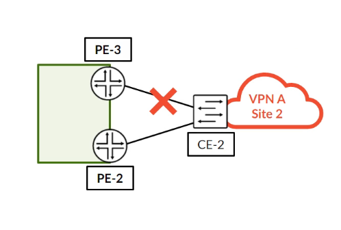
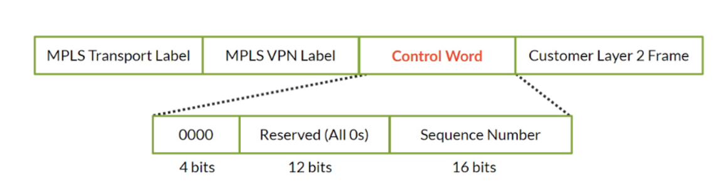
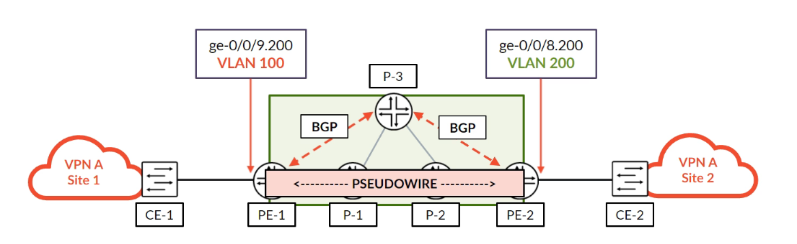
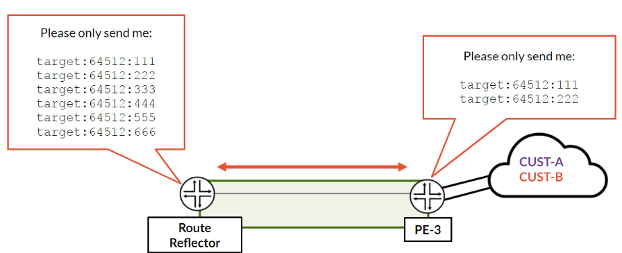

# L2VPN Advanced Concepts

**Multihoming with site preference, the control word, VLAN normalization, route target filtering and the L2VPN routing tables**

> Study notes by [Nazirul Roslan](https://www.linkedin.com/in/nazirulroslan) · JNCIP-SP · Junos Layer 2 VPNs · Part 008

← [Previous: L2VPN Site IDs, the Label Base and Overprovisioning](007-site-ids-label-base-overprovisioning.md) · [Index](../README.md) · [Next: L2Circuit: LDP-Signaled Pseudowires](009-l2circuit-ldp-signaled-pseudowires.md) →

**Contents:** [1 Multihoming](#module-1-l2vpn-multihoming) · [2 Control Word and VLANs](#module-2-control-word-and-vlan-normalization) · [3 RT Filtering](#module-3-route-reflection-and-filtering) · [4 Routing Tables](#module-4-l2vpn-routing-table-deep-dive) · [5 Lab](#module-5-comprehensive-lab-advanced-l2vpn-features) · [6 Glossary](#module-6-glossary) · [7 Dynamic Recall](#module-7-dynamic-recall)

---

## Module 1: L2VPN Multihoming

**Objectives:**
- Explain the concept of L2VPN multihoming for service redundancy.
- Configure an active-backup multihoming scenario using `site-preference`.
- Understand how the designated PE is chosen for loop prevention.

### 1.1 The need for resiliency

In production networks, connecting a customer site to a single PE router creates a single point of failure. **Multihoming** solves this by connecting the customer's CE device to two or more PE routers. However, this introduces the risk of a Layer 2 loop. Junos provides a BGP-based mechanism for a resilient, loop-free, **active-backup** service.



Both PEs configure the **same site ID** for the multihomed site. Remote PEs therefore receive two advertisements for one site and must pick one.

### 1.2 Influencing path selection with `site-preference`

To create an active-backup scenario, one path must be more preferable than the other. Use the `site-preference` statement in the L2VPN site configuration. It sets the BGP **`LOCAL_PREFERENCE`** attribute of that site's L2VPN advertisement.

- A **higher** local preference is more preferred.
- The path with the highest local preference becomes the **primary** path.

On PE2 (primary) we set a higher site preference. On PE3 (backup) we set a lower one.

```
# On PE2 (Primary)
[edit routing-instances L2VPN-MULTIHOME protocols l2vpn]
site CE1-A {
    site-identifier 1;
    site-preference 200; # Higher value = more preferred
    interface ge-0/0/9.0;
}
# On PE3 (Backup)
[edit routing-instances L2VPN-MULTIHOME protocols l2vpn]
site CE1-B {
    site-identifier 1;
    site-preference 100; # Lower value = less preferred
    interface ge-0/0/8.0;
}
```

> [!NOTE]
> `site-preference` also accepts the keywords `primary` (the highest value, 65535) and `backup` (the lowest, 1). 100 is the same as the default local preference, so PE3 here is "backup" simply because PE2 is higher.

### 1.3 Loop prevention: choosing one designated PE

With two active paths, a loop would form. To prevent this, only one PE may forward for the multihomed site. The multihomed PEs (and the remote PEs) run normal BGP path selection on the advertisements for the shared site ID. The PE whose advertisement wins (here, the highest local preference) becomes the **designated** PE for the site. Only it forwards traffic to and from the CE.

The PE that **loses** does not bring up its pseudowire for that site, so its attachment circuit carries no traffic. This is the key to loop prevention.

> [!NOTE]
> The original guide called this the **Designated Forwarder (DF) election**. That's the term used in EVPN (and VPLS multihoming discussions); for BGP L2VPN multihoming, Junos documentation talks about the **designated** site/PE chosen by BGP path selection. The idea is the same: exactly one PE forwards for the site.

On the remote PE (PE1), the `show l2vpn connections` output shows two connections for site 1. The connection to the primary PE is `Up`, while the connection to the backup PE is in the `BK` (backup) state.

```
naz@PE1> show l2vpn connections 
Instance: L2VPN-MULTIHOME
  Local site: SITE-Z (2)
    connection-site           Type  St     Time last up          # Up trans
    1                         rmt   Up     Sep 16 10:00:00 2025        1
      Remote PE: 192.168.1.2, ...
    1                         rmt   BK     Sep 16 10:00:00 2025        1
      Remote PE: 192.168.1.3, ...
```

> [!NOTE]
> Verify the status codes in your own lab. The legend printed by `show l2vpn connections` includes `LN` (local site not designated) and `RN` (remote site not designated), which are the codes normally associated with BGP L2VPN multihoming: the losing PE typically shows its own site as `LN`. `BK` (backup connection) is more commonly seen with pseudowire redundancy features. The exact display on the remote PE can vary by release.

> [!TIP]
> **Exam tip: verifying the designated PE.** Look at the routing tables. The instance's `<instance>.l2vpn.0` table shows both advertisements for the site ID, with `*` marking the active (best) path, whose advertiser is the designated PE. The original guide points to the `<instance>.l2id.0` table for this; check which of the two tables your Junos release uses for the multihomed site (`show route table <instance>`).

> [!IMPORTANT]
> **Key takeaways:** L2VPN multihoming gives critical resiliency. `site-preference` sets the BGP local preference and makes the active-backup design deterministic. Because the backup PE isn't designated, only one path forwards and no loop forms. Next: two data plane features, the control word and VLAN normalization.

---

## Module 2: Control Word and VLAN Normalization

**Objectives:**
- Explain the purpose and function of the Ethernet control word.
- Diagnose data plane failures caused by mismatched PE-CE VLAN tags.
- Configure VLAN normalization (VLAN swapping) to resolve tag mismatches.

### 2.1 The control word

The **control word** is an optional 4-byte field inserted between the MPLS label stack and the Layer 2 payload. Its main purpose is to stop the MPLS core from misinterpreting the customer's frame. Core routers doing ECMP hashing often "peek" past the bottom label: if the first nibble looks like `4` or `6`, they assume an IPv4 or IPv6 packet. With an Ethernet pseudowire the first nibble after the labels is actually the start of the customer's **destination MAC address**, so a MAC beginning with 4 or 6 can be hashed as if it were IP. Frames of the same flow can then take different paths and arrive **out of order**.



The control word's first four bits are always `0000`, so core routers never mistake the payload for an IP packet.

> [!NOTE]
> **Correction.** The original guide said "Junos enables the control word for VPLS but disables it for L2VPNs." It's the other way round: for **BGP L2VPN** (and LDP l2circuit) pseudowires Junos **supports and signals the control word by default**, and you turn it off with `no-control-word`. BGP-signaled VPLS doesn't use a control word. The control word is **negotiated**: each PE signals whether it will use it (the C bit in the Layer 2 info extended community for BGP L2VPN), and it's used only if both ends agree. That's why you see `Negotiated control-word: Yes/No` in `show l2vpn connections extensive`. Keep the setting consistent on both ends so behavior is predictable. Junos doesn't use the 16-bit sequence number (it's sent as 0).

The original guide's example of enabling it explicitly in an L2VPN instance:

```
[edit routing-instances L2VPN-EXAMPLE protocols l2vpn]
set control-word
```

And to disable it (the more common change, for example to interoperate with a device that doesn't support it):

```
[edit routing-instances L2VPN-EXAMPLE protocols l2vpn]
set no-control-word
```

### 2.2 VLAN normalization

A common scenario: a customer wants an L2VPN between two sites but uses a different VLAN ID at each site for local reasons. The L2VPN control plane still comes up, because BGP signaling doesn't carry the local VLAN IDs. The data plane, however, can fail: the frame arrives at the egress PE with the ingress site's VLAN tag, which doesn't match the VLAN configured on the local CE-facing interface.



> [!NOTE]
> How a mismatch shows up depends on the platform and encapsulation (for example, some platforms rewrite the outer tag to the local unit's VLAN ID when it leaves the egress `vlan-ccc` interface). Don't rely on that; normalize the tags explicitly. See also the mismatched-VLAN case in [006](006-l2vpn-troubleshooting.md).

The solution is **VLAN normalization**, or VLAN swapping: the PE translates the VLAN tag as frames enter or leave the MPLS core.

On PE2, we swap the tag between the remote VLAN 100 and the locally significant VLAN 200. The original guide's version:

```
[edit interfaces ge-0/0/9 unit 200]
set vlan-id 200;
set input-vlan-map swap;
set output-vlan-map swap;
```

> [!NOTE]
> **Correction.** That snippet mixes `set` commands with curly-brace syntax (the trailing `;`), and `input-vlan-map swap` needs to be told **which** VLAN ID to swap to. In the diagram, PE-2's interface is `ge-0/0/8.200`. A working version on PE-2 (the interface also needs `vlan-tagging` or `flexible-vlan-tagging` and a CCC encapsulation):
>
> ```
> [edit interfaces ge-0/0/8 unit 200]
> set encapsulation vlan-ccc
> set vlan-id 200
> set input-vlan-map swap
> set input-vlan-map vlan-id 100
> set output-vlan-map swap
> ```
>
> Frames from CE-2 arrive tagged 200 and are swapped to 100 before entering the pseudowire (`input-vlan-map`). Frames leaving towards CE-2 have their outer tag swapped back to the unit's own VLAN ID, 200 (`output-vlan-map swap`). Check the exact VLAN map options on your platform and release.

> [!IMPORTANT]
> **Key takeaways:** The control word is a simple data plane feature that prevents packet reordering in ECMP cores. VLAN normalization lets service providers stitch together L2VPNs even when customers use different VLAN IDs at their sites. Next: scaling the L2VPN control plane with route target filtering.

---

## Module 3: Route Reflection and Filtering

**Objectives:**
- Explain the scalability problem with standard BGP route reflection for VPNs.
- Configure and verify BGP route target filtering (RT constraint).
- Understand the function of the `bgp.rtarget.0` routing table.

### 3.1 The scalability problem

In a large service provider network, a standard BGP route reflector (RR) reflects **every** L2VPN route to **every** PE router. A PE in New York might receive thousands of L2VPN advertisements for services that only exist in California. This floods the PE with unnecessary information, costing memory and CPU and slowing BGP convergence.


> [!NOTE]
> A PE discards received VPN routes whose route targets don't match any local instance (unless `keep all` is configured), so they don't end up in its tables. But it still has to **receive and process** every one of them, which is the real cost, especially when a session comes up and the RR sends everything at once.

### 3.2 The solution: route target filtering

**Route target filtering** (also called **route target constraint**, RT constraint or RTC, RFC 4684) solves this. It uses a new BGP address family, `family route-target`. Each PE uses it to tell the RR which route targets it's actually interested in (the RTs its local instances import, such as from `vrf-target`). The RR then filters its advertisements and sends each PE only the relevant L2VPN routes.



To enable it, add `family route-target` to the BGP configuration on all the PEs and the RR.

```
# On all PEs and the RR
[edit protocols bgp group to_RR]
set family route-target
```

> [!WARNING]
> Adding an address family to a BGP group resets the sessions in that group. Remember that once any explicit family is configured, only the listed families are negotiated, so keep `family l2vpn signaling` (and any other families you need) in the same group. Plan the change for a maintenance window.

### 3.3 Verification

With RT filtering enabled, each PE sends its route target "subscriptions" to the RR, which stores them in the `bgp.rtarget.0` table. The RR uses this table as a filter map. On the RR you can see which PEs have subscribed to which route targets.

```
naz@RR> show route table bgp.rtarget.0
bgp.rtarget.0: 2 destinations, 2 routes (2 active, 0 holddown, 0 hidden)
+ = Active Route, - = Last Active, * = Both
192.168.1.1:0:target:123:100/96
                   *[BGP/170] 00:10:00, localpref 100, from 192.168.1.1
                      AS path: I
                    > to 10.0.0.1 via ge-0/0/0.0
192.168.1.2:0:target:123:100/96
                   *[BGP/170] 00:09:00, localpref 100, from 192.168.1.2
                      AS path: I
                    > to 10.0.0.2 via ge-0/0/1.0
```

> [!NOTE]
> Treat this output as illustrative. An RT membership prefix (RFC 4684) is **origin AS (4 bytes) + route target (8 bytes) = 96 bits**, so in Junos the entry starts with the originating **AS number** followed by the route target (something like `<AS>:target:123:100/96`), not the router's loopback address. Also, when several PEs subscribe to the same RT with the same origin AS, the RR sees them as the same prefix with multiple paths rather than separate destinations.

The result: a PE's `bgp.l2vpn.0` table now only receives routes for the VPNs it actually participates in, which greatly improves scalability.

> [!IMPORTANT]
> **Key takeaways:** Route target filtering is an essential scalability feature for any large L2VPN deployment. With `family route-target`, PEs subscribe to only the VPNs they need, reducing control plane load and improving stability.

---

## Module 4: L2VPN Routing Table Deep Dive

**Objectives:**
- Describe the function and purpose of the `bgp.l2vpn.0` table.
- Explain how routes move from `bgp.l2vpn.0` into the `<instance-name>.l2vpn.0` table.
- Detail the role of the `<instance-name>.l2id.0` table in multihoming.

### 4.1 The L2VPN route flow

When troubleshooting, you need to understand how L2VPN routes are processed. Received routes flow through the tables like this:


Locally originated routes go the other way: they are created in `<instance>.l2vpn.0` and copied into `bgp.l2vpn.0` to be advertised.

### 4.2 Table functions

**1. `bgp.l2vpn.0`: the master table**

The primary BGP L2VPN table. It stores the L2VPN advertisements received from BGP peers. Without RT filtering, the RR sends every L2VPN route in the network; with RT filtering, only routes for the subscribed route targets arrive. A received route must appear here before any L2VPN instance can use it.

**2. `<instance-name>.l2vpn.0`: the instance table**

The per-instance table. Junos copies routes from `bgp.l2vpn.0` into it if the route's RT matches the instance's import (`vrf-target` or `vrf-import`). The pseudowires are built from the routes in this table.

> [!NOTE]
> The original guide said "if a route is in `bgp.l2vpn.0` but not here, you have a Route Target mismatch." On a PE, that's rarely what you'll see: by default a PE (unlike an RR) **doesn't keep** VPN routes that no local instance imports, so an RT mismatch usually makes the route **disappear from `bgp.l2vpn.0` too**. That's exactly why the lab uses `keep all` to make it visible. On an RR, or with `keep all`, a route present in `bgp.l2vpn.0` but missing from the instance table does point to an RT mismatch.

**3. `<instance-name>.l2id.0`: the local ID and multihoming table**

According to the original guide, this table serves two purposes: it maps the local attachment circuits (site IDs) to the L2VPN instance, and it's where BGP path selection for a multihomed site shows up, with `*` marking the best path whose advertiser becomes the designated PE.

> [!NOTE]
> Hedge: whether an `<instance>.l2id.0` table is created, and what it contains, depends on the instance type and the Junos release (it's best known from VPLS multihoming). If you don't see it, compare the multiple paths for the shared site ID in `<instance>.l2vpn.0`. Use `show route table <instance-name>` to list every table the instance has.

> [!IMPORTANT]
> **Key takeaways:** Troubleshoot L2VPN routes by checking the tables in order. Missing from `bgp.l2vpn.0`: a BGP signaling or filtering problem (or, on a PE, an RT mismatch that caused the route to be discarded). Missing from `<instance>.l2vpn.0`: an RT mismatch. Wrong path selected for a multihomed site: a multihoming configuration issue (site ID or site preference).

---

## Module 5: Comprehensive Lab: Advanced L2VPN Features

**Lab overview:** this lab brings the advanced topics together. You'll build a baseline L2VPN, deliberately create a route target mismatch to practice troubleshooting, then implement route target filtering for a scalable, efficient control plane.


> [!TIP]
> **Why this matters.** Scaling and troubleshooting are the two most important skills for a service provider engineer. This lab moves past basic configuration: you diagnose a common but confusing issue (a hidden route caused by an RT mismatch), then implement the best-practice fix for scale (RT filtering).

### Part 1: Establish a second L2VPN

**Goal:** create a new, separate L2VPN between PE1 and PE3 as the basis for the troubleshooting scenarios.

**Reasoning:** a second, distinct L2VPN lets us change its route target independently without affecting other services, so we can safely observe the filtering behavior.

Configure a new instance `VPN-B` on both PEs with a new route target (`target:65534:2`). The original guide's configuration:

```
# On PE1
set interfaces ge-0/0/3 unit 0 encapsulation ethernet-ccc
set routing-instances VPN-B instance-type l2vpn
set routing-instances VPN-B interface ge-0/0/3.0
set routing-instances VPN-B route-distinguisher 172.17.20.5:65534
set routing-instances VPN-B vrf-target target:65534:2
set routing-instances VPN-B protocols l2vpn site SITE-B1 site-identifier 3
# On PE3
set interfaces ge-0/0/4 unit 0 encapsulation ethernet-ccc
set routing-instances VPN-B instance-type l2vpn
set routing-instances VPN-B interface ge-0/0/4.0
set routing-instances VPN-B route-distinguisher 172.17.20.7:65534
set routing-instances VPN-B vrf-target target:65534:2
set routing-instances VPN-B protocols l2vpn site SITE-B2 site-identifier 4
```

> [!NOTE]
> **Corrections.** This config wouldn't bring up the pseudowire as written:
> - **No interface under the site.** Each site needs `interface <ifl>` under `protocols l2vpn site <name>`.
> - **Implicit remote site IDs.** With site IDs 3 and 4 and one interface each, the implicit rule (count from 1, skip your own ID) maps PE1's interface to remote site **1** and PE3's to remote site **1** as well, so neither would connect to the other. Use explicit `remote-site-id` statements (see [007](007-site-ids-label-base-overprovisioning.md)).
> - **No `encapsulation-type`.** A port-based `ethernet-ccc` circuit pairs with `encapsulation-type ethernet` in the instance.
> - **Port-mode CCC encapsulation.** For a whole-port circuit, `ethernet-ccc` is configured on the physical interface, with `family ccc` on unit 0.
>
> A corrected version:
>
> ```
> # On PE1
> set interfaces ge-0/0/3 encapsulation ethernet-ccc
> set interfaces ge-0/0/3 unit 0 family ccc
> set routing-instances VPN-B instance-type l2vpn
> set routing-instances VPN-B interface ge-0/0/3.0
> set routing-instances VPN-B route-distinguisher 172.17.20.5:65534
> set routing-instances VPN-B vrf-target target:65534:2
> set routing-instances VPN-B protocols l2vpn encapsulation-type ethernet
> set routing-instances VPN-B protocols l2vpn site SITE-B1 site-identifier 3
> set routing-instances VPN-B protocols l2vpn site SITE-B1 interface ge-0/0/3.0 remote-site-id 4
> # On PE3
> set interfaces ge-0/0/4 encapsulation ethernet-ccc
> set interfaces ge-0/0/4 unit 0 family ccc
> set routing-instances VPN-B instance-type l2vpn
> set routing-instances VPN-B interface ge-0/0/4.0
> set routing-instances VPN-B route-distinguisher 172.17.20.7:65534
> set routing-instances VPN-B vrf-target target:65534:2
> set routing-instances VPN-B protocols l2vpn encapsulation-type ethernet
> set routing-instances VPN-B protocols l2vpn site SITE-B2 site-identifier 4
> set routing-instances VPN-B protocols l2vpn site SITE-B2 interface ge-0/0/4.0 remote-site-id 3
> ```

**Verification:** on both PEs, confirm the new L2VPN connection is `Up`.

```
naz@PE1> show l2vpn connections instance VPN-B
Instance: VPN-B
  Local site: SITE-B1 (3)
    connection-site           Type  St     Time last up          # Up trans
    4                         rmt   Up     Sep 16 11:00:00 2025        1
```

### Part 2: Create an RT mismatch and use `keep all`

**Goal:** deliberately misconfigure a route target and use `keep all` to diagnose why the route is being discarded.

**Reasoning:** by default, a PE doesn't keep VPN routes that no local instance imports. `keep all` is a powerful troubleshooting tool that retains them (as hidden routes), immediately revealing problems such as RT mismatches.

Configuration (PE1): change `vrf-target` for VPN-B to a non-matching value.

```
[edit routing-instances VPN-B]
delete vrf-target target:65534:2
set vrf-target target:65534:99
```

**Verification and troubleshooting:** `show l2vpn connections` now shows no connection. The route from PE3 is received but not retained. Use `keep all` to see it. The original guide's commands and (abridged) output:

```
# On PE1 - Enable keep all
set protocols bgp group to_RR family l2vpn signaling keep all
# Now check the l2vpn table again
show route table bgp.l2vpn.0 hidden extensive | match 172.17.20.7
    172.17.20.7:65534:4:1/96 (1 entry, 0 announced)
     BGP group to_RR type Internal
     Communities: target:65534:2  <-- Mismatched RT is now visible
     Hidden reason: Not imported by any L2VPN
```

> [!NOTE]
> **Correction.** `keep` isn't an option of `family l2vpn signaling`. It's configured at the BGP global, group or neighbor level:
>
> ```
> set protocols bgp group to_RR keep all
> ```
>
> Changing `keep` makes Junos request a route refresh from the peer (or reset the session if the peer doesn't support refresh), so the previously discarded routes are sent again. Also, `| match 172.17.20.7` would only print the lines containing that string; the output above is an abridged summary of the interesting fields in `show route table bgp.l2vpn.0 hidden extensive`. The prefix format is `RD:site-ID:label-block-offset/96`, so `172.17.20.7:65534:4:1/96` is PE3's site 4 with offset 1.

After observing the hidden route, revert the configuration: set the correct `vrf-target` and remove `keep all`.

### Part 3: Implement route target filtering

**Goal:** enable `family route-target` on all the PEs and the RR to build a scalable control plane.

**Reasoning:** this is the best-practice method for large networks. The exercise shows how it prunes the distribution of L2VPN routes, improving efficiency and stability.

Configuration (all PEs and the RR):

```
[edit protocols bgp group to_RR]
set family route-target
```

**Verification:** on the RR, check the new `bgp.rtarget.0` table to see the PEs' "subscriptions". Then, on a PE that does **not** host VPN-B (for example PE2), confirm it no longer has a VPN-B route in `bgp.l2vpn.0`.

```
# On RR
naz@RR> show route table bgp.rtarget.0
# On PE2
naz@PE2> show route table bgp.l2vpn.0 | match 172.17.20.7 
# Expected output is empty
```

> [!NOTE]
> PE2 wouldn't have kept the VPN-B route even **before** RT filtering (no local instance imports it, and `keep all` was removed). To see the real difference, check what the RR **sends**: compare `show route advertising-protocol bgp <PE2-loopback> table bgp.l2vpn.0` on the RR (or `show route receive-protocol bgp <RR-loopback> table bgp.l2vpn.0` on PE2) before and after enabling `family route-target`. After the change, the VPN-B routes are no longer advertised to PE2 at all.

---

## Module 6: Glossary

| Term | Definition |
|---|---|
| **Multihoming** | Connecting a single customer site to two or more PE routers for service redundancy. |
| **Site preference** | A Junos statement that sets the BGP `LOCAL_PREFERENCE` of an L2VPN site's advertisement to create an active-backup design. |
| **Designated PE / Designated Forwarder (DF)** | In a multihoming scenario, the single PE chosen (by BGP path selection) to forward traffic for the site, preventing loops. "DF" is the EVPN term. |
| **Control word** | An optional 4-byte field between the label stack and the payload that stops the MPLS core misinterpreting Layer 2 payloads during ECMP hashing. On by default (negotiated) for Junos BGP L2VPN. |
| **VLAN normalization** | Swapping VLAN tags at a PE to resolve mismatched VLAN IDs between customer sites. |
| **Route target filtering** | A BGP feature (`family route-target`, RFC 4684) that lets PEs subscribe to only the VPN routes they need, improving scalability. |

---

## Module 7: Dynamic Recall

### Part 1: Recall

**Which statement is used to influence the primary path in an L2VPN multihoming setup?**

<details><summary>Answer</summary>

`site-preference`. A higher value sets a higher BGP `LOCAL_PREFERENCE`, making that path the primary.

</details>

**How does L2VPN multihoming prevent loops?**

<details><summary>Answer</summary>

Only one PE is **designated** for the multihomed site (the one whose advertisement wins BGP path selection; the original guide calls this the Designated Forwarder election). The PE that loses doesn't bring up its pseudowire for the site, so its CE-facing circuit doesn't forward.

</details>

**Your L2VPN control plane is `Up`, but traffic fails. The customer uses VLAN 100 on one side and VLAN 200 on the other. What is the solution?**

<details><summary>Answer</summary>

Configure **VLAN normalization** with `input-vlan-map` (swap, plus the `vlan-id` to swap to) and `output-vlan-map swap` on one of the PE interfaces to translate the tags.

</details>

**Which BGP address family enables route target filtering?**

<details><summary>Answer</summary>

`family route-target`. It lets PEs advertise the route targets they want to the route reflector.

</details>

### Part 2: Fusion (a story)

Naz was troubleshooting a failed L2VPN multihoming cutover. "It's strange," he said to Maria. "I configured the new backup PE, and its connection to the remote site is `Up`. But the primary PE's connection is now `Down`! They won't work at the same time."

Maria looked at the configs. "Let's check the basics. Are the site IDs the same on both multihomed PEs?" Naz confirmed they were both `site-identifier 1`. "And the `site-preference`?" Naz showed her: `200` on the primary, `100` on the backup. "That all looks perfect," she conceded.

"Let's look at the data plane," Maria suggested. "Did you remember the **control word**?" Naz's eyes widened. The primary PE was a newer router that enabled it by default, but the backup PE was an older model where it was disabled. The mismatch caused the signaling to fail as soon as both were active. "And what about the VLANs?" she added. Sure enough, a quick check showed the new backup link used a different local VLAN from the primary. The service would have failed even if the control plane came up.

Naz learned a vital lesson: advanced features like multihoming still depend on basic data plane consistency. He enabled the control word and configured **VLAN normalization** on the backup PE, and the service came up perfectly, with one path `Up` and the other correctly in the backup state.

> [!NOTE]
> Keep the story's lesson (consistency matters), but not its detail: with BGP L2VPN the control word is negotiated, so a mismatch normally makes the pseudowire fall back to **no** control word rather than fail signaling. Inconsistent settings between the two multihomed PEs can still cause confusing behavior after a switchover, so configure them identically.

### Part 3: Chunk and collapse

| Chunk | One-line summary | Tags |
|---|---|---|
| **Multihoming** | Active-backup resiliency by connecting a CE to two PEs, with `site-preference` controlling the active path. | #Redundancy #Site-Preference #DF-Election |
| **VLAN normalization** | Fix data plane failures caused by mismatched PE-CE VLAN tags by swapping them at the network edge. | #VLAN-Swap #Data-Plane #Translation |
| **RT filtering** | Scale the L2VPN control plane by having PEs subscribe to only the route targets they need from the RR. | #Scalability #RT-Constraint #family-route-target |
| **Routing tables** | Troubleshoot by checking the tables in order: `bgp.l2vpn.0` (receive), `<instance>.l2vpn.0` (import), `<instance>.l2id.0` (multihoming selection). | #Troubleshooting #Route-Flow #Verification |

---

← [Previous: L2VPN Site IDs, the Label Base and Overprovisioning](007-site-ids-label-base-overprovisioning.md) · [Index](../README.md) · [Next: L2Circuit: LDP-Signaled Pseudowires](009-l2circuit-ldp-signaled-pseudowires.md) →
