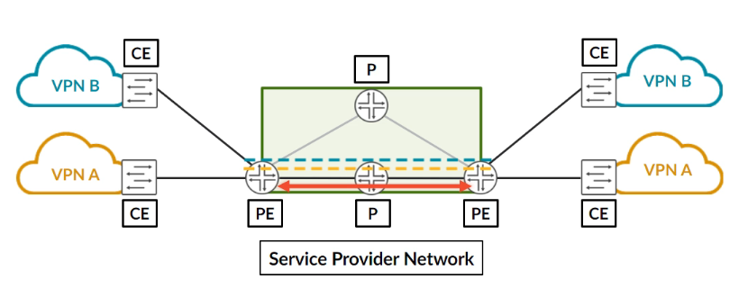
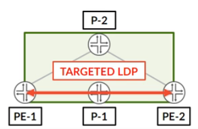
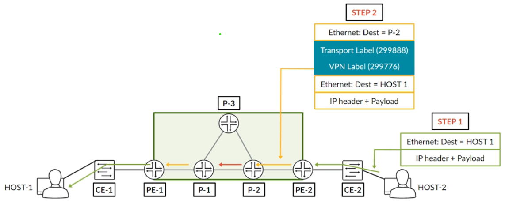
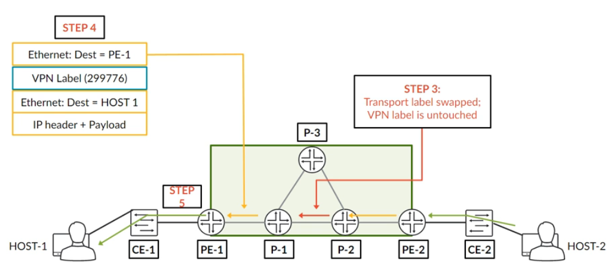
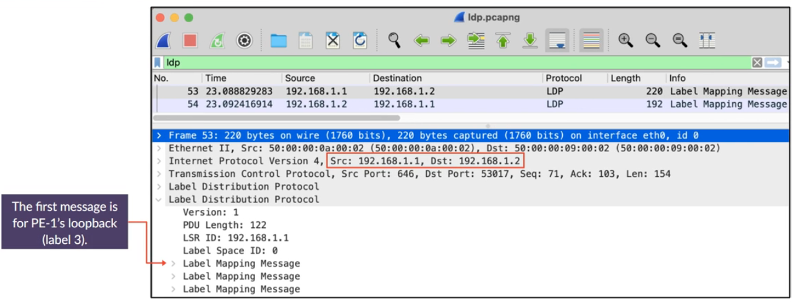
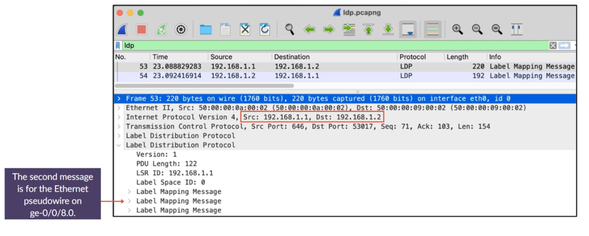
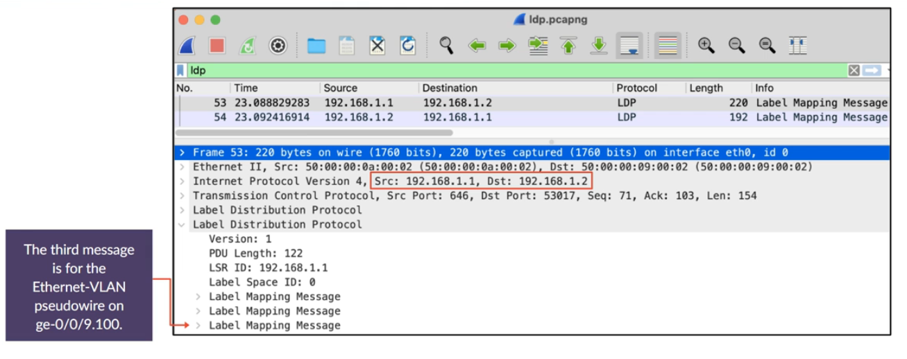
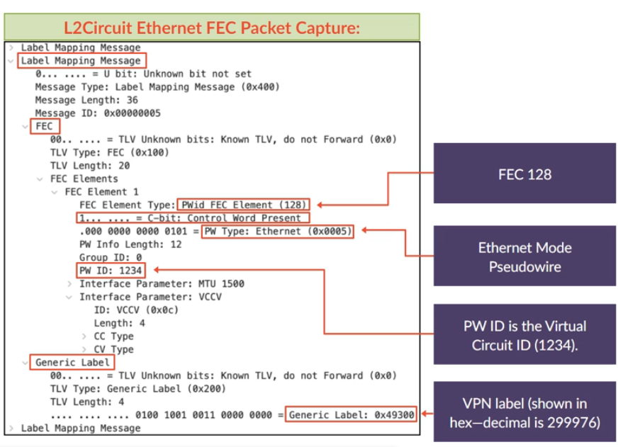
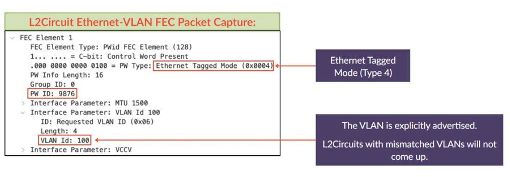

# L2Circuit: LDP-Signaled Pseudowires

**Martini pseudowires: targeted LDP, a three-line config, FEC 128 on the wire, and how they compare with BGP L2VPNs**

> Study notes by [Nazirul Roslan](https://www.linkedin.com/in/nazirulroslan) · JNCIP-SP · Junos Layer 2 VPNs · Part 009

← [Previous: L2VPN Advanced Concepts](008-l2vpn-advanced-concepts.md) · [Index](../README.md) · [Next: L2Circuit Troubleshooting](010-l2circuit-troubleshooting.md) →

**Contents:** [1 Introduction](#module-1-introduction-to-l2circuits) · [2 Configuration](#module-2-configuring-an-l2circuit) · [3 Verification & Data Plane](#module-3-l2circuit-verification--data-plane) · [4 LDP Capture](#module-4-ldp-advertisement-packet-capture) · [5 L2VPN vs. L2Circuit](#module-5-l2vpn-vs-l2circuit-a-comparative-analysis) · [6 Glossary](#module-6-glossary) · [7 Dynamic Recall](#module-7-dynamic-recall)

---

## Module 1: Introduction to L2Circuits

**Objectives:**
- Define L2Circuits (Martini pseudowires) and their use of LDP for signaling.
- Identify the key similarities between L2Circuits and BGP-signaled L2VPNs.
- Explain the concept of a targeted LDP session.

### 1.1 What is an L2Circuit?

An **L2Circuit** is a point-to-point Layer 2 pseudowire that is signaled using the **Label Distribution Protocol (LDP)**. In the industry they are widely known as **"Martini circuits"**, named after Luca Martini, a co-author of RFC 4447, the original RFC that defined this technology. While BGP-signaled L2VPNs rely on BGP for auto-discovery and signaling, L2Circuits use a direct LDP session between the two endpoint PE routers.

> [!NOTE]
> RFC 4447 has since been obsoleted by **RFC 8077** (same mechanism, updated text). You will still see "RFC 4447" and "Martini" used everywhere, including in Juniper material.

**Key similarities with L2VPNs.** If you understand BGP L2VPNs, you already know most of what you need for L2Circuits. They share the same building blocks:

| Aspect | BGP L2VPN vs. L2Circuit |
|---|---|
| **Data plane** | Identical: an inner VPN label and an outer transport label. |
| **Interface configuration** | Identical: the same encapsulation types (`ethernet-ccc`, `vlan-ccc`, etc.) and `family ccc`. |
| **Verification** | Similar: the main command is `show l2circuit connections` instead of `show l2vpn connections`. |

### 1.2 LDP for signaling vs. LDP for transport

Using LDP to **signal** an L2Circuit is completely separate from using LDP to build the underlying **transport** LSPs. You can mix and match protocols.



- The **red line** is the transport LSP that carries the customer traffic. It can be built with LDP, RSVP or Segment Routing.
- The **dotted lines** are the LDP signaling sessions for the pseudowires themselves. For an L2Circuit this is always LDP.

> [!TIP]
> Think of it as two separate jobs. The transport LSP is the road between the two PEs; the targeted LDP session is the phone call where the two PEs agree which "lane" (VPN label) each customer circuit uses. You can build the road with RSVP and still make the phone call with LDP.

### 1.3 Targeted LDP sessions

Standard LDP sessions for transport form between directly connected routers. The two PEs at the ends of a pseudowire, however, are often separated by several P routers. To exchange pseudowire labels they use a **targeted LDP** session: a special LDP session formed directly between the loopback addresses of the two PEs, "tunneling" through the P routers in the core.



Configuring an L2Circuit automatically triggers the establishment of this targeted LDP session. The PEs then use it to exchange VPN labels and other pseudowire parameters.

> [!NOTE]
> Targeted LDP discovery uses unicast hellos (UDP port 646) sent to the remote loopback, instead of the multicast hellos used between directly connected neighbours. The session itself is TCP port 646, as with any LDP session. The targeted session is ordinary IP traffic routed over the IGP, so it does not itself need an LSP; the pseudowire, however, does need a transport LSP to the neighbour (see [010](010-l2circuit-troubleshooting.md)).

> [!IMPORTANT]
> **Key takeaways.** L2Circuits are LDP-signaled pseudowires that share the same data plane and interface configuration as their BGP-signaled counterparts. They use a special targeted LDP session between PE loopbacks for signaling, which is independent of the protocol used for MPLS transport. Next: how simple it is to configure an L2Circuit.

---

## Module 2: Configuring an L2Circuit

**Objectives:**
- Configure the prerequisites for a targeted LDP session.
- Configure both port-based (Ethernet) and VLAN-based (Ethernet-VLAN) L2Circuits.
- Explain the role of the `virtual-circuit-id`.

### 2.1 Targeted LDP prerequisites

Before an L2Circuit can work you must enable LDP on the loopback interface of each PE router. This allows the PEs to establish the targeted LDP session.

```
[edit protocols ldp]
set interface lo0.0
```

> [!WARNING]
> **Firewall considerations.** Remember to permit LDP in any firewall filter applied to your loopback interface. Allow both **TCP and UDP on port 646** (UDP for the targeted hellos, TCP for the session). Forgetting this is a classic cause of a circuit that never comes up (see [010 section 3.2](010-l2circuit-troubleshooting.md#32-failure-control-plane-firewall-filter)).

### 2.2 L2Circuit configuration

The configuration is remarkably simple. Unlike an L2VPN it does **not** need a routing instance. It lives directly under `[edit protocols l2circuit]`.

This configuration creates two L2Circuits to the same neighbor: one port-based and one VLAN-based.

```
[edit protocols l2circuit]
neighbor 192.168.1.2 {
    interface ge-0/0/8.0 {
        virtual-circuit-id 1234;
    }
    interface ge-0/0/9.100 {
        virtual-circuit-id 9876;
    }
}
```

| Statement | Meaning |
|---|---|
| `neighbor 192.168.1.2` | Manually specifies the remote PE's loopback address. This is the key difference from BGP's auto-discovery. |
| `interface ge-0/0/8.0` | Binds the local customer-facing interface to this pseudowire. |
| `virtual-circuit-id 1234` | A number that identifies this specific pseudowire between the two PEs. It **must match** on both ends of the L2Circuit. |

> [!NOTE]
> The VC ID only needs to be unique per neighbor (and per pseudowire type), not across the whole network: the pair "remote PE + VC ID" identifies the circuit. The same VC ID can be reused towards a different neighbor.

The customer-facing interfaces use the same CCC encapsulations as in the L2VPN notes. The guide doesn't show them; a typical configuration for the two circuits above would look like this (an illustrative example, not taken from the lab):

```
[edit interfaces]
ge-0/0/8 {
    encapsulation ethernet-ccc;
    unit 0 {
        family ccc;
    }
}
ge-0/0/9 {
    vlan-tagging;
    encapsulation vlan-ccc;
    unit 100 {
        encapsulation vlan-ccc;
        vlan-id 100;
        family ccc;
    }
}
```

`ethernet-ccc` (whole port) is signaled as PW type **Ethernet (5)**; `vlan-ccc` (one VLAN) is signaled as PW type **Ethernet Tagged Mode (4)**. You will see both in the packet capture in Module 4.

> [!IMPORTANT]
> **Key takeaways.** Configuring an L2Circuit takes two steps: enable LDP on the loopback, then define the `neighbor`, `interface` and `virtual-circuit-id` under `protocols l2circuit`. The configuration is much shorter than an L2VPN because there is no auto-discovery and no routing instance. Next: verification and the data plane.

---

## Module 3: L2Circuit Verification & Data Plane

**Objectives:**
- Verify the status of the targeted LDP session and the L2Circuit connections.
- Analyze the LDP database to see the advertised VPN labels.
- Walk through the five steps of the L2Circuit data plane.

### 3.1 Verification commands

Verifying an L2Circuit means checking the targeted LDP session first, then the circuit itself.

**Step 1: the targeted LDP session must be `Operational`.**

```
root@PE-1> show ldp session 
Address           State       Connection  Hold time  Adv. Mode
192.168.1.2       Operational Open        29         DU
```

**Step 2: `show l2circuit connections` shows the pseudowire status. Look for `St Up`.**

```
root@PE-1> show l2circuit connections 
Neighbor: 192.168.1.2
  Interface           Type  St     Time last up          # Up trans
  ge-0/0/8.0(vc 1234) rmt   Up     Jul 10 19:42:06 2021           1
    Remote PE: 192.168.1.2, Negotiated control-word: Yes (Null)
    Incoming label: 299776, Outgoing label: 299888
  ge-0/0/9.100(vc 9876)
                      rmt   Up     Jul 10 19:42:06 2021           1
    Remote PE: 192.168.1.2, Negotiated control-word: Yes (Null)
    Incoming label: 299792, Outgoing label: 299904
```

How to read the labels:
- **Incoming label** is the VPN label PE-1 allocated and advertised to PE-2. PE-2 pushes it on frames sent towards PE-1.
- **Outgoing label** is the VPN label PE-2 advertised to PE-1. PE-1 pushes it on frames sent towards PE-2.
- **Negotiated control-word: Yes**: Junos uses the control word on L2Circuits by default (it can be turned off per interface with `no-control-word`).

**Step 3: `show ldp database` reveals the VPN labels advertised and received for each virtual circuit ID.**

```
root@PE-1> show ldp database 
Input label database, 192.168.1.1:0--192.168.1.2:0
  Labels received: 3
    Label      Prefix
    299904     L2CKT CtrlWord VLAN VC 9876
    299888     L2CKT CtrlWord ETHERNET VC 1234
Output label database, 192.168.1.1:0--192.168.1.2:0
  Labels advertised: 3
    Label      Prefix
    299792     L2CKT CtrlWord VLAN VC 9876
    299776     L2CKT CtrlWord ETHERNET VC 1234
```

Notice how the database lines up with the connection output: the **Output** database holds PE-1's incoming labels (299776, 299792) and the **Input** database holds PE-1's outgoing labels (299888, 299904).

> [!NOTE]
> The counters say 3 labels, but only two lines are shown per direction. The third entry in each direction is the router's loopback prefix (PE-1 advertises 192.168.1.1/32 with label 3, implicit null), because Junos also advertises its prefix FECs over the targeted session. It was trimmed from this output; the packet capture in Module 4 shows that third message.

### 3.2 The L2Circuit data plane

The data plane for an L2Circuit is identical to that of an L2VPN: a five-step process with a two-label MPLS stack.


**Step-by-step flow**



1. **HOST-2 sends a frame to HOST-1.** A standard Ethernet frame arrives at PE-2.
2. **PE-2 (ingress PE) encapsulates the frame.** It pushes two MPLS labels, the inner **VPN label (299776)** and an outer **transport label**, and forwards the packet to P-2.



3. **P-2 (P router) swaps the transport label.** A standard MPLS forwarding operation based only on the outer label; the frame goes to P-1.
4. **P-1 (penultimate P router) pops the transport label.** Because of penultimate hop popping (PHP), P-1 removes the outer label and forwards the frame to PE-1 with only the VPN label.
5. **PE-1 (egress PE) processes the VPN label.** PE-1 looks at the VPN label (299776), identifies the egress interface (`ge-0/0/8.0`), removes the label and forwards the original Ethernet frame to CE-1.

> [!NOTE]
> **Correction on the transport label value.** The guide and the step 2 diagram give the transport label as 299888. But 299888 is PE-1's *outgoing* label for VC 1234 from the output above, which is the **VPN label PE-2 advertised** for traffic going the other way (PE-1 to PE-2). It is not a transport label. The real outer label is whatever P-2 advertised to PE-2 for PE-1's loopback (192.168.1.1/32) via the transport protocol; its value isn't shown in the guide. The VPN label 299776 is correct: it is the label PE-1 advertised (its incoming label), so PE-2 pushes it towards PE-1. For a refresher on PHP and label 3 see [MPLS mechanics](../../../Junos-MPLS-Fundamentals/notes/02-mpls-mechanics.md).

> [!IMPORTANT]
> **Key takeaways.** Verify an L2Circuit by checking the LDP session and then the L2Circuit connection status. The data plane is identical to an L2VPN, with a two-label stack across the MPLS core. The difference is only in the signaling protocol. Next: a closer look at the LDP advertisements in a packet capture.

---

## Module 4: LDP Advertisement Packet Capture

**Objectives:**
- Define Forwarding Equivalence Class (FEC) in the context of LDP.
- Analyze a Wireshark capture of an LDP Label Mapping message for an L2Circuit.
- Differentiate between the FEC elements for Ethernet and Ethernet-VLAN L2Circuits.

### 4.1 LDP and Forwarding Equivalence Classes (FECs)

LDP uses the term **Forwarding Equivalence Class (FEC)** for a set of packets that are forwarded the same way. For L2Circuits LDP uses a specific FEC element: **FEC 128 (PWid FEC Element)**. Each L2Circuit is advertised individually in its own LDP Label Mapping message carrying a FEC 128 element.

> [!IMPORTANT]
> **L2Circuit vs. L2VPN scalability.** This is a key difference. An L2VPN can advertise a **block** of labels for many pseudowires in a single BGP update. An L2Circuit needs a **separate Label Mapping message for every single pseudowire**. This makes L2VPNs more efficient for large hub-and-spoke deployments.

> [!NOTE]
> Separate *messages* doesn't mean separate *packets*: several Label Mapping messages can share one LDP PDU, as the capture below shows. The point is that there is one FEC and one label per pseudowire, with no concept of label blocks.

### 4.2 Wireshark capture overview

These screenshots from a Wireshark capture show the LDP messages exchanged between PE1 (192.168.1.1) and PE2 (192.168.1.2) after the L2Circuits were configured.







PE1 sends a single packet containing three separate **Label Mapping messages**: one for its loopback (label 3, implicit null, for transport) and one for each of the two L2Circuits.

### 4.3 Dissecting the FEC element

**Ethernet L2Circuit (type 5)**



| Field | Value | Meaning |
|---|---|---|
| FEC Element Type | PWid FEC Element (128) | FEC 128. |
| C-bit | Control Word Present | The control word will be used (matches `Negotiated control-word: Yes`). |
| PW Type | Ethernet (0x0005) | A port-based service (`ethernet-ccc`). |
| PW ID | 1234 | The `virtual-circuit-id` we configured. |
| Interface Parameters | MTU 1500, VCCV | The attachment circuit MTU and the supported VCCV (connectivity verification) types. |
| Generic Label | 0x49300 | The VPN label: 0x49300 = **299776** in decimal. |

> [!NOTE]
> The callout on the screenshot says "decimal is 299976"; that's a typo. 0x49300 = 4×65536 + 9×4096 + 3×256 = **299776**, which matches the output database in Module 3.

> [!NOTE]
> Because the MTU is signaled, both ends must agree on it. A mismatch keeps the circuit down (status `MM`, MTU mismatch) unless you configure `ignore-mtu-mismatch` (or set a matching `mtu` under the L2Circuit interface).

**Ethernet-VLAN L2Circuit (type 4)**



| Field | Value | Meaning |
|---|---|---|
| PW Type | Ethernet Tagged Mode (0x0004) | A VLAN-based service (`vlan-ccc`). |
| PW ID | 9876 | The `virtual-circuit-id`. |
| Interface Parameter | Requested VLAN ID (0x06): VLAN Id 100 | The VLAN is explicitly advertised. |

The VLAN ID is the crucial difference. It is explicitly advertised in the LDP message, and so L2Circuits with mismatched VLANs will not come up (status `VM`). This is stricter behavior than BGP L2VPNs.

> [!NOTE]
> The VLAN check applies to the tagged-mode (type 4) circuit; a port-based Ethernet (type 5) circuit carries no VLAN ID. As covered in the L2VPN notes, a BGP L2VPN doesn't signal the VLAN ID, so mismatched VLANs there can come up and simply fail to pass traffic correctly unless you normalize the tags.

> [!IMPORTANT]
> **Key takeaways.** L2Circuits use LDP and FEC 128 to signal pseudowires one by one. The advertisement carries the VC ID, the PW type (encapsulation) and, for VLAN-based services, the VLAN ID. This makes them less scalable for hub-and-spoke designs but gives stricter validation. Next: a formal comparison of L2VPNs and L2Circuits.

---

## Module 5: L2VPN vs. L2Circuit: A Comparative Analysis

**Objectives:**
- Compare the signaling mechanisms and scalability of L2VPNs and L2Circuits.
- Analyze the trade-offs between configuration simplicity and operational flexibility.
- Give architectural guidance on when to choose each technology.

### Choosing the right tool for the job

Both BGP-signaled L2VPNs and LDP-signaled L2Circuits are excellent ways to build point-to-point pseudowires. Neither is objectively "better": the right choice depends on the network's scale, topology and operational requirements.

| Feature | BGP L2VPN (Kompella) | LDP L2Circuit (Martini) |
|---|---|---|
| **Signaling protocol** | BGP | LDP (targeted) |
| **Configuration** | More complex (routing instance, RD/RT, site ID) | Very simple (a short `protocols l2circuit` stanza) |
| **Discovery** | **Auto-discovery** via route targets. No need to specify the remote PE. | **Manual configuration.** You must specify the remote PE's `neighbor` IP. |
| **Scalability (hub-and-spoke)** | **High.** Supports overprovisioning and advertises a block of labels in a single BGP update. | **Low.** Needs separate configuration and a separate LDP message for every pseudowire. |
| **Control plane state** | PEs typically peer only with route reflectors, keeping the session count low. | A targeted LDP session to every remote PE that shares an L2Circuit; with any-to-any circuits this approaches a full mesh. |
| **Best use case** | Large, dynamic networks; hub-and-spoke topologies; frequent customer migrations. | Small, static networks; simple point-to-point needs where configuration simplicity matters most. |

> [!NOTE]
> The original table said L2Circuits need "a full mesh of targeted LDP sessions between all PEs that host L2Circuits". Strictly, a PE only needs a targeted session to the PEs it actually has circuits with. In practice this still grows towards a full mesh as the service grows, while BGP needs only sessions to the route reflectors (see [BGP route reflectors](../../../JNCIS-SP/notes/007-bgp.md#63-route-reflectors-rr)).

> [!IMPORTANT]
> **Key takeaways.** L2VPNs offer better scalability and operational flexibility thanks to BGP auto-discovery and label-block advertisements, which makes them ideal for large or complex networks. L2Circuits offer unmatched configuration simplicity, which makes them a great choice for smaller, static deployments. Understanding these trade-offs is key to good network architecture.

---

## Module 6: Glossary

| Term | Definition |
|---|---|
| **L2Circuit** | The Junos term for a point-to-point pseudowire signaled with LDP. |
| **Martini circuit** | The industry term for an LDP-signaled pseudowire, named after co-author Luca Martini. |
| **Targeted LDP** | An LDP session between the loopback addresses of two PE routers that are not directly connected, used to signal pseudowires. |
| **Virtual Circuit ID (VC ID)** | A number that identifies a specific L2Circuit between two PEs. It must match on both ends. Carried as the PW ID in FEC 128. |
| **FEC 128** | The PWid FEC element LDP uses to advertise a single L2Circuit pseudowire. |

---

## Module 7: Dynamic Recall

### Part 1: Recall

**What signaling protocol do L2Circuits use?**

<details><summary>Answer</summary>

**LDP (Label Distribution Protocol).** Specifically, a targeted LDP session between the PE loopbacks.

</details>

**What piece of configuration must match on both ends of an L2Circuit?**

<details><summary>Answer</summary>

The **`virtual-circuit-id`**. This number identifies the pseudowire between the two PEs.

</details>

**Do L2Circuits support auto-discovery of remote PEs?**

<details><summary>Answer</summary>

**No.** You must manually configure the `neighbor` IP address of the remote PE. This is the trade-off for their configuration simplicity.

</details>

**What FEC type does LDP use to advertise an L2Circuit?**

<details><summary>Answer</summary>

**FEC 128** (PWid FEC Element). Each L2Circuit is advertised in its own Label Mapping message.

</details>

### Part 2: Fusion (a story)

Naz was tasked with connecting a new customer between two data centers. "The customer needs a simple, point-to-point Layer 2 link. Quick and easy," his manager said. Naz remembered the complexity of BGP L2VPNs with their routing instances, RDs and RTs. "There must be a simpler way," he thought.

He recalled learning about LDP-signaled pseudowires, or **L2Circuits**. The configuration was refreshingly simple: enable LDP on the loopbacks, then add a single stanza under `protocols l2circuit` on each PE, pointing to the other's loopback address.

"The key is the **`virtual-circuit-id`**," he muttered to himself. "As long as that number matches, the **targeted LDP** session will signal the pseudowire." He configured `virtual-circuit-id 555` on both ends and committed. Moments later, `show l2circuit connections` showed `St Up`. It was that easy.

He realized the trade-off: for this simplicity he gave up BGP's **auto-discovery**. If the customer ever moved to a different PE, he would have to reconfigure the `neighbor` IP by hand. But for a small, static network, the speed and elegance of the L2Circuit were undeniable.

### Part 3: Chunk & Collapse

| Chunk | Summary | Tags |
|---|---|---|
| **LDP signaling** | L2Circuits use LDP, not BGP, to set up pseudowires via a targeted session between PE loopbacks. | #L2Circuit #Martini #TargetedLDP |
| **Simple config** | Minimal configuration: no routing instances, just a `neighbor` IP and a matching `virtual-circuit-id`. | #Simple #VC-ID #Manual |
| **No auto-discovery** | The main trade-off: no BGP auto-discovery, so you must define the remote PE neighbor manually. | #NoBGP #Static #TradeOff |
| **FEC 128** | Each L2Circuit is advertised individually with LDP's FEC 128; there are no label blocks. | #FEC128 #OneByOne #NoBlocks |

---

← [Previous: L2VPN Advanced Concepts](008-l2vpn-advanced-concepts.md) · [Index](../README.md) · [Next: L2Circuit Troubleshooting](010-l2circuit-troubleshooting.md) →
