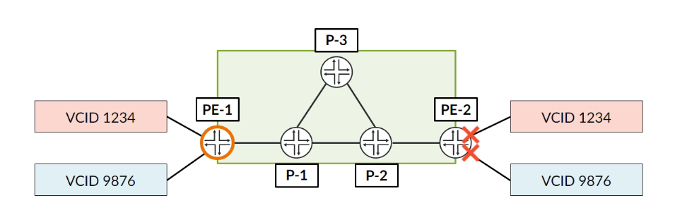
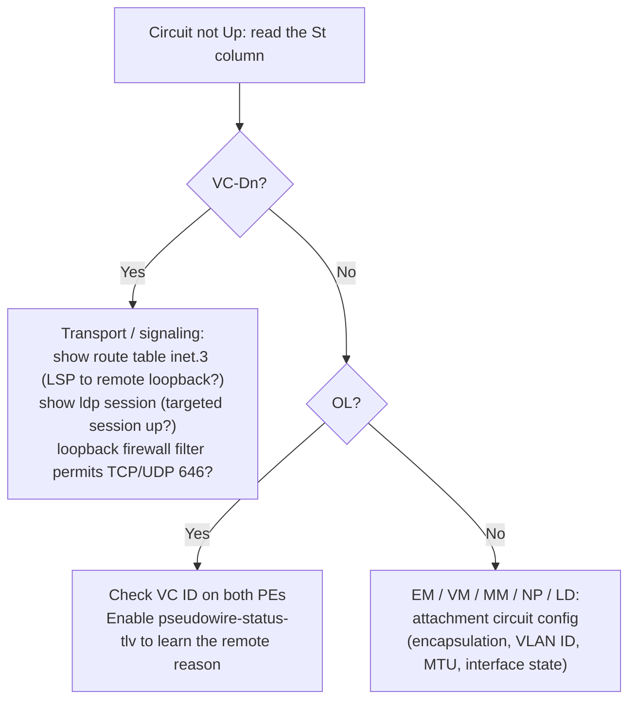
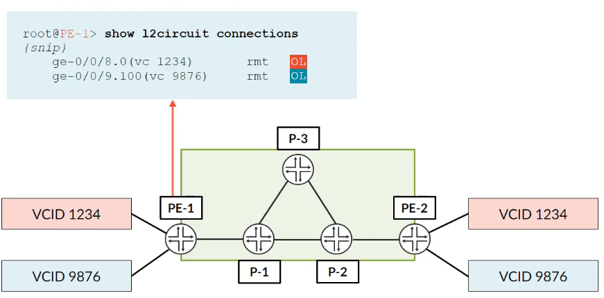
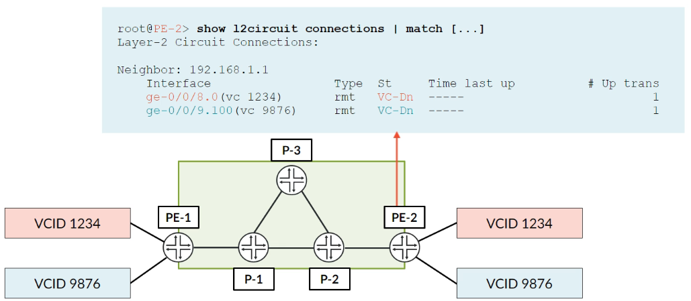

# L2Circuit Troubleshooting

**The Pseudowire Status TLV, the `show l2circuit connections` status codes, and the classic failure scenarios**

> Study notes by [Nazirul Roslan](https://www.linkedin.com/in/nazirulroslan) · JNCIP-SP · Junos Layer 2 VPNs · Part 010

← [Previous: L2Circuit: LDP-Signaled Pseudowires](009-l2circuit-ldp-signaled-pseudowires.md) · [Index](../README.md)

**Contents:** [1 Pseudowire Status TLV](#module-1-the-pseudowire-status-tlv) · [2 Error Codes](#module-2-common-l2circuit-error-codes) · [3 Failure Scenarios](#module-3-troubleshooting-failure-scenarios) · [4 Glossary](#module-4-glossary) · [5 Dynamic Recall](#module-5-dynamic-recall)

---

## Module 1: The Pseudowire Status TLV

**Objectives:**
- Explain the troubleshooting limitations when the Pseudowire Status TLV is disabled.
- Configure the Pseudowire Status TLV per circuit and globally.
- Verify that the remote PE now correctly reports the reason for a circuit failure.

The lab is the same as in [009](009-l2circuit-ldp-signaled-pseudowires.md): PE-1 (192.168.1.1) and PE-2 (192.168.1.2) with two L2Circuits, `ge-0/0/8.0` (VC 1234, Ethernet) and `ge-0/0/9.100` (VC 9876, Ethernet-VLAN).

### 1.1 The problem: ambiguous failures

By default, if an attachment circuit on a remote PE goes down, the remote PE simply **withdraws its VPN label**. The local PE has no visibility into *why* the circuit failed. All it knows is that the remote label is gone.



In this scenario the customer-facing interfaces on PE-2 have been shut down. PE-2 knows this and reports `LD` (local site down). PE-1, however, is left in the dark.

On PE-1 the status is `OL` (no outgoing label). This is unhelpful, because `OL` can have many different causes on the remote PE.

```
root@PE-1> show l2circuit connections
Layer-2 circuit connections:
...
Legend for connection status (St)
OL -- no outgoing label
...
Neighbor: 192.168.1.2
  Interface             Type  St     Time last up          # Up trans
  ge-0/0/8.0(vc 1234)   rmt   OL     ---                         0
  ge-0/0/9.100(vc 9876) rmt   OL     ---                         0
```

### 1.2 The solution: the Pseudowire Status TLV

The **Pseudowire Status TLV (Type-Length-Value)** solves this problem. When it is enabled, a PE no longer has to withdraw its label to signal a fault. It keeps the label in place and sends a **status code** to the remote PE, explicitly telling it *why* the pseudowire is down (for example, "local attachment circuit fault").

> [!NOTE]
> **Corrections.** The original guide cited RFC 6073 and said the status code rides in the LDP label *withdrawal* message. The PW Status TLV is defined in **RFC 4447** (now RFC 8077); RFC 6073 covers multi-segment pseudowires, which also use it. And with the TLV in use, the status travels in an LDP **Notification** message (and in the initial Label Mapping), while the label stays advertised. That is exactly why PE-1 stops seeing `OL`: it still has an outgoing label, plus a reason the circuit is down. Both PEs must support the TLV; enable it on both ends.

You can enable it for a single L2Circuit, or for all L2Circuits with a configuration group:

```
# Option 1: Per-Circuit Configuration
[edit protocols l2circuit neighbor 192.168.1.2 interface ge-0/0/8.0]
set pseudowire-status-tlv

# Option 2: Global Configuration (Best Practice)
[edit groups L2CIRCUIT-GLOBALS protocols l2circuit]
set pseudowire-status-tlv

[edit]
set apply-groups L2CIRCUIT-GLOBALS
```

> [!WARNING]
> Option 2 as written in the guide won't commit: `pseudowire-status-tlv` is configured per circuit, at the `[edit protocols l2circuit neighbor <address> interface <interface>]` level, not directly under `protocols l2circuit`. To apply it to every circuit, use wildcards in the group:
>
> ```
> [edit]
> set groups L2CIRCUIT-GLOBALS protocols l2circuit neighbor <*> interface <*> pseudowire-status-tlv
> set apply-groups L2CIRCUIT-GLOBALS
> ```
>
> Check the result with `show protocols l2circuit | display inheritance`.

With the TLV enabled on PE-2, PE-1 now sees the much more informative `RD` (remote site down) status, which points the troubleshooter straight in the right direction.

```
root@PE-1> show l2circuit connections
...
Legend for connection status (St)
RD -- remote site signaled down
...
Neighbor: 192.168.1.2
  Interface             Type  St     Time last up          # Up trans
  ge-0/0/8.0(vc 1234)   rmt   RD     ---                         0
  ge-0/0/9.100(vc 9876) rmt   RD     ---                         0
```

> [!TIP]
> Maria's analogy from the story below: the Status TLV is like adding a subject line to your error messages. Without it, the remote PE just hangs up the phone; with it, the remote PE tells you why before it goes quiet.

> [!IMPORTANT]
> **Key takeaways.** The Pseudowire Status TLV gives visibility into remote site failures. It is disabled by default, which leads to ambiguous `OL` codes. Best practice is to enable it on all PEs that host L2Circuits. Next: a reference list of the common status codes.

---

## Module 2: Common L2Circuit Error Codes

**Objectives:**
- Provide a quick-reference table for the most common L2Circuit status codes.
- Associate each status code with a likely failure domain (transport, control plane, attachment circuit).

### Decoding `show l2circuit connections`

The `St` (status) column is the single most important piece of information when troubleshooting an L2Circuit. These are the codes you'll meet most often.

| Code | Meaning | Likely problem area |
|---|---|---|
| **Up** | Operational | None. The circuit is working. |
| **OL** | No outgoing label | Control plane (e.g. mismatched VC ID), or the remote attachment circuit (if the Status TLV is off). |
| **LD** | Local site signaled down | Local attachment circuit (e.g. interface down). |
| **RD** | Remote site signaled down | Remote attachment circuit (needs the Status TLV). |
| **VC-Dn** | Virtual circuit down | Transport layer (e.g. no LSP to the remote PE, LDP session down). |
| **EM** | Encapsulation mismatch | Attachment circuit (e.g. one side `ethernet-ccc`, the other `vlan-ccc`). |
| **VM** | VLAN ID mismatch | Attachment circuit (VLAN IDs differ on a `vlan-ccc` circuit). |
| **NP** | Interface hardware not present | Attachment circuit (the configured interface doesn't exist on the router). |

> [!NOTE]
> **Additions and a refinement.** The Junos legend lists more codes than the guide's table. Worth knowing for the exam:
> - **MM** (MTU mismatch): the signaled MTUs differ. Fix the MTU or use `ignore-mtu-mismatch`.
> - **CM** (control-word mismatch): one side uses the control word and the other doesn't.
> - **NC** (interface encapsulation not CCC/TCC): the interface exists but isn't configured with a CCC encapsulation. The guide attributed a missing `family ccc` to `NP`; in the Junos legend `NP` means the interface hardware isn't present, while a wrong or missing CCC encapsulation shows as `NC` (or `EI`, encapsulation invalid). Treat the exact code as release-dependent and read the legend at the top of the output.
> - **Dn** (down), plus redundancy codes such as **BK** (backup), **ST** (standby) and **HS** (hot-standby) for pseudowire redundancy.

> [!IMPORTANT]
> **Key takeaways.** Each status code is a clue that points to a specific layer of the L2Circuit architecture. Knowing them cuts diagnosis time dramatically. Next: several failure scenarios and their CLI symptoms.

---

## Module 3: Troubleshooting Failure Scenarios

**Objectives:**
- Identify the symptoms of a missing transport LSP.
- Diagnose failures caused by control plane filters.
- Recognize the CLI output for various attachment circuit misconfigurations.

Troubleshoot from the bottom up: transport first, then signaling, then the attachment circuit.



### 3.1 Failure: no LSP to the remote PE

This is the most fundamental failure. If the ingress PE has no labeled route to the remote PE's loopback in its `inet.3` table, it has no way to build the transport part of the pseudowire.





According to the guide, the targeted LDP session fails to establish and the L2Circuit connection shows `VC-Dn`:

```
root@PE-1> show ldp session
# Output is empty

root@PE-1> show l2circuit connections
...
  Interface             Type  St     Time last up          # Up trans
  ge-0/0/8.0(vc 1234)   rmt   VC-Dn  ---                         0
```

> [!NOTE]
> **Read the two screenshots carefully; they tell a more precise story.** In the lab, it is **PE-2** that shows `VC-Dn` (it has no LSP towards PE-1 in `inet.3`), while **PE-1** shows `OL`. PE-2 can't use the circuit without a transport LSP, so it doesn't advertise (or withdraws) its VPN label, and PE-1 is left with no outgoing label. So `VC-Dn` appears on the PE that is **missing the LSP**, and the far end typically shows `OL`.
>
> Also, a missing `inet.3` route on its own doesn't necessarily kill the targeted LDP session: the session is plain TCP routed over the IGP in `inet.0`. An empty `show ldp session` means the loopbacks can't reach each other at all, LDP isn't enabled on `lo0.0`, or LDP is being filtered (section 3.2). In every case, check both PEs: `show route table inet.3 <remote-loopback>` and `show ldp session`.

### 3.2 Failure: control plane firewall filter

A common mistake is applying a firewall filter to the loopback interface for security and forgetting to permit LDP (TCP/UDP port 646). This blocks the targeted LDP session from forming, which gives the same `VC-Dn` symptom as a missing LSP.

The fix is a term in the filter that accepts LDP:

```
[edit firewall filter PROTECT-RE]
term LDP {
    from {
        protocol [ tcp udp ];
        port 646;
    }
    then accept;
}
```

> [!WARNING]
> Firewall filter terms are evaluated in order. If the filter ends with a discard term, the new `LDP` term must sit **before** it (`insert term LDP before term <discard-term>`), or it will never be reached. For tighter security you can also match `source-address` on your PE loopback range.

> [!NOTE]
> Depending on the Junos release and on which side is filtered, a circuit with no targeted LDP session may show `OL` (no label ever arrives) rather than `VC-Dn`. Either way, `show ldp session` without the remote loopback is the tell.

### 3.3 Attachment circuit failures

Several misconfigurations on the PE-CE interface can break an L2Circuit.

**Symptom: `EM` (encapsulation mismatch).** The PEs use different encapsulation types.

```
# PE-1 has 'encapsulation ethernet-ccc'
# PE-2 has 'encapsulation vlan-ccc'

root@PE-1> show l2circuit connections
...
  Interface             Type  St     Time last up          # Up trans
  ge-0/0/8.0(vc 1234)   rmt   EM     ---                         0
```

Why it's detected: `ethernet-ccc` is signaled as PW type Ethernet (5) and `vlan-ccc` as Ethernet Tagged Mode (4), so the two FEC 128 advertisements don't agree (see [009 section 4.3](009-l2circuit-ldp-signaled-pseudowires.md#43-dissecting-the-fec-element)). Junos also offers `ignore-encapsulation-mismatch` for deliberate interworking cases.

**Symptom: `VM` (VLAN mismatch).** The PEs are configured for a VLAN circuit but the VLAN IDs don't match.

```
# PE-1 has 'vlan-id 100'
# PE-2 has 'vlan-id 200'

root@PE-1> show l2circuit connections
...
  Interface             Type  St     Time last up          # Up trans
  ge-0/0/9.100(vc 9876) rmt   VM     ---                         0
```

**Symptom: `OL` (no outgoing label).** The virtual circuit IDs don't match.

```
# PE-1 has 'virtual-circuit-id 1234'
# PE-2 has 'virtual-circuit-id 5678'

root@PE-1> show l2circuit connections
...
  Interface             Type  St     Time last up          # Up trans
  ge-0/0/8.0(vc 1234)   rmt   OL     ---                         0
```

PE-2 does advertise a label, but for PW ID 5678. PE-1 is waiting for PW ID 1234, so from its point of view no matching label ever arrives.

> [!IMPORTANT]
> **Key takeaways.** L2Circuit troubleshooting follows a logical path from the transport layer up to the attachment circuit. `VC-Dn` points to a transport or LDP signaling issue, while `EM`, `VM` and `OL` point to specific configuration mismatches between the two PEs. A methodical approach guided by the status codes is the key to fast resolution.

---

## Module 4: Glossary

| Term | Definition |
|---|---|
| **OL (no outgoing label)** | The local PE hasn't received a VPN label from the remote PE for this circuit. |
| **LD (local site down)** | The local PE's attachment circuit is down. |
| **RD (remote site down)** | The remote PE's attachment circuit is down; visible only with the Status TLV. |
| **VC-Dn (virtual circuit down)** | A failure in the underlying transport or LDP signaling layer. |
| **Pseudowire Status TLV** | An LDP extension (RFC 4447 / RFC 8077) that lets a PE signal the *reason* for a pseudowire failure to its remote peer. |

---

## Module 5: Dynamic Recall

### Part 1: Recall

**What is the default, unhelpful status code a PE shows when a remote attachment circuit fails?**

<details><summary>Answer</summary>

**`OL` (no outgoing label).** The remote PE simply withdraws its label without giving a reason.

</details>

**What feature provides more specific failure information from the remote PE?**

<details><summary>Answer</summary>

The **Pseudowire Status TLV**. It lets the remote PE signal the actual reason for the failure, which changes the local status to `RD` (remote site down).

</details>

**What does the `VC-Dn` status code almost always indicate?**

<details><summary>Answer</summary>

A **transport layer failure**: either there is no LSP to the remote PE (no route in `inet.3`) or the targeted LDP session itself is down.

</details>

**Besides a missing LSP, what is another common cause of a `VC-Dn` status?**

<details><summary>Answer</summary>

A **firewall filter on the loopback interface** that doesn't explicitly permit LDP (TCP/UDP port 646).

</details>

### Part 2: Fusion (a story)

"This is impossible!" Naz exclaimed, staring at the `show l2circuit connections` output. "The status is `OL`. I've checked the virtual circuit IDs a dozen times, and they match perfectly. What else could it be?"

Maria glanced over. "If the VC IDs match, `OL` usually means the problem is on the remote PE. But without more information you're just guessing. Did you enable the **Pseudowire Status TLV**?" Naz admitted he hadn't. "It's the first thing you should enable," she advised. "Think of it as adding a subject line to your error messages."

He configured `pseudowire-status-tlv` on both PEs. The status on his screen changed from `OL` to `EM`. "Encapsulation mismatch!" he shouted. A quick check confirmed his mistake: he had configured one side as `ethernet-ccc` and the other as `vlan-ccc`.

Naz realized his error. He had been so focused on the L2Circuit configuration itself that he forgot the basics of the attachment circuit. The Status TLV didn't fix the problem, but it pointed him straight to it, turning a frustrating guessing game into a quick fix.

> [!NOTE]
> Treat the story as an illustration of the Status TLV's value rather than an exact lab result. An encapsulation mismatch is visible in the PW type of the FEC 128 advertisement itself, so Junos normally reports `EM` for an `ethernet-ccc` vs. `vlan-ccc` mismatch even without the Status TLV (as in section 3.3).

### Part 3: Chunk & Collapse

| Chunk | Summary | Tags |
|---|---|---|
| **Enable Status TLV** | Always enable `pseudowire-status-tlv` to get specific codes like `RD` from the remote PE instead of the generic `OL`. | #Status-TLV #Visibility #BestPractice |
| **VC-Dn = transport** | If you see `VC-Dn`, check the transport layer first: `show route table inet.3` and `show ldp session`. | #VC-Down #Transport #LSP #LDP |
| **Mismatches kill circuits** | `OL`, `EM` and `VM` are almost always caused by a configuration mismatch between the two PEs. | #Mismatch #VC-ID #Encapsulation #VLAN |
| **Check the firewall** | A loopback firewall filter is a common source of LDP failures; always permit TCP/UDP port 646. | #Firewall #Loopback #Port646 |

---

← [Previous: L2Circuit: LDP-Signaled Pseudowires](009-l2circuit-ldp-signaled-pseudowires.md) · [Index](../README.md)
