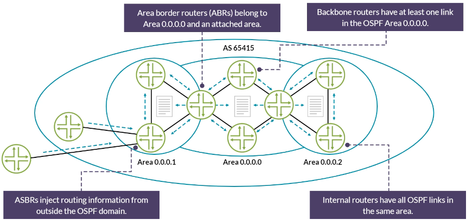
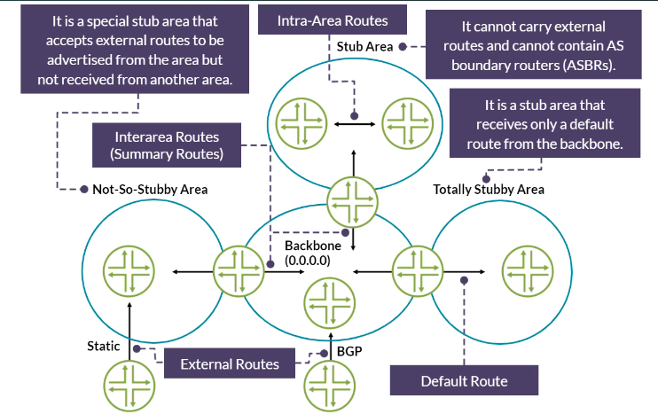
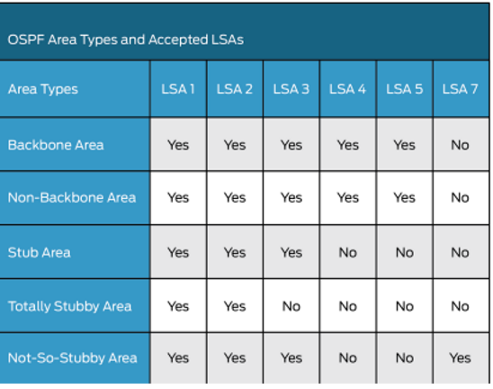
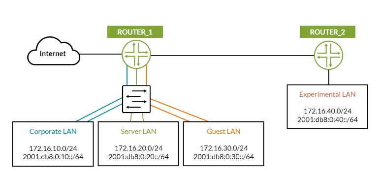

# Fundamentals of OSPF (Junos Edition)

> Study notes by [Nazirul Roslan](https://www.linkedin.com/in/nazirulroslan) · JNCIS-SP

---

## 1. What is OSPF?

**Open Shortest Path First (OSPF)** is a scalable, widely deployed **link-state IGP**. Unlike distance-vector protocols (such as RIP) that rely on second-hand information, every OSPF router builds a full topology map and runs **Dijkstra's SPF** algorithm to find the shortest path to each destination. The result is fast convergence and loop-free routing.

| Property | Value |
|---|---|
| Protocol type | Link-state IGP |
| Standard | OSPFv2: RFC 2328 · OSPFv3: RFC 5340 |
| Algorithm | Dijkstra SPF |
| Metric | Cost, configurable per interface |
| Junos route preference | **10** internal · **150** external |

### OSPF packet types

| Packet | Purpose |
|---|---|
| **Hello** | Discover and maintain neighbors |
| **Database Description (DD/DBD)** | Exchange LSA headers during adjacency formation |
| **Link-State Request (LSR)** | Ask a neighbor for specific LSAs |
| **Link-State Update (LSU)** | Carry one or more LSAs |
| **Link-State Acknowledgment (LSAck)** | Confirm LSUs for reliable flooding |

---

## 2. Forming a Neighbor Adjacency

### The seven neighbor states


| State | What's happening |
|---|---|
| **Down** | No Hellos received yet |
| **Init** | A Hello arrived, but it doesn't list our Router ID: communication is one-way so far |
| **2-Way** | Each router sees its own ID in the other's Hello. On broadcast networks, DROthers stop here with each other |
| **ExStart** | Primary/secondary roles for the database exchange are chosen; higher Router ID becomes primary |
| **Exchange** | DBD packets (LSDB summaries) are exchanged |
| **Loading** | LSRs are sent for missing or outdated LSAs |
| **Full** | LSDBs are synchronized: fully adjacent |

> [!NOTE]
> On **NBMA** networks there is also an **Attempt** state, where Hellos are sent to manually configured neighbors before Init.

### Designated Router (DR) and Backup DR (BDR)

On broadcast media (Ethernet), OSPF elects a **DR** so routers don't need a full mesh of adjacencies; the **BDR** stands by.

- **Election:** highest priority (0–255) wins; **priority 0** can never be DR. Ties go to the highest Router ID.
- **Default priority in Junos:** **128**.

```
set protocols ospf area 0.0.0.0 interface ge-0/0/0.0 priority 100
```

- **Non-preemptive:** a DR keeps the role until it fails, even if a higher-priority router joins later.
- **Point-to-point links:** set Ethernet links between two routers to `p2p` to skip the election entirely.

```
set protocols ospf area 0.0.0.0 interface ge-0/0/0.0 interface-type p2p
```

---

## 3. Scalability: Router Roles, LSAs & Areas

### Router roles



| Role | Definition |
|---|---|
| **Internal router** | All OSPF interfaces in one area; keeps only that area's LSDB |
| **Backbone router** | At least one interface in Area 0. Every ABR is a backbone router |
| **ABR** (Area Border Router) | Connects Area 0 and at least one other area; summarizes between them with Type 3 LSAs |
| **ASBR** (AS Boundary Router) | Injects routes from outside OSPF (BGP, static) as Type 5, or Type 7 in an NSSA |

### LSA types

| Type | Name | Generated by | Flooding scope |
|---|---|---|---|
| 1 | Router LSA | Every router | Within the area |
| 2 | Network LSA | DR | Within the area |
| 3 | Summary LSA | ABR | Into other areas |
| 4 | ASBR Summary LSA | ABR | Into other areas (tells them how to reach an ASBR) |
| 5 | AS External LSA | ASBR | All areas except stub/NSSA |
| 7 | NSSA External LSA | ASBR in an NSSA | NSSA only (ABR translates to Type 5) |

### Area types and the LSAs they accept





| Junos area type | Type 1/2 | Type 3 | Type 4 | Type 5 | Type 7 | Notes |
|---|---|---|---|---|---|---|
| **Backbone / standard** | ✅ | ✅ | ✅ | ✅ | ❌ | Carries everything |
| **`stub`** | ✅ | ✅ | ❌ | ❌ | ❌ | No external routes |
| **`stub no-summaries`** | ✅ | ❌ (default only) | ❌ | ❌ | ❌ | Junos equivalent of **totally stubby** |
| **`nssa`** | ✅ | ✅ | ❌ | ❌ | ✅ | Local ASBR allowed; ABR translates 7 → 5 |
| **`nssa no-summaries`** | ✅ | ❌ (default only) | ❌ | ❌ | ✅ | Junos equivalent of **totally NSSA** |

> [!IMPORTANT]
> **Junos gotcha:** unlike some vendors, a Junos ABR does **not** send a default route into a stub area automatically. You must configure it on the ABR:
> ```
> set protocols ospf area 0.0.0.1 stub default-metric 10
> ```
> For an NSSA, use `nssa default-lsa default-metric 10`.

> [!TIP]
> **Why Type 4 matters:** for a router in Area 1 to use an external route injected by an ASBR in Area 2, it first needs to know how to reach that ASBR. The Type 4 LSA provides exactly that.

### Route summarization and virtual links

**Summarization** on an ABR condenses many prefixes into one advertisement, shrinking other areas' LSDBs and hiding flaps:

```
set protocols ospf area 0.0.0.1 area-range 192.168.0.0/16
```

**Virtual links** logically connect an area to Area 0 through a transit area. Use them as a last resort; they can't cross stub areas.

---

## 4. Configuration Scenario (Junos)



ROUTER_1 advertises its LANs and a default route to ROUTER_2 in Area 0.

| LAN | IPv4 | IPv6 |
|---|---|---|
| Corporate | 172.16.10.0/24 | 2001:db8:0:10::/64 |
| Server | 172.16.20.0/24 | 2001:db8:0:20::/64 |
| Guest | 172.16.30.0/24 | 2001:db8:0:30::/64 |
| Experimental (ROUTER_2) | 172.16.40.0/24 | 2001:db8:0:40::/64 |

### ROUTER_1: OSPFv2

```
# ge-0/0/0 to ROUTER_2, ge-0/0/1 Corporate, ge-0/0/2 Server, ge-0/0/3 Guest, ge-0/0/4 Internet
set interfaces ge-0/0/0 unit 0 family inet address 10.1.2.1/30
set interfaces ge-0/0/1 unit 0 family inet address 172.16.10.1/24
set interfaces ge-0/0/2 unit 0 family inet address 172.16.20.1/24
set interfaces ge-0/0/3 unit 0 family inet address 172.16.30.1/24
set interfaces ge-0/0/4 unit 0 family inet address 200.0.0.1/30
set routing-options router-id 1.1.1.1
set routing-options static route 0.0.0.0/0 next-hop 200.0.0.2

set policy-options policy-statement export-default term 1 from protocol static
set policy-options policy-statement export-default term 1 from route-filter 0.0.0.0/0 exact
set policy-options policy-statement export-default term 1 then accept

set protocols ospf area 0.0.0.0 interface ge-0/0/0.0 interface-type p2p
set protocols ospf area 0.0.0.0 interface ge-0/0/1.0 passive
set protocols ospf area 0.0.0.0 interface ge-0/0/2.0 passive
set protocols ospf area 0.0.0.0 interface ge-0/0/3.0 passive
set protocols ospf export export-default
```

> [!TIP]
> The LAN interfaces are `passive`: their subnets are still advertised, but no Hellos are sent toward end hosts. Nothing to peer with there, and it stops rogue devices forming adjacencies.

### ROUTER_1: OSPFv3 (IPv6)

```
set interfaces ge-0/0/0 unit 0 family inet6 address 2001:db8:0:12::1/64
set interfaces ge-0/0/1 unit 0 family inet6 address 2001:db8:0:10::1/64
set interfaces ge-0/0/2 unit 0 family inet6 address 2001:db8:0:20::1/64
set interfaces ge-0/0/3 unit 0 family inet6 address 2001:db8:0:30::1/64
set interfaces ge-0/0/4 unit 0 family inet6 address 2001:db8:0:100::1/64
set routing-options rib inet6.0 static route ::/0 next-hop 2001:db8:0:100::2

set policy-options policy-statement export-default term 2 from protocol static
set policy-options policy-statement export-default term 2 from route-filter ::/0 exact
set policy-options policy-statement export-default term 2 then accept

set protocols ospf3 area 0.0.0.0 interface ge-0/0/0.0 interface-type p2p
set protocols ospf3 area 0.0.0.0 interface ge-0/0/1.0 passive
set protocols ospf3 area 0.0.0.0 interface ge-0/0/2.0 passive
set protocols ospf3 area 0.0.0.0 interface ge-0/0/3.0 passive
set protocols ospf3 export export-default
```

> [!NOTE]
> OSPFv3 still uses a 32-bit **IPv4-format router ID**. With no IPv4 addresses on the box, you must set `routing-options router-id` manually.

### ROUTER_2

```
# ge-0/0/0 to ROUTER_1, ge-0/0/1 Experimental LAN
set interfaces ge-0/0/0 unit 0 family inet address 10.1.2.2/30
set interfaces ge-0/0/1 unit 0 family inet address 172.16.40.1/24
set routing-options router-id 2.2.2.2
set protocols ospf area 0.0.0.0 interface ge-0/0/0.0 interface-type p2p
set protocols ospf area 0.0.0.0 interface ge-0/0/1.0 passive

set interfaces ge-0/0/0 unit 0 family inet6 address 2001:db8:0:12::2/64
set interfaces ge-0/0/1 unit 0 family inet6 address 2001:db8:0:40::1/64
set protocols ospf3 area 0.0.0.0 interface ge-0/0/0.0 interface-type p2p
set protocols ospf3 area 0.0.0.0 interface ge-0/0/1.0 passive
```

---

## 5. Verification & Troubleshooting (Junos)

### Neighbor adjacency (v2 and v3): look for `Full`

```
user@ROUTER_1> show ospf neighbor
Address          Interface              State     ID               Pri  Dead
10.1.2.2         ge-0/0/0.0             Full      2.2.2.2          128    38

user@ROUTER_1> show ospf3 neighbor
ID               Interface              State     Pri  Dead   Address
2.2.2.2          ge-0/0/0.0             Full      128    34   fe80::...
```

OSPFv3 neighbors talk over **link-local** addresses (`fe80::/10`), so adjacencies form even without global IPv6 addresses on the link.

### OSPF routes

```
user@ROUTER_1> show route protocol ospf
172.16.40.0/24     *[OSPF/10] 00:05:32, metric 2
                    > to 10.1.2.2 via ge-0/0/0.0

user@ROUTER_2> show route protocol ospf
172.16.10.0/24     *[OSPF/10] 00:15:10, metric 2
                    > to 10.1.2.1 via ge-0/0/0.0
172.16.20.0/24     *[OSPF/10] 00:15:08, metric 2
                    > to 10.1.2.1 via ge-0/0/0.0
172.16.30.0/24     *[OSPF/10] 00:15:05, metric 2
                    > to 10.1.2.1 via ge-0/0/0.0
0.0.0.0/0          *[OSPF/150] 00:14:50, metric 1, Ext2
                    > to 10.1.2.1 via ge-0/0/0.0
```

The default route shows preference **150**, because it was exported into OSPF as an **external** route.

---

## 6. Quick Reference Cheatsheet

### Protocol facts

| Item | Value |
|---|---|
| Packets | Hello, DBD, LSR, LSU, LSAck |
| IP protocol number | **89** (not TCP/UDP) |
| Multicast | 224.0.0.5 (all OSPF routers) · 224.0.0.6 (DR/BDR) |

### Junos facts

| Item | Value |
|---|---|
| Preference | 10 internal · 150 external |
| Router ID | Configured `router-id`, otherwise the `lo0` address, otherwise the first interface address |
| DR election | Highest priority (0–255) → highest Router ID |
| Default priority | 128 |
| Timers (broadcast / P2P) | Hello 10 s · Dead 40 s |
| Default cost | Reference bandwidth 100 Mbps ÷ interface speed, minimum 1 (so 1 for 100 Mbps and faster); `lo0` = 0 |

### Common commands

| Purpose | Command |
|---|---|
| Neighbor state | `show ospf neighbor` / `show ospf3 neighbor` |
| Database | `show ospf database` / `show ospf3 database` |
| OSPF routes | `show route protocol ospf` / `show route protocol ospf3` |
| Interface state, DR info | `show ospf interface` / `show ospf3 interface` |

---

## 7. Glossary

| Term | Meaning |
|---|---|
| Area | Logical group of routers and links that bounds LSA flooding |
| ASBR | Connects OSPF to an external domain and injects external routes |
| ABR | Has interfaces in more than one area; summarizes and filters between them |
| Cost | OSPF metric; lowest total cost wins |
| Dijkstra's algorithm | Computes shortest paths from one source to all destinations |
| DR / BDR | Elected on multi-access networks to reduce adjacencies; BDR is the standby |
| `interface-type p2p` | Treats an interface as point-to-point: no DR/BDR election, faster adjacency |
| LSA | Unit of link-state information; building block of the LSDB |
| LSDB | All LSAs a router knows; identical for all routers in an area |
| MTU mismatch | Different MTUs on each end; stalls the adjacency at ExStart/Exchange |
| OSPFv2 vs. OSPFv3 | v2 (RFC 2328) for IPv4; v3 (RFC 5340) for IPv6, running over IPv6 |
| Route preference | Junos equivalent of administrative distance |
