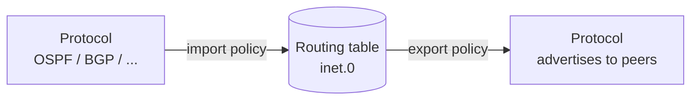
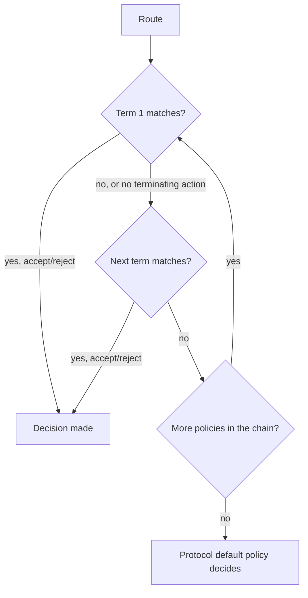
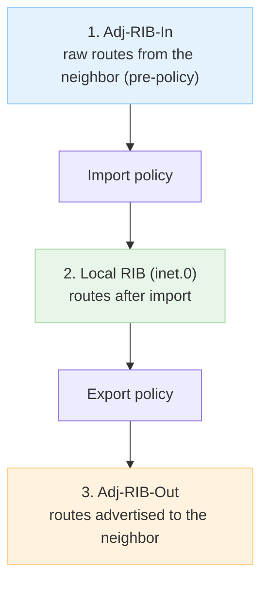

# A Comprehensive Guide to Junos Routing Policy

**From Core Principles to Advanced Engineering**

> Study notes by [Nazirul Roslan](https://www.linkedin.com/in/nazirulroslan) · JNCIS-SP

---

## 1. The Junos Policy Framework: Core Principles

Junos gives you a powerful, granular framework for controlling routing information. It rests on three ideas: strict separation of the **control and data planes**, a directional model of **import** and **export**, and a clear line between **policies** (which act on routes) and **filters** (which act on packets).

### Control plane vs. data plane

| | Routing table | Forwarding table |
|---|---|---|
| Lives on | **Routing Engine (RE)**, control plane | **Packet Forwarding Engine (PFE)**, data plane |
| Contents | Every route from every source (direct, static, OSPF, BGP...) | Only the **active** route per destination |
| View with | `show route` | `show route forwarding-table` |

> [!TIP]
> **Learner's perspective: a tale of two tables.** Two equal-cost paths in `show route` does **not** mean traffic is load-balanced. By default Junos installs only **one** of them in the forwarding table. Check `show route forwarding-table` to see how traffic really flows.

### Import and export policies

Routes never flow directly from one protocol to another (for example OSPF to BGP). The routing table is always the middleman.



- **Import policy:** filters or changes routes coming **from a protocol into the routing table**.
- **Export policy:** filters or changes routes going **from the routing table to a protocol** for advertisement.

### Default import and export behavior

| Protocol | Default import | Default export |
|---|---|---|
| **BGP** | Accept all routes | Advertise all **active BGP** routes to all peers |
| **OSPF / IS-IS** | Accept all LSAs/LSPs (link-state import can't be used to block the database) | **Reject everything** (only their own OSPF/IS-IS interfaces are advertised) |
| **RIP** | Accept all RIP routes | **Reject everything** |

> [!IMPORTANT]
> **Key takeaway:** to advertise a static or direct route into OSPF, IS-IS or RIP, you **must** write an explicit export policy.

---

## 2. Routing Policies vs. Firewall Filters

The syntax looks similar, but they do completely different jobs.

| Feature | Routing policy | Firewall filter |
|---|---|---|
| Acts on | **Routes / prefixes** | **Packets** |
| Plane | Control plane (RE) | Data plane (PFE) |
| Configured at | `[edit policy-options]` | `[edit firewall]` |
| Applied to | Protocols (BGP, OSPF), forwarding table | Interfaces (physical, `lo0`) |
| Typical `from` | `protocol`, `route-filter`, `community` | `source-address`, `destination-port` |
| Typical `then` | `accept`, `reject`, `metric`, `preference` | `accept`, `discard`, `log`, `count` |
| Use case | Control advertisement and path selection | Protect the RE, filter transit traffic, CoS |

---

## 3. Constructing Routing Policies

### Anatomy of a policy statement

A `policy-statement` holds one or more ordered **terms**. Each term has `from` (match) and `then` (action). Evaluation is **top-down** and stops at the first **terminating action** (`accept` or `reject`).

```
policy-statement <POLICY_NAME> {
    term <TERM_1> {
        from { /* match conditions */ }
        then { /* actions */ }
    }
    term <TERM_2> {
        from { /* match conditions */ }
        then { /* actions */ }
    }
}
```

### `from`: match conditions

Several values of the **same** condition are a logical **OR**; **different** conditions are a logical **AND**.

| Match condition | Matches | Example use |
|---|---|---|
| `protocol [bgp \| ospf \| static ...]` | Routes from a protocol | Export only static routes into OSPF |
| `route-filter <prefix> exact` | That exact prefix and length | The default route `0.0.0.0/0` |
| `route-filter <prefix> orlonger` | The prefix and all more-specifics | A customer /16 and its subnets |
| `route-filter <prefix> longer` | Only more-specifics, not the prefix itself | Blocking de-aggregates |
| `route-filter <prefix> upto /n` | The prefix down to length /n | Accept up to /24 inside a block |
| `community <name>` | Routes carrying a BGP community | Set Local Preference from tags |
| `as-path <name>` | Routes whose AS path matches a regex | Reject routes from a given AS |

### `then`: actions

> [!IMPORTANT]
> **Changing an attribute does not accept the route.** You must add `accept` explicitly.

| Type | Actions | Ends evaluation? |
|---|---|---|
| Terminating | `accept`, `reject` | ✅ Yes |
| Flow control | `next term`, `next policy` | Moves on |
| Attribute changes | `metric`, `preference`, `local-preference`, `community`... | ❌ No |

### Common pitfall: the missing `accept`

Goal: export static routes into OSPF with metric 100.

```
term SET_METRIC {
    from protocol static;
    then metric 100;
}
```

This **fails**. The metric is set, but with no `accept` the route falls through to OSPF's default export policy, which is **reject**.

```
term SET_METRIC_AND_ACCEPT {
    from protocol static;
    then {
        metric 100;
        accept;
    }
}
```

### How a route moves through a policy chain



---

## 4. Foundational Policy Applications

### Case study: exporting a static default route into OSPF

```
   (has static default)                 (needs default)
   +----------+       OSPF adjacency     +----------+
   | Router 1 |--------------------------| Router 2 |
   +----------+                          +----------+
         ---- default route exported ---->
```

OSPF's default export is **reject**, so Router 1 needs a policy.

**1. Match and accept the static default:**

```
policy-options {
    policy-statement EXPORT_DEFAULT {
        term ALLOW_DEFAULT {
            from {
                protocol static;
                route-filter 0.0.0.0/0 exact;
            }
            then accept;
        }
    }
}
```

**2. Apply it as an OSPF export policy:**

```
protocols {
    ospf {
        export EXPORT_DEFAULT;
    }
}
```

### Controlling advertisement with `no-readvertise`

`no-readvertise` on a static route stops it from ever being exported into a dynamic protocol. It **overrides any `accept`** in a policy. Perfect for floating static backups you want active locally but never advertised.

```
routing-options {
    static {
        /* This route CAN be exported by a policy */
        route 172.29.12.0/24 next-hop 10.10.10.1;

        /* This route will NEVER be exported */
        route 172.29.13.0/24 {
            next-hop 10.10.10.1;
            no-readvertise;
        }
    }
}
```

With a policy that exports all static routes, the neighbor sees:

| Prefix | Result |
|---|---|
| 172.29.12.0/24 | ✅ Learned |
| 172.29.13.0/24 | ❌ Not learned |

> [!WARNING]
> Classic exam gotcha: `no-readvertise` wins over the policy's `accept`.

---

## 5. Verification & Troubleshooting

### The BGP policy pipeline



Check each stage to find out whether the problem is receiving, importing, selecting or exporting.

| Question | Stage | Command |
|---|---|---|
| Am I receiving the route at all? | Adj-RIB-In | `show route receive-protocol bgp <neighbor>` |
| Did my import policy reject it? | Post-import | `show route hidden` or `show route protocol bgp hidden` |
| Is it in the main routing table? | Local RIB | `show route <prefix>` |
| Is my export policy sending it? | Adj-RIB-Out | `show route advertising-protocol bgp <neighbor>` |

### Advanced diagnosis with `traceoptions`

When `show` commands aren't enough, trace the policy engine's decisions. It's CPU-intensive: use it only while actively troubleshooting.

```
routing-options {
    traceoptions {
        file rpd-policy-trace size 10m files 5;
        flag policy detail;
    }
}
```

- `commit` to start tracing.
- `monitor start rpd-policy-trace` to watch live.
- `show log rpd-policy-trace` to read the log.
- **Turn it off afterwards:** `deactivate routing-options traceoptions` and `commit`.

You can also test a policy without applying it:

```
test policy <POLICY_NAME> <prefix>
```

---

## 6. Best Practices for Policy Design

### Readability and maintainability

- **Descriptive names:** `EXPORT-TRANSIT-TO-PEER-A` beats `policy1`. Name policies, terms and prefix lists clearly.
- **Structure logically:** put explicit `reject` terms for unwanted routes (bogons, private space) at the top of import policies.
- **Avoid hardcoding:** use `prefix-list` definitions instead of prefixes inside policies, so updates happen in one place.

### Scalability and modularity

- **Policy chains:** split complex logic into small single-purpose policies and chain them.

```
[edit protocols bgp group ebgp-peers]
export [ REJECT-BOGONS SET-ATTRIBUTES DEFAULT-POLICY ];
```

- **BGP communities:** tag routes at the edge; core and egress policies match the tag instead of long prefix or AS-path lists.

### Security

- **Default deny:** end policies with an explicit catch-all, e.g. `term REJECT-ALL { then reject; }`, so nothing leaks by accident.
- **Filter at the edge:** on every eBGP session, reject your own prefixes, RFC 1918 space and bogons.
- **Protect the RE:** always apply a firewall filter on `lo0` that limits management access (SSH, SNMP) to trusted sources.

### Influencing the forwarding plane: ECMP

Equal-cost paths in `inet.0` aren't load-balanced until you install them all in the PFE with a forwarding-table export policy:

```
policy-options {
    policy-statement ECMP-POLICY {
        then {
            load-balance per-packet;
        }
    }
}
routing-options {
    forwarding-table {
        export ECMP-POLICY;
    }
}
```

> [!NOTE]
> Despite the name, `per-packet` gives **per-flow** load balancing on modern Junos platforms (a hash of packet headers), so packets within one session aren't reordered.
