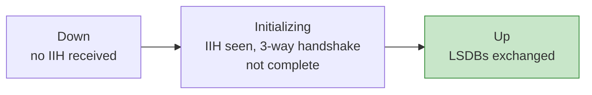
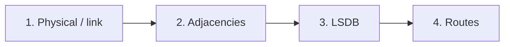

# The JNCIS-SP Masterclass: IS-IS on Junos OS

> Study notes by [Nazirul Roslan](https://www.linkedin.com/in/nazirulroslan) · JNCIS-SP

**Contents:** [Overview](#module-1-is-is-overview) · [NET Addressing](#module-2-nsap-net-addressing) · [PDUs & TLVs](#module-3-is-is-pdus-and-tlvs) · [Adjacencies](#module-4-forming-adjacencies) · [Metrics](#module-5-metrics-and-path-selection) · [Configuration](#module-6-configuring--monitoring-is-is-on-junos) · [Timers](#module-7-key-is-is-timers) · [Lab](#module-8-comprehensive-lab) · [Troubleshooting](#module-9-troubleshooting-methodology) · [Exam Prep](#module-10-jncis-sp-exam-preparation) · [Glossary](#module-11-glossary)

---

## Module 1: IS-IS Overview

### 1.1 Introduction

**Intermediate System to Intermediate System (IS-IS)** is an IGP originally built by ISO for CLNP. Its extensible design, **Integrated (Dual) IS-IS**, lets it route IP too, which made it a favorite in large service provider networks.

Like OSPF, it's **link-state**: it builds a full topology map (the LSDB) and runs **Dijkstra SPF** to compute loop-free best paths.

> [!TIP]
> **Learner's perspective: the network's GPS.** Every delivery truck (router) has the complete map of every road and its traffic (the topology), and works out the fastest route to any address, so parcels (packets) arrive quickly without driving in circles.

### 1.2 The two-level hierarchy

| Router type | Knows | Reaches other areas by |
|---|---|---|
| **Level 1 (L1)** | Detailed topology of its own area only | Default route toward the nearest L1/L2 router |
| **Level 2 (L2)** | The L2 backbone and which prefixes live in each area | Routing between areas |
| **Level 1/2 (L1/L2)** | Both L1 and L2 databases | Is the border; sets the **Attached (ATT) bit** in its L1 LSP to tell L1 routers it can reach the backbone |

### 1.3 IS-IS vs. OSPF

| Feature | IS-IS | OSPF |
|---|---|---|
| Transport | Directly over Layer 2 (CLNS) | IP, protocol 89 |
| Native to | CLNS, extended for IP | IP |
| Hierarchy | Flexible two levels (L1/L2) | Strict: everything attaches to Area 0 |
| Area boundary | **On the link** (a router sits in one area) | **On the router** (ABRs have interfaces in several areas) |
| LAN election | DIS (Designated IS) | DR and BDR |
| Preemption | **DIS is preemptive** | DR/BDR are **not** preemptive |
| Extensibility | Very high via TLVs | Limited in OSPFv2; better in OSPFv3 with new LSA types |
| Overhead | Lighter, less chatty | Can be heavier |

### 1.4 Route preferences on Junos

Lower preference wins when the same prefix comes from several protocols.

| Route type | Preference |
|---|---|
| OSPF internal | **10** |
| IS-IS Level 1 internal | **15** |
| IS-IS Level 2 internal | **18** |
| OSPF external | **150** |
| IS-IS Level 1 external | **160** |
| IS-IS Level 2 external | **165** |
| BGP (EBGP and IBGP) | **170** |

> [!IMPORTANT]
> By default, **OSPF internal (10) beats all IS-IS internal routes (15, 18)**, and **OSPF external (150) beats all IS-IS external routes (160, 165)**. Keep this in mind in networks running both IGPs, for example during a migration.

---

## Module 2: NSAP (NET) Addressing

### 2.1 What is the NET?

IS-IS identifies routers with an OSI **NSAP** address, called the **Network Entity Title (NET)** when it belongs to a router. On Junos the NET is **mandatory**, normally configured on the loopback. It's used to:

- uniquely identify each router in the domain,
- form adjacencies (carried in IIH packets),
- identify the originator of each LSP.

### 2.2 Anatomy of a NET

Example: `49.0001.1921.6800.1001.00`

| Part | Example | Meaning |
|---|---|---|
| **Area ID** | `49.0001` | AFI `49` (private) + local area `0001`. Must match for L1 adjacencies |
| **System ID** | `1921.6800.1001` | 6 bytes, **unique across the whole domain**. Often derived from the loopback IP (192.168.001.001) |
| **NSEL** | `00` | Must be `00` for a router |

### 2.3 Configuration and best practice

```
# Put the NET on the stable loopback
set interfaces lo0 unit 0 family iso address 49.0001.1921.6800.1001.00

# Run IS-IS on lo0 passively: advertised, but no Hellos sent from it
set protocols isis interface lo0.0 passive
```

> [!CAUTION]
> **Duplicate System IDs** are one of the most disruptive IS-IS mistakes: constant LSP flapping and instability. Make every System ID unique.

---

## Module 3: IS-IS PDUs and TLVs

### 3.1 PDU types

| PDU | Purpose | Analogy |
|---|---|---|
| **IIH** (IS-IS Hello) | Discover neighbors and keep adjacencies alive | "Anyone there?" / "Still here!" |
| **LSP** (Link-State PDU) | The map itself: neighbors, prefixes, metrics. Flooded to build the LSDB | Detailed road maps shared by everyone |
| **CSNP** (Complete Sequence Number PDU) | Index of the whole LSDB, used to check synchronization | A checklist of every map you should have |
| **PSNP** (Partial Sequence Number PDU) | Acknowledge an LSP, or request a missing one | "Got it" or "I'm missing map #5" |

### 3.2 The power of TLVs

IS-IS carries everything in **Type-Length-Value** blocks:

- **Type:** what kind of data (an IP prefix, a neighbor ID...)
- **Length:** how long it is, so routers can **skip TLVs they don't understand**
- **Value:** the data itself

> [!TIP]
> **Seamless upgrades.** When something new arrives (IPv6, Segment Routing), the IETF defines new TLVs (e.g. TLV 236 for IPv6, RFC 5308). Newer routers advertise them; older ones read the length and skip over them. No flag-day upgrade needed.

### Key TLVs

| TLV | Name | Purpose |
|---|---|---|
| 22 | Extended IS Reachability | Neighbors, with wide metrics and sub-TLVs (RFC 5305) |
| 135 | Extended IP Reachability | IPv4 prefixes with wide metrics (RFC 5305); replaces TLV 128 |
| 236 | IPv6 Reachability | IPv6 prefixes and metrics (RFC 5308) |

---

## Module 4: Forming Adjacencies

### 4.1 Adjacency rules

- **Levels must match:** L1 peers with L1 or L1/L2; L2 peers with L2 or L1/L2. **L1 never peers with a pure L2.**
- **L1: area IDs must match.**
- **L2: area IDs may differ.** That's how inter-area routing works.
- **Authentication:** type and key must match.
- **MTU:** must be compatible; mismatches cause dropped PDUs and failed adjacencies.

| Router A | Router B | Adjacency? |
|---|---|---|
| L1, area 49.0001 | L1/L2, area 49.0001 | ✅ L1 |
| L1/L2, area 49.0001 | L2, area 49.0002 | ✅ L2 |
| L1, area 49.0001 | L2, area 49.0002 | ❌ None |

### 4.2 DIS election and adjacency states

On broadcast networks IS-IS elects a **Designated Intermediate System (DIS)**. It creates a **pseudonode** representing the LAN, and every router advertises a link to the pseudonode instead of to each other.

**DIS election:**
- Highest priority wins (**0–127, default 64**).
- Tie → highest MAC address (SNPA).
- **Preemptive:** a higher-priority router takes over immediately, triggering a new pseudonode LSP and brief reflooding.
- **No backup DIS.**

**Adjacency states:**



---

## Module 5: Metrics and Path Selection

### 5.1 Default metrics on Junos

| Interface | Default metric |
|---|---|
| Loopback (`lo0`) | **0** |
| All others (`ge-`, `xe-`...) | **10**, regardless of bandwidth |

### 5.2 Narrow vs. wide metrics

| | Narrow (legacy) | Wide (modern) |
|---|---|---|
| Link metric | 1–63 | 1–16,777,215 |
| Path metric | 1–1023 | up to 4,294,967,295 |
| Limitation / note | Can't tell 10G from 100G | Required for TE and Segment Routing |

Best practice: `wide-metrics-only`.

### 5.3 How IS-IS picks the best path

1. **Build the LSDB** from flooded LSPs.
2. **Run SPF** to build a shortest-path tree; the best path has the **lowest total metric**.
3. **Install** the best loop-free paths in `inet.0`.
4. **ECMP:** equal-cost paths are all kept in the routing table (install them in the forwarding table with a load-balance policy).

### 5.4 Bandwidth-based metrics

```
set protocols isis reference-bandwidth 100g
# 1 Gbps interface -> metric 100 (100 Gbps / 1 Gbps). lo0 stays at 0.
```

Use a reference bandwidth in high-speed networks so metrics reflect link capacity.

### 5.5 Example

```
R1 ---[10]--- R2 ---[10]--- R3
 |                           |
 +-----------[30]------------+
```

- Via R2: 10 + 10 = **20** ✅
- Direct: **30**

IS-IS chooses **R1 → R2 → R3**.

---

## Module 6: Configuring & Monitoring IS-IS on Junos

### 6.1 Configuration checklist

1. **Enable `family iso`** on every IS-IS interface.
2. **Configure the NET** on `lo0`.
3. **Add interfaces** under `protocols isis`.

```
# 1. Interfaces with the ISO family
set interfaces ge-0/0/0 unit 0 family inet address 10.0.1.1/24
set interfaces ge-0/0/0 unit 0 family iso

# 2. NET on the loopback
set interfaces lo0 unit 0 family inet address 192.168.0.1/32
set interfaces lo0 unit 0 family iso address 49.0001.1921.6800.1001.00

# 3. Enable IS-IS
set protocols isis interface ge-0/0/0.0
set protocols isis interface lo0.0 passive
```

By default a Junos IS-IS router runs **both L1 and L2** on every interface.

### 6.2 Verification toolkit

**Checklist**
- Adjacencies `Up`? `show isis adjacency`
- LSDB populated from neighbors? `show isis database`
- Expected routes computed? `show isis route`
- Right level and DIS on each interface? `show isis interface`

```
user@junos> show isis adjacency
Interface    System     L State   Hold (secs) SNPA
ge-0/0/0.0   Router-B   2 Up              23  00:0c:29:ab:cd:ef
ge-0/0/1.0   Router-C   1 Up              25  00:0c:29:fe:dc:ba
```

```
user@junos> show isis database R2.00-00 extensive
  TLV 22, Extended IS Reachability:
    Metric: 10, Neighbor: R3.00
  TLV 135, IP Extended:
    Metric: 10, Up/Down: Up
    IP prefix: 192.168.0.2/32
```

```
user@junos> show isis route
192.168.0.3/32    L2   20  Int  ge-0/0/0.0  R2
192.168.0.4/32    L1   20  Int  ge-0/0/1.0  R4
0.0.0.0/0         L1   10  Int  ge-0/0/2.0  R2
```

```
user@junos> show isis statistics
PDU type   Received  Processed  Drops  Sent   Rexmit
IIH        15432     15432      0      15430  0
LSP        120       118        2      98     4
CSNP       500       500        0      502    0
PSNP       10        10         0      8      0

SPF runs: 5
LSP regenerations: 12   Purges initiated: 1
```

PDU drops point to MTU, authentication or LSDB problems; many SPF runs suggest an unstable topology.

### 6.3 Pitfalls and best practices

> [!WARNING]
> **Common pitfalls**
> - **Forgetting `family iso`:** IS-IS won't run on the interface even though it's under `protocols isis`. The classic beginner mistake.
> - **Mismatched area IDs on L1 links:** no L1 adjacency.
> - **Duplicate System IDs:** instability.
> - **Not making `lo0` passive:** harmless on Junos, but explicit is cleaner.

> [!TIP]
> **Best practices**
> - `wide-metrics-only` everywhere.
> - **Overload bit** for maintenance: `set protocols isis overload` gracefully takes the router out of the transit path.
> - **Summarize at the L1/L2 boundary** to shrink the L2 LSDB.
> - **Authenticate** in production.

---

## Module 7: Key IS-IS Timers

| Timer | Default | Scope | Why it matters |
|---|---|---|---|
| Hello interval | 9 s (P2P, non-DIS) · 3 s (DIS) | Per interface/level | Failure detection vs. overhead |
| Hold time | 27 s (P2P, non-DIS) · 9 s (DIS) | Per interface/level | Stops adjacency flaps on noisy links |
| CSNP interval | 10 s | Per interface | LSDB sync on LANs |
| LSP lifetime | 1200 s (20 min) | Global/level | Failsafe that purges stale LSPs |
| LSP refresh | ~900 s (15 min) | Global/level | Re-advertises own LSPs before they expire |
| SPF delay | 200 ms | Global | Batches changes before running SPF |
| LSP interval | 33 ms | Per interface | Pacing of LSP flooding |
| LSP retransmit | 5 s | Per interface/level | Resends unacknowledged LSPs |

**Best practices**
- Keep defaults unless you have a reason.
- For faster convergence, lower Hello/Hold (e.g. 3 s / 9 s), or better, use **BFD**, and watch CPU.
- On slow links, raise `lsp-interval` to pace flooding.
- Use `overload timeout <seconds>` at startup so the router isn't used for transit before it has converged.

---

## Module 8: Comprehensive Lab

### 8.1 Overview

**Objective:** a multi-area IS-IS network with levels, custom metrics, authentication, the ATT-bit default, and summarization.

```
     Area 49.0001          |  Area 49.0003 (backbone) |       Area 49.0002
                           |                          |
 R1 (L1) --ge-0/0/0--+     |                          |
                     |     |                          |
                 R3 (L1/L2) ---- L2, metric 50 ---- R4 (L2) ---- L2, metric 200 ---- R5 (L1/L2) -- L1 --> Area 2
                     |     |                          |
 R2 (L1) --ge-0/0/0--+     |                          |
```

**Interfaces used below**

| Router | Interface | Connects to |
|---|---|---|
| R1, R2 | ge-0/0/0 | R3 |
| R3 | ge-0/0/0 / ge-0/0/1 | R1 / R2 (L1) |
| R3 | ge-0/0/2 | R4 (L2) |
| R4 | ge-0/0/2 / ge-0/0/3 | R3 / R5 (L2) |
| R5 | ge-0/0/3 | R4 (L2) |

**Goals**
1. IPv4 addressing and NETs on every router.
2. Correct L1 and L2 adjacencies.
3. `wide-metrics-only` everywhere, custom L2 metrics.
4. MD5 authentication on all L2 adjacencies.
5. R1 and R2 learn a default route through R3's ATT bit.
6. R3 summarizes the Area 49.0001 loopbacks into one prefix for L2.

### Goal 1: addressing and NETs

```
# R1: set interfaces lo0.0 family iso address 49.0001.1921.6800.0001.00
# R2: set interfaces lo0.0 family iso address 49.0001.1921.6800.0002.00
# R3: set interfaces lo0.0 family iso address 49.0001.1921.6800.0003.00
# R4: set interfaces lo0.0 family iso address 49.0003.1921.6800.0004.00
# R5: set interfaces lo0.0 family iso address 49.0002.1921.6800.0005.00
# Plus IPv4 addresses and 'family iso' on every transit interface
```

> [!IMPORTANT]
> R3 forms **L1** adjacencies with R1 and R2, so R3 must share their area, **49.0001**. It still forms an L2 adjacency with R4 in 49.0003, because L2 doesn't require matching areas.

### Goal 2a: L1-only routers (R1, R2)

```
set protocols isis level 2 disable
set protocols isis interface ge-0/0/0.0
set protocols isis interface lo0.0 passive
```

### Goal 2b: L1/L2 border routers

```
# R3: L1 toward R1/R2, L2 toward R4
set protocols isis interface ge-0/0/0.0 level 2 disable
set protocols isis interface ge-0/0/1.0 level 2 disable
set protocols isis interface ge-0/0/2.0 level 1 disable
set protocols isis interface lo0.0 passive

# R5: L2 toward R4 (plus its own L1 interfaces in Area 49.0002)
set protocols isis interface ge-0/0/3.0 level 1 disable
set protocols isis interface lo0.0 passive
```

### Goal 2c: L2-only router (R4)

```
set protocols isis level 1 disable
set protocols isis interface ge-0/0/2.0
set protocols isis interface ge-0/0/3.0
set protocols isis interface lo0.0 passive
```

### Goal 3: wide metrics and custom L2 metrics

```
# On ALL routers
set protocols isis level 1 wide-metrics-only
set protocols isis level 2 wide-metrics-only

# R3 (to R4)
set protocols isis interface ge-0/0/2.0 level 2 metric 50
# R4 (to R3, to R5)
set protocols isis interface ge-0/0/2.0 level 2 metric 50
set protocols isis interface ge-0/0/3.0 level 2 metric 200
# R5 (to R4)
set protocols isis interface ge-0/0/3.0 level 2 metric 200
```

### Goal 4: secure the L2 backbone

Level-wide authentication on the L2 routers (R3, R4, R5):

```
set protocols isis level 2 authentication-type md5
set protocols isis level 2 authentication-key "juniper123"
```

> [!NOTE]
> Level authentication covers the IS-IS PDUs for that level. For key rotation, use a key chain (`security authentication-key-chains`) with `authentication-key-chain`. Hellos can also be authenticated per interface with `interface <name> level 2 hello-authentication-key` and `hello-authentication-type`.

### Goal 5: verify the ATT bit and default route

R3 is L1/L2, so it sets the ATT bit in its L1 LSP, and R1/R2 install a default toward it:

```
user@R1> show route protocol isis
0.0.0.0/0          *[IS-IS/15] 00:10:20, metric 10
                    > to 10.1.13.3 via ge-0/0/0.0
```

A default route on R1 proves the ATT-bit mechanism is working.

### Goal 6: route summarization

On R3, advertise one aggregate, `192.168.0.0/29`, into L2 instead of the individual /32 loopbacks. L1 routes leak into L2 **automatically**, so you must also **suppress the specifics**:

```
# On R3
set routing-options aggregate route 192.168.0.0/29

set policy-options policy-statement AGGREGATE-TO-L2 term SUPPRESS from protocol isis
set policy-options policy-statement AGGREGATE-TO-L2 term SUPPRESS from level 1
set policy-options policy-statement AGGREGATE-TO-L2 term SUPPRESS from route-filter 192.168.0.0/29 longer
set policy-options policy-statement AGGREGATE-TO-L2 term SUPPRESS to level 2
set policy-options policy-statement AGGREGATE-TO-L2 term SUPPRESS then reject

set policy-options policy-statement AGGREGATE-TO-L2 term SUMMARY from protocol aggregate
set policy-options policy-statement AGGREGATE-TO-L2 term SUMMARY from route-filter 192.168.0.0/29 exact
set policy-options policy-statement AGGREGATE-TO-L2 term SUMMARY to level 2
set policy-options policy-statement AGGREGATE-TO-L2 term SUMMARY then accept

set protocols isis export AGGREGATE-TO-L2
```

**Verify on R4:** only the summary, not the /32s:

```
user@R4> show route 192.168.0.0/29
192.168.0.0/29     *[IS-IS/165] 00:01:05, metric 50
                    > to 10.1.34.3 via ge-0/0/2.0
```

The aggregate enters IS-IS through an **export** policy, so it's normally installed as an **external** IS-IS route (preference 165 at L2) rather than internal (18). Compare with your own lab output.

### 8.2 Advanced challenges

**🔧 Challenge 1: overload bit (maintenance mode)**

```
set protocols isis overload          # take R3 out of the transit path
delete protocols isis overload       # after maintenance
```

✅ Neighbors' `show isis route` stops using paths **through** R3, but R3's own prefixes stay reachable.

**🌐 Challenge 2: IS-IS for IPv6**

IS-IS carries IPv6 natively in its own TLVs; there are no separate address families to turn on.

```
set interfaces ge-0/0/0 unit 0 family inet6 address 2001:db8:1::1/64
set interfaces lo0 unit 0 family inet6 address 2001:db8::1/128
# Nothing extra needed under protocols isis
```

✅ `show isis database detail` shows TLV 236 (IPv6 reachability).

**🔁 Challenge 3: leak L2 routes into L1**

L2 routes are **never** leaked into L1 automatically. On R3, leak `172.16.100.0/24`:

```
set policy-options policy-statement LEAK-L2-TO-L1 from protocol isis
set policy-options policy-statement LEAK-L2-TO-L1 from level 2
set policy-options policy-statement LEAK-L2-TO-L1 from route-filter 172.16.100.0/24 exact
set policy-options policy-statement LEAK-L2-TO-L1 to level 1
set policy-options policy-statement LEAK-L2-TO-L1 then accept

set protocols isis export LEAK-L2-TO-L1
```

✅ `show route 172.16.100.0/24` on R1 and R2.

**🧭 Challenge 4: multi-topology IS-IS (M-ISIS)**

Run a separate IPv6 topology, so IPv4 and IPv6 can use different paths:

```
set protocols isis topologies ipv6-unicast
```

✅ `show isis database detail` now shows multi-topology TLVs such as **229** (MT identifiers) and **237** (MT IPv6 reachability).

---

## Module 9: Troubleshooting Methodology

### 9.1 A systematic approach



```
> show interfaces terse          # interface status
> show isis adjacency            # neighbors
> show isis interface            # interface config, level, DIS
> show isis database             # LSDB consistency
> show isis route                # SPF results
> show route protocol isis       # installed routes
> show isis statistics           # error counters
> show log messages | match isis # IS-IS log events
```

### 9.2 Common failure points

| Problem | Symptoms | Check with |
|---|---|---|
| **MTU mismatch** | Adjacency stuck in Initializing, PDU drops | `show interfaces \| match mtu` |
| **Area mismatch (L1)** | No L1 adjacency | `show isis adjacency detail` |
| **Authentication failure** | Adjacency down, authentication errors in the logs | `show isis statistics`, `show log messages` |
| **Missing `family iso`** | Interface doesn't take part in IS-IS at all | `show configuration interfaces <name>` |
| **Duplicate System ID** | Route flapping, high CPU, clashing LSP IDs | `show isis database` |

---

## Module 10: JNCIS-SP Exam Preparation

### 10.1 Key exam topics

- **Fundamentals:** levels, areas, NET/System ID, the ATT bit.
- **Adjacency formation:** level and area matching, MTU, authentication.
- **PDUs and TLVs:** IIH, LSP, CSNP, PSNP; TLVs 22 and 135.
- **DIS election:** priority, SNPA, preemption.
- **Configuration and verification:** interfaces, levels, metrics, authentication, the `show` commands.
- **Policy:** leaking between levels, summarization.

### 10.2 Exam gotchas

> [!WARNING]
> - **Area vs. level:** an **L1** adjacency will **not** form with different area IDs; an **L2** adjacency **will**.
> - **Default route in L1:** only appears when the L1 router is adjacent to an L1/L2 router that sets the **ATT bit**.
> - **Leaking is one-way by default:** L1 → L2 happens automatically; **L2 → L1 never does** without an export policy.
> - **`family iso`:** forget it and IS-IS PDUs are dropped, so no adjacency.
> - **Preferences:** OSPF internal (10) beats IS-IS internal (15/18).

---

## Module 11: Glossary

| Term | Meaning |
|---|---|
| AFI | Authority and Format Identifier: first byte of an NSAP (`49` = private) |
| ATT bit | Set by an L1/L2 router in its L1 LSP; makes L1 routers install a default toward it |
| CLNP | OSI Connectionless Network Protocol, which IS-IS was designed for |
| CSNP | Summary of the whole LSDB, used for synchronization |
| DIS | Designated IS: elected on a LAN, originates the pseudonode LSP |
| ES | End System: OSI term for a host |
| IIH | IS-IS Hello: neighbor discovery and keepalive |
| IS | Intermediate System: OSI term for a router |
| LSDB | All LSPs a router holds for its level/area |
| LSP | Link-State PDU: a router's links, neighbors and prefixes |
| NET | Network Entity Title: a router's NSAP address, NSEL `00` |
| NSAP | OSI network-layer address |
| NSEL | Last byte of the NSAP; `00` for a router |
| PDU | Protocol Data Unit (IIH, LSP, CSNP, PSNP) |
| PSNP | Acknowledges LSPs or requests missing ones |
| SPF | Dijkstra shortest path first algorithm |
| TLV | Type-Length-Value: the extensible encoding used in IS-IS |

---

## References

- Juniper Networks, *Junos OS IS-IS User Guide*, juniper.net
- RFC 1195: Use of OSI IS-IS for Routing in TCP/IP and Dual Environments
- RFC 5305: IS-IS Extensions for Traffic Engineering
- RFC 5308: Routing IPv6 with IS-IS
- ISO/IEC 10589: IS-IS Intra-Domain Routing
