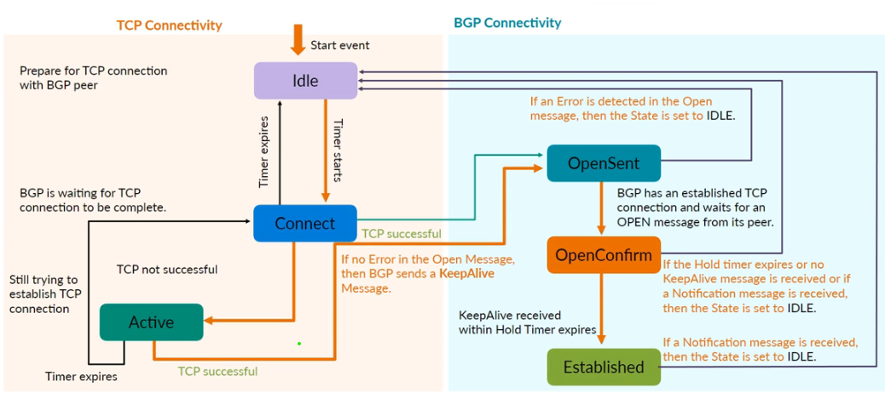
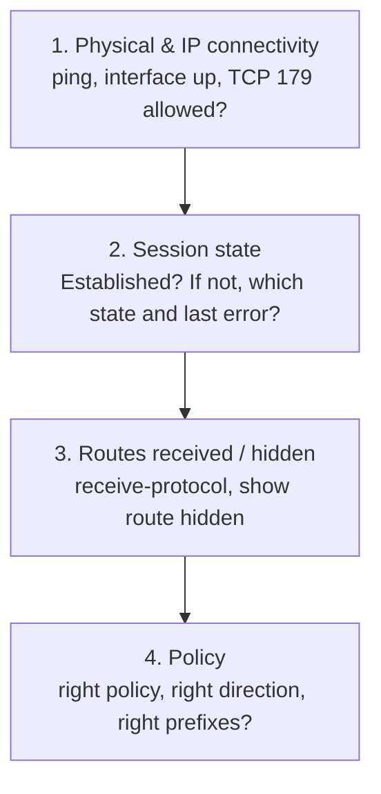

# BGP Complete Study Guide (Junos)

**A comprehensive reference for JNCIS-SP / JNCIP-SP candidates**

> Study notes by [Nazirul Roslan](https://www.linkedin.com/in/nazirulroslan) · JNCIS-SP

**Contents:** [1 Concepts](#module-1-bgp-concepts-and-operation) · [2 Peering](#module-2-bgp-peering-and-adjacency) · [3 Configuration](#module-3-ibgp--ebgp-design-and-configuration) · [4 Attributes](#module-4-bgp-attributes--path-selection) · [5 Lab](#module-5-comprehensive-bgp-lab) · [6 Scaling IBGP](#module-6-full-mesh-route-reflectors-and-confederations) · [7 Security](#module-7-isp-best-practices--security) · [8 Monitoring](#module-8-monitoring--troubleshooting) · [9 Methodology](#module-9-bgp-troubleshooting-methodology) · [10 Exam Prep](#module-10-jncis-sp-exam-preparation) · [11 Case Study](#module-11-isp-network-case-study) · [12 Practice Q&A](#module-12-practice-questions--answers) · [13 Glossary](#module-13-glossary)

---

## Module 1: BGP Concepts and Operation

**Objective:** BGP's role as the inter-domain protocol, how it differs from IGPs, its key attributes, and when to use it.

### 1.1 The role of BGP

**BGP** is the standard exterior gateway protocol for exchanging reachability between **Autonomous Systems (ASes)**, groups of networks under one administrative authority. IGPs like OSPF aim for fast convergence on simple metrics inside one network; BGP is built for **scale, policy and control** between networks.

BGP is a **path-vector** protocol: each advertisement carries the list of ASes it has crossed, the **AS_PATH**. That's BGP's main loop-prevention mechanism and a key input to policy. **BGP-4** is the deployed version and introduced CIDR support, essential for keeping the internet table manageable.

### 1.2 When to use BGP

- **Multi-homing:** several upstream links, to one ISP or to several, for redundancy and traffic control.
- **Your own portable address space** that must be announced to the internet, even over one link.
- **Inside large networks:** MPLS VPNs, or splitting up large IGP domains.

A single-homed network with one ISP usually just needs a static default route.

> [!WARNING]
> **Common pitfall:** running BGP where a simple default route would do adds complexity for no benefit.

### 1.3 BGP vs. IGPs

| | BGP | IGPs (OSPF, IS-IS) |
|---|---|---|
| Goal | Policy-based routing **between** ASes | Fast, efficient paths **inside** an AS |
| Scope | Global (inter-AS) | Local (intra-AS) |
| Metric | Path attributes (AS_PATH, Local Pref...) | Simple cost |
| Scale | Extremely high (millions of routes) | Limited; needs areas/levels |
| Convergence | Relatively slow | Very fast |

### 1.4 AS numbers

- **Formats:** originally 16-bit (65,536 values); **32-bit / 4-byte** ASNs extend this to over 4.2 billion. Junos fully supports 4-byte ASNs.

| Range | Type |
|---|---|
| 1 – 64511 | Public (2-byte) |
| **64512 – 65534** | **Private (2-byte)** |
| **4200000000 – 4294967294** | **Private (4-byte)** |

Private ASNs must be stripped before routes reach the internet. On Junos, use **`remove-private`** on the EBGP session.

### 1.5 BGP scale vs. IGP limits

- The global IPv4 internet table is **well over 900,000 prefixes and still growing** (check a current source such as CIDR Report for today's figure).
- IGPs are happiest with **tens of thousands** of prefixes; push them much further and convergence and stability suffer.
- BGP handles internet scale because it is deliberately policy-driven, incremental, and runs over reliable **TCP port 179**.

> [!TIP]
> **Learner's perspective: why not OSPF for the internet?** Imagine one constantly updating map of every street in every city on Earth. That's what an IGP would attempt. BGP is more like each country (AS) telling its neighbors only about its major highways and handling its own streets internally. That hierarchy keeps the internet manageable.

---

## Module 2: BGP Peering and Adjacency

**Objective:** IBGP vs. EBGP, the finite state machine, message types, and keeping sessions stable.

### 2.1 Transport

BGP runs over **TCP port 179**, which handles reliability and retransmission so BGP doesn't have to.

### 2.2 IBGP vs. EBGP

| Peering | Between | Default TTL (Junos) | Next hop | AS_PATH |
|---|---|---|---|---|
| **EBGP** | Different ASes | **1** | Set to its own address | **Prepends** its own ASN |
| **IBGP** | Same AS | **64** | **Unchanged** | Not modified |

- **EBGP** peers are normally directly connected. If they aren't (e.g. loopback peering), you need `multihop`.
- **IBGP** peers don't need to be adjacent; they peer between loopbacks and rely on the **IGP** for reachability.

### 2.3 The IBGP split-horizon rule

The AS_PATH stops loops between ASes, but inside an AS the ASN never changes. So BGP enforces:

> **A route learned from one IBGP peer is not advertised to another IBGP peer.**

That's why IBGP normally needs a **full mesh**, and why route reflectors and confederations exist (Module 6).

### 2.4 The BGP finite state machine



```
Router A                          Router B
   |------ TCP SYN (port 179) ------>|
   |<------ SYN-ACK -----------------|
   |------- ACK -------------------->|
   |------- BGP OPEN --------------->|
   |<------ BGP OPEN ----------------|
   |<------ KEEPALIVE -------------->|
                Established
```

| State | Meaning | If stuck here... |
|---|---|---|
| **Idle** | Waiting for a start event (e.g. commit) | Peer disabled, no route to peer, or shut down by prefix limit |
| **Connect** | TCP connection attempt in progress | |
| **Active** | TCP attempt failed; listening and retrying | Flapping Connect ↔ Active = TCP problem: firewall, wrong IP, no route, missing `multihop` |
| **OpenSent** | TCP up; OPEN sent, waiting for the peer's | Parameter mismatch (e.g. wrong `peer-as`) → NOTIFICATION → Idle |
| **OpenConfirm** | Valid OPEN received; waiting for KEEPALIVE | Hold timer expiry or NOTIFICATION → Idle |
| **Established** ✅ | Session up; UPDATE, KEEPALIVE, NOTIFICATION flow | |

### 2.5 Message types

All share a 19-byte header. Junos defaults: **hold time 90 s**, keepalive every **30 s**.

| Message | Code | Purpose | Sent when |
|---|---|---|---|
| **OPEN** | 1 | Negotiate ASN, hold time, capabilities | TCP session comes up |
| **UPDATE** | 2 | Advertise or withdraw routes | Routing or policy changes |
| **NOTIFICATION** | 3 | Report an error and close the session | Invalid message, hold timer expiry... |
| **KEEPALIVE** | 4 | Heartbeat | Periodically, so the hold timer doesn't expire |
| **ROUTE-REFRESH** | 5 | Ask the peer to resend its routes, no reset | Usually after a local policy change |

### 2.6 UPDATE messages

An UPDATE describes **one set of path attributes** and lists every prefix (**NLRI**) reachable with them, so attributes aren't repeated per prefix. Prefixes stay valid until a later UPDATE replaces or withdraws them. If a neighbor fails, the router deletes everything learned from it and sends withdrawals to its other peers.

### 2.7 Route refresh and soft reconfiguration

Route Refresh (negotiated in OPEN) lets you apply policy changes without resetting sessions.

- **Import policy change:** Junos automatically sends a ROUTE-REFRESH when you commit. To trigger it by hand: `clear bgp neighbor <ip> soft-inbound`.
- **Export policy change:** Junos re-evaluates and sends the needed UPDATEs itself.

> [!IMPORTANT]
> **Avoid hard resets.** `clear bgp neighbor <ip>` tears down the TCP session and interrupts routing. Last resort only, especially on full-table sessions.

---

## Module 3: IBGP & EBGP Design and Configuration

### 3.1 The Junos BGP hierarchy

Everything lives under `[edit protocols bgp]`, with neighbors organized into **groups** that share settings.

### 3.2 Local AS and router ID

```
set routing-options autonomous-system 64512
set routing-options router-id 203.0.113.1
```

If you don't set `router-id`, Junos uses the loopback address (or the first interface address if there's no loopback address).

### 3.3 Groups and neighbors

**EBGP group**

```
set protocols bgp group EBGP-ISP type external
set protocols bgp group EBGP-ISP peer-as 65530
set protocols bgp group EBGP-ISP neighbor 198.51.100.2 description "ISP A Link"
set protocols bgp group EBGP-ISP neighbor 198.51.100.2 local-address 198.51.100.1
```

**IBGP group**

```
set protocols bgp group IBGP-Core type internal
set protocols bgp group IBGP-Core local-address 10.0.0.1
set protocols bgp group IBGP-Core neighbor 10.0.0.2
```

For `type internal`, `peer-as` is implicitly the local AS.

### 3.4 Timers

- **Hold time:** how long to wait for a KEEPALIVE/UPDATE before declaring the peer down. **Junos default 90 s.**
- **Keepalive:** one third of the hold time (30 s).

```
set protocols bgp group EBGP-PEER hold-time 90
```

The keepalive is derived from the negotiated hold time. For faster failure detection than timers allow, use **BFD** (Module 7).

### 3.5 Advertising routes: Junos default export

> [!IMPORTANT]
> The Junos BGP **default export policy advertises all active BGP routes** (subject to the IBGP split-horizon rule) and **nothing else**. Direct, static and IGP routes are **never** advertised into BGP without an explicit export policy.

To advertise your own prefix:
1. Make sure the route is **active** in the routing table.
2. Write a policy under `[edit policy-options]` that matches and accepts it.
3. Apply it as `export` on the group or neighbor.

### 3.6 Advertising a default route

```
# A default route must exist first
set routing-options static route 0.0.0.0/0 reject

set policy-options policy-statement SEND-DEFAULT term 1 from protocol static
set policy-options policy-statement SEND-DEFAULT term 1 from route-filter 0.0.0.0/0 exact
set policy-options policy-statement SEND-DEFAULT term 1 then accept
set protocols bgp group EBGP-CUSTOMER export SEND-DEFAULT
```

### 3.7 Import and export filtering

You can chain several import and export policies; they're evaluated in order.

**Defaults**
- No `import` policy → **accept everything** from the peer.
- No `export` policy → advertise **active BGP routes** only.

**Best practice on every EBGP session**
- **Import:** accept only expected prefixes, set a prefix limit, drop bogons.
- **Export:** advertise **only your own prefixes**, so you never become a transit AS by accident.

### 3.8 Multi-vendor peering

BGP is an open standard: Juniper, Cisco and others interoperate as long as parameters match. Useful to recognize when troubleshooting: on Cisco IOS, BGP lives under `router bgp <asn>`, and `network <prefix> mask <mask>` advertises a prefix that must exist exactly in the routing table.

> [!TIP]
> **Open standard advantage:** you're never locked into one vendor for inter-domain routing.

---

## Module 4: BGP Attributes & Path Selection

### 4.1 Attribute categories

| Category | Meaning | Examples |
|---|---|---|
| **Well-known mandatory** | Recognized by all, in every UPDATE | `AS_PATH`, `NEXT_HOP`, `ORIGIN` |
| **Well-known discretionary** | Recognized by all, not always present | `LOCAL_PREF`, `ATOMIC_AGGREGATE` |
| **Optional transitive** | May be unsupported; passed on anyway | `AGGREGATOR`, `COMMUNITY` |
| **Optional non-transitive** | May be unsupported; not passed on | `MED`, `ORIGINATOR_ID`, `CLUSTER_LIST` |

### 4.2 Key attributes

| Attribute | Purpose | Junos default | Preferred |
|---|---|---|---|
| **LOCAL_PREF** | Chooses the **exit** from your AS (outbound traffic). IBGP only | 100 | **Higher** |
| **AS_PATH** | Loop prevention; shorter paths preferred (influences **inbound** traffic when you prepend) | – | **Shorter** |
| **ORIGIN** | How the route entered BGP | IGP for BGP-originated, Incomplete for redistributed | **i > e > ?** |
| **MED** | Hints to a neighbor AS which entry point to use (inbound) | Missing = 0 | **Lower** |
| **COMMUNITY** | Tag that triggers policy | None | – |
| **NEXT_HOP** | Where to send traffic; **must be reachable** for the route to be active | – | Reachable |

- **NEXT_HOP:** EBGP sets it to its own address; IBGP leaves it unchanged.
- **LOCAL_PREF:** never sent to EBGP peers.

> [!NOTE]
> **MED on Junos:** by default MEDs are only compared between routes from the **same neighboring AS**, and a missing MED counts as **0** (best). `set protocols bgp path-selection always-compare-med` compares MEDs across different neighbor ASes.

### 4.3 The Junos BGP path selection process

The first step where two paths differ decides.

| # | Prefer | Influences |
|---|---|---|
| 0 | Next hop reachable (otherwise the route is hidden) | – |
| 1 | **Highest Local Preference** (default 100) | Outbound |
| 2 | **Lowest AIGP** metric, if AIGP is in use | Outbound |
| 3 | **Shortest AS_PATH** | Inbound |
| 4 | **Lowest ORIGIN** (i < e < ?) | Tie-break |
| 5 | **Lowest MED** (same neighbor AS by default) | Inbound |
| 6 | **EBGP over IBGP** | Tie-break |
| 7 | **Lowest IGP cost to the next hop** ("hot potato") | Outbound |
| 8 | For EBGP paths, keep the **currently active** path (stability) | Tie-break |
| 9 | **Lowest router ID** (or ORIGINATOR_ID) | Tie-break |
| 10 | **Shortest CLUSTER_LIST** | Tie-break |
| 11 | **Lowest peer address** | Tie-break |

> [!NOTE]
> Before BGP's own process starts, Junos compares **route preference** (BGP = 170). BGP path selection only runs among BGP paths to the same prefix.

**Mnemonic:** *"**L**overs **A**lways **O**ffer **M**arriage, **E**specially **I**f **O**ld **R**omance **P**revails"*
= **L**ocal-Pref · **A**S path · **O**rigin · **M**ED · **E**BGP > IBGP · **I**GP cost · **O**ldest/active path · **R**outer ID · **P**eer address

### 4.4 AIGP (Accumulated IGP)

**AIGP** carries IGP cost across AS boundaries so BGP can prefer paths with lower **real** internal cost.

- **How:** each speaker adds its internal IGP cost as the route propagates; BGP compares the accumulated value.
- **Where:** large MPLS / Segment Routing / data-center fabrics, or organizations running several ASNs that want end-to-end cost-aware routing.

```
set protocols bgp group IBGP-GROUP family inet labeled-unicast aigp
```

> [!NOTE]
> AIGP is only used between peers where it's explicitly enabled (it's off by default). Check the exact knobs for your Junos release.

### 4.5 Communities

Optional transitive tags that **trigger policy** rather than directly affecting path selection.

- **Standard:** 32-bit, written `ASN:VALUE` (e.g. `65100:100`).
- **Well-known:** `no-export` (don't send to EBGP peers), `no-advertise` (don't send to any peer).

```
set policy-options community NO-EXPORT-COMM members no-export
set policy-options policy-statement TAG-INTERNAL-ROUTES from protocol direct
set policy-options policy-statement TAG-INTERNAL-ROUTES then community add NO-EXPORT-COMM
set policy-options policy-statement TAG-INTERNAL-ROUTES then accept
set protocols bgp group IBGP-GROUP export TAG-INTERNAL-ROUTES
```

> [!TIP]
> **Key takeaways**
> - Path selection is deterministic and starts (after reachability) with Local Preference.
> - Missing MED = 0 on Junos; `always-compare-med` compares across neighbor ASes.
> - **Outbound** traffic: raise Local Preference with an **import** policy. **Inbound** traffic: prepend AS_PATH (or set MED) with an **export** policy.
> - AIGP lets BGP take real IGP cost into account across domains.

---

## Module 5: Comprehensive BGP Lab

### Phase 1: peering and underlay

```
   AS 65001                        AS 65002
+-----------+                 +--------------------------------+
|  +------+ |   EBGP link     |  +------+   IBGP    +------+   |
|  | vMX1 |-|-----------------|--| vMX2 |-----------| vMX3 |   |
|  |1.1.1.1| | 192.168.12.0/24|  |2.2.2.2| OSPF area0|3.3.3.3|  |
|  +------+ |                 |  +------+ 172.16.23.0/24 +------+ |
+-----------+                 +--------------------------------+
```

| Router | Interface | Address |
|---|---|---|
| vMX1 | ge-0/0/0.0 | 192.168.12.1/24 |
| vMX1 | lo0.0 | 1.1.1.1/32 |
| vMX2 | ge-0/0/0.0 | 192.168.12.2/24 |
| vMX2 | ge-0/0/1.0 | 172.16.23.2/24 |
| vMX2 | lo0.0 | 2.2.2.2/32 |
| vMX3 | ge-0/0/1.0 | 172.16.23.3/24 |
| vMX3 | lo0.0 | 3.3.3.3/32 |

**vMX1 (AS 65001)**

```
set system host-name vMX1
set interfaces ge-0/0/0 unit 0 family inet address 192.168.12.1/24
set interfaces lo0 unit 0 family inet address 1.1.1.1/32
set routing-options router-id 1.1.1.1
set routing-options autonomous-system 65001
set protocols bgp group EBGP-TO-VMX2 type external
set protocols bgp group EBGP-TO-VMX2 peer-as 65002
set protocols bgp group EBGP-TO-VMX2 neighbor 192.168.12.2
```

**vMX2 (AS 65002, border)**

```
set system host-name vMX2
set interfaces ge-0/0/0 unit 0 family inet address 192.168.12.2/24
set interfaces ge-0/0/1 unit 0 family inet address 172.16.23.2/24
set interfaces lo0 unit 0 family inet address 2.2.2.2/32
set routing-options router-id 2.2.2.2
set routing-options autonomous-system 65002
set protocols ospf area 0.0.0.0 interface ge-0/0/1.0
set protocols ospf area 0.0.0.0 interface lo0.0 passive
set protocols bgp group EBGP-TO-VMX1 type external
set protocols bgp group EBGP-TO-VMX1 peer-as 65001
set protocols bgp group EBGP-TO-VMX1 neighbor 192.168.12.1
set protocols bgp group IBGP-TO-VMX3 type internal
set protocols bgp group IBGP-TO-VMX3 local-address 2.2.2.2
set protocols bgp group IBGP-TO-VMX3 neighbor 3.3.3.3
```

**vMX3 (AS 65002, core)**

```
set system host-name vMX3
set interfaces ge-0/0/1 unit 0 family inet address 172.16.23.3/24
set interfaces lo0 unit 0 family inet address 3.3.3.3/32
set routing-options router-id 3.3.3.3
set routing-options autonomous-system 65002
set protocols ospf area 0.0.0.0 interface ge-0/0/1.0
set protocols ospf area 0.0.0.0 interface lo0.0 passive
set protocols bgp group IBGP-TO-VMX2 type internal
set protocols bgp group IBGP-TO-VMX2 local-address 3.3.3.3
set protocols bgp group IBGP-TO-VMX2 neighbor 2.2.2.2
```

**Verify on vMX2:** both sessions `Establ`, and vMX3's loopback reachable via OSPF.

```
user@vMX2> show bgp summary
Peer            AS     InPkt  OutPkt  OutQ  Flaps  Last Up/Dwn  State
192.168.12.1    65001     10      12     0      0       3:15    Establ
3.3.3.3         65002      8       9     0      0       2:45    Establ

user@vMX2> show route 3.3.3.3
3.3.3.3/32   *[OSPF/10] 00:05:10, metric 1
              > to 172.16.23.3 via ge-0/0/1.0
```

### Phase 2: advertisement and the next-hop problem

**The problem:** vMX2 learns vMX1's routes with next hop `192.168.12.1`. When it passes them to vMX3 over IBGP, the next hop is **unchanged**. vMX3 has no route to `192.168.12.1`, so the route is **hidden**.

**On vMX1, advertise its loopback:**

```
set policy-options policy-statement ADV-LO0 term 1 from protocol direct
set policy-options policy-statement ADV-LO0 term 1 from route-filter 1.1.1.1/32 exact
set policy-options policy-statement ADV-LO0 term 1 then accept
set protocols bgp group EBGP-TO-VMX2 export ADV-LO0
```

**Before the fix, on vMX3:**

```
user@vMX3> show route 1.1.1.1/32 hidden extensive
1.1.1.1/32 (1 entry, 0 announced)
         BGP    Preference: 170
                Next hop: 192.168.12.1 (unresolved)
                State: <Hidden Int Ext>
                AS path: 65001 I
```

**The fix, on vMX2: next-hop self toward IBGP**

```
set policy-options policy-statement NHS term 1 from protocol bgp
set policy-options policy-statement NHS term 1 from route-type external
set policy-options policy-statement NHS term 1 then next-hop self
set protocols bgp group IBGP-TO-VMX3 export NHS
```

> [!NOTE]
> The NHS term has no `accept`. `next-hop self` modifies the route, and evaluation falls through to BGP's default export policy, which advertises active BGP routes. That's usually what you want: EBGP-learned routes get vMX2 as next hop and still get advertised.

**After the fix, on vMX3:**

```
user@vMX3> show route 1.1.1.1/32 extensive
1.1.1.1/32 (1 entry, 1 announced)
        *BGP    Preference: 170, LocalPref: 100
                AS path: 65001 I
                Protocol next hop: 2.2.2.2
                  to 172.16.23.2 via ge-0/0/1.0
```

Alternatively, advertise the EBGP link subnet into the IGP (as a passive OSPF interface on vMX2) so the original next hop resolves.

### Phase 3: traffic engineering with attributes

```
   AS 65001                          AS 65100
 +---------+       EBGP        +------------------------------+
 |  ISP_1  |-------------------|  R2 ---------- IBGP ---- R1  |
 |11.1.1.1 |  10.1.10.0/24     | 2.2.2.2  10.1.12.0/24 1.1.1.1|
 +---------+                   +---|--------------------------+
                                   | EBGP 10.1.20.0/24
                              +---------+
                              |  ISP_2  |  AS 65002
                              |22.2.2.2 |
                              +---------+
```

| Router | Interface | Address |
|---|---|---|
| ISP_1 | ge-0/0/0.0 / lo0.0 | 10.1.10.1/24 / 11.1.1.1/32 |
| ISP_2 | ge-0/0/0.0 / lo0.0 | 10.1.20.1/24 / 22.2.2.2/32 |
| R2 | ge-0/0/0.0 (to ISP_1) | 10.1.10.2/24 |
| R2 | ge-0/0/1.0 (to ISP_2) | 10.1.20.2/24 |
| R2 | ge-0/0/2.0 (to R1) | 10.1.12.2/24 |
| R2 | lo0.0 | 2.2.2.2/32 |
| R1 | ge-0/0/0.0 / lo0.0 | 10.1.12.1/24 / 1.1.1.1/32 |

**Goals**
- **Outbound:** prefer ISP_1 → raise Local Preference on routes **imported** from ISP_1.
- **Inbound:** make ISP_2 the backup → **prepend** on routes **exported** to ISP_2.
- **Never be a transit AS:** only advertise our own prefixes to either ISP.

**Base configuration**

```
# ---------- ISP_1 (AS 65001) ----------
set interfaces lo0 unit 0 family inet address 11.1.1.1/32
set interfaces ge-0/0/0 unit 0 family inet address 10.1.10.1/24
set routing-options autonomous-system 65001
set routing-options static route 0.0.0.0/0 reject
set policy-options policy-statement ADVERTISE-DEFAULT from protocol static
set policy-options policy-statement ADVERTISE-DEFAULT from route-filter 0.0.0.0/0 exact
set policy-options policy-statement ADVERTISE-DEFAULT then accept
set protocols bgp group EBGP-R2 type external
set protocols bgp group EBGP-R2 peer-as 65100
set protocols bgp group EBGP-R2 neighbor 10.1.10.2
set protocols bgp group EBGP-R2 export ADVERTISE-DEFAULT

# ---------- ISP_2 (AS 65002) ----------
set interfaces lo0 unit 0 family inet address 22.2.2.2/32
set interfaces ge-0/0/0 unit 0 family inet address 10.1.20.1/24
set routing-options autonomous-system 65002
set routing-options static route 0.0.0.0/0 reject
set policy-options policy-statement ADVERTISE-DEFAULT from protocol static
set policy-options policy-statement ADVERTISE-DEFAULT from route-filter 0.0.0.0/0 exact
set policy-options policy-statement ADVERTISE-DEFAULT then accept
set protocols bgp group EBGP-R2 type external
set protocols bgp group EBGP-R2 peer-as 65100
set protocols bgp group EBGP-R2 neighbor 10.1.20.2
set protocols bgp group EBGP-R2 export ADVERTISE-DEFAULT

# ---------- R1 (AS 65100) ----------
set interfaces lo0 unit 0 family inet address 1.1.1.1/32
set interfaces ge-0/0/0 unit 0 family inet address 10.1.12.1/24
set routing-options autonomous-system 65100
set routing-options router-id 1.1.1.1
set protocols ospf area 0.0.0.0 interface ge-0/0/0.0
set protocols ospf area 0.0.0.0 interface lo0.0 passive
set policy-options policy-statement ADV-LO0 from protocol direct
set policy-options policy-statement ADV-LO0 from route-filter 1.1.1.1/32 exact
set policy-options policy-statement ADV-LO0 then accept
set protocols bgp group IBGP-R2 type internal
set protocols bgp group IBGP-R2 local-address 1.1.1.1
set protocols bgp group IBGP-R2 neighbor 2.2.2.2
set protocols bgp group IBGP-R2 export ADV-LO0

# ---------- R2 (AS 65100) ----------
set interfaces lo0 unit 0 family inet address 2.2.2.2/32
set interfaces ge-0/0/0 unit 0 family inet address 10.1.10.2/24
set interfaces ge-0/0/1 unit 0 family inet address 10.1.20.2/24
set interfaces ge-0/0/2 unit 0 family inet address 10.1.12.2/24
set routing-options autonomous-system 65100
set routing-options router-id 2.2.2.2
set protocols ospf area 0.0.0.0 interface ge-0/0/2.0
set protocols ospf area 0.0.0.0 interface lo0.0 passive
set protocols bgp group EBGP-ISP1 type external
set protocols bgp group EBGP-ISP1 peer-as 65001
set protocols bgp group EBGP-ISP1 neighbor 10.1.10.1
set protocols bgp group EBGP-ISP2 type external
set protocols bgp group EBGP-ISP2 peer-as 65002
set protocols bgp group EBGP-ISP2 neighbor 10.1.20.1
set protocols bgp group IBGP-R1 type internal
set protocols bgp group IBGP-R1 local-address 2.2.2.2
set protocols bgp group IBGP-R1 neighbor 1.1.1.1
set policy-options policy-statement NHS term 1 then next-hop self
set protocols bgp group IBGP-R1 export NHS
```

**Traffic-engineering policies on R2**

```
# Only our own routes (empty AS path) may go to the ISPs
set policy-options as-path LOCAL "()"

# OUTBOUND: prefer ISP_1
set policy-options policy-statement PREFER-ISP1 term main then local-preference 200
set policy-options policy-statement PREFER-ISP1 term main then accept

# To ISP_1: our routes only
set policy-options policy-statement TO-ISP1 term ours from as-path LOCAL
set policy-options policy-statement TO-ISP1 term ours then accept
set policy-options policy-statement TO-ISP1 term rest then reject

# INBOUND: make ISP_2 the backup (prepend), our routes only
set policy-options policy-statement DEPREFER-VIA-ISP2 term ours from as-path LOCAL
set policy-options policy-statement DEPREFER-VIA-ISP2 term ours then as-path-prepend "65100 65100"
set policy-options policy-statement DEPREFER-VIA-ISP2 term ours then accept
set policy-options policy-statement DEPREFER-VIA-ISP2 term rest then reject

set protocols bgp group EBGP-ISP1 import PREFER-ISP1
set protocols bgp group EBGP-ISP1 export TO-ISP1
set protocols bgp group EBGP-ISP2 export DEPREFER-VIA-ISP2
```

> [!WARNING]
> Without the `term rest then reject`, the default BGP export policy would pass ISP_1's routes to ISP_2 (and vice versa), turning your network into a **transit AS**.

**Verify outbound, on R1:** both defaults arrive; ISP_1's wins on Local Preference.

```
user@R1> show route 0.0.0.0/0
0.0.0.0/0     *[BGP/170] 00:15:30, localpref 200, from 2.2.2.2
                 AS path: 65001 I
               > to 10.1.12.2 via ge-0/0/0.0
```

The ISP_2 default (Local Preference 100) loses at step 1, so R2 doesn't advertise it to R1 at all, since BGP only advertises its **best** path.

**Verify inbound, on ISP_2:** R1's loopback carries a longer AS path.

```
user@ISP_2> show route 1.1.1.1/32
1.1.1.1/32    *[BGP/170] 00:10:05, localpref 100
                 AS path: 65100 65100 65100 I
               > to 10.1.20.2 via ge-0/0/0.0
```

Networks beyond ISP_2 see a three-AS path through ISP_2, versus one AS through ISP_1, so they prefer ISP_1 to reach you.

---

## Module 6: Full Mesh, Route Reflectors, and Confederations

### 6.1 The IBGP scaling problem

A full mesh of **N** IBGP routers needs **N × (N − 1) / 2** sessions: 10 routers → 45 sessions. Route reflection and confederations reduce that.

### 6.2 Full mesh (baseline)

Every IBGP router peers with every other.

| Pros | Cons |
|---|---|
| No extra complexity or new rules | Doesn't scale; hard to manage |

### 6.3 Route reflectors (RR)

An RR **reflects** IBGP routes to its **clients**, relaxing the split-horizon rule. Routers are grouped into **clusters**, each with one or more RRs.

**Reflection rules**

| Route learned from | Reflected to |
|---|---|
| A **client** | All other clients **and** all non-clients |
| A **non-client** | **Clients only** |
| An **EBGP** peer | Everyone (clients and non-clients) |

**Loop prevention**
- **ORIGINATOR_ID:** router ID of the router that first injected the route into the AS.
- **CLUSTER_LIST:** cluster IDs the route has passed through.

On Junos, configuring `cluster <id>` on a group makes every neighbor in that group a client:

```
set protocols bgp group IBGP-CLUSTER type internal
set protocols bgp group IBGP-CLUSTER cluster 192.0.2.1
set protocols bgp group IBGP-CLUSTER neighbor 10.0.0.2
set protocols bgp group IBGP-CLUSTER neighbor 10.0.0.3
```

| Pros | Cons |
|---|---|
| Far fewer sessions; hierarchical scaling | Can cause suboptimal routing; a single RR is a single point of failure |

**Best practice:** deploy redundant RRs, with clients peering to both.

### 6.4 Confederations

Split one AS into several **sub-ASes**. Between sub-ASes you run EBGP-like sessions; to the outside world it all looks like **one AS**. Inside each sub-AS you still need a full mesh or RRs.

```
# Router in sub-AS 65001, confederation 65000
set routing-options autonomous-system 65001
set routing-options confederation 65000 members [ 65001 65002 65003 ]

# Peering to sub-AS 65002
set protocols bgp group TO-SUB-AS-65002 type external
set protocols bgp group TO-SUB-AS-65002 peer-as 65002
set protocols bgp group TO-SUB-AS-65002 neighbor 10.0.12.2
```

| Pros | Cons |
|---|---|
| Smaller meshes; per-sub-AS policy | More complex; every router must know the structure; harder to troubleshoot |

### 6.5 BGP multipath

Install several equal EBGP paths for load sharing:

```
set protocols bgp group EBGP-UPSTREAMS multipath
```

Add a forwarding-table load-balance policy so the PFE actually uses them all.

### 6.6 BGP Flowspec

Flowspec distributes **traffic filtering rules** through BGP, e.g. to stop a DDoS quickly across the network. On Junos, flow routes are defined under `routing-options flow`:

```
# Drop TCP traffic to port 80 for 203.0.113.10
set routing-options flow route BLOCK-WEB match destination 203.0.113.10/32
set routing-options flow route BLOCK-WEB match protocol tcp
set routing-options flow route BLOCK-WEB match destination-port 80
set routing-options flow route BLOCK-WEB then discard

# Carry flow routes over BGP
set protocols bgp group EBGP-PEERS family inet flow
```

### 6.7 RR vs. confederation

| | Route reflector | Confederation |
|---|---|---|
| Concept | Hub-and-spoke IBGP; RR reflects routes | One AS split into private sub-ASes |
| Complexity | Lower; config mostly on the RR | Higher; every router is aware |
| Loop prevention | ORIGINATOR_ID, CLUSTER_LIST | AS_CONFED segments in the AS_PATH |
| Adoption | **De facto standard** | Very large or unusual networks |

For JNCIS-SP, focus on route reflectors; know what confederations are.

### Lab 6: a route reflector

```
+----------------------- AS 65002 -----------------------+
|                    +------------+                      |
|                    |    vMX2    |                      |
|                    |    (RR)    |                      |
|                    | cluster    |                      |
|                    |  2.2.2.2   |                      |
|                    +------------+                      |
|                   /      |       \   (clients)         |
|          +--------+  +--------+  +--------+            |
|          |  vMX1  |  |  vMX3  |  |  vMX4  |            |
|          |1.1.1.1 |  |3.3.3.3 |  |4.4.4.4 |            |
|          +--------+  +--------+  +--------+            |
|          OSPF area 0 for loopback reachability         |
+--------------------------------------------------------+
```

**Base config (all routers):** loopback, router ID, AS 65002, OSPF area 0 on `lo0.0` (passive) and on the physical links. vMX4 also has `lo0.1` with `44.4.4.4/32` to advertise.

```
# vMX4 extra loopback unit
set interfaces lo0 unit 1 family inet address 44.4.4.4/32
```

**vMX2 (RR)**

```
set protocols bgp group RR-CLUSTER type internal
set protocols bgp group RR-CLUSTER local-address 2.2.2.2
set protocols bgp group RR-CLUSTER cluster 2.2.2.2
set protocols bgp group RR-CLUSTER neighbor 1.1.1.1
set protocols bgp group RR-CLUSTER neighbor 3.3.3.3
set protocols bgp group RR-CLUSTER neighbor 4.4.4.4
```

**vMX1 and vMX3 (clients)**

```
# vMX1
set protocols bgp group TO-RR type internal
set protocols bgp group TO-RR local-address 1.1.1.1
set protocols bgp group TO-RR neighbor 2.2.2.2
# vMX3
set protocols bgp group TO-RR type internal
set protocols bgp group TO-RR local-address 3.3.3.3
set protocols bgp group TO-RR neighbor 2.2.2.2
```

**vMX4 (client, advertises 44.4.4.4/32)**

```
set protocols bgp group TO-RR type internal
set protocols bgp group TO-RR local-address 4.4.4.4
set protocols bgp group TO-RR neighbor 2.2.2.2
set policy-options policy-statement ADV-LO1 from protocol direct
set policy-options policy-statement ADV-LO1 from route-filter 44.4.4.4/32 exact
set policy-options policy-statement ADV-LO1 then accept
set protocols bgp group TO-RR export ADV-LO1
```

> [!NOTE]
> The original lab put `4.4.4.4/32` on both `lo0.0` and `lo0.1`, which Junos rejects and which OSPF would already advertise anyway. A separate prefix (`44.4.4.4/32`) on `lo0.1` makes the BGP reflection visible.

**Verify on the RR:** clients recognized.

```
user@vMX2> show bgp neighbor 1.1.1.1
  Type: Internal    State: Established    Flags: <Sync>
  ...
  Cluster ID: 2.2.2.2
```

**Verify on vMX1:** the reflected route carries RR attributes.

```
user@vMX1> show route 44.4.4.4/32 extensive
44.4.4.4/32 (1 entry, 1 announced)
        *BGP    Preference: 170, LocalPref: 100
                AS path: I (Originator)
                Cluster list:  2.2.2.2
                Originator ID: 4.4.4.4
                Protocol next hop: 4.4.4.4
```

**ORIGINATOR_ID** (4.4.4.4, who injected it) and **CLUSTER_LIST** (2.2.2.2, the RR that reflected it) prove reflection works.

### Lab 7: a BGP confederation

```
+------------- Confederation AS 65000 -------------+
|                                                  |
|   Sub-AS 65001            Sub-AS 65002           |        AS 400
|  +----------+  confed    +----------+   EBGP     |      +----------+
|  |    R1    |---EBGP-----|    R3    |------------|------|   ISP    |
|  | 1.1.1.1  |            | 3.3.3.3  | 200.10.10.0/30    | 4.4.4.4  |
|  +----------+            +----------+            |      +----------+
|       | IBGP                                     |
|  +----------+                                    |
|  |    R2    |                                    |
|  | 2.2.2.2  |                                    |
|  +----------+                                    |
+--------------------------------------------------+
```

| Router | Interface | Address | AS |
|---|---|---|---|
| R1 | ge-0/0/0.0 / lo0.0 | 10.0.0.1/24 / 1.1.1.1/32 | 65001 |
| R2 | ge-0/0/0.0 / lo0.0 | 10.0.0.2/24 / 2.2.2.2/32 | 65001 |
| R3 | ge-0/0/0.0 / lo0.0 | 10.0.0.3/24 / 3.3.3.3/32 | 65002 |
| R3 | ge-0/0/1.0 | 200.10.10.1/30 | 65002 |
| ISP | ge-0/0/1.0 / lo0.0 | 200.10.10.2/30 / 4.4.4.4/32 | 400 |

**R1 and R2 (sub-AS 65001)**

```
# R1
set routing-options autonomous-system 65001
set routing-options confederation 65000 members [ 65001 65002 ]
set protocols bgp group CONFED-TO-R3 type external
set protocols bgp group CONFED-TO-R3 peer-as 65002
set protocols bgp group CONFED-TO-R3 neighbor 10.0.0.3
set protocols bgp group IBGP-INTERNAL type internal
set protocols bgp group IBGP-INTERNAL local-address 1.1.1.1
set protocols bgp group IBGP-INTERNAL neighbor 2.2.2.2

# R2
set routing-options autonomous-system 65001
set routing-options confederation 65000 members [ 65001 65002 ]
set protocols bgp group IBGP-INTERNAL type internal
set protocols bgp group IBGP-INTERNAL local-address 2.2.2.2
set protocols bgp group IBGP-INTERNAL neighbor 1.1.1.1
```

**R3 (sub-AS 65002)**

```
set routing-options autonomous-system 65002
set routing-options confederation 65000 members [ 65001 65002 ]
set protocols bgp group TO-SUBAS-65001 type external
set protocols bgp group TO-SUBAS-65001 peer-as 65001
set protocols bgp group TO-SUBAS-65001 neighbor 10.0.0.1
set protocols bgp group TO-ISP type external
set protocols bgp group TO-ISP peer-as 400
set protocols bgp group TO-ISP neighbor 200.10.10.2
```

**ISP (AS 400)**: it only ever sees AS **65000**:

```
set routing-options autonomous-system 400
set routing-options static route 0.0.0.0/0 reject
set protocols bgp group TO-R3 type external
set protocols bgp group TO-R3 peer-as 65000
set protocols bgp group TO-R3 neighbor 200.10.10.1
set policy-options policy-statement SEND-DEFAULT term 1 from protocol static
set policy-options policy-statement SEND-DEFAULT term 1 from route-filter 0.0.0.0/0 exact
set policy-options policy-statement SEND-DEFAULT term 1 then accept
set protocols bgp group TO-R3 export SEND-DEFAULT
```

> [!NOTE]
> Sub-AS routers peer over directly connected interface addresses here. Peering between loopbacks across sub-ASes would need `multihop`, like any other EBGP session.

**Verify on R1**

```
user@R1> show bgp summary
Peer        AS     InPkt  OutPkt  OutQ  Flaps  Last Up/Dwn  State
2.2.2.2     65001     20      22     0      0     15:12     Establ
10.0.0.3    65002     18      19     0      0     14:57     Establ

user@R1> show bgp neighbor 10.0.0.3
Peer: 10.0.0.3+179 AS 65002    Local: 10.0.0.1+50123 AS 65001
  Type: External    State: Established
  ...
```

Routes crossing sub-ASes show the sub-AS numbers in parentheses in the AS path, e.g. `(65002) 400 I`: the AS_CONFED_SEQUENCE.

---

## Module 7: ISP Best Practices & Security

### 7.1 Session security

**MD5 authentication** protects against TCP reset and session hijacking:

```
set protocols bgp group EBGP-PEER neighbor 1.2.3.4 authentication-key "MySecretKey"
```

**TTL security (GTSM)** accepts BGP packets from directly connected peers only if they arrive with TTL 255, so attackers further away can't inject packets. Both sides send with TTL 255 (Junos `ttl 255` sets the TTL of outgoing packets), and the receiving side checks the TTL, on Junos typically with a firewall filter on `lo0` that matches `ttl 255` for TCP/179 from the peer.

```
set protocols bgp group EBGP-PEER neighbor 1.2.3.4 ttl 255
```

### 7.2 Prefix filtering and hygiene

**Customer prefix filtering:** only accept what the customer is allowed to announce.

```
set policy-options prefix-list CUSTOMER-A-PREFIXES 203.0.113.0/24
set policy-options policy-statement FROM-CUSTOMER-A term 1 from prefix-list CUSTOMER-A-PREFIXES
set policy-options policy-statement FROM-CUSTOMER-A term 1 then accept
set policy-options policy-statement FROM-CUSTOMER-A term 2 then reject
set protocols bgp group CUSTOMER-A import FROM-CUSTOMER-A
```

**Maximum prefix limits:** protect memory and CPU if a peer leaks a full table.

```
set protocols bgp group CUSTOMER-A family inet unicast prefix-limit maximum 10
set protocols bgp group CUSTOMER-A family inet unicast prefix-limit teardown 80
```

`teardown 80` warns at 80% and tears the session down when the limit is exceeded.

### 7.3 RPKI route origin validation

RPKI cryptographically checks that an AS is authorized to originate a prefix: a key defense against hijacks. After configuring a connection to an RPKI validator (`routing-options validation`):

```
set policy-options policy-statement RPKI-VALIDATION term valid from validation-database valid
set policy-options policy-statement RPKI-VALIDATION term valid then validation-state valid
set policy-options policy-statement RPKI-VALIDATION term valid then accept
set policy-options policy-statement RPKI-VALIDATION term invalid from validation-database invalid
set policy-options policy-statement RPKI-VALIDATION term invalid then validation-state invalid
set policy-options policy-statement RPKI-VALIDATION term invalid then reject
set policy-options policy-statement RPKI-VALIDATION term unknown then accept
set protocols bgp group EBGP-PEER import RPKI-VALIDATION
```

This rejects **invalid** routes and accepts **valid** and **unknown** ones, so prefixes not yet covered by RPKI keep working.

### 7.4 Preventing transit routing

A multi-homed AS must never pass one ISP's routes to another. Only advertise routes that originate in your AS; these have an **empty AS path**:

```
set policy-options as-path LOCAL "()"
set policy-options policy-statement NO-TRANSIT term ours from as-path LOCAL
set policy-options policy-statement NO-TRANSIT term ours then accept
set policy-options policy-statement NO-TRANSIT term rest then reject
set protocols bgp group EBGP-PEER-B export NO-TRANSIT
```

Anything learned from another AS has a non-empty AS path and is rejected.

### 7.5 Stability: timers and BFD

- **Hold time 90 s** (keepalive 30 s) is the Junos default and a sensible balance.
- **BFD** detects failures in well under a second and tells BGP immediately instead of waiting for the hold timer. Recommended on critical links.

```
set protocols bgp group EBGP-PEER bfd-liveness-detection minimum-interval 300
set protocols bgp group EBGP-PEER bfd-liveness-detection multiplier 3
```

### 7.6 Peering agreements and communities

Business relationships (customer, peer, transit) drive routing policy, and **communities** enforce it at scale:

- **Tag on ingress:** mark routes by source (customer, peer, transit) and location.
- **Act on tags:** e.g. customers' routes get higher Local Preference than peers' routes.
- **Customer control:** many ISPs publish communities customers can send to lower Local Preference or restrict where a prefix is advertised.

---

## Module 8: Monitoring & Troubleshooting

### 8.1 Command cheat sheet

| Command | Purpose |
|---|---|
| `show bgp summary` | All peers, state, uptime, prefix counts. **Start here** |
| `show bgp neighbor <ip>` | One peer in detail: state, timers, options, last error, negotiated capabilities |
| `show route receive-protocol bgp <ip>` | Routes received from the peer, **before** import policy |
| `show route advertising-protocol bgp <ip>` | Routes sent to the peer, **after** export policy |
| `show route hidden` | Routes present but not usable, often an unresolved next hop |
| `monitor traffic interface <if>` | Live capture: are BGP TCP packets flowing? |

### 8.2 Pitfalls and best practices

> [!WARNING]
> **Common pitfalls**
> - **Unresolved next hop:** the most common IBGP issue. Make sure the IGP reaches the next hop, or use `next-hop self`.
> - **Silent policy rejection:** a policy quietly dropping everything. Compare `receive-protocol` (pre-policy) with `show route` (post-policy).
> - **AS mismatch:** a typo in `peer-as` makes the session fail at OpenSent.
> - **TCP 179 blocked:** the classic "stuck in Active".

> [!TIP]
> **Best practices**
> - Separate groups per peer type (IBGP, transit, customers).
> - IBGP between loopbacks.
> - Explicit import and export policies on every EBGP session.
> - Log state changes: `set protocols bgp log-updown`.

---

## Module 9: BGP Troubleshooting Methodology

Work up the stack:



```
# 1. Connectivity
> ping <neighbor>
> show interfaces terse | match <interface>

# 2. Session state
> show bgp summary
> show bgp neighbor <ip> | match "State|Last Error"

# 3. Reception
> show route receive-protocol bgp <ip>
> show route hidden

# 4. Policy
> show configuration protocols bgp | display set
> show route advertising-protocol bgp <ip>
```

### Common adjacency failures

| Symptom | Likely causes |
|---|---|
| **Stuck in Idle** | BGP or peer deactivated, no route to the peer, interface down, or shut down by a prefix limit |
| **Stuck in Active** (flapping with Connect) | TCP can't complete: firewall on 179, wrong source/destination address, missing `multihop` |
| **Flapping** (Established ↔ Idle) | `peer-as` or authentication mismatch, hold timer expiring (CPU, congestion), unstable link |

---

## Module 10: JNCIS-SP Exam Preparation

### Top exam traps

> [!WARNING]
> 1. **The hidden route:** a prefix missing from `inet.0`? First suspect an **unreachable IBGP next hop**. Check `show route hidden`; the fix is `next-hop self`.
> 2. **Junos default export:** BGP advertises **active BGP routes only**. Your static, direct and IGP routes are never sent without an export policy.
> 3. **Policy direction:** to control traffic **leaving** your AS, raise Local Preference with an **import** policy. To control traffic **entering**, prepend (or set MED) with an **export** policy.
> 4. **Local Preference beats MED:** Local Pref 200 wins over Local Pref 100 even if the second path has a much better MED.
> 5. **RR rules:** an RR never reflects a route from one **non-client** to another **non-client**.

### Practice strategy

- **Mini-labs:** small focused topologies per concept (EBGP, IBGP, RR), not one giant lab.
- **Command recall:** write configs and `show` commands by hand daily.
- **Break things on purpose:** wrong `peer-as`, a reject-all policy, remove `next-hop self`, then troubleshoot methodically.

---

## Module 11: ISP Network Case Study

### Scenario 1: single-homed customer, static routing

```
  +----------------+
  |   Customer A   |   static default -> ISP A
  | 172.20.21.0/24 |
  +--------+-------+
           | static
  +--------+-------+
  |     ISP A      |   static 172.20.21.0/24 -> Customer A
  |   (AS 65001)   |   advertises only the aggregate 172.20.0.0/16
  | 172.20.0.0/16  |
  +----------------+
```

- Customer A uses a static default to ISP A.
- ISP A has a static route for the customer's /24.
- ISP A advertises only its **aggregate** `172.20.0.0/16` to peers, not the customer's /24. This keeps the global table small.

### Scenario 2: multi-homed customer with BGP

```
+----------+  BGP   +----------+  BGP   +----------+
|  ISP A   |--------|  ISP B   |--------|  ISP C   |
| AS 65001 |        | AS 65002 |        | AS 65003 |
+----------+        +----------+        +----------+
     |                    \              /
     |               BGP   \            /  BGP
+------------+           +------------+
| Customer A |           | Customer B |
|  (static)  |           |  AS 65100  |
+------------+           +------------+
```

- Customer B (AS 65100) announces its portable prefix to **ISP B** and **ISP C**.
- ISP B receives it twice: directly (`65100`) and via ISP C (`65003 65100`). It picks the **shorter AS path**, the direct one.
- ISP B advertises only its best path (`65002 65100`) to ISP A.
- If the ISP B – Customer B link fails, ISP B withdraws the direct route, switches to the path via ISP C, and updates its peers with the longer path.

---

## Module 12: Practice Questions & Answers

**Q1. What are the five BGP message types and their purpose?**

<details><summary>Answer</summary>

**OPEN** starts the session and negotiates ASN, hold time and capabilities. **KEEPALIVE** is the periodic heartbeat. **UPDATE** advertises and withdraws prefixes with their attributes. **NOTIFICATION** reports an error and closes the session. **ROUTE-REFRESH** asks the peer to resend its routes without a reset, typically after a policy change.
</details>

**Q2. A new session stays in `Active` and never reaches Established. Why, and how do you fix it?**

<details><summary>Answer</summary>

`Active` means BGP keeps retrying but **the TCP handshake doesn't complete**. Causes: no IP reachability, a firewall blocking TCP 179, a wrong neighbor or local address, or missing `multihop` for non-adjacent EBGP peers. Check with `ping` (sourced from the right address), verify the neighbor configuration on both sides, and check filters. A wrong `peer-as` shows up later, at OpenSent, once TCP is up.
</details>

**Q3. Which attribute do you change to influence traffic leaving your AS, and how?**

<details><summary>Answer</summary>

**Local Preference.** Apply an **import** policy that sets a higher value (e.g. 200 vs. the default 100) on routes from the preferred upstream. Every router in your AS then prefers that exit.
</details>

---

## Module 13: Glossary

| Term | Meaning |
|---|---|
| AIGP | Optional attribute carrying accumulated IGP cost across AS boundaries |
| AS | Networks under one administrative domain, identified by an ASN |
| AS_PATH | Mandatory attribute listing the ASes a route crossed; main loop prevention |
| BFD | Lightweight protocol for fast failure detection |
| CLUSTER_LIST | RR attribute listing the clusters a route passed through; prevents RR loops |
| Community | Optional transitive tag used to group routes for policy |
| Confederation | One AS split into private sub-ASes to scale IBGP |
| EBGP | BGP between different ASes |
| Graceful restart | Keeps forwarding during a routing-process restart |
| IBGP | BGP within one AS |
| Local Preference | Chooses the exit from your AS; higher wins; IBGP only |
| MED | Suggests a preferred entry point to a neighbor AS; lower wins; non-transitive |
| Next-hop self | Border router sets itself as next hop on routes it passes to IBGP peers |
| NLRI | The prefixes carried in an UPDATE |
| ORIGINATOR_ID | RR attribute naming the router that injected the route into the AS |
| Peering agreement | Business terms for exchanging traffic between ASes |
| Route reflector | Relaxes IBGP split horizon to avoid a full mesh |
| RPKI | Cryptographic validation of which AS may originate a prefix |
