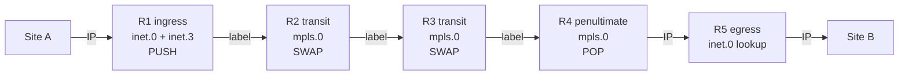

# The Mechanics of MPLS

**Label structure, router roles, the Junos tables behind the data plane, reserved labels and the four transport protocols**

> Study notes by [Nazirul Roslan](https://www.linkedin.com/in/nazirulroslan) · Junos MPLS Fundamentals · Part 02

← [Previous: Introduction to MPLS](01-mpls-fundamentals.md) · [Index](../README.md) · [Next: Static LSPs and the Forwarding Plane](03-static-lsps-forwarding-plane.md) →

**Contents:** [1 Label Structure](#module-1-the-structure-of-an-mpls-label) · [2 Roles & Actions](#module-2-mpls-router-roles-and-label-actions) · [3 Data Plane](#module-3-the-data-plane-across-a-label-switched-path) · [4 Reserved Labels](#module-4-implicit-null-explicit-null-and-reserved-labels) · [5 Transport Protocols](#module-5-the-four-mpls-transport-protocols) · [6 Exam Prep](#module-6-jncis-sp-exam-preparation) · [7 Glossary](#module-7-glossary)

---

## Module 1: The Structure of an MPLS Label

**Objective:** describe the structure and fields of an MPLS label and its header.

### 1.1 The MPLS shim header

MPLS works by adding a small header to a packet. This **MPLS shim header** carries a number called a **label**. Instead of a complex IP lookup, routers in the middle of the network (transit routers) forward based only on this label value.

The shim header is **32 bits (4 bytes)** long and sits **between the Layer 2 header (e.g. Ethernet) and the Layer 3 header (e.g. IP)**. That position is why MPLS is often called a **"Layer 2.5" protocol**.

> [!TIP]
> **Learner's perspective: a VIP pass.** An MPLS label is like a VIP wristband at a concert. Security doesn't check your full ID at every checkpoint; they glance at the wristband and wave you through to the next section. The label tells core routers where the packet goes without them reading the final destination address.

### 1.2 Anatomy of the 32-bit header

```
+-----------+---------------------------------------------+-----------+
| L2 Header |                 MPLS Header                 | L3 Header |
|           +---------------------+--------+-----+--------+           |
|           |       Label         |   TC   |  S  |  TTL   |           |
|           |      20 bits        | 3 bits |1 bit| 8 bits |           |
+-----------+---------------------+--------+-----+--------+-----------+
```

| Field | Size | Purpose |
|---|---|---|
| **Label** | 20 bits | The core of the header. A value from **0 to 1,048,575** that identifies the path the packet should take. **Labels 0–15 are reserved** for special functions. |
| **Traffic Class (TC)** | 3 bits | Quality of Service. 3 bits give **8 classes of service** for differentiated treatment (voice, video, best-effort). Formerly called the **Experimental (EXP)** bits. |
| **Bottom of Stack (S)** | 1 bit | **S=1**: this is the last label in the stack. **S=0**: at least one more MPLS header follows. Essential for services like MPLS VPNs that use several labels. |
| **Time to Live (TTL)** | 8 bits | Loop prevention, same job as the IP TTL. Decremented by one at each hop; the packet is dropped at zero. By default the **IP TTL is copied into the MPLS TTL** when the packet enters an LSP. |

### 1.3 Locally significant labels

MPLS labels have **local significance**. The label value for an LSP is chosen by the **downstream** router and only means something on the link between two adjacent routers.

Each router tells its upstream neighbour: "to send me traffic for this destination, use label X". The upstream neighbour then swaps its incoming label to X. Because each router decides independently, the label value for one LSP almost always changes at every hop. As an operator you rarely need to care about the actual numbers; the routers handle signalling and assignment.

### Key takeaways

> [!IMPORTANT]
> The 32-bit MPLS shim header is a "Layer 2.5" identifier: a **20-bit label**, **3 TC bits** for QoS, **1 S bit** for stacking and an **8-bit TTL** for loop prevention. Labels are **locally significant** and allocated by the **downstream** router.

---

## Module 2: MPLS Router Roles and Label Actions

**Objective:** define the router roles within an LSP and describe the three fundamental label operations.

### 2.1 Router roles in a Label-Switched Path

Within a single, **unidirectional** LSP, routers play specific roles. The roles are **per LSP**: one device can play different roles for different LSPs at the same time.

```
[Site A] --- R1 (Ingress) --- R2 (Transit) --- R3 (Transit) --- R4 (Transit) --- R5 (Egress) --- [Site B]
               |                                                                    |
               +--------------------[ Label-Switched Path (LSP) ]-------------------+
```

| Role | Also called | What it does | Example |
|---|---|---|---|
| **Ingress** | Head-end | Receives an unlabelled packet (e.g. plain IP), makes a forwarding decision and **pushes** the first label, sending it into the LSP. | R1 |
| **Transit** | LSR (Label Switching Router) | Any router in the middle. Forwards **only** on the MPLS label, not the IP header, and performs a **swap**. | R2, R3, R4 |
| **Egress** | Tail-end | End of the LSP. Removes the label (**pop**) and forwards a normal packet towards its final destination. | R5 |

### 2.2 Service provider roles: P, PE and CE

| Device | Role |
|---|---|
| **Provider Edge (PE)** | The intelligent border of the provider network. Connects to customers (CEs), runs BGP, applies policy, and is the ingress/egress point for LSPs. |
| **Provider (P)** | A core router acting purely as a transit LSR. Its only job is high-speed label switching. P routers typically don't run BGP with external peers, which gives the **BGP-free core** and reduces configuration and resource load. |
| **Customer Edge (CE)** | The customer's device. Connects to the PE and is completely unaware of the MPLS network behind it. |

### 2.3 The three fundamental label actions

| Action | Meaning | Performed by |
|---|---|---|
| **PUSH** | Add a label to an unlabelled packet | Ingress router |
| **SWAP** | Replace the incoming label with a new outgoing label | Transit routers |
| **POP** | Remove the label | Egress router (or, more commonly, the router before it) |

> [!IMPORTANT]
> **Key concept: Penultimate Hop Popping (PHP).** By default the label is popped by the **penultimate** (second-to-last) router, not the egress. Without PHP the egress would do two lookups: one on the label (only to discover it's the end of the LSP) and another on the IP header. With PHP the egress receives a plain IP packet and does a single IP lookup.

> [!NOTE]
> Junos also supports **ultimate hop popping** (UHP): the egress signals a real label and pops it itself. You'll meet this and explicit null in Module 4.

### Key takeaways

You can now identify routers as ingress, transit or egress and map them to P/PE/CE. You know the three label actions (push, swap, pop) and the PHP optimisation. Next: a packet's complete journey and the Junos tables that drive each decision.

---

## Module 3: The Data Plane Across a Label-Switched Path

**Objective:** describe a packet's end-to-end journey and the roles of the `inet.0`, `inet.3` and `mpls.0` tables in Junos.

### 3.1 The journey begins: the ingress router

Follow a packet from Site A to Site B. The ingress PE (R1) receives a standard IP packet for a host at Site B.

1. R1 looks up the destination (e.g. `203.0.113.1`) in its main routing table, **`inet.0`**.
2. It finds `203.0.113.0/24`, learned via BGP with next hop R5 (R5's loopback `192.168.1.5`).
3. R1 must now resolve how to reach the BGP next hop. It has two possible sources:
   - an IGP route (IS-IS or OSPF) in **`inet.0`**
   - an MPLS LSP in the special table **`inet.3`**
4. Junos considers both and uses the path with the best (lowest) **route preference**.

### 3.2 Junos routing tables and the `inet.3` tie-breaker

MPLS signalling protocols have a more preferred (lower) route preference than the IGPs:

| Protocol | Junos route preference | More preferred? |
|---|---|---|
| RSVP | **7** | ✔✔✔ |
| LDP | **9** | ✔✔ |
| OSPF internal | 10 | ✔ |
| IS-IS Level 1 internal | 15 | |
| IS-IS Level 2 internal | 18 | |

Because of this, BGP picks the LSP in `inet.3` to resolve its next hop. The purpose of `inet.3` is to provide LSP paths to resolving protocols, primarily BGP.

`show route table inet.3` shows the LSPs for which this router is the ingress:

```
user@R1> show route table inet.3

inet.3: 3 destinations, 3 routes (3 active, 0 holddown, 0 hidden)
+ = Active Route, - = Last Active, * = Both

192.168.1.5/32     *[RSVP/7/1] 00:10:20, metric 1
                    > to 10.1.2.2 via ge-0/0/0.0, label-switched-path R1-to-R5
192.168.1.6/32     *[RSVP/7/1] 00:10:15, metric 1
                    > to 10.1.2.2 via ge-0/0/0.0, label-switched-path R1-to-R6
```

**Result of BGP next-hop resolution:** the BGP route is now resolved through the LSP, and the forwarding action is to **push** a label and send the packet into the path.

```
user@R1> show route 203.0.113.0/24 extensive

203.0.113.0/24 (1 entry, 1 announced)
*BGP    Preference: 170/-101
        Next hop type: Indirect, Next hop index: 1048575
        Address: 0x9b1a1b4
        Next-hop reference count: 2
        Source: 192.168.1.5
        Protocol next hop: 192.168.1.5
        Push 16
        Indirect next hop: 0x9e8f6c0 1048574 INH Session ID: 0x0
        State: ...
        Local AS: 65001 Peer AS: 65001
```

> [!NOTE]
> **Correction and label values.** The original output showed `Push 16, Push 299776(top)`. Two pushes means a **label stack** (for example an L3VPN service label underneath a transport label). A plain IPv4 BGP route resolved over an LSP needs only **one** transport label, so the output here shows a single push, matching the "label 16" the walkthrough follows. Also note the label values in this module (16, 20, 22, 35) are simplified for readability: Junos allocates dynamic labels (LDP, RSVP) from **299776** upwards, so on a real router you'd see six-digit values.

### 3.3 The transit path: the `mpls.0` table

The packet, now carrying label 16, reaches the first transit router, R2. Since it's already labelled, R2 doesn't look in `inet.0` or `inet.3`. It uses its label forwarding table, **`mpls.0`**, the **Label Forwarding Information Base (LFIB)**.

`mpls.0` is a simple, fast mapping: for an incoming label, what's the action, the outgoing label and the next-hop interface?

```
user@R2> show route table mpls.0

mpls.0: 10 destinations, 10 routes (10 active, 0 holddown, 0 hidden)
+ = Active Route, - = Last Active, * = Both

16                 *[LDP/9/1] 01:23:45, metric 1
                    > to 10.2.3.3 via ge-0/0/1.0, Swap 22
20                 *[RSVP/7/1] 00:15:00, metric 1
                    > to 10.2.4.4 via ge-0/0/2.0, Swap 35
```

R2 receives label 16; `mpls.0` tells it to **swap** to 22 and send out `ge-0/0/1.0` towards R3. This repeats at every transit hop.

### 3.4 The journey ends: penultimate hop popping

The packet reaches the penultimate router, R4, which looks up its incoming label in `mpls.0`. The egress (R5) has signalled R4 that it is the final hop and wants no label (the PHP mechanism).

So R4's `mpls.0` entry for this LSP has a **Pop** action. R4 removes the MPLS header and sends a plain IP packet to R5.

```
user@R4> show route table mpls.0

mpls.0: 12 destinations, 12 routes (12 active, 0 holddown, 0 hidden)
+ = Active Route, - = Last Active, * = Both

299904             *[LDP/9/1] 01:15:30, metric 1
                    > to 10.4.5.5 via ge-0/0/3.0, Pop
```

R5 receives an unlabelled IP packet, does a standard IP lookup in `inet.0`, and forwards it to Site B. The MPLS journey is complete.



### Key takeaways

> [!IMPORTANT]
> - **`inet.3`** is used by BGP for next-hop resolution on the ingress.
> - **`mpls.0`** (the LFIB) is used by transit routers for fast label switching.
> - Junos uses the LSP because MPLS protocols have a **better route preference** (RSVP 7, LDP 9) than the IGPs.

What if we *don't* want to pop the label at the penultimate hop? That's controlled by the reserved labels.

---

## Module 4: Implicit Null, Explicit Null and Reserved Labels

**Objective:** describe the key reserved labels (0–3) and how they control data-plane behaviour.

### 4.1 Reserved labels 0–15

The first 16 label values (**0–15**) are reserved by the IETF for special functions. You don't need all of them, but **0, 1, 2 and 3** are fundamental and common exam topics.

| Label | Name | Function | Reference |
|---|---|---|---|
| **0** | IPv4 Explicit NULL | Prevents PHP; a label is delivered to the egress | RFC 3032 |
| **1** | Router Alert | Tells the receiving LSR to hand the packet to its control plane (software) for inspection instead of just switching it | RFC 3032 |
| **2** | IPv6 Explicit NULL | Prevents PHP for IPv6; a label is delivered to the egress | RFC 3032 |
| **3** | Implicit NULL | Enables PHP; the label is popped by the penultimate hop | RFC 3032 |
| 4–15 | Reserved | Reserved for other or future special uses | IANA |

### 4.2 Controlling PHP: implicit vs. explicit null

**Label 3: Implicit Null (the default)**

Label 3 is a **control-plane signal, not a data-plane label**. When the egress wants the default PHP behaviour, it advertises **label 3** to its upstream neighbour (the penultimate hop).

The penultimate router reads this as: "don't use a label when sending this LSP's packets to me; pop the label instead". A packet is **never actually sent with label 3** in its header.

**Labels 0 and 2: Explicit Null (disabling PHP)**

Sometimes you need the MPLS header to reach the egress, typically for QoS, so the TC bits are preserved along the whole path. Then PHP must be disabled.

The egress advertises **label 0 (IPv4)** or **label 2 (IPv6)**. The penultimate router swaps its incoming label to 0 or 2 and forwards the labelled packet. The egress knows that label 0 or 2 means "end of LSP": it pops the label and processes the payload.

> [!TIP]
> In Junos, explicit null is enabled on the egress with `set protocols mpls explicit-null` (RSVP) or `set protocols ldp explicit-null` (LDP).

### Key takeaways

> [!IMPORTANT]
> Reserved labels 0–3 are critical signals. **Implicit Null (3)** enables the default PHP behaviour. **Explicit Null (0 for IPv4, 2 for IPv6)** disables it so a label reaches the egress router.

---

## Module 5: The Four MPLS Transport Protocols

**Objective:** summarise the four main protocols used to build LSPs, with their features and trade-offs.

### 5.1 RSVP (Resource Reservation Protocol)

The powerhouse of MPLS, known for rich **Traffic Engineering (TE)**. RSVP LSPs are explicitly configured, manually or by a controller: more admin effort, much finer control.

- **Explicit paths:** define the exact path an LSP must take, overriding the IGP shortest path.
- **Bandwidth reservation:** reserve bandwidth along a path, guaranteeing resources for critical traffic.
- **Fast Reroute (FRR):** pre-computes and pre-programs backup paths for sub-50 ms failover.
- **Link colouring / affinity:** tag links with administrative "colours" and make LSPs use or avoid them.

**Use case:** providers who need to guarantee SLAs, manage bandwidth efficiently and steer traffic away from congested links.

### 5.2 LDP (Label Distribution Protocol)

The "set it and forget it" protocol. Simple to configure, and it automatically builds a full mesh of LSPs between all LDP-enabled routers. Its key characteristic: it **always follows the IGP shortest path**.

- **Simplicity:** just enable it on the core interfaces.
- **Automatic LSP creation:** no manual LSP definitions.
- **No traffic engineering:** paths are dictated entirely by IGP metrics.

**Use case:** networks with plenty of bandwidth where the goal is MPLS services (VPNs, BGP-free core) without TE complexity.

### 5.3 Segment Routing (SR-MPLS)

A modern approach that aims to give the benefits of both RSVP and LDP with less protocol overhead. There's no separate signalling protocol: label information is carried in an extended IGP (IS-IS or OSPF).

- **Simplified control plane:** no LDP or RSVP; the IGP distributes labels.
- **Source routing for TE:** the ingress pushes a **stack** of labels that dictates the exact path, hop by hop.
- **IGP shortest path:** can also behave like LDP, following the IGP best path.

**Use case:** a flexible, scalable option for modern networks: a simpler core, with TE driven from the edge or a central controller.

### 5.4 BGP Labeled Unicast (BGP-LU)

Used to signal LSPs **across autonomous system (AS) boundaries**. RSVP, LDP and SR normally run **within** one AS; BGP-LU stitches those paths together.

- **Inter-AS MPLS:** end-to-end LSPs between PEs in different provider networks.
- **VPN services:** key for complex inter-AS L3VPN and L2VPN designs.

**Use case:** extending MPLS services between providers, or across separate administrative domains in a large enterprise.

### Comparison

| | RSVP | LDP | SR-MPLS | BGP-LU |
|---|---|---|---|---|
| Path | Explicit / constrained | IGP shortest path | IGP path or source-routed stack | Across AS boundaries |
| Traffic engineering | Yes (bandwidth, colours, FRR) | No | Yes (label stack) | Not its purpose |
| Extra signalling protocol | Yes | Yes | No (IGP extensions) | Uses BGP |

---

## Module 6: JNCIS-SP Exam Preparation

**Question 1: The role of `inet.3`.** A PE learns a BGP prefix from a remote PE and also has a valid LSP to that remote PE's loopback. Which table will Junos use to resolve the BGP next hop, and why?

<details><summary>Answer</summary>

**The `inet.3` table.** Junos prefers the LSP in `inet.3` because MPLS signalling protocols such as LDP (preference 9) and RSVP (preference 7) have a numerically lower (more preferred) route preference than IGPs like OSPF (10) or IS-IS (15/18).

</details>

**Question 2: Penultimate hop popping.** Which reserved label does an egress router advertise to tell its upstream neighbour to perform PHP?

<details><summary>Answer</summary>

**Label 3 (Implicit Null).** It's a control-plane signal, not a data-plane label, telling the penultimate router to pop the label before forwarding. By contrast, label 0 (Explicit Null) is used in the data plane to **prevent** PHP.

</details>

**Question 3: Label actions.** A transit LSR receives a packet with label 100. Its LFIB (`mpls.0`) says the outgoing label for this LSP is 200. What is this operation called?

<details><summary>Answer</summary>

**Swap.** A transit router's main job is to swap an incoming label for an outgoing label. Push happens at the ingress; pop happens at or before the egress.

</details>

**Question 4: Transport protocols.** You need an LSP that avoids a specific congested core link, even though that link is on the IGP shortest path. Which transport protocol should you use?

<details><summary>Answer</summary>

**RSVP or Segment Routing.** LDP strictly follows the IGP path and has no TE capability. RSVP (explicit paths) and Segment Routing (source-routed label stack) can both steer traffic onto a non-default path.

</details>

---

## Module 7: Glossary

| Term | Meaning |
|---|---|
| **Egress** | The router at the end of an LSP, responsible for popping the label. |
| **Explicit Null** | Label 0 (IPv4) or 2 (IPv6). Disables PHP by forcing a label to be sent to the egress router. |
| **Implicit Null** | Label 3. A control-plane signal that enables PHP. |
| **Ingress** | The router at the start of an LSP, responsible for pushing the first label. |
| **LDP** | Label Distribution Protocol. Simple signalling protocol that builds LSPs along the IGP shortest path. |
| **LFIB** | Label Forwarding Information Base. The forwarding table for labelled packets (`mpls.0` in Junos). |
| **LSP** | Label-Switched Path. A unidirectional path through an MPLS network. |
| **LSR** | Label Switching Router. Any router that performs label switching, typically a transit router. |
| **P router** | Provider router. A core transit router in a service provider network. |
| **PE router** | Provider Edge router. Connects to customers and acts as an ingress/egress point. |
| **PHP** | Penultimate Hop Popping. The default mechanism where the second-to-last router pops the label. |
| **Pop** | Removing an MPLS label. |
| **Push** | Adding an MPLS label. |
| **RSVP** | Resource Reservation Protocol. Signalling protocol used for traffic-engineered LSPs. |
| **Segment Routing** | Modern MPLS transport method that uses IGP extensions for signalling. |
| **Swap** | Replacing an incoming label with an outgoing label. |
| **Transit** | A router in the middle of an LSP that performs label swapping. |

---

> 🧠 **Test yourself:** [Recall guide for this topic](../recall/R02-mpls-mechanics-recall.md)

← [Previous: Introduction to MPLS](01-mpls-fundamentals.md) · [Index](../README.md) · [Next: Static LSPs and the Forwarding Plane](03-static-lsps-forwarding-plane.md) →
