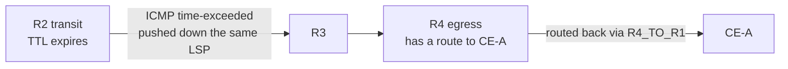

# Static LSPs and the Forwarding Plane

**Enabling MPLS on Junos, building static LSPs hop by hop, and reading `inet.3` and `mpls.0`**

> Study notes by [Nazirul Roslan](https://www.linkedin.com/in/nazirulroslan) · Junos MPLS Fundamentals · Part 03

← [Previous: The Mechanics of MPLS](02-mpls-mechanics.md) · [Index](../README.md) · [Next: An Introduction to RSVP](04-rsvp-introduction.md) →

**Contents:** [1 Enabling MPLS](#module-1-configuring-your-network-to-host-mpls-services) · [2 Ingress](#module-2-static-lsps-the-headend-ingress-router) · [3 Transit & PHP](#module-3-static-lsps-transit-and-penultimate-hop-routers) · [4 Lab Topology](#module-4-lab-introduction-and-topology) · [5 Lab: IGP & BGP](#module-5-lab-underlying-igp-and-bgp-configuration) · [6 Lab: Enable MPLS](#module-6-lab-enabling-mpls-in-the-core) · [7 Lab: R1 to R4](#module-7-lab-creating-the-forward-static-lsp-r1-to-r4) · [8 Lab: R4 to R1](#module-8-lab-challenge-creating-the-reverse-lsp) · [9 Lab: ICMP Tunneling](#module-9-lab-full-visibility-with-icmp-tunneling) · [10 Exam Questions](#module-10-exam-practice-questions) · [11 Glossary](#module-11-glossary)

> [!NOTE]
> **Topology consistency fix.** The source guide mixed an older 10-router version of this lab (PE router R5, loopback `192.168.1.5`) with the current 8-router lab (PE router R4, loopback `192.168.1.4`), which left lines like "R4 === R4" and "R4's loopback is 192.168.1.5". Everything in these notes now uses the lab that the configs and diagrams actually match: **R1 (PE) – R2 (P) – R3 (P) – R4 (PE)** on the top row, R5–R8 on the bottom row, the LSP `R1_TO_R4` to `192.168.1.4`, and **R3** as the penultimate hop.

---

## Module 1: Configuring Your Network to Host MPLS Services

**Objectives:**

- Understand the starting network state and the problem MPLS solves.
- Learn the two-step process to enable MPLS on Junos interfaces.
- Verify MPLS interface configuration.

### 1.1 The challenge: a BGP-free core

In many service provider networks the core (P) routers don't run BGP. This **BGP-free core** improves scalability and stability, but creates a problem: how does an edge router (PE) forward traffic to a remote customer prefix when the routers in between don't know that prefix?

R1 (a PE) learns Site B's prefix from R4 (the other PE). R1's IGP (IS-IS or OSPF) says the next physical hop towards R4 is R2. But R2 and R3 are P routers with no BGP information. When R1 sends an **unlabelled** packet for Site B to R2, R2 has no route for the destination and drops it. This is where MPLS comes in.

```
Site A --- R1 ==== R2 ==== R3 ==== R4 --- Site B
 (CE)     (PE)    (P)     (P)     (PE)     (CE)
           |       |       |       |
           R5 ---- R6 ---- R7 ---- R8

Problem:  R2 and R3 drop traffic for Site B because they don't run BGP.
Solution: Create a Label-Switched Path (LSP) from R1 to R4.
```

### 1.2 Enabling MPLS on core interfaces

Before any label protocol can work, MPLS must be enabled on the core-facing interfaces. In Junos this is a **two-step** process.

**Step 1: data plane.** Enable the MPLS address family on the logical interface. This prepares the Packet Forwarding Engine (PFE) to process labelled packets.

```
set interfaces ge-0/0/0 unit 0 family mpls
```

**Step 2: control plane.** Add the interface under `protocols mpls`. This lets the Routing Engine manage label operations for that interface.

```
set protocols mpls interface ge-0/0/0.0
```

### Verification and troubleshooting

`show mpls interface` is the main command to verify MPLS interface status:

```
naz@R1> show mpls interface
Interface           State       Administrative groups (x: extended)
ge-0/0/0.0          Up
ge-0/0/1.0          Up
```

> [!WARNING]
> **Troubleshooting tips**
> - Interface **missing** from the output: you probably forgot to add it under `protocols mpls`.
> - Interface state **Dn** (down): you probably forgot `family mpls` on the interface itself.

### Key takeaways

A BGP-free core needs a transport such as MPLS, and Junos needs **both** `family mpls` on the interface and the interface under `protocols mpls`. With the network ready, the next step is the first static LSP, starting at the headend.

---

## Module 2: Static LSPs: The Headend (Ingress) Router

**Objectives:**

- Describe the configuration pieces of an ingress static LSP.
- Verify the ingress LSP.
- Explain `inet.3` and its role in BGP next-hop resolution.

### 2.1 Configuring the ingress router

The headend (ingress) router is where the LSP starts. It's configured under `protocols mpls static-label-switched-path`, and you supply five pieces of information.

```
LSP name: R1_TO_R4

  + Push label 1001212
  |
  v
[ R1 ] -----> [ R2 ] -----> [ R3 ] -----> [ R4 ]
                ^                            ^
                |                            |
          Next hop:                    To: 192.168.1.4
          10.1.2.2                     (R4's loopback)
```

```
[edit protocols mpls]
static-label-switched-path R1_TO_R4 {    # 1. Locally significant LSP name
    ingress {                            # 2. This router's role: ingress
        to 192.168.1.4;                  # 3. Ultimate destination (egress router's loopback)
        next-hop 10.1.2.2;               # 4. Immediate physical next hop
        push 1001212;                    # 5. Label operation (push) and label value
    }
}
```

The same thing in `set` form:

```
set protocols mpls static-label-switched-path R1_TO_R4 ingress to 192.168.1.4
set protocols mpls static-label-switched-path R1_TO_R4 ingress next-hop 10.1.2.2
set protocols mpls static-label-switched-path R1_TO_R4 ingress push 1001212
```

> [!NOTE]
> The source mixed `set` and brace syntax on one line (`set static-label-switched-path R1_TO_R4 ingress { ... }`), which Junos won't accept. It's shown above in valid hierarchical and `set` forms.

> [!TIP]
> Junos reserves the label range **1,000,000 – 1,048,575** for static LSPs, which is why the labels in this guide are seven-digit values like `1001212`. Dynamic protocols (LDP, RSVP) allocate from 299,776 upwards.

### 2.2 Verifying the ingress LSP

> [!WARNING]
> **Common pitfall:** "Up" on a static LSP does **not** mean the end-to-end path works. It only means the local configuration is valid and the immediate next hop is reachable.

`show mpls static-lsp ingress` shows the state and destination:

```
naz@R1> show mpls static-lsp ingress
Ingress LSPs:
LSPname          To                  State
R1_TO_R4         192.168.1.4         Up
```

`show mpls static-lsp ingress detail` shows the configured label operation:

```
naz@R1> show mpls static-lsp ingress detail
Ingress LSPs:
LSPname: R1_TO_R4, To: 192.168.1.4
State: Up
Nexthop: 10.1.2.2 Via ge-0/0/0.0
LabelOperation: Push, Outgoing-Label: 1001212
```

### 2.3 The `inet.3` table: BGP's secret weapon

`inet.3` holds the **egress addresses of the LSPs this router is the ingress for**. It acts as a shortcut list for BGP next-hop resolution.

> [!TIP]
> **Learner's perspective: a VIP phonebook.** `inet.0` is the main public phonebook everyone (OSPF, IS-IS, BGP) uses. `inet.3` is a private VIP phonebook reserved for BGP. When BGP needs a path to a remote next hop, it looks in both books. If the VIP book has an entry (an LSP), that entry usually wins, because MPLS routes have a better (lower) route preference.

`show route 192.168.1.4` compares the `inet.0` and `inet.3` entries:

```
naz@R1> show route 192.168.1.4

inet.0: 31 destinations, 31 routes (31 active...)
+ = Active Route, - = Last Active, * = Both

192.168.1.4/32   *[IS-IS/18] 03:20:17, metric 30
                  > to 10.1.2.2 via ge-0/0/0.0

inet.3: 1 destinations, 1 routes (1 active...)
+ = Active Route, - = Last Active, * = Both

192.168.1.4/32   *[MPLS/6/1] 00:03:29, metric 0
                  > to 10.1.2.2 via ge-0/0/0.0, Push 1001212
```

> [!NOTE]
> Addresses and the IS-IS metric were aligned to the lab: R4 is three IS-IS hops from R1, so with the default metric of 10 per link the route shows metric 30 (the source showed metric 40 for the old 4-hop R5 path).

### 2.4 Impact on BGP next-hop resolution

With the LSP in `inet.3`, BGP now resolves the remote next hop (`192.168.1.4`) through the LSP, because the **static LSP route preference (6)** beats the **IS-IS Level 2 preference (18)**.

How is the BGP prefix `150.0.0.150/32` resolved on R1?

| | |
|---|---|
| ✅ **Resolved via LSP** | The route now includes a `Push 1001212` operation. |
| ❌ **Not resolved via IGP** | It's no longer a plain IP lookup in `inet.0`. |

BGP checks both `inet.3` and `inet.0` and picks the path with the best route preference: the MPLS entry in `inet.3` wins.

```
naz@R1> show route 150.0.0.150/32

inet.0: 31 destinations, 31 routes (31 active...)
150.0.0.150/32   *[BGP/170] 00:05:13, localpref 100
                    AS path: 150 I
                  > to 10.1.2.2 via ge-0/0/0.0, Push 1001212
```

> [!NOTE]
> The source output showed `AS path: 65102 I`. CE-B is in **AS 150** in this lab, so the AS path has been corrected to `150 I`.

### Key takeaways

You've configured the headend of a static LSP and seen its effect on `inet.3` and BGP next-hop resolution. But the path is incomplete: the transit routers must also be configured to keep forwarding the labelled packet.

---

## Module 3: Static LSPs: Transit and Penultimate-Hop Routers

**Objectives:**

- Configure a transit router to **swap**.
- Configure a penultimate-hop router to **pop**.
- Explain `mpls.0` (the LFIB).
- Verify end-to-end connectivity and understand default traceroute behaviour.

### 3.1 Configuring a transit router (swap)

A transit router receives a labelled packet, looks up the incoming label and forwards it with a new label: the **swap** operation. The configuration is similar to the ingress, but you specify `transit` and the **incoming label** to match.

```
# On R2
[edit protocols mpls]
static-label-switched-path R1_TO_R4 {
    transit 1001212 {           # For incoming label 1001212...
        swap 1002323;           # ...swap to 1002323
        next-hop 10.2.3.3;      # and forward to the next physical hop (R3's interface)
    }
}
```

### 3.2 The `mpls.0` table: the LFIB

`mpls.0` is the **Label Forwarding Information Base (LFIB)**: a simple table mapping an incoming label to an operation (swap or pop), an outgoing label and a next hop. Every router doing label operations has entries here.

```
naz@R2> show route table mpls.0

mpls.0: 7 destinations, 7 routes (7 active...)
+ = Active Route, - = Last Active, * = Both
...
1001212          *[MPLS/6] 00:00:49, metric 1
                  > to 10.2.3.3 via ge-0/0/2.0, Swap 1002323
```

### 3.3 The penultimate hop (pop)

The router just before the egress is the **penultimate hop**. It **pops** the transport label before forwarding. This is **Penultimate Hop Popping (PHP)**, an optimisation that spares the egress from doing a label lookup followed by an IP lookup. The configuration just says `pop`.

```
# On R3 (the penultimate hop)
[edit protocols mpls]
static-label-switched-path R1_TO_R4 {
    transit 1002323 {           # For incoming label 1002323...
        pop;                    # ...pop the label
        next-hop 10.3.4.4;      # and forward the unlabelled IP packet to R4's interface
    }
}
```

```
naz@R3> show route table mpls.0 label 1002323

mpls.0: 8 destinations, 8 routes (8 active...)
1002323          *[MPLS/6] 00:01:50, metric 1
                  > to 10.3.4.4 via ge-0/0/0.0, Pop
1002323(S=0)     *[MPLS/6] 00:01:50, metric 1
                  > to 10.3.4.4 via ge-0/0/0.0, Pop
```

> [!NOTE]
> You see **two** entries for a pop. The `(S=0)` entry handles packets that have more labels stacked underneath (for example MPLS VPN traffic), since after the pop the packet is still labelled. The plain entry handles the bottom-of-stack case (S=1). The router needs to know how to handle both.

### Key takeaways

You've now configured every piece of a **unidirectional** static LSP: push at the ingress, swap on transit routers and pop at the penultimate hop, and you've met `mpls.0`. Time to build it in the lab.

---

## Module 4: Lab: Introduction and Topology

**Lab objectives:** build a working MPLS network from scratch: the underlying routing, MPLS, and bidirectional static LSPs for end-to-end connectivity across a BGP-free core.

- Configure IS-IS as the IGP.
- Configure EBGP and IBGP sessions.
- Enable MPLS on the core routers.
- Build and verify a static LSP from R1 to R4.
- Build and verify a static LSP from R4 to R1.
- Use `icmp-tunneling` for full traceroute visibility.
- Observe the effect of a link failure on a static LSP.

### 4.1 Lab topology and IP scheme

The lab uses an 8-router core (R1–R4 top row, R5–R8 bottom row) with an addressing scheme designed to make verification easy.


| Item | Format | Example |
|---|---|---|
| **Loopbacks** | `192.168.1.x/32`, where `x` is the router number | R4's loopback is `192.168.1.4` |
| **Point-to-point links** | `10.x.y.z/24`, where `x` and `y` are the two routers on the link and `z` is the router number | On the R2–R3 link, R2 is `10.2.3.2` and R3 is `10.2.3.3` |
| **CE-A ↔ R1** | `100.100.100.0/24` | CE-A loopback `lo0.0` `100.0.0.100/32` (AS 100) |
| **CE-B ↔ R4** | `150.150.150.0/24` | CE-B loopback `lo0.0` `150.0.0.150/32` (AS 150) |

---

## Module 5: Lab: Underlying IGP and BGP Configuration

### Part 1: Configure the underlay

MPLS needs basic IP reachability between all loopbacks first. IS-IS is the IGP. BGP is also configured to exchange customer prefixes, which exposes the need for MPLS.

### 5.1 IS-IS configuration

Apply to all core routers (R1 through R8):

```
# On each router (e.g. R1)
# 1. Set the NET address on the loopback (the System ID must be unique!)
set interfaces lo0.0 family iso address 49.0001.0000.0000.0001.00

# 2. Enable family iso on all core-facing interfaces
set interfaces ge-0/0/0 unit 0 family iso
set interfaces ge-0/0/1 unit 0 family iso
# ... etc. for all core links

# 3. Enable IS-IS on the interfaces
set protocols isis interface all
set protocols isis interface lo0.0 passive
```

### 5.2 BGP configuration

Configure BGP on the PE routers (R1 and R4) and the CE routers (CE-A and CE-B).

**On R1**

```
set policy-options policy-statement NHS then next-hop self

set routing-options autonomous-system 64512
set protocols bgp group TO_R4 type internal
set protocols bgp group TO_R4 local-address 192.168.1.1
set protocols bgp group TO_R4 neighbor 192.168.1.4
set protocols bgp group TO_R4 export NHS
set protocols bgp group TO_CEA type external
set protocols bgp group TO_CEA peer-as 100
set protocols bgp group TO_CEA neighbor 100.100.100.100
```

**On R4** (similar configuration, pointing to R1 and CE-B)

```
set policy-options policy-statement NHS then next-hop self

set routing-options autonomous-system 64512
set protocols bgp group TO_R1 type internal
set protocols bgp group TO_R1 local-address 192.168.1.4
set protocols bgp group TO_R1 neighbor 192.168.1.1
set protocols bgp group TO_R1 export NHS
# ... etc. for the external group to CE-B (peer-as 150)
```

> [!NOTE]
> **Corrections.** The source had `peer-as 65001` on R1's CE-A group, but CE-A is configured as **AS 100**, so the peer AS is corrected to `100`. The `NHS` export was added to R4's snippet: R1 must see R4's loopback `192.168.1.4` as the BGP next hop (as the verification output below shows) so that it matches the static LSP's `to` address. Without next-hop self, R1 would see CE-B's address as the next hop and the LSP would never be used.

**On CE-A**

```
set routing-options autonomous-system 100
set protocols bgp group TO_R1 type external
set protocols bgp group TO_R1 peer-as 64512
set protocols bgp group TO_R1 neighbor 100.100.100.1
set protocols bgp group TO_R1 export TO-BGP
# ... advertise local routes
set policy-options policy-statement TO-BGP from protocol direct
set policy-options policy-statement TO-BGP from route-filter 100.0.0.100/32 exact
set policy-options policy-statement TO-BGP from route-filter 100.100.100.0/24 exact
set policy-options policy-statement TO-BGP then accept
```

### 5.3 Verifying the problem

R1 learns Site B's prefix from R4, but the BGP next hop (`192.168.1.4`) is resolved via IS-IS. The transit routers (R2, R3) have no BGP routes, so a traceroute from Site A to Site B fails in the core.

```
naz@R1> show route 150.0.0.150/32
inet.0: ...
150.0.0.150/32   *[BGP/170] ... from 192.168.1.4
                  > to 10.1.2.2 via ge-0/0/0.0  # Resolved via IS-IS
```

---

## Module 6: Lab: Enabling MPLS in the Core

### Part 2: Enable MPLS

Enable MPLS on the core-facing interfaces of R1, R2, R3 and R4.

### 6.1 Configuration

On each of the four routers, apply this pattern to every interface that connects to another core router:

```
# Example for R2
# Data plane
set interfaces ge-0/0/0 unit 0 family mpls
set interfaces ge-0/0/2 unit 0 family mpls
set interfaces ge-0/0/1 unit 0 family mpls

# Control plane
set protocols mpls interface ge-0/0/0.0
set protocols mpls interface ge-0/0/2.0
set protocols mpls interface ge-0/0/1.0
```

### 6.2 Verification

After committing on all four routers, check that the interfaces are up from an MPLS point of view:

```
naz@R2> show mpls interface
Interface           State       Administrative groups (x: extended)
ge-0/0/0.0          Up
ge-0/0/2.0          Up
ge-0/0/1.0          Up
```

---

## Module 7: Lab: Creating the Forward Static LSP (R1 to R4)

### Part 3: Create the LSP from R1 to R4

Configure the unidirectional LSP from R1 to R4, verifying each step. Labels to use:

| Hop | Label |
|---|---|
| R1 → R2 | `1001212` (push on R1) |
| R2 → R3 | `1002323` (swap on R2) |
| R3 → R4 | none (pop on R3, PHP) |


> [!NOTE]
> This reference diagram names the CEs CE-100 and CE-150 and uses LAN subnets 198.51.100.0/24 and 203.0.113.0/24. The labels and router roles match these notes; for addressing, follow the scheme in Module 4 (CE-A/CE-B on 100.100.100.0/24 and 150.150.150.0/24).

### 7.1 Ingress (R1) configuration and verification

```
# On R1
set protocols mpls static-label-switched-path R1_TO_R4 ingress to 192.168.1.4
set protocols mpls static-label-switched-path R1_TO_R4 ingress next-hop 10.1.2.2
set protocols mpls static-label-switched-path R1_TO_R4 ingress push 1001212
```

Check the BGP route on R1: the `Push` operation is now present.

```
naz@R1> show route 150.0.0.150/32
inet.0: ...
150.0.0.150/32   *[BGP/170] ... from 192.168.1.4
                  > to 10.1.2.2 via ge-0/0/0.0, Push 1001212
```

### 7.2 Transit (R2) configuration and verification

```
# On R2
set protocols mpls static-label-switched-path R1_TO_R4 transit 1001212 swap 1002323 next-hop 10.2.3.3
```

Check `mpls.0` on R2:

```
naz@R2> show route table mpls.0 label 1001212
mpls.0: ...
1001212          *[MPLS/6] ...
                  > to 10.2.3.3 via ge-0/0/2.0, Swap 1002323
```

### 7.3 Penultimate hop (R3) configuration and verification

```
# On R3
set protocols mpls static-label-switched-path R1_TO_R4 transit 1002323 pop next-hop 10.3.4.4
```

Check `mpls.0` on R3:

```
naz@R3> show route table mpls.0 label 1002323
mpls.0: ...
1002323          *[MPLS/6] ...
                  > to 10.3.4.4 via ge-0/0/0.0, Pop
```

> [!IMPORTANT]
> At this point traffic from Site A to Site B works, but **return traffic fails**: an LSP is one-way. Test with a `ping` from CE-A.

---

## Module 8: Lab Challenge: Creating the Reverse LSP

### Part 4: Create the LSP from R4 to R1

For bidirectional traffic you need a second static LSP in the opposite direction. Apply what you did in Module 7.

| Item | Value |
|---|---|
| LSP name | `R4_TO_R1` |
| Ingress | R4 |
| Egress | R1 |
| Penultimate hop | R2 |
| Labels | R4 → R3: `1004343`, R3 → R2: `1003232`, R2 → R1: pop |

### 8.1 Solution

<details><summary>Show solution</summary>

```
# On R4 (ingress)
set protocols mpls static-label-switched-path R4_TO_R1 ingress to 192.168.1.1
set protocols mpls static-label-switched-path R4_TO_R1 ingress next-hop 10.3.4.3
set protocols mpls static-label-switched-path R4_TO_R1 ingress push 1004343

# On R3 (transit)
set protocols mpls static-label-switched-path R4_TO_R1 transit 1004343 swap 1003232 next-hop 10.2.3.2

# On R2 (penultimate hop)
set protocols mpls static-label-switched-path R4_TO_R1 transit 1003232 pop next-hop 10.1.2.1
```

</details>

---

## Module 9: Lab: Full Visibility with ICMP Tunneling

### Part 5: Enable ICMP tunneling

With LSPs in both directions, a `traceroute` from CE-A to CE-B succeeds, but the P routers (R2, R3) show as `* * *`. They receive the labelled probe, its TTL expires, and they try to send an ICMP "time exceeded" back to the source, but as BGP-free routers they have no route to it. `icmp-tunneling` fixes this.

### 9.1 The "before" state

Run a traceroute from CE-A:

```
naz@CE-A> traceroute 150.0.0.150 source 100.0.0.100
traceroute to 150.0.0.150 (150.0.0.150) from 100.0.0.100...
 1  100.100.100.1 (100.100.100.1)  1.0 ms  1.0 ms  1.0 ms
 2  * * *
 3  * * *
 4  10.3.4.4 (10.3.4.4)  4.0 ms  4.0 ms  4.0 ms
 5  150.0.0.150 (150.0.0.150)  6.0 ms  6.0 ms  6.0 ms
```

> [!NOTE]
> The source's "before" output skipped a hop number and showed `150.150.150.150` at hop 4. R4 (the egress PE) has BGP routes, so it can answer, and it replies from its incoming interface `10.3.4.4`, exactly as in the "after" output below. The "before" output has been corrected to match.

### 9.2 Configuration and the "after" state

Apply one command on the core routers (R1, R2, R3, R4):

```
# On R1, R2, R3, R4
set protocols mpls icmp-tunneling
```

> [!TIP]
> Strictly, `icmp-tunneling` matters on the routers that generate the ICMP message while the packet is labelled, i.e. the transit LSRs (R2, R3). Configuring it everywhere keeps things simple and consistent.

Run the traceroute again. The intermediate hops are now visible and even report the MPLS label they received:

```
naz@CE-A> traceroute 150.0.0.150 source 100.0.0.100
traceroute to 150.0.0.150 (150.0.0.150) from 100.0.0.100...
 1  100.100.100.1 (100.100.100.1)  1.0 ms  1.0 ms  1.0 ms
 2  10.1.2.2 (10.1.2.2)  2.0 ms  2.0 ms  2.0 ms
     MPLS Label=1001212 CoS=0 TTL=1 S=1
 3  10.2.3.3 (10.2.3.3)  3.0 ms  3.0 ms  3.0 ms
     MPLS Label=1002323 CoS=0 TTL=1 S=1
 4  10.3.4.4 (10.3.4.4)  4.0 ms  4.0 ms  4.0 ms
 5  150.0.0.150 (150.0.0.150)  6.0 ms  6.0 ms  6.0 ms
```



### 9.3 Bonus: testing failure

To prove static LSPs don't react to network changes, disable the R2–R3 link:

```
# On R2
set interfaces ge-0/0/2 disable
```

The traceroute from CE-A now fails at R2. R1's static LSP stays **Up** (its own next hop, R2, is still reachable), so R1 keeps pushing label `1001212`. R2 has no dynamic way to reroute: its only instruction for that label points out the failed link, so the traffic is **black-holed**. This is the main drawback of static LSPs and sets the stage for dynamic label protocols such as LDP and RSVP.

> [!NOTE]
> The source said R2 "will continue trying to send the traffic out the disabled interface". More precisely, R2's static transit entry can no longer be used and nothing replaces it, while the ingress has no idea anything is wrong. The result is the same: a black hole.

---

## Module 10: Exam Practice Questions

**Question 1.** An engineer has configured a static LSP, but BGP traffic isn't using it. The LSP shows **Up** on the ingress router. What is the most likely cause?

- A) `family mpls` is missing from a transit router's interface.
- B) The `to` address in the static LSP configuration doesn't match the BGP protocol next hop.
- C) The `mpls.0` table on the egress router is empty.
- D) The IGP has a lower (more preferred) administrative distance than MPLS.

<details><summary>Answer</summary>

**B.** For BGP to use an LSP, the LSP's destination (`to ...`) in `inet.3` must **exactly match** the BGP protocol next-hop address. (Junos calls "administrative distance" route preference, and a static LSP's 6 already beats any IGP.)

</details>

**Question 2.** Which two tables does Junos consult when resolving a BGP next hop in an MPLS-enabled network?

- A) `inet.0` and `inet.2`
- B) `inet.0` and `mpls.0`
- C) `inet.0` and `inet.3`
- D) `inet.3` and `mpls.0`

<details><summary>Answer</summary>

**C.** Junos looks for the BGP next hop in both the main IP routing table (`inet.0`) and the LSP table (`inet.3`) and chooses the path with the best route preference.

</details>

**Question 3.** On which router in an LSP is the `pop` operation configured?

- A) The ingress router.
- B) The egress router.
- C) The penultimate-hop router.
- D) All transit routers.

<details><summary>Answer</summary>

**C.** The penultimate-hop router (the one just before the egress) pops the transport label as an optimisation (PHP).

</details>

---

## Module 11: Glossary

| Term | Meaning |
|---|---|
| **BGP-free core** | Design where core (P) routers don't run BGP and rely on an MPLS transport layer to carry customer traffic. |
| **Egress router** | Router at the end of an LSP where the final label is removed (or was already removed by PHP) and the packet is forwarded on its IP header. Also called the tail-end. |
| **Headend router** | Another name for the ingress router, where the LSP begins. |
| **ICMP tunneling** | Junos feature that lets transit LSRs answer traceroutes by sending the ICMP time-exceeded message down the LSP to the egress, which routes it back to the source. |
| **Ingress router** | Router at the start of an LSP, where the first label is pushed. |
| **inet.0** | The main IPv4 unicast routing table in Junos. |
| **inet.3** | The Junos MPLS path table. Stores the egress addresses of LSPs and is used for BGP next-hop resolution. |
| **LFIB** | Label Forwarding Information Base. Maps incoming labels to outgoing labels, operations and next hops. `mpls.0` in Junos. |
| **LSP** | Label-Switched Path. The one-way path a labelled packet follows through an MPLS network. |
| **mpls.0** | The Junos table that represents the LFIB. |
| **PHP** | Penultimate Hop Popping. The second-to-last router pops the label, saving the egress a label lookup. |
| **Pop** | Removing a label from a packet. |
| **Push** | Adding a label to a packet. |
| **Swap** | Replacing an incoming label with a new outgoing label. |
| **Transit router** | A router in the middle of an LSP that swaps labels. |

---

> 🧠 **Test yourself:** [Recall guide for this topic](../recall/R03-static-lsps-recall.md)

← [Previous: The Mechanics of MPLS](02-mpls-mechanics.md) · [Index](../README.md) · [Next: An Introduction to RSVP](04-rsvp-introduction.md) →
