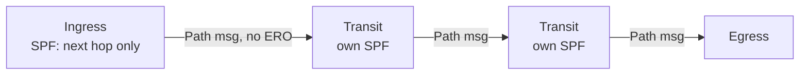

# An Introduction to RSVP

**Why RSVP replaces static LSPs, how it builds paths, and how to prepare a Junos network for it**

> Study notes by [Nazirul Roslan](https://www.linkedin.com/in/nazirulroslan) · Junos MPLS Fundamentals · Part 04

← [Previous: Static LSPs and the Forwarding Plane](03-static-lsps-forwarding-plane.md) · [Index](../README.md) · [Next: Configuring a Basic RSVP LSP](05-rsvp-basic-lsp.md) →

**Contents:** [1 Overview](#module-1-rsvp-overview) · [2 Creating an LSP](#module-2-creating-an-rsvp-lsp) · [3 Preparing the Network](#module-3-preparing-the-network-for-rsvp) · [4 Verification](#module-4-verification--troubleshooting) · [5 Practice Questions](#module-5-exam-practice-questions) · [6 Glossary](#module-6-glossary)

---

## Module 1: RSVP Overview

**Objectives**

- Explain the purpose of RSVP and its advantages over static LSPs.
- Describe the key traffic engineering features offered by RSVP.
- Understand the role of IGP traffic engineering extensions and the Traffic Engineering Database (TED).

### 1.1 From static to dynamic LSPs

You wouldn't build a large network with only static routes, and you wouldn't build a service provider network with only static LSPs either. Static LSPs are rigid, manually intensive, and don't react to network changes. The **Resource Reservation Protocol (RSVP)** fixes this: it gives you a scalable, automatic and dynamic way to create and manage Label-Switched Paths.

RSVP LSPs still need manual configuration on the **ingress (headend) router**, but every other hop in the path is configured automatically. The ingress router signals the path requirements downstream, and the downstream routers allocate labels and resources accordingly.

### 1.2 The power of traffic engineering

That one piece of configuration on the ingress router unlocks a rich set of traffic engineering features. RSVP lets you build LSPs that meet almost any requirement.

| Category | What RSVP can do |
|---|---|
| **Path control** | Follow the IGP's best path · Take a specific hop-by-hop explicit path · Include or avoid certain links or nodes · Optimize paths as the network changes |
| **Resource management** | Reserve specific amounts of bandwidth · Assign different priority levels to LSPs · Dynamically adjust bandwidth based on traffic · Split or merge LSPs based on load |
| **Resiliency** | Create diverse standby backup LSPs · Create local-repair backup paths at every hop (Fast Reroute) |
| **Advanced applications** | Create point-to-multipoint LSPs for multicast traffic |

### 1.3 A quick history and opaque objects

RSVP wasn't originally designed for MPLS. It was created to reserve Quality of Service (QoS) across the internet for applications like voice and video. That goal never took off on a global scale, but the protocol's design was very forward-thinking.

> [!TIP]
> **Learner's perspective: the universal shipping container.** Think of RSVP as a shipping container. The container doesn't know or care whether it's carrying car parts, bananas or electronics; its job is to move a payload from A to B. RSVP works the same way with **opaque objects**. RSVP transports these objects, which are "opaque" (meaningless) to RSVP itself, but they carry instructions (like "create an LSP" or "reserve 100 Mbps of bandwidth") that MPLS-enabled routers understand. This extensibility is what let RSVP be repurposed so neatly for MPLS traffic engineering.

### 1.4 IGP extensions and the TED

How does an ingress router know the available bandwidth or the administrative tags of a link on the far side of the network? Through extensions to the IGPs (IS-IS and OSPF):

- The IGPs were extended to advertise extra **traffic engineering (TE)** information in their link-state updates.
- Each router collects this TE information and stores it in a special database, the **Traffic Engineering Database (TED)**.
- With a complete TED, any router can calculate a path that meets specific constraints (bandwidth, tags) **before** signaling the LSP.

This enhanced version of RSVP is often called **RSVP-TE**.

> [!IMPORTANT]
> **Key takeaway:** RSVP overcomes the limits of static LSPs with dynamic signaling and a rich set of TE features. It relies on TE extensions in the IGP to build the TED. Next: the two ways you can tell RSVP to create a path.

---

## Module 2: Creating an RSVP LSP

**Objectives**

- Differentiate between creating an LSP using the Traffic Engineering Database (TED) and the Link-State Database (LSDB).
- Define the purpose of the Explicit Route Object (ERO).
- Explain what an ingress router does when creating an LSP using the LSDB.

### 2.1 Two methods for path creation

When you configure an RSVP LSP on the ingress router, you make a fundamental choice: use the full power of traffic engineering, or just build a dynamic LSP that follows the IGP's best path. That choice decides which database the router uses to calculate the path.

| Feature | Method 1: Constrained path (use the TED) | Method 2: IGP path (use the LSDB) |
|---|---|---|
| **Calculation basis** | A path based on your constraints (bandwidth, admin groups, ...) | The metrically best path according to the IGP (IS-IS or OSPF) |
| **Path control** | The ingress router calculates the precise hop-by-hop path end to end | The ingress router only decides the immediate next physical hop; each following router runs its own SPF to the destination |
| **Signaling object** | The calculated path is placed in an **Explicit Route Object (ERO)** and signaled downstream | No ERO; the path is decided hop by hop |
| **Primary use case** | Full traffic engineering: forcing traffic over non-default paths to meet requirements | Simple dynamic LSPs that automatically follow IGP topology changes |

> [!NOTE]
> In Junos, Method 1 (CSPF using the TED) is the **default**. Method 2 is what you get with the `no-cspf` statement on the LSP (covered in [Part 05](05-rsvp-basic-lsp.md)).

### 2.2 Ingress router behavior (using the LSDB)

What the ingress router does for a simple, unconstrained LSP is a key exam topic. When the LSP follows the IGP (uses the LSDB), the ingress router does two things:

> [!IMPORTANT]
> **What does an ingress router do if you configure an RSVP LSP using the LSDB?**
> 1. It **calculates the metrically best path but does not include the path in an ERO**.
> 2. It **decides the next physical hop, not the exact end-to-end path**.

The router runs a standard SPF calculation to find the best next hop toward the LSP's destination. It does **not** pre-calculate the full path or use an ERO. Every router along the path independently picks its own next hop, creating a "chained" SPF calculation.



> [!IMPORTANT]
> **Key takeaway:** RSVP LSPs are built either from the TED (constrained, traffic-engineered, signaled with an ERO) or from the LSDB (follows the IGP best path, hop by hop). Next: preparing the network to host these LSPs.

---

## Module 3: Preparing the Network for RSVP

**Objectives**

- List the mandatory and optional steps to prepare a Junos network for RSVP.
- Configure MPLS and RSVP on an interface.
- Configure IGP traffic engineering extensions.
- Allow RSVP through a control plane firewall filter.

### 3.1 Base configuration checklist

Before you create a single RSVP LSP, prepare the network. These steps apply to all core-facing routers.

| Mandatory | Optional (but recommended) |
|---|---|
| Enable MPLS on core-facing interfaces | Enable traffic engineering extensions in your IGP |
| Enable RSVP on the same interfaces | |
| Allow RSVP and MPLS self-ping through control plane firewall filters (if used) | |

> [!NOTE]
> TE extensions are "optional" only in the sense that an LSP with `no-cspf` works without them. The default (CSPF) LSP needs a populated TED, so in practice you want them on.

### 3.2 Enabling MPLS and RSVP

Enable MPLS and RSVP on every interface that takes part in the MPLS domain, in both the data plane (`family mpls`) and the control plane (`protocols mpls` and `protocols rsvp`).

```
# On each core-facing interface (e.g., ge-0/0/0.0 on R1)

# 1. Enable MPLS in the data plane
set interfaces ge-0/0/0 unit 0 family mpls

# 2. Enable MPLS in the control plane
set protocols mpls interface ge-0/0/0.0

# 3. Enable RSVP in the control plane
set protocols rsvp interface ge-0/0/0.0
```

> [!WARNING]
> Forgetting any one of the three is a classic gotcha. Without `family mpls` the interface can't forward labeled packets; without `protocols mpls interface` the interface isn't MPLS-enabled for signaling; without `protocols rsvp interface` no RSVP hellos or Path/Resv messages are processed there.

### 3.3 Enabling IGP traffic engineering

To build the TED, the IGP must advertise TE information. The configuration differs between IS-IS and OSPF.

| IS-IS | OSPF |
|---|---|
| TE extensions are **enabled by default** in Junos OS. No extra configuration needed. | You must **explicitly enable** TE with one command under OSPF. |

```
[edit protocols ospf]
set traffic-engineering
```

### 3.4 Control plane firewall filter

If you protect the Routing Engine with a firewall filter, add terms that explicitly permit RSVP. RSVP is its own transport protocol (**IP protocol 46**); it doesn't use TCP or UDP. You also need to allow **UDP port 8503** for **MPLS self-ping**, which tests the health of an LSP's data plane.

```
[edit firewall family inet filter PROTECT_RE]

# Term to allow RSVP (Protocol 46)
set term RSVP from protocol rsvp
set term RSVP then accept

# Term to allow MPLS Self-Ping (UDP Port 8503)
set term MPLS_SELF_PING from protocol udp
set term MPLS_SELF_PING from port 8503
set term MPLS_SELF_PING then accept

# Ensure these terms are placed before the final discard term
insert term RSVP before term DISCARD_ALL
insert term MPLS_SELF_PING after term RSVP
```

> [!WARNING]
> New terms are appended at the **end** of a filter. If the filter ends with a catch-all discard term, your new terms are never reached until you `insert` them before it.

> [!IMPORTANT]
> **Key takeaway:** preparing for RSVP means enabling MPLS and RSVP on interfaces, enabling TE in the IGP (explicitly for OSPF), and updating RE firewall filters. Next: verifying the base configuration.

---

## Module 4: Verification & Troubleshooting

**Objectives**

- Use `show rsvp interface` to verify local RSVP configuration.
- Use `show rsvp neighbor` to verify bidirectional RSVP communication.
- Identify common failure symptoms from command output.

### `show rsvp interface`

Verifies that RSVP is configured **locally** on an interface. A `State` of `Up` only confirms the local configuration; it does **not** guarantee that the neighbor is configured too.

```
naz@R1> show rsvp interface
RSVP interface: 2 active
                                  Active Subscr- Static      Available   Reserved  Highwater
Interface           State   resv  iption BW          BW          BW        mark
ge-0/0/0.0          Up      0     100%   1000Mbps    1000Mbps    0bps      0bps
ge-0/0/1.0          Up      0     100%   1000Mbps    1000Mbps    0bps      0bps
```

The **`Active resv`** column shows how many LSPs are currently active over the interface. It's 0 here and will increase as you build LSPs.

### `show rsvp neighbor`: the most useful command

Verifies that RSVP hello messages are being exchanged **in both directions** with a neighbor. It's the best command to confirm that both sides of a link are configured correctly.

```
naz@R1> show rsvp neighbor
RSVP neighbor: 2 learned
Address             Idle  Up/Dn Last Change   HelloInt HelloTx/Rx  MsgRcvd
10.1.6.6            0     1/0   00:00:05          9   38/38           0
10.1.2.2            5:30  0/0   00:05:32          9   37/0            0
```

**Interpreting the output**

| Neighbor | Idle | HelloTx/Rx | Verdict |
|---|---|---|---|
| 10.1.6.6 | `0` | `38/38`: hellos sent and received | ✅ Healthy neighbor |
| 10.1.2.2 | `5:30` (non-zero) | `37/0`: no hellos received | ❌ Problem: RSVP most likely isn't configured on the remote router (R2), or a firewall is blocking it |

> [!TIP]
> `HelloInt 9` is the Junos default RSVP hello interval (9 seconds).

> [!IMPORTANT]
> **Key takeaway:** `show rsvp interface` confirms your local setup; `show rsvp neighbor` confirms communication with your peers. Spotting a failed neighbor (non-zero Idle, zero HelloRx) is a critical troubleshooting skill.

---

## Module 5: Exam Practice Questions

**Question 1: Which two statements accurately describe how RSVP can create an LSP?**

- A) It can use the TED to calculate a path based on constraints and signal it with an ERO.
- B) It always requires an ERO to be configured on the ingress router.
- C) It can use the LSDB to follow the IGP's best path, with each router performing its own SPF calculation.
- D) It must have traffic engineering enabled in OSPF to function.

<details><summary>Answer</summary>

**A and C.** RSVP can either use the TED for constrained engineering (signaled with an ERO) or simply follow the IGP's best path using the LSDB, hop by hop.

</details>

**Question 2: An engineer runs `show rsvp neighbor` and sees a non-zero idle time and zero received hello messages for a specific neighbor. What is the most likely cause?**

- A) The local interface is missing the `family mpls` command.
- B) The remote router does not have RSVP configured on the corresponding interface, or a firewall is blocking the traffic.
- C) The `traffic-engineering` knob has not been enabled under `protocols ospf`.
- D) There are no active LSPs traversing the link.

<details><summary>Answer</summary>

**B.** A non-zero idle time and zero received hellos are classic signs that the remote end isn't sending RSVP hellos, either because RSVP isn't enabled there or because the packets are being dropped.

</details>

---

## Module 6: Glossary

| Term | Definition |
|---|---|
| **ERO (Explicit Route Object)** | An object in an RSVP Path message that specifies the exact hop-by-hop route an LSP must take. |
| **Ingress router** | The router at the start of an LSP, where traffic enters the MPLS domain and the first label is pushed. Also called the headend. |
| **LSDB (Link-State Database)** | The standard database built by a link-state IGP (OSPF or IS-IS) holding the topology used for SPF calculations. |
| **Opaque object** | A data structure carried by a protocol (like RSVP) that is meaningless to that protocol. Its contents are interpreted by other applications or protocols on the receiving router. |
| **RSVP (Resource Reservation Protocol)** | A control plane protocol used to signal and manage LSPs, able to reserve resources like bandwidth and provide advanced traffic engineering. |
| **RSVP-TE** | RSVP used specifically for MPLS traffic engineering, relying on IGP TE extensions. |
| **TED (Traffic Engineering Database)** | A database populated by IGP TE extensions. It holds richer information than the LSDB: available bandwidth, link colors (admin groups) and other TE attributes. |

> 🧠 **Test yourself:** [Recall guide for this topic](../recall/R04-rsvp-introduction-recall.md)

---

← [Previous: Static LSPs and the Forwarding Plane](03-static-lsps-forwarding-plane.md) · [Index](../README.md) · [Next: Configuring a Basic RSVP LSP](05-rsvp-basic-lsp.md) →
