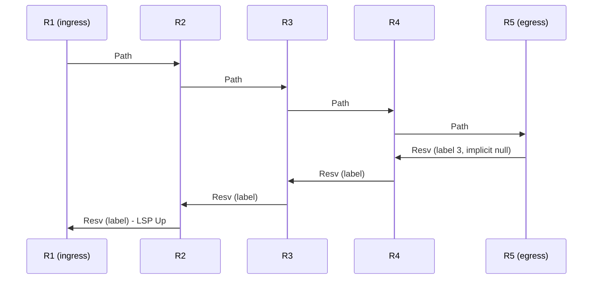
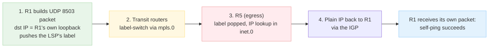

# Configuring a Basic RSVP LSP

**Building, signaling and verifying an LSP that follows the IGP, plus MPLS self-ping and RSVP objects**

> Study notes by [Nazirul Roslan](https://www.linkedin.com/in/nazirulroslan) · Junos MPLS Fundamentals · Part 05

← [Previous: An Introduction to RSVP](04-rsvp-introduction.md) · [Index](../README.md) · [Next: RSVP: The Traffic Engineering Database](06-rsvp-traffic-engineering-database.md) →

**Contents:** [1 Configuration](#module-1-configuration) · [2 Signaling & Verification](#module-2-signaling--verification) · [3 MPLS Self-Ping](#module-3-mpls-self-ping) · [4 Path & Resv Messages](#module-4-path--resv-messages) · [5 Cheat Sheet](#module-5-cheat-sheet) · [6 Practice Questions](#module-6-exam-practice-questions) · [7 Glossary](#module-7-glossary)

---

## Module 1: Configuration

**Objectives**

- Understand the problem a basic RSVP LSP solves in a BGP-free core.
- Differentiate between path calculation using the TED and the LSDB.
- Configure a basic RSVP LSP that follows the IGP's best path using `no-cspf`.

### 1.1 The challenge: a BGP-free core

In service provider networks the core routers (P routers) often don't run BGP: a **BGP-free core**. That creates a problem. When an edge router (PE) such as R1 learns a customer prefix via BGP from a remote PE (R5), the transit P routers (R2, R3, R4) know nothing about that prefix. Any **unlabeled** packet sent into the core toward it is dropped. An RSVP LSP from R1 to R5 solves this by giving the traffic a tunnel through the core.

```
  Site A --- R1 === R2 === R3 === R4 === R5 --- Site B
  (CE)       (PE)  (P)    (P)    (P)   (PE)     (CE)
             |      |      |      |      |
             R6 --- R7 --- R8 --- R9 --- R10

Problem: R2, R3, R4 drop traffic for Site B because they don't run BGP.
Solution: Create an RSVP LSP from R1 to R5.
```

### 1.2 Path calculation: the `no-cspf` statement

To focus on RSVP fundamentals, the first LSP simply follows the IGP's best path. You do that by explicitly disabling the **Constrained Shortest Path First (CSPF)** algorithm. This distinction is critical for the exam.

| | CSPF enabled (default) | `no-cspf` configured |
|---|---|---|
| Algorithm | CSPF | Standard SPF |
| Database | **Traffic Engineering Database (TED)** | Regular **Link-State Database (LSDB)** |
| What the ingress calculates | A precise end-to-end path that satisfies constraints like bandwidth | Only the immediate next hop |
| ERO | Result placed in an Explicit Route Object (ERO) | No ERO |
| Good for | Traffic engineering | Simple dynamic LSPs that just follow the IGP |

### 1.3 LSP configuration on the ingress router

A basic, unconstrained LSP is often a single line under `protocols mpls`:

```
[edit protocols mpls]
set label-switched-path R1_TO_R5 to 192.168.1.5 no-cspf
```

**Configuration breakdown**

| Statement | Meaning |
|---|---|
| `label-switched-path R1_TO_R5` | Defines a new LSP with a locally significant name. |
| `to 192.168.1.5` | The destination (the egress router's loopback). This address is what gets installed in the `inet.3` table. |
| `no-cspf` | Disables the CSPF (TE) calculation so the LSP follows the IGP's best path. |

> [!NOTE]
> This assumes the preparation from [Part 04](04-rsvp-introduction.md) is already in place on every router in the path: `family mpls`, `protocols mpls interface` and `protocols rsvp interface` on the core interfaces.

> [!IMPORTANT]
> **Key takeaway:** a basic RSVP LSP needs only a destination and `no-cspf` to follow the IGP. That one line on the ingress triggers a dynamic, multi-step signaling process.

---

## Module 2: Signaling & Verification

**Objectives**

- Describe the two-way signaling process using Path and Resv messages.
- Use `show mpls lsp` to verify the state of an LSP.
- Confirm the LSP's presence in the `inet.3` and `inet.0` tables.
- Interpret `show mpls lsp extensive`, focusing on the Record Route Object (RRO).

### 2.1 The signaling process

Once configured, the ingress router starts a two-way handshake to establish the LSP.

1. **Path message (downstream):** R1 sends a `Path` message to its next hop (R2). R2 calculates its own next hop toward R5 and forwards the `Path` message to R3, and so on, until it reaches the egress router R5.
2. **Resv message (upstream):** R5 answers with a `Resv` (reserve) message to R4, telling R4 which label to use. R4 then sends a `Resv` to R3 with the label R3 should use, and so on.
3. **LSP up:** when R1 receives the `Resv` from R2, the LSP is considered **Up** and can start forwarding traffic.



> [!NOTE]
> With PHP (the default), the egress advertises label **3 (implicit null)**, so R4 pops the label rather than swapping it.

### 2.2 Verification command toolkit

**`show mpls lsp`: your first check.** Look for a `State` of `Up`.

```
naz@R1> show mpls lsp

Ingress LSP: 1 sessions
To           From         State Rt ActivePath       LSPname
192.168.1.5  192.168.1.1  Up    0                  R1_TO_R5
Total 1 displayed, Up 1, Down 0
```

> [!WARNING]
> If the state is `Dn` (Down), the most common causes are forgetting to enable MPLS/RSVP on an interface in the path, or a firewall filter blocking RSVP.

**Routing tables.** Verify the LSP is installed in `inet.3` and that BGP uses it to resolve its next hop.

```
naz@R1> show route table inet.3 192.168.1.5/32

inet.3: 1 destinations, 1 routes (1 active...)
192.168.1.5/32   *[RSVP/7/1] 00:12:06, metric 40
                  > to 10.1.2.2 via ge-0/0/0.0, label-switched-path R1_TO_R5

naz@R1> show route 203.0.113.0/24

inet.0: 32 destinations, 32 routes (32 active...)
203.0.113.0/24   *[BGP/170] 00:30:10 ...
                  > to 10.1.2.2 via ge-0/0/0.0, label-switched-path R1_TO_R5
```

> [!TIP]
> RSVP routes have a route preference of **7** in Junos. BGP resolves its protocol next hop (192.168.1.5) in `inet.3` first, which is why the BGP route in `inet.0` points into the LSP.

**`show mpls lsp extensive`: the most detail**, including the actual path taken by the LSP via the Record Route Object (RRO).

```
naz@R1> show mpls lsp name R1_TO_R5 extensive
...
 ActivePath: (primary)
 LSPtype: Static Configured, Penultimate hop popping
...
 Received RRO (ProtectionFlag...):
   10.1.2.2 (Label 17) 10.2.3.3 (Label 23) 10.3.4.4 (Label 17) 10.4.5.5 (Label 3)
...
 8 Feb 4 20:15:08.942 Selected as active path
 7 Feb 4 20:15:08.941 Self-ping ended successfully
 6 Feb 4 20:15:08.713 Up
...
 1 Feb 4 20:15:08.650 Originate Call
...
```

**Output breakdown**

- **Penultimate hop popping:** confirms PHP is in use: the last label is removed by the second-to-last router (R4).
- **Received RRO:** shows the exact path the LSP took (R1 → R2 → R3 → R4 → R5) and the incoming label each router allocated. For example, R2 expects to receive packets with label 17. R5's label 3 is the implicit-null label that triggers PHP.
- **Logs:** the timestamped log shows the sequence of events, from origination (`Originate Call`) to the LSP coming `Up` and being selected as the active path. Invaluable for troubleshooting.

> [!NOTE]
> `LSPtype: Static Configured` means the LSP was configured by hand on the ingress (as opposed to created dynamically, e.g. by auto-mesh); it is still an RSVP-signaled LSP, not a static LSP. Also, the small label values in this sample are illustrative: on real Junos routers, dynamically allocated labels start at **299776**.

> [!IMPORTANT]
> **Key takeaway:** verify an LSP by checking its state with `show mpls lsp`, confirming its effect on `inet.3`/`inet.0`, and using `extensive` to see the exact path and event log. Part of this process is an automatic data plane check: MPLS self-ping.

---

## Module 3: MPLS Self-Ping

MPLS self-ping is a Junos feature that automatically tests the **data plane** of a newly signaled LSP. The ingress router sends a UDP packet (port **8503**) down the LSP, addressed to **itself**. If the packet comes back, the LSP really forwards traffic.

### 3.1 Self-ping process



**🟩 1. Packet origination (R1)**

- R1 builds a UDP packet whose **destination IP is its own address** (for example its loopback, 192.168.1.1), sent to **UDP port 8503** (reserved for self-ping).
- **Forwarding decision:** R1 places the packet directly into the LSP being tested and pushes that LSP's label(s), the same label operation it uses for traffic mapped to the LSP (the LSP's destination is what sits in `inet.3`).

> [!NOTE]
> The original guide said R1 does a route lookup in `inet.3` for the packet. Since the packet is addressed to R1 itself, a normal lookup would never send it into the LSP; instead the ingress injects the probe straight into the specific LSP (or new LSP instance) under test. That's what makes it a test of that exact path.

**🟨 2. LSP traversal**

- The labeled packet is forwarded hop by hop using **`mpls.0`** on each transit node.
- Transit routers don't inspect the IP header; they forward on the top label.
- Label actions (swap, pop) come from `mpls.0`.

**🟥 3. Egress processing (R5)**

- After the last label is popped (by PHP at R4, or by R5 itself), R5 inspects the IP header.
- The destination IP is still 192.168.1.1 (R1's loopback).
- **Forwarding decision:** R5 does an IP lookup in **`inet.0`** and forwards the packet back to R1 using normal IGP routing (IS-IS or OSPF).
- No MPLS label is added: the packet returns as plain IP.

**✅ 4. Verification complete (R1)**

R1 receives its own packet back. That confirms:

- The label stack was applied correctly.
- The forwarding plane followed the LSP as expected.
- The IP path from egress back to ingress works.

> [!IMPORTANT]
> **Summary of tables used**
> - `inet.3`: holds the LSP route at R1 (the LSP being tested).
> - `mpls.0`: label switching during LSP traversal.
> - `inet.0`: used by R5 to return the packet as normal IP.

### 3.2 Why it matters

An LSP can come up, and even forward traffic, when self-ping is blocked. But self-ping is critical for the advanced resiliency features.

| Result of blocked self-ping (UDP 8503 blocked by a firewall) | |
|---|---|
| ✅ **Still works** | The primary LSP comes up and forwards traffic. |
| ❌ **Fails** | Traffic is **not** moved to a new optimized path, or to a backup / local-repair path, because the self-ping test on those new paths fails. |

That can leave traffic stuck on a less optimal path or, worse, prevent failover during an outage.

> [!WARNING]
> Best practice: always permit **UDP port 8503** in your control plane (lo0) filters. The self-ping packet returns to R1 as ordinary IP addressed to the RE, so R1's lo0 filter sees it.

> [!IMPORTANT]
> **Key takeaway:** MPLS self-ping is an automatic data plane check that advanced RSVP features (path optimization, make-before-break, fast reroute) rely on. Understand its one-way-out, IP-back flow and always permit its traffic.

---

## Module 4: Path & Resv Messages

**Objectives**

- Describe the direction and purpose of Path and Resv messages.
- Explain that RSVP messages are made of objects.
- Identify the function of key objects: Session, Session Attribute, Label Request and RRO.

### 4.1 A closer look at signaling

RSVP messages are a short header followed by a series of chunks of information called **objects**. Each object carries one specific piece of information. The two fundamental messages are Path and Resv.

| Message | Direction | Purpose |
|---|---|---|
| **Path** | **Downstream**, ingress → egress | **Request** the creation of an LSP |
| **Resv** | **Upstream**, egress → ingress | **Confirm** the reservation and **distribute labels** |

### 4.2 Common objects in a Path message

A typical Path message carries around 14 different objects. You don't need to memorize them all, but know what these do:

| Object | Function |
|---|---|
| **Session** | Identifies the LSP session. Contains the ultimate destination IP address and a unique Tunnel ID. |
| **Session Attribute** | Carries attributes of the LSP, such as its configured name and its priority levels (setup and hold). |
| **Label Request** | A request from the upstream router asking the downstream router to provide a label for this LSP. |
| **RRO (Record Route Object)** | Each router records its address in this object as the message travels. The RRO that comes back to the ingress (in the Resv message) gives a full, end-to-end record of the path taken, which is invaluable for verification on the ingress router. |

> [!NOTE]
> The RRO is carried in **both** Path and Resv messages. The Path RRO is built as the message goes downstream; the "Received RRO" you see on the ingress in `show mpls lsp extensive` comes from the Resv, which is why it can also list the label each hop allocated.

> [!IMPORTANT]
> **Key takeaway:** RSVP signaling is object-oriented. Path messages flow downstream to request an LSP; Resv messages flow upstream to confirm it and distribute labels. Focus on the intent of each message and the job of the key objects rather than memorizing every object name.

---

## Module 5: Cheat Sheet

| Topic | Command / concept | Purpose |
|---|---|---|
| Configure basic LSP | `set protocols mpls label-switched-path ... no-cspf` | Creates an LSP without using the TED; follows the IGP best path. |
| Verify LSP status | `show mpls lsp` | Primary check: is the LSP Up or Down? |
| Verify LSP details | `show mpls lsp extensive` | Detailed hops (RRO), event logs and path attributes. |
| Check routing tables | `show route table inet.3` | Confirms the LSP destination is available for BGP next-hop resolution. |
| RSVP session details | `show rsvp session` | RSVP-specific state, including reservation style and label mappings. |
| Test data plane | MPLS self-ping | Automatic check (UDP 8503) that the LSP can actually forward traffic. |

---

## Module 6: Exam Practice Questions

**Question 1: You have configured a basic RSVP LSP with the `no-cspf` statement. Which two actions does the ingress router perform when signaling this LSP?**

- A) It calculates the precise path based on constraints in the TED.
- B) It calculates the metrically best path using the LSDB but does not include the path in an ERO.
- C) It includes the full path in an ERO when signaling the LSP.
- D) It decides only the immediate next physical hop, not the exact end-to-end path.

<details><summary>Answer</summary>

**B and D.** `no-cspf` makes the router use the standard LSDB for a simple SPF calculation to find the next hop only. It doesn't calculate the full path or use an ERO.

</details>

**Question 2: Which object in an RSVP message allows the ingress router to see the full, hop-by-hop path that an LSP has taken?**

- A) Session Object
- B) Explicit Route Object (ERO)
- C) Session Attribute Object
- D) Record Route Object (RRO)

<details><summary>Answer</summary>

**D.** The Record Route Object (RRO) is populated by each router in the path, building a complete record that reaches the ingress router for verification. (The ERO is the *requested* path, not the path actually taken.)

</details>

---

## Module 7: Glossary

| Term | Definition |
|---|---|
| **CSPF (Constrained Shortest Path First)** | An extended SPF algorithm that uses the TED to calculate paths that satisfy a set of constraints (e.g. bandwidth). |
| **ERO (Explicit Route Object)** | An object in an RSVP Path message that dictates the exact hop-by-hop path an LSP must follow. |
| **MPLS self-ping** | A Junos feature that automatically tests the data plane of a newly signaled LSP by sending a UDP packet (port 8503) down the LSP, addressed to the ingress router itself. |
| **Path message** | An RSVP message sent downstream (ingress → egress) to request the creation of an LSP. |
| **PHP (Penultimate Hop Popping)** | An MPLS optimization where the second-to-last router removes the transport label, reducing the processing load on the egress router. |
| **Resv message** | An RSVP message sent upstream (egress → ingress) to confirm an LSP reservation and distribute labels to upstream neighbors. |
| **RRO (Record Route Object)** | An object in RSVP messages where each hop adds its IP address, creating a record of the path taken. Used for loop detection and verification. |

> 🧠 **Test yourself:** [Recall guide for this topic](../recall/R05-rsvp-basic-lsp-recall.md)

---

← [Previous: An Introduction to RSVP](04-rsvp-introduction.md) · [Index](../README.md) · [Next: RSVP: The Traffic Engineering Database](06-rsvp-traffic-engineering-database.md) →
