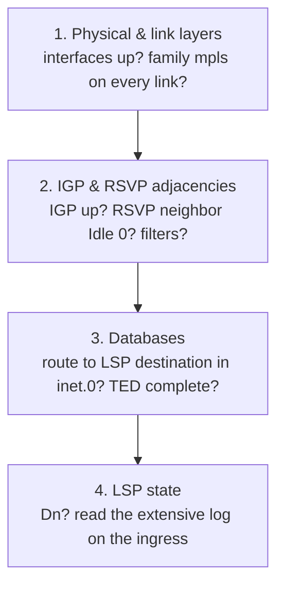

# RSVP: The Traffic Engineering Database

**IGP TE extensions, the TED, CSPF-computed paths, loose and strict hops (with lab)**

> Study notes by [Nazirul Roslan](https://www.linkedin.com/in/nazirulroslan) · Junos MPLS Fundamentals · Part 06

← [Previous: Configuring a Basic RSVP LSP](05-rsvp-basic-lsp.md) · [Index](../README.md) · [Next: RSVP: LSP Bandwidth Reservation](07-rsvp-bandwidth-reservation.md) →

**Contents:** [1 TE Extensions](#module-1-igp-traffic-engineering-extensions) · [2 TED with IS-IS](#module-2-populating-the-ted-with-is-is) · [3 LSPs with the TED](#module-3-configuring-lsps-with-the-ted) · [4 Loose & Strict Hops](#module-4-lsp-path-control-with-loose-and-strict-hops) · [5 TED with OSPF](#module-5-populating-the-ted-with-ospf) · [6 Lab](#module-6-comprehensive-lab-rsvp-lsps) · [7 Troubleshooting](#module-7-troubleshooting-methodology) · [8 Practice Questions](#module-8-exam-practice-questions) · [9 Glossary](#module-9-glossary)

---

## Module 1: IGP Traffic Engineering Extensions

**Objectives**

- Describe how extensions to IS-IS and OSPF advertise traffic engineering information.
- List the key pieces of TE information advertised by IGPs.
- Understand the flooding mechanism for TE updates.

### 1.1 What are TE extensions?

By default, IGPs like IS-IS and OSPF advertise basic topology: routers, links, metrics and IP prefixes. **Traffic Engineering (TE) extensions** let them advertise a much richer set of data. That extra information is the foundation for intelligent path calculation for RSVP LSPs.

> [!TIP]
> **Learner's perspective: from road map to live traffic report.** A standard IGP map is a basic road atlas: it shows the roads and distances. TE extensions upgrade it to a live GPS traffic system. Now the map shows current traffic, lane closures (link tags) and even the number of lanes on each highway (bandwidth). With live data you can plan a much smarter route, avoiding congestion and restrictions.

### 1.2 Key TE information advertised

With TE extensions enabled, the IGP floods this information through the network:

| Bandwidth information | Link attributes |
|---|---|
| Maximum link bandwidth | **Admin groups** (link colors / tags): arbitrary tags on links, so LSPs can include or exclude them |
| Maximum reservable bandwidth | **TE metric:** a separate metric used only for RSVP path calculation, so TE paths can differ from the IGP's best path |
| Currently unreserved (available) bandwidth | |
| Available bandwidth per priority level (0–7) | |

Any change to this information (a change in available bandwidth, a new admin group) is flooded with the IGP's normal link-state update mechanism. Every router therefore keeps a consistent, up-to-date view of the network's TE capabilities.

> [!IMPORTANT]
> **Key takeaway:** TE extensions turn standard IGPs into carriers of detailed link attributes, flooded network-wide, so every router can build a complete view of the network's capabilities.

---

## Module 2: Populating the TED with IS-IS

**Objectives**

- Explain how IS-IS uses TLVs to carry TE information.
- State that IS-IS TE extensions are enabled by default in Junos OS.
- Use `show isis database extensive` to view TE information in a Link-State PDU.
- Define the purpose of the Traffic Engineering Database (TED).
- Use `show ted database` to verify the contents of the TED.

### 2.1 IS-IS and traffic engineering

IS-IS is an excellent fit for MPLS TE. Its **Type-Length-Value (TLV)** encoding makes it naturally extensible: TE extensions are just new TLVs (and sub-TLVs) in the standard Link-State PDUs.

> [!IMPORTANT]
> **Junos best practice:** IS-IS TE extensions are **enabled by default** in Junos OS. No extra configuration is needed under `protocols isis` to advertise TE information, which makes setup simpler than OSPF.

A nice advantage of IS-IS for learning: its database shows router hostnames, so verification is much more intuitive.

### 2.2 Verifying TE TLVs in the IS-IS database

You can see the TE information inside a router's LSP with `show isis database extensive`. TE data is carried in the **Extended IS Reachability TLV (type 22)**.

Viewing TE info for router R2:

```
naz@R1> show isis database R2.00-00 extensive

IS-IS LSP R2.00-00, seq 0x5, ltime 1187
...
  Hostname: R2
  ...
  Extended IS Reachability TLV #22, length 170
    IS extended neighbor: R1.00, metric 100
      IP address: 10.1.2.2
      Neighbor's IP address: 10.1.2.1
      ...
      Current reservable bandwidth:
        Priority 0: 1000Mbps
        Priority 1: 1000Mbps
        ... (priorities 2-7) ...
...(output truncated to show link to R1 only)...
```

**Output analysis**

| Field | Meaning |
|---|---|
| `Extended IS Reachability TLV` | The container for modern IS-IS link information, including TE data (as sub-TLVs). |
| `Current reservable bandwidth` | Available bandwidth at all 8 priority levels. This is the data CSPF uses for path calculation. |
| `Administrative groups` | Empty for now (not shown above); populated once you configure link colors (admin groups). |

### 2.3 The Traffic Engineering Database (TED)

The TE information originates in the IGP, but routers don't run CSPF against the IGP database directly. The TE information is extracted, converted to a common format and placed in a separate, **protocol-independent** database: the **Traffic Engineering Database (TED)**.

> [!NOTE]
> **Key concept: protocol independence.** The TED gives RSVP/CSPF one consistent source of TE data whether the IGP is IS-IS or OSPF. This modular design is a hallmark of Junos OS.

View it with `show ted database`. Summary view of all nodes and links:

```
naz@R1> show ted database
TED database: 10 ISIS nodes
ID                        Type Age(s) LnkIn LnkOut Protocol
R1.00(192.168.1.1)        Rtr    212     2      2 IS-IS(2)
  To: R2.00(192.168.1.2), Local: 10.1.2.1, Remote: 10.1.2.2
  To: R6.00(192.168.1.6), Local: 10.1.6.1, Remote: 10.1.6.6
R2.00(192.168.1.2)        Rtr    212     3      3 IS-IS(2)
  To: R1.00(192.168.1.1), Local: 10.1.2.2, Remote: 10.1.2.1
  To: R7.00(192.168.1.7), Local: 10.2.7.2, Remote: 10.2.7.7
  To: R3.00(192.168.1.3), Local: 10.2.3.2, Remote: 10.2.3.3
...(output truncated)...
```

Detailed view for one node:

```
naz@R1> show ted database extensive R2.00
...
NodeID: R2.00(192.168.1.2)
  To: R1.00(192.168.1.1), Local: 10.1.2.2, Remote: 10.1.2.1
    Color: 
    Metric: 100
    IGP metric: 100
    Static BW: 1000Mbps
    Reservable BW: 1000Mbps
    Available BW[priority]bps:
      [0] 1000Mbps
      [1] 1000Mbps
...
```

The information is identical to the IS-IS database output, just presented in a standardized format. `Metric` is the TE metric (it defaults to the IGP metric unless you set a separate TE metric) and `Color` shows the admin groups.

> [!NOTE]
> Modules 2 to 4 use a 10-router example network (R1–R5 on top, R6–R10 below, as in [Part 05](05-rsvp-basic-lsp.md)) with an IGP metric of 100 per link. The lab in Module 6 uses a smaller 8-router topology.

### 2.4 The pseudonode in the TED

On broadcast networks like Ethernet, IS-IS and OSPF elect a designated router (the **DIS** in IS-IS, the **DR** in OSPF) to represent the LAN segment. This creates a "fake" router in the topology, the **pseudonode**. It simplifies the link-state map: instead of every router on the LAN showing an adjacency to every other router (a full mesh), each shows a single adjacency to the pseudonode.

In the TED, a link to a pseudonode is identified by a remote IP address of **0.0.0.0**.

`show ted database` on a network with a broadcast link between R1 and R2:

```
naz@R1> show ted database R1.00
...
  To: R1.02, Local: 10.1.2.1, Remote: 0.0.0.0
...
naz@R1> show ted database R2.00
...
  To: R1.02, Local: 10.1.2.2, Remote: 0.0.0.0
...
naz@R1> show ted database R1.02
ID                        Type Age(s) LnkIn LnkOut Protocol
R1.02                     Net     46     2      2 IS-IS(2)
  To: R1.00(192.168.1.1), Local: 0.0.0.0, Remote: 0.0.0.0
  To: R2.00(192.168.1.2), Local: 0.0.0.0, Remote: 0.0.0.0
```

**Output analysis**

- Both R1 and R2 show a link to a node named `R1.02` with a remote IP of `0.0.0.0`.
- `R1.02` is the pseudonode, generated by R1 (the DIS). It shows links back to R1 and R2 (type `Net`).

```
  Broadcast link (no point-to-point):      Configured as point-to-point:

   R1.00          R2.00                      R1.00 ---------- R2.00
      \            /
       \          /
        [ R1.02 ]  <- pseudonode
```

> [!TIP]
> Configure true point-to-point Ethernet links as `point-to-point` in the IGP. That removes the pseudonode and keeps the TED simple.

> [!IMPORTANT]
> **Key takeaway:** IS-IS advertises TE information by default in Junos using extensible TLVs. That data is copied into the protocol-independent TED. You can check it in both the IS-IS database and the TED.

---

## Module 3: Configuring LSPs with the TED

**Objectives**

- Configure an RSVP LSP that uses the TED to calculate its path.
- Explain the function of the Explicit Route Object (ERO) and Record Route Object (RRO).
- Verify the computed ERO and RRO in the LSP details.
- Identify the "CSPF computation" log entry as evidence of a TED-based calculation.

### 3.1 Default behavior: using the TED

With the TED populated, you can build LSPs that use it. In Junos, **using the TED (CSPF) is the default** for an RSVP LSP. To enable it, you simply configure the LSP **without** `no-cspf`.

LSP from R1 to R5 using the TED:

```
[edit protocols mpls]
set label-switched-path R1_TO_R5_TED to 192.168.1.5
```

This simple configuration triggers a full path calculation on the ingress router, R1.

### 3.2 The ERO and RRO: plan vs. reality

When an LSP uses the TED, the ingress router calculates the **entire** end-to-end path, not just the first hop. Two RSVP objects matter here:

| | ERO: Explicit Route Object | RRO: Record Route Object |
|---|---|---|
| Role | The **plan** | The **reality** |
| Built by | The ingress router (R1), after running CSPF on its TED | Each router along the path, adding its own address |
| Carried in | The `Path` message, sent downstream | The `Path` message going downstream, and the `Resv` message coming back upstream |
| Meaning | The precise hop-by-hop path the LSP **must** take. Transit routers must obey the ERO. | A record of the path the LSP **actually** took, returned to the ingress for verification |

### 3.3 Verification

`show mpls lsp` now shows this information.

**Viewing the ERO (`detail`):**

```
naz@R1> show mpls lsp name R1_TO_R5_TED detail
Ingress LSP: 1 sessions
192.168.1.5
  From: 192.168.1.1, State: Up, ActiveRoute: 0, LSPname: R1_TO_R5_TED
  ...
  Computed ERO (S [L] denotes strict [loose] hops): (CSPF metric: 400)
   10.1.2.2 S 10.2.3.3 S 10.3.4.4 S 10.4.5.5 S
  Received RRO (ProtectionFlag...):
   10.1.2.2(Label=21) 10.2.3.3(Label=21) 10.3.4.4(Label=20) 10.4.5.5(Label=3)
```

**Spotting the CSPF log (`extensive`):**

```
naz@R1> show mpls lsp name R1_TO_R5_TED extensive
...
 9 Feb 17 22:47:45.184 Selected as active path
 8 Feb 17 22:47:45.182 Self-ping ended successfully
 7 Feb 17 22:47:44.931 Up
 ...
 2 Feb 17 22:47:44.869 Originate Call
 1 Feb 17 22:47:44.868 CSPF: computation result accepted 10.1.2.2 10.2.3.3 10.3.4.4 10.4.5.5
```

The `CSPF: computation result accepted` log entry is definitive proof that the LSP's path was calculated using the TED.

> [!NOTE]
> The label values in these samples are small for readability. On a real Junos router, dynamically allocated RSVP labels start at **299776**. Label 3 from the egress is the implicit-null label (PHP).

### 3.4 The ERO on the wire

A packet capture of the RSVP `Path` message shows the ERO as a list of **subobjects**, one per hop of the calculated path. The **Strict** flag (L-bit = 0) means the hop must be directly connected to the previous hop.

Sample Wireshark view of an ERO:

```
Resource Reservation Protocol
    ...
    Objects
        EXPLICIT_ROUTE object, class: 20, C-Type: 1, Length: 36
            Subobject: IPv4 prefix, Length: 8, Type: 1, L-bit: 0 (Strict)
                IP address: 10.1.2.2 (R2)
            Subobject: IPv4 prefix, Length: 8, Type: 1, L-bit: 0 (Strict)
                IP address: 10.2.3.3 (R3)
            Subobject: IPv4 prefix, Length: 8, Type: 1, L-bit: 0 (Strict)
                IP address: 10.3.4.4 (R4)
            Subobject: IPv4 prefix, Length: 8, Type: 1, L-bit: 0 (Strict)
                IP address: 10.4.5.5 (R5)
```

> [!IMPORTANT]
> **Key takeaway:** using the TED is the default and most powerful way to build RSVP LSPs. The ingress runs CSPF to produce an ERO that dictates the exact path. That gives fine control but depends on a healthy, accurate TED.

---

## Module 4: LSP Path Control with Loose and Strict Hops

**Objectives**

- Explain the difference between a loose hop and a strict hop in an ERO.
- Configure a named path with a mix of loose and strict hops.
- Apply a named path to an LSP as its primary path.
- Verify that the LSP follows the path constraints.

### 4.1 Defining path constraints

CSPF finds the best path automatically based on constraints like bandwidth, but you can also dictate parts of the path by hand, by defining hops as `strict` or `loose`.

| Strict hop | Loose hop |
|---|---|
| The hop **must be directly connected** to the previous hop in the path. If that direct link is unavailable, the LSP setup fails. | The hop **does not need to be directly connected**. Any route may be used to reach it. |
| Absolute path control. | Directional guidance without rigid constraints. |

> [!NOTE]
> Who resolves a loose hop? With CSPF (the default), the **ingress** expands the loose hop using the TED and signals a fully strict ERO (as the verification below shows). A loose hop is resolved hop by hop with the IGP/routing table only when it is actually signaled as loose, for example with `no-cspf`.

### 4.2 Configuration: named paths

Create a **named path** under `protocols mpls`, then apply it to one or more LSPs.

Named path on R1 that goes via R8 (loose) and then R9 (strict):

```
[edit protocols mpls]
set path LOOSE_R8_STRICT_R9 192.168.1.8 loose
set path LOOSE_R8_STRICT_R9 192.168.1.9 strict
```

Apply it to a new LSP from R1 to R5:

```
[edit protocols mpls]
set label-switched-path R1_TO_R5_VIA-R8-R9 to 192.168.1.5 primary LOOSE_R8_STRICT_R9
```

`primary` assigns the named path as the LSP's primary path. R1 now runs CSPF to find the best path that satisfies the loose-then-strict constraint.

> [!TIP]
> If you don't specify `loose` or `strict` on a path hop, Junos treats it as **strict**.

### 4.3 Verification

The LSP details now show the named path and the ERO R1 calculated.

```
naz@R1> show mpls lsp name R1_TO_R5_VIA-R8-R9 detail
Ingress LSP: 1 sessions
192.168.1.5
  From: 192.168.1.1, State: Up, ActiveRoute: 0, LSPname: R1_TO_R5_VIA-R8-R9
  ActivePath: LOOSE_R8_STRICT_R9 (primary)
  ...
  Computed ERO (S [L] denotes strict [loose] hops): (CSPF metric: 600)
   10.1.2.2 S 10.2.7.7 S 10.7.8.8 S 10.8.9.9 S 10.9.10.10 S 10.10.5.5 S
  Received RRO (ProtectionFlag...):
   10.1.2.2(Label=22) 10.2.7.7(Label=22) 10.7.8.8(Label=17) 10.8.9.9(Label=19) ...
```

**Output analysis**

- `ActivePath`: confirms the LSP is using the named path.
- `Computed ERO`: the result of R1's calculation. Although R8 was a loose hop, R1 computed a specific strict path to reach it (R1 → R2 → R7 → R8). The next hop after that is strictly R9 (10.8.9.9), satisfying the constraint. From R9 CSPF takes the best path to the destination (R9 → R10 → R5).

```
  Resulting LSP path (other links omitted):

  R1 ---- R2     R3     R4     R5
          |                    |
  R6     R7 ---- R8 ---- R9 --- R10
```

> [!IMPORTANT]
> **Key takeaway:** named paths with loose and strict hops are the main tool for manual traffic engineering in RSVP. They guide LSPs with as much or as little precision as you need.

---

## Module 5: Populating the TED with OSPF

**Objectives**

- Enable OSPF traffic engineering extensions.
- Explain that OSPF uses Type 10 opaque LSAs to carry TE information.
- Understand that Type 10 LSAs have area-scope flooding.
- Use `show ospf database opaque-area` to verify TE LSAs.

### 5.1 Enabling OSPF TE extensions

Unlike IS-IS, OSPF needs TE extensions enabled **explicitly**, with one command under `protocols ospf` on every router in the area:

```
[edit protocols ospf]
set traffic-engineering
```

This command is non-disruptive: it doesn't tear down existing OSPF adjacencies. It simply triggers the generation of new LSAs that carry TE data.

### 5.2 Type 10 opaque LSAs

OSPF carries TE information in the **Type 10 opaque LSA**. "Opaque" means the standard OSPF SPF calculation doesn't use the contents; OSPF is just the transport that floods the data to all routers. The TE data is then extracted from these LSAs to build the TED.

> [!WARNING]
> **Exam critical: flooding scope.** Type 10 opaque LSAs have **area scope**. They're flooded throughout their own area but **not** passed into other areas by an ABR. End-to-end TE across multiple areas needs more advanced techniques such as inter-area RSVP LSPs.

### 5.3 Verification

Viewing the Type 10 LSAs:

```
naz@R1> show ospf database opaque-area

    OSPF Opaque-Area LSA database, Area 0.0.0.0
 Type       ID               Adv Rtr           Seq      Age  Opt  Cksum  Len
OpaqArea   1.0.0.1          192.168.1.1      0x80000001   38  0x22 0xb0a7 28
OpaqArea   1.0.0.3          192.168.1.1      0x80000001   28  0x22 0xf90e 136
OpaqArea   1.0.0.1          192.168.1.2      0x80000001   41  0x22 0xb4a1 28
OpaqArea   1.0.0.3          192.168.1.2      0x80000001   31  0x22 0x41cd 136
... (output truncated) ...
```

Details of one LSA:

```
naz@R1> show ospf database opaque-area extensive lsa-id 1.0.0.3 advertising-router 192.168.1.1
...
    Opaque LSA, Opaque-type 1, Opaque-id 3
    ...
    Link (2), length 112:
      Link-type (1), length 1: P-2-P
      Link-ID (2), length 4: 192.168.1.6
      Local-address (3), length 4: 10.1.6.1
      Remote-address (4), length 4: 10.1.6.6
      TE-metric (5), length 4: 100
      Max-BW (6), length 4: 1000Mbps
      Unrsv-BW (8), length 32:
        Priority 0, 1000Mbps
... (output truncated) ...
```

> [!TIP]
> LSA IDs starting with `1.` are opaque type 1 (TE LSAs). The small one (length 28) carries the Router Address TLV; the larger ones carry a Link TLV per TE link, like the one above.

The OSPF database holds exactly the same TE information (link IPs, metrics, bandwidth) as the IS-IS database. Once it's extracted into the TED, RSVP behaves identically whichever IGP you use.

> [!IMPORTANT]
> **Key takeaway:** OSPF fully supports MPLS TE once you enable `traffic-engineering`, which floods TE data in area-scoped Type 10 opaque LSAs. The verification commands differ from IS-IS, but the end result, a populated TED, is the same.

---

## Module 6: Comprehensive Lab: RSVP LSPs

### Lab overview

Build and verify a working RSVP-signaled MPLS network: configure the IGP, enable MPLS and RSVP, create simple and traffic-engineered LSPs, and secure the control plane with a firewall filter.

### Lab topology


- **Interfaces:** all are `ge-0/0/X`, with X shown on the topology. Example: R1 connects to R5 with `ge-0/0/2`.
- **Loopbacks:** `192.168.1.x/32`, where `x` is the router number. Example: R4 is `192.168.1.4`.
- **Point-to-point links:** `10.x.y.z/24`, where `x` and `y` are the two routers on the link and `z` is the router number. Example: on the R2–R3 link, R2 is `10.2.3.2` and R3 is `10.2.3.3`.

### Part 1: Configure and verify IS-IS on R1

**Goal:** establish baseline IP connectivity by configuring IS-IS on R1 (the other routers are pre-configured). This lets RSVP work and populates the TED.

**Reasoning:** RSVP relies on an IGP to reach LSP destinations. IS-IS is used here, and its default TE extensions build the TED automatically.

**Configuration (R1)**

```
# 1. Enable ISO family on core-facing interfaces and loopback
set interfaces ge-0/0/0 unit 0 family iso
set interfaces ge-0/0/2 unit 0 family iso
set interfaces lo0 unit 0 family iso address 49.0001.0000.0000.0001.00

# 2. Enable IS-IS on the interfaces
set protocols isis interface ge-0/0/0.0 point-to-point
set protocols isis interface ge-0/0/2.0 point-to-point
set protocols isis interface lo0.0

# 3. Configure IS-IS as a flat Level 2 domain with wide metrics
set protocols isis level 1 disable
set protocols isis level 2 wide-metrics-only
```

**Verification (R1)**

Check for `Up` adjacencies to R2 and R5:

```
naz@R1> show isis adjacency
Interface           System        L State         Hold (secs) SNPA
ge-0/0/0.0          R2            2  Up                  23
ge-0/0/2.0          R5            2  Up                  25
```

Confirm R1 has learned the loopback of R4 (the future LSP destination):

```
naz@R1> show route 192.168.1.4

inet.0: 10 destinations, 10 routes (10 active...)
192.168.1.4/32   *[IS-IS/18] 00:05:10, metric 30
                  > to 10.1.2.2 via ge-0/0/0.0
```

### Part 2: Enable MPLS and RSVP on R1 and R2

**Goal:** enable the control and data plane protocols for MPLS and RSVP signaling on R1 and R2.

**Reasoning:** interfaces must be explicitly enabled for MPLS forwarding (`family mpls`) and for the MPLS/RSVP control plane protocols.

**Configuration (R1 and R2)**

```
# On R1
set interfaces ge-0/0/0 unit 0 family mpls
set interfaces ge-0/0/2 unit 0 family mpls
set protocols mpls interface ge-0/0/0.0
set protocols mpls interface ge-0/0/2.0
set protocols rsvp interface ge-0/0/0.0
set protocols rsvp interface ge-0/0/2.0

# On R2 (apply to ge-0/0/0, ge-0/0/1, ge-0/0/2)
wildcard range set interfaces ge-0/0/[0-2] unit 0 family mpls 
wildcard range set protocols mpls interface ge-0/0/[0-2].0 
wildcard range set protocols rsvp interface ge-0/0/[0-2].0 
```

**Verification (R1)**

Check the interfaces have `family mpls` and are under `protocols mpls`:

```
naz@R1# show interfaces | match "ge|lo|mpls"    
ge-0/0/0 {
        family mpls;
ge-0/0/1 {
        family mpls;
ge-0/0/2 {
        family mpls;
lo0 {
        family mpls;

naz@R1# show protocols mpls  
interface lo0.0;
interface ge-0/0/0.0;
interface ge-0/0/2.0;
```

> [!NOTE]
> The `ge-0/0/1` and `lo0` entries above come from the pre-existing lab configuration. `family mpls` and `protocols mpls interface` on `lo0` aren't needed for RSVP LSPs; only the core-facing interfaces need them.

Check RSVP neighbors. Idle time should be 0 for R2 and R5:

```
naz@R1> show rsvp neighbor
RSVP neighbor: 2 learned
Address             Idle  Up/Dn Last Change   HelloInt HelloTx/Rx  MsgRcvd
10.1.2.2            0     1/0   00:00:05          9   38/38           0
10.1.5.5            0     1/0   00:00:08          9   41/41           0
```

> [!TIP]
> **Troubleshooting:** a neighbor with a non-zero **Idle** time and **0** in the `HelloRx` column means you aren't receiving hellos. The usual causes: RSVP isn't configured on the remote router, or a firewall is blocking IP protocol 46.

### Part 3: Configure LSPs in both directions

**Goal:** create a basic LSP from R1 to R4 that follows the IGP path, and a second LSP from R4 to R1 that uses the TED. Together they give end-to-end connectivity for BGP traffic.

**Reasoning:** the `no-cspf` LSP shows simple dynamic tunneling; the default (TED-based) LSP is the foundation of traffic engineering.

> [!NOTE]
> These are two separate unidirectional LSPs, one each way. RSVP LSPs are always unidirectional (co-routed bidirectional LSPs are a separate feature, see [Part 16](16-corouted-bidirectional-lsps.md)). R3, R4 and the other transit routers need MPLS and RSVP enabled too; the lab assumes they're pre-configured.

**Configuration**

```
# On R1
set protocols mpls label-switched-path R1_TO_R4 to 192.168.1.4 no-cspf

# On R4
set protocols mpls label-switched-path R4_TO_R1_TED to 192.168.1.1
```

**Verification**

On R1, verify the `no-cspf` LSP is up and installed in `inet.3`:

```
naz@R1> show mpls lsp name R1_TO_R4
Ingress LSP: 1 sessions
To           From         State Rt ActivePath       LSPname
192.168.1.4  192.168.1.1  Up    0                  R1_TO_R4

naz@R1> show route table inet.3
inet.3: 1 destinations, 1 routes (1 active...)
+ = Active Route, - = Last Active, * = Both

192.168.1.4/32   *[RSVP/7/1] 00:03:18, metric 30
                  > to 10.1.2.2 via ge-0/0/0.0, label-switched-path R1_TO_R4
```

On R4, verify the TED-based LSP is up and view its computed ERO:

```
naz@R4> show mpls lsp name R4_TO_R1_TED detail
Ingress LSP: 1 sessions
192.168.1.1
  From: 192.168.1.4, State: Up, ActiveRoute: 0, LSPname: R4_TO_R1_TED
  ...
  Computed ERO (S [L] denotes strict [loose] hops): (CSPF metric: 30)
   10.3.4.3 S 10.2.3.2 S 10.1.2.1 S
```

#### ✅ Part 3 review: CSPF vs. `no-cspf`

| Feature | CSPF enabled | `no-cspf` |
|---|---|---|
| Path computation | Ingress node (centralized CSPF) | Hop by hop (distributed, IGP) |
| ERO in Path message | ✅ Present (full strict hops) | ❌ Absent |
| Uses TED | ✅ Yes | ❌ No (standard LSDB / routing table only) |
| Path message behavior | Entire path precomputed | Next hop computed at each router |
| Path message forwarding | Follows the ERO strictly | Uses the routing table at each hop |

**🧩 Why no ERO with `no-cspf`?** With `no-cspf`, the LSP simply asks RSVP to forward the Path message toward the destination. Junos doesn't precompute a full path with CSPF; each router forwards the Path message based on its own routing table (the IGP's best path). It's a distributed path-selection model, not strict routing via an ERO.

Juniper's documentation describes the same behavior (paraphrased): when `no-cspf` is configured, the ingress doesn't generate an ERO from a CSPF calculation, and RSVP uses the routing table at each hop to forward the Path message.

> [!NOTE]
> The original guide presented this as a direct quote from Juniper documentation. It's shown here as a paraphrase of the documented behavior. Strictly, you *can* still send an ERO with `no-cspf` if you apply a named path to the LSP; the ingress then signals the configured hops as given, without running CSPF.

### Part 4: Create an explicit named path

**Goal:** create a new LSP from R1 to R4 that is forced onto a non-default path via R7 and R8.

**Reasoning:** this is manual traffic engineering, overriding the IGP's metrically best path to meet a specific requirement.

**Configuration (R1)**

```
# 1. Create the named path
set protocols mpls path VIA_R7_AND_R8 192.168.1.7 loose
set protocols mpls path VIA_R7_AND_R8 192.168.1.8 strict

# 2. Apply the path to a new LSP
set protocols mpls label-switched-path R1_TO_R4_VIA_R7-R8 to 192.168.1.4 primary VIA_R7_AND_R8
```

**Verification (R1)**

Check the LSP's extensive output and confirm the RRO shows the path via R7 and R8:

```
naz@R1> show mpls lsp name R1_TO_R4_VIA_R7-R8 extensive
...
  ActivePath: VIA_R7_AND_R8 (primary)
...
  Computed ERO (S [L] denotes strict [loose] hops): (CSPF metric: 50)
   10.1.5.5 S 10.5.6.6 S 10.6.7.7 S 10.7.8.8 S 10.4.8.4 S
  Received RRO (ProtectionFlag...):
   10.1.5.5(Label=18) 10.5.6.6(Label=19) 10.6.7.7(Label=20) 10.7.8.8(Label=21) 10.4.8.4(Label=3)
```

The resulting path is R1 → R5 → R6 → R7 (the loose hop, reached via the bottom row) → R8 (strict, directly connected to R7) → R4.

### Part 5: Secure the control plane

**Goal:** apply a pre-configured firewall filter to R1's loopback, observe the LSP failure, then add the terms needed to permit RSVP and MPLS self-ping.

**Reasoning:** a critical real-world task. Production routers must have control plane protection, and you must explicitly allow required protocols like RSVP.

**Configuration: control plane filter on R1**

```
# 1. Create control plane filter
set firewall family inet filter CONTROL_PLANE term BGP from port bgp
set firewall family inet filter CONTROL_PLANE term BGP then accept

set firewall family inet filter CONTROL_PLANE term ICMP from protocol icmp
set firewall family inet filter CONTROL_PLANE term ICMP then accept

set firewall family inet filter CONTROL_PLANE term SSH from port ssh
set firewall family inet filter CONTROL_PLANE term SSH then accept

set firewall family inet filter CONTROL_PLANE term TRACEROUTE from protocol udp
set firewall family inet filter CONTROL_PLANE term TRACEROUTE from port 33434-33689
set firewall family inet filter CONTROL_PLANE term TRACEROUTE then accept

set firewall family inet filter CONTROL_PLANE term OSPF from protocol ospf
set firewall family inet filter CONTROL_PLANE term OSPF then accept

set firewall family inet filter CONTROL_PLANE term REJECT_ALL_ELSE then reject

#2. Apply the filter
set interfaces lo0.0 family inet filter input CONTROL_PLANE
```

> [!NOTE]
> The lab IGP is IS-IS, which doesn't run over IP, so a `family inet` filter on lo0 doesn't affect it. That's why the IS-IS adjacencies stay up while RSVP (IP protocol 46) is blocked.

**Verify that RSVP is blocked**

After applying the filter, the LSP may take a while to go down (RSVP has to detect the failure through missed hellos and state time-outs). You can clear the LSP to speed things up:

```
naz@R1> clear mpls lsp name R1_TO_R4

naz@R1> show mpls lsp name R1_TO_R4
Ingress LSP: 1 sessions
To           From         State Rt ActivePath       LSPname
192.168.1.4  192.168.1.1  Dn    0                  R1_TO_R4
```

**Configuration (R1), after observing the failure**

```
# 2. Add terms to permit RSVP and MPLS Self-Ping
set firewall family inet filter CONTROL_PLANE term RSVP from protocol rsvp
set firewall family inet filter CONTROL_PLANE term RSVP then accept
set firewall family inet filter CONTROL_PLANE term MPLS_SELF_PING from protocol udp
set firewall family inet filter CONTROL_PLANE term MPLS_SELF_PING from port 8503
set firewall family inet filter CONTROL_PLANE term MPLS_SELF_PING then accept

# 3. Ensure the new terms are placed before the final reject term
insert firewall family inet filter CONTROL_PLANE term RSVP before term REJECT_ALL_ELSE
insert firewall family inet filter CONTROL_PLANE term MPLS_SELF_PING after term RSVP
```

**Verify the LSP is back up**

After adding the terms the LSP comes back up (it can take around 30 seconds, the default LSP retry timer). You can clear the LSP to speed it up.

```
naz@R1> show mpls lsp name R1_TO_R4
Ingress LSP: 1 sessions
To           From         State Rt ActivePath       LSPname
192.168.1.4  192.168.1.1  Up    0                  R1_TO_R4
```

---

## Module 7: Troubleshooting Methodology

When an RSVP LSP fails, work **bottom-up** to isolate the problem quickly.



| Step | Check | Commands |
|---|---|---|
| **1. Physical & link layers** | Are the interfaces physically up? Is `family mpls` configured on every link in the path? | `show interfaces terse` |
| **2. IGP & RSVP adjacencies** | Is the IGP adjacency up? Is the RSVP neighbor healthy (`Idle 0`)? Is a firewall filter blocking protocol traffic? | `show isis adjacency`<br/>`show rsvp neighbor` |
| **3. Databases** | Does the ingress have a route to the LSP destination in `inet.0`? Is the TED populated with all nodes? | `show route <destination>`<br/>`show ted database` |
| **4. LSP state** | If the LSP is `Dn`, examine the `extensive` log on the ingress to see where the Path message failed. | `show mpls lsp name <lsp-name> extensive` |

---

## Module 8: Exam Practice Questions

**Question 1: Which Junos OS command is used to view the computed path that an LSP, calculated via CSPF, is instructed to take?**

- A) `show ted database`
- B) `show mpls lsp detail`
- C) `show isis database extensive`
- D) `show route table inet.3`

<details><summary>Answer</summary>

**B.** `show mpls lsp detail` displays the `Computed ERO`, the explicit path calculated by CSPF for the LSP to follow. (`extensive` shows it too.)

</details>

**Question 2: An engineer has configured an explicit path for an LSP that includes `192.168.1.8 loose` followed by `192.168.1.9 strict`. Which statement accurately describes the expected behavior?**

- A) The LSP must have a direct link to 192.168.1.8.
- B) The router at 192.168.1.8 can use its IGP to find the best path to 192.168.1.9.
- C) The router at 192.168.1.8 must have a direct physical connection to the router at 192.168.1.9.
- D) The entire path from ingress to 192.168.1.9 is treated as loose.

<details><summary>Answer</summary>

**C.** `strict` means the hop to 192.168.1.9 must be directly connected to the previous hop, 192.168.1.8. The path to the `loose` hop (192.168.1.8) can take any route.

</details>

---

## Module 9: Glossary

| Term | Definition |
|---|---|
| **Admin group** | A user-defined tag or "color" applied to a link and advertised by TE extensions, used to influence LSP path selection. |
| **CSPF** | Constrained Shortest Path First. An algorithm that uses the TED to compute the shortest path that meets a set of constraints (bandwidth, admin groups, ...). |
| **ERO** | Explicit Route Object. An object in an RSVP Path message that dictates the exact hop-by-hop path an LSP must follow. |
| **Loose hop** | A hop in an ERO that doesn't need to be directly connected; any route may be used to reach it. |
| **Opaque LSA** | An OSPF LSA (Type 10 for area scope) that carries information "opaque" to OSPF itself but used by other applications such as MPLS TE. |
| **Pseudonode** | A logical "fake" router created by the DR/DIS on a broadcast segment to simplify the link-state topology. |
| **RRO** | Record Route Object. An object in RSVP messages where each hop adds its IP address, creating a record of the path actually taken. |
| **Strict hop** | A hop in an ERO that must be directly connected to the previous hop. |
| **TED** | Traffic Engineering Database. A protocol-independent database of TE information (bandwidth, admin groups, TE metrics) flooded by the IGP. |
| **TLV** | Type-Length-Value. The modular encoding used in IS-IS PDUs, which makes the protocol highly extensible. |

---

← [Previous: Configuring a Basic RSVP LSP](05-rsvp-basic-lsp.md) · [Index](../README.md) · [Next: RSVP: LSP Bandwidth Reservation](07-rsvp-bandwidth-reservation.md) →
