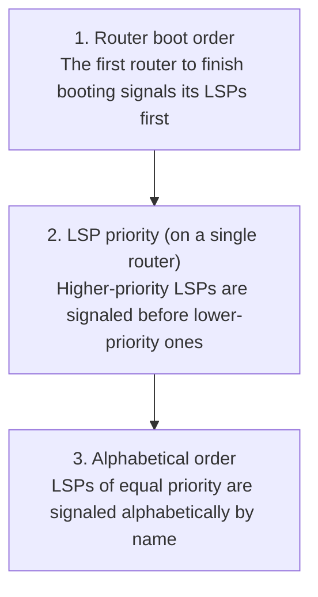
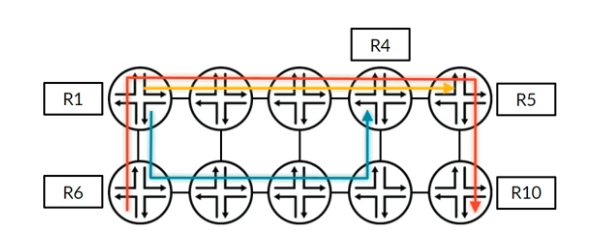
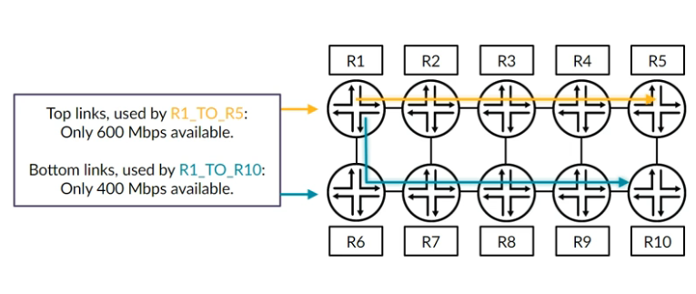
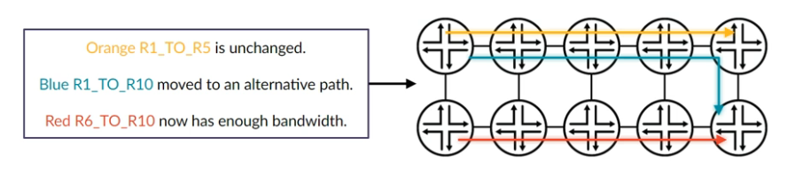

# RSVP: LSP Priorities

**Setup and hold priorities, preemption, bin packing and soft preemption**

> Study notes by [Nazirul Roslan](https://www.linkedin.com/in/nazirulroslan) · Junos MPLS Fundamentals · Part 08

← [Previous: RSVP: LSP Bandwidth Reservation](07-rsvp-bandwidth-reservation.md) · [Index](../README.md) · [Next: RSVP: CSPF, Tie-Breakers and Admin Groups](09-rsvp-cspf-tie-breakers-admin-groups.md) →

**Contents:** [1 The Problem](#module-1-the-preemption-problem-first-come-first-served) · [2 Setup & Hold](#module-2-the-solution-setup-and-hold-priorities) · [3 Bin Packing](#module-3-the-bin-packing-strategy) · [4 Configuration](#module-4-configuration-and-verification) · [5 Soft Preemption](#module-5-graceful-preemption-with-soft-preemption) · [6 Lab](#module-6-comprehensive-lab-bandwidth-and-priorities) · [7 Practice](#module-7-exam-practice-questions) · [8 Glossary](#module-8-glossary)

---

## Module 1: The Preemption Problem: "First-Come, First-Served"

**Objectives:**
- Explain the inefficiency of default RSVP path selection when bandwidth is constrained.
- Describe the factors that influence the order in which LSPs are established.
- Recognize how this ordering can lead to suboptimal routing or LSP failures.

### 1.1 A race for resources

Bandwidth reservation solves oversubscription, but it creates a new problem: **fairness**. With default settings, LSP establishment is a race. The LSPs that come up first get the best, shortest paths and reserve what they need. Later LSPs must calculate their paths from the remaining, depleted resources.

> [!TIP]
> **Learner's perspective: the race for parking.** Picture a parking garage with limited spaces. The first cars get the best spots next to the entrance. The last car might have to park on the roof, even if it's an ambulance on an emergency call. Default RSVP works the same way: first-come, first-served, regardless of how important the traffic is.

### 1.2 LSP establishment order

The order in which LSPs are signaled isn't random; it follows a clear hierarchy. Important LSPs can be starved of resources simply because they're later in the queue.



### 1.3 The unintended consequences

Three LSPs established in sequence on a network of 1 Gbps links:



| LSP | Order | Needs | Result |
|---|---|---|---|
| **Orange** | First | 400 Mbps | Takes the best path along the top and reserves its bandwidth. |
| **Blue** | Second | 700 Mbps | The top path only has 600 Mbps left, so it's forced onto the longer, suboptimal bottom path. |
| **Red** | Last | 400 Mbps | The bottom is constrained by blue and the top by orange, so it's forced onto an even longer, six-hop path. |

If the blue LSP carried critical voice traffic, this outcome would be unacceptable. Worse, if red had needed 700 Mbps it wouldn't have come up at all, even though there was technically enough total bandwidth in the network.

> [!IMPORTANT]
> **Key takeaway:** unmanaged reservations work on a first-come, first-served basis, which can cause inefficient routing and outages for important LSPs. We need a way to express importance and fairness: **LSP priorities**.

---

## Module 2: The Solution: Setup and Hold Priorities

**Objectives:**
- Define setup priority and hold priority.
- Explain the preemption rule based on these two values.
- State the Junos OS default priority values and their implications.
- Recognize the configuration constraint that prevents preemption loops.

### 2.1 Introducing priorities

RSVP solves the first-come, first-served problem with two priority values per LSP. Both range from **0 (best)** to **7 (worst)** and only matter during bandwidth contention.

| Priority | Describes | Used when |
|---|---|---|
| **Setup priority** | The LSP's **aggressiveness** | A new LSP is trying to establish and hits a link without enough bandwidth that another LSP is using. |
| **Hold priority** | The LSP's **defensiveness** | An already-active LSP defends its resources against preemption attempts from new LSPs. |

### 2.2 The preemption rule

> [!IMPORTANT]
> **The golden rule of preemption.** A new LSP can preempt an existing LSP if, and only if:
>
> **New LSP's setup priority < existing LSP's hold priority** (numerically lower = better)

### 2.3 Junos OS defaults and constraints

By default Junos gives every LSP highly defensive priorities:

- **Default setup priority: 7** (worst)
- **Default hold priority: 0** (best)

So with default settings, a new LSP can never preempt an existing one, and an existing LSP can never be preempted.

> [!WARNING]
> **Common pitfall and exam tip: preventing loops.** If two LSPs could keep preempting each other, you'd get an endless preemption loop. To prevent it, Junos enforces a rule at commit time: **an LSP's setup priority can never be better (numerically lower) than its own hold priority.** Configure it the other way round and the commit fails. This is a common exam "trick question".

---

## Module 3: The "Bin Packing" Strategy

**Objectives:**
- Explain the bin packing problem as it applies to LSP path selection.
- Describe the strategy for assigning priorities to solve it.

### 3.1 The bin packing problem

Sometimes an LSP fails not because there isn't enough total bandwidth, but because the bandwidth is fragmented inefficiently. An LSP with several equal-cost options might randomly pick one that starves a future LSP. This is the **bin packing problem**.



The orange LSP (400 Mbps) and blue LSP (600 Mbps) have taken separate paths. Now a new red LSP from R6 to R10 needing 700 Mbps can't come up, because both paths are partly used. Had blue taken the top path alongside orange, the bottom path would be completely free and red would come up easily.

### 3.2 The suitcase analogy and solution

> [!TIP]
> **Pack your network like a suitcase for a holiday:** put the big, inflexible items in first.

| Strategy | What happens |
|---|---|
| ❌ **Incorrect:** small items first | Low-bandwidth LSPs spread out inefficiently, leaving no contiguous space for the high-bandwidth LSPs. |
| ✅ **Correct:** big items first | Give high-bandwidth LSPs better (lower) priorities so they get the resources they need. The smaller, more flexible LSPs fit into the remaining gaps. |

**The bin packing method:**
1. Tag your higher-bandwidth LSPs with higher priority.
2. Larger LSPs can now force smaller LSPs to calculate a different path.
3. The priority system automatically moves the smaller LSPs to another path.
4. The smaller LSPs fit into the remaining gaps.

### 3.3 The result of a good priority strategy

Give the red R6→R10 LSP (700 Mbps) a higher priority and it can preempt the blue R1→R10 LSP (600 Mbps), forcing blue onto the top path. All three LSPs now come up.



---

## Module 4: Configuration and Verification

**Objectives:**
- Configure custom priorities on an individual LSP.
- Configure global default priorities using `apply-groups`.
- Verify priority settings and their effect on the TED.

### 4.1 Per-LSP priority configuration

Override the defaults on any LSP with the `priority` statement.

```
[edit protocols mpls]
set label-switched-path R1_TO_R5 priority 5 4
```

- The first number is the **setup priority** (5).
- The second number is the **hold priority** (4).

> [!WARNING]
> Changing the priority on a live LSP can make it flap. Make such changes in a maintenance window.

### 4.2 Global priority configuration with `apply-groups`

Setting a new network-wide default priority for all LSPs is easy with a configuration group.

Creating and applying a global LSP priority group:

```
[edit]
set groups RSVP_LSP_PRIORITY protocols mpls label-switched-path <*> priority 5 4
set apply-groups RSVP_LSP_PRIORITY
```

Using a wildcard to apply priorities only to LSPs designated for voice traffic:

```
[edit]
set groups VOICE_LSPS protocols mpls label-switched-path "<VOICE-*>" priority 2 1
set apply-groups VOICE_LSPS
```

This applies a high priority (2 1) to any LSP whose name starts with `VOICE-`.

> [!NOTE]
> The original guide used `"VOICE-.*"`. Junos configuration groups don't use regular expressions: they match names with shell-style wildcards inside angle brackets (`<*>`, `<VOICE-*>`). Without the angle brackets the group would only apply to an LSP literally named `VOICE-.*`.

### Verification toolkit

`show mpls lsp detail` shows the configured priorities:

```
naz@R1> show mpls lsp name R1_TO_R5 detail
...
*Primary            State: Up
  Priorities: 5 4
  Bandwidth: 400Mbps
...
```

`show configuration | display inheritance no-comments` verifies inherited (group) settings:

```
naz@R6> show configuration protocols mpls label-switched-path R6_TO_R10 | display inheritance no-comments

label-switched-path R6_TO_R10 {
    to 192.168.1.10;
    bandwidth 400m;
    priority 5 4;
}
```

`show ted database extensive` shows per-priority bandwidth accounting:

```
naz@R1> show ted database extensive R2.00
...
  To: R3.00(192.168.1.3)...
    Available BW[priority]bps:
      [0] 1000Mbps
      [1] 1000Mbps
      [2] 1000Mbps
      [3] 1000Mbps
      [4] 600Mbps
      [5] 600Mbps
      [6] 600Mbps
      [7] 600Mbps
...
```

**Output analysis:** an LSP with **hold priority 4** has reserved 400 Mbps. The reservation only counts against its own priority level (4) and all worse levels (5, 6, 7). The full 1000 Mbps is still available to higher-priority LSPs (0–3), because they could preempt it.

---

## Module 5: Graceful Preemption with `soft-preemption`

**Objectives:**
- Differentiate between default (disruptive) preemption and graceful (soft) preemption.
- Configure `soft-preemption` on an LSP.
- Analyze LSP logs to verify the make-before-break process.

### 5.1 The problem: disruptive by default

Junos RSVP LSPs support preemption by default. When bandwidth is insufficient, a higher-priority LSP (lower setup priority value) can preempt an existing lower-priority LSP. By default this is **disruptive**: the low-priority LSP is torn down immediately, causing a traffic outage. Only after the teardown does the ingress router calculate and signal a new path.

Logs from a **default (disruptive)** preemption on the low-priority LSP:

```
naz@R1> show mpls lsp name R1_TO_R5 extensive
{snip}
25 Mar 1 12:29:01.655 Deselected as active
24 Mar 1 12:29:01.655 ResvTear received
23 Mar 1 12:29:01.654 10.1.2.1 Down
22 Mar 1 12:29:01.653 10.2.3.3 Requested bandwidth unavailable
21 Mar 1 12:29:01.653 10.2.3.3: Session preempted
{snip}
```

### 5.2 The solution: `soft-preemption`

To avoid the downtime, configure `soft-preemption` on the LSP that is likely **to be preempted** (the lower-priority LSP). This enables make-before-break.

```
[edit protocols mpls]
set label-switched-path R1_TO_R5 soft-preemption
```

The ingress router now receives a `PathErr` message asking it to reroute, and it gracefully reroutes the LSP without immediately tearing down the original path.

Logs from a **graceful (soft)** preemption on the same low-priority LSP:

```
naz@R1> show mpls lsp name R1_TO_R5 extensive
{snip}
20 Mar 1 12:59:59.071 Make-before-break: Cleaned up old instance
19 Mar 1 12:59:24.563 Make-before-break: switched to new instance
18 Mar 1 12:59:24.228 Up
{snip}
12 Mar 1 12:59:23.958 Originate make-before-break call
11 Mar 1 12:59:23.958 CSPF: computation result accepted ...
10 Mar 1 12:59:23.957 10.3.3.3 Reroute request due to soft preemption received
{snip}
```

The logs show make-before-break (read bottom to top): a reroute is requested, a new path is calculated, the new instance comes up and traffic switches to it, and only then is the old instance cleaned up. No packet loss.

### 5.3 Verifying RSVP LSP status and preemption events

| Command | Use it to |
|---|---|
| `show mpls lsp name <lsp-name> extensive` | Review CSPF results, preemption status and path selection logs |
| `show log messages \| match preempt` | Check whether an LSP has been preempted or rerouted |
| `show rsvp session` | Confirm active RSVP sessions and resource reservations |

Example output:

```
Ingress LSP: 1 sessions

To              From            State   Rt Style Labelin Labelout LSPname
192.168.1.4     192.168.1.1     Up      0  1     -       300048   R1_TO_R4_600m_Low

Preemption: enabled
Soft preemption in progress: true
CSPF status: computation result accepted
Selected path: R1-R2-R3-R4
```

> [!NOTE]
> Treat this as an annotated summary rather than literal output. Real `show rsvp session` output shows only the session table (the `Style` column normally reads `1 FF` or `1 SE`). Preemption, CSPF and path details come from `show mpls lsp extensive` and `show rsvp session detail`.

### 5.4 Troubleshooting RSVP LSP preemption

If a high-priority LSP doesn't come up, or a low-priority LSP disappears unexpectedly, check:

| Check | Command |
|---|---|
| RSVP neighbors | `show rsvp neighbor` |
| TED availability | `show ted database` |
| Whether preemption occurred | `show log messages \| match preempt` |
| Whether soft-preemption is configured | `show configuration protocols mpls \| display set \| match soft-preemption` |

Correct preemption behavior depends on a populated TED, successful CSPF computation and correct LSP priority settings.

> [!NOTE]
> **Advanced concept: `soft-preemption` vs. `adaptive`.** Junos has two make-before-break mechanisms that are often confused:
> - `soft-preemption`: used by a **low-priority LSP** to move out of the way gracefully when a **different**, high-priority LSP preempts it.
> - `adaptive`: used by the **same LSP** to move itself gracefully to a new, better path that has become available, with no external preemption event.

---

## Module 6: Comprehensive Lab: Bandwidth and Priorities

This lab walks through bandwidth reservation and priorities end to end. You'll see the first-come, first-served problem, then fix it with priorities: first disruptively, then gracefully with soft preemption.

### Lab topology


All links are 1 Gbps. IGP metrics are equal on all links.

| Addressing | Format | Example |
|---|---|---|
| Loopbacks | `192.168.1.x/32` (x = router number) | R4 is `192.168.1.4` |
| Point-to-point | `10.x.y.z/24` (x, y = the two routers, z = this router) | On R2–R3, R2 is `10.2.3.2`, R3 is `10.2.3.3` |

### Part 1: Verify IS-IS on R1

**Goal:** confirm baseline IP connectivity by verifying the pre-configured IS-IS on R1.

**Reasoning:** RSVP relies on the IGP for reachability to LSP destinations and to populate the TED. Verifying the IGP is the mandatory first step.

Check for `Up` adjacencies to R2 and R5:

```
naz@R1> show isis adjacency
Interface           System        L State         Hold (secs) SNPA
ge-0/0/0.0          R2            2  Up                  24
ge-0/0/2.0          R5            2  Up                  19
```

Confirm R1 has learned the loopbacks of all other core routers:

```
naz@R1> show route protocol isis | match /32
192.168.1.2/32     *[IS-IS/18] 00:07:26, metric 100
192.168.1.3/32     *[IS-IS/18] 00:07:26, metric 110
192.168.1.4/32     *[IS-IS/18] 00:07:26, metric 120
192.168.1.5/32     *[IS-IS/18] 00:19:17, metric 100
192.168.1.6/32     *[IS-IS/18] 00:07:26, metric 110
192.168.1.7/32     *[IS-IS/18] 00:07:26, metric 120
192.168.1.8/32     *[IS-IS/18] 00:07:26, metric 130
```

### Part 2: Configure and verify MPLS and RSVP on R1

**Goal:** enable the control and data plane protocols for MPLS and RSVP signaling on R1.

**Reasoning:** interfaces must be explicitly enabled for MPLS forwarding (`family mpls`) and for the MPLS and RSVP control plane protocols.

```
set interfaces ge-0/0/0 unit 0 family mpls
set interfaces ge-0/0/2 unit 0 family mpls
set protocols mpls interface ge-0/0/0.0
set protocols mpls interface ge-0/0/2.0
set protocols rsvp interface ge-0/0/0.0
set protocols rsvp interface ge-0/0/2.0
```

Check that MPLS and RSVP are active on the core interfaces:

```
naz@R1> show mpls interface
Interface        State       Administrative groups (x: extended)
ge-0/0/0.0       Up          
ge-0/0/2.0       Up          

naz@R1> show rsvp neighbor
RSVP neighbor: 4 learned
Address          Idle  Up/Dn LastChange   HelloInt HelloTx/Rx  MsgRcvd
192.168.1.2         0    1/0       00:01:54        9      13/13        0
192.168.1.5         0    1/0       00:01:54        9      13/13        0
10.1.2.2            0    1/0       00:01:54        9      14/13        0
10.1.5.5            0    1/0       00:01:54        9      14/13        0
```

### Part 3: Demonstrate the bandwidth constraint problem

**Goal:** create two LSPs that compete for bandwidth on the same path, and see CSPF force the second onto a longer route.

**Reasoning:** this is the core first-come, first-served problem. The first LSP reserves resources on the best path and constrains every later LSP.

On R1, configure the first LSP:

```
set protocols mpls label-switched-path R1_TO_R4_600m to 192.168.1.4 bandwidth 600m
```

On R2, configure the second LSP:

```
set protocols mpls label-switched-path R2_TO_R4_600m to 192.168.1.4 bandwidth 600m
```

On R2, check the new LSP's path. R1's LSP already holds 600 Mbps on R1-R2-R3-R4, so both R2-R3 and R3-R4 have only 400 Mbps left. R2's LSP is forced onto the longer path via R6, R7 and R8:

```
naz@R2> show mpls lsp name R2_TO_R4_600m extensive
...
Computed ERO (S [L] denotes strict [loose] hops): (CSPF metric: 40)
 10.2.6.6 S 10.6.7.7 S 10.7.8.8 S 10.4.8.4 S
...
```

> [!NOTE]
> Corrected from the original guide, which showed `(CSPF metric: 30)` and the ERO `10.2.6.6 S 10.6.7.7 S 10.3.7.3 S 10.3.4.4 S` (R2-R6-R7-R3-R4). That path can't be valid: it uses the R3-R4 link, which only has 400 Mbps left after R1's 600 Mbps LSP, so CSPF prunes it. The only path with 600 Mbps free is R2-R6-R7-R8-R4: four hops, metric 40 at 10 per link.

If you commit R2's configuration first, R1's LSP is the one pushed onto the longer bottom path instead.

**Cleanup:** delete both LSPs before the next part.

### Part 4: Demonstrate disruptive preemption

**Goal:** configure a low-priority LSP, then preempt it with a new high-priority LSP, and observe the disruptive default behavior.

**Reasoning:** this is the heart of the lab. Priorities solve first-come, first-served, but the default behavior causes a brief traffic outage.

On R1, configure the low-priority LSP:

```
set protocols mpls label-switched-path R1_TO_R4_600m_Low to 192.168.1.4 bandwidth 600m
set protocols mpls label-switched-path R1_TO_R4_600m_Low priority 4 3
```

On R2, configure the high-priority LSP:

```
set protocols mpls label-switched-path R2_TO_R4_600m_High to 192.168.1.4 bandwidth 600m
set protocols mpls label-switched-path R2_TO_R4_600m_High priority 2 1
```

The high-priority LSP's setup priority (2) is better than the low-priority LSP's hold priority (3), so it preempts it on R2-R3-R4.

On R1, check the low-priority LSP's logs. It was preempted and torn down before it found a new path:

```
naz@R1> show mpls lsp name R1_TO_R4_600m_Low extensive
...
 LSPevent: Session preempted
...
 LSPevent: ResvTear received
...
 LSPevent: Down
...
 LSPevent: CSPF: computation result accepted 10.1.5.5 ...
 LSPevent: Up
...
```

**Cleanup:** remove both LSPs with `rollback 1` (then `commit`) on both routers before continuing.

> [!TIP]
> You can see what each rollback number would change with `show | compare rollback <n>`:
>
> ```
> naz@R2# show | compare rollback 1 
> [edit protocols mpls]
> +    label-switched-path R2-to-R4-600m {
> +        to 192.168.1.4;
> +        bandwidth 600m;
> +    }
> ```

### Part 5: Demonstrate graceful (soft) preemption

**Goal:** repeat the preemption scenario with `soft-preemption` configured, for a graceful, non-disruptive reroute.

**Reasoning:** this is the best-practice way to handle LSP preemption in production and avoid traffic loss.

On R1, re-create the low-priority LSP, adding `soft-preemption`:

```
set protocols mpls label-switched-path R1_TO_R4_600m_Low to 192.168.1.4 
set protocols mpls label-switched-path R1_TO_R4_600m_Low bandwidth 600m 
set protocols mpls label-switched-path R1_TO_R4_600m_Low priority 4 3 
set protocols mpls label-switched-path R1_TO_R4_600m_Low soft-preemption
```

On R2, re-create the high-priority LSP:

```
set protocols mpls label-switched-path R2_TO_R4_600m_High to 192.168.1.4
set protocols mpls label-switched-path R2_TO_R4_600m_High bandwidth 600m
set protocols mpls label-switched-path R2_TO_R4_600m_High priority 2 1
```

On R1, check the low-priority LSP's logs. You now see make-before-break:

```
naz@R1> show mpls lsp name R1_TO_R4_600m_Low extensive
...
20 Mar 9 21:51:17.270 Make-before-break: Cleaned up old instance
19 Mar 9 21:50:47.813 Make-before-break: Switched to new instance
...
17 Mar 9 21:50:47.300 Up
...
12 Mar 9 21:50:47.248 Originate make-before-break call
11 Mar 9 21:50:47.248 CSPF: computation result accepted
...
```

---

## Module 7: Exam Practice Questions

**Question 1.** A new LSP with `priority 3 2` tries to signal over a path used by an existing LSP with `priority 4 3`. There isn't enough bandwidth for both. Which LSP gets the path?

- A) The existing LSP, because its setup priority is better.
- B) The new LSP, because its setup priority (3) is equal to the existing LSP's hold priority (3).
- C) The new LSP, because its setup priority (3) is not better than the existing LSP's hold priority (3).
- D) The existing LSP, because the new LSP's setup priority (3) is not numerically lower than the existing LSP's hold priority (3).

<details><summary>Answer</summary>

**D.** Preemption only happens if the new LSP's setup priority is strictly better (numerically lower) than the existing LSP's hold priority. 3 is not less than 3, so the existing LSP wins the tie and the new LSP must find another path.

</details>

**Question 2.** An engineer wants to make sure a low-priority LSP doesn't cause a traffic outage when a more important LSP preempts it. What should be configured?

- A) The `adaptive` statement on the high-priority LSP.
- B) The `soft-preemption` statement on the high-priority LSP.
- C) The `adaptive` statement on the low-priority LSP.
- D) The `soft-preemption` statement on the low-priority LSP.

<details><summary>Answer</summary>

**D.** `soft-preemption` goes on the LSP that will be preempted (the lower-priority one), so it can perform a graceful make-before-break reroute.

</details>

---

## Module 8: Glossary

| Term | Definition |
|---|---|
| **Bin packing problem** | A resource allocation issue where inefficient placement of small items (low-bandwidth LSPs) stops large items (high-bandwidth LSPs) fitting, even though there's enough total capacity. |
| **Hold priority** | An LSP's "defensiveness" (0 best to 7 worst), used to protect its resources from preemption by new LSPs. |
| **Preemption** | A higher-priority LSP forcing a lower-priority LSP to be torn down and rerouted off a shared, constrained path. |
| **Setup priority** | An LSP's "aggressiveness" (0 best to 7 worst) when establishing a path and claiming resources from existing, lower-priority LSPs. |
| **Soft preemption** | A graceful, make-before-break mechanism that lets a preempted LSP find and switch to a new path before its original path is torn down, preventing traffic loss. |

---

← [Previous: RSVP: LSP Bandwidth Reservation](07-rsvp-bandwidth-reservation.md) · [Index](../README.md) · [Next: RSVP: CSPF, Tie-Breakers and Admin Groups](09-rsvp-cspf-tie-breakers-admin-groups.md) →
