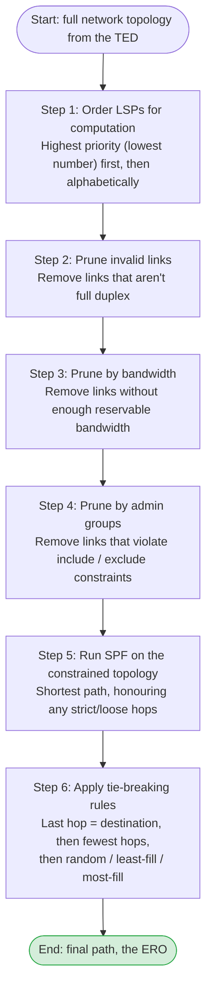
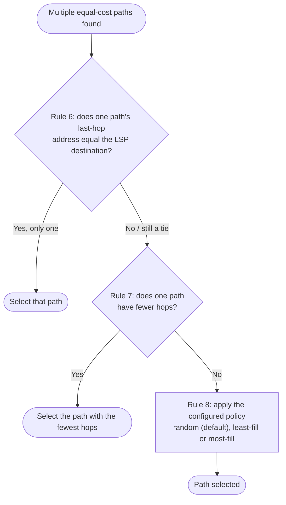
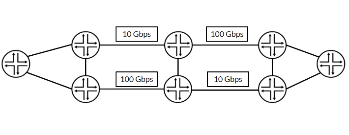
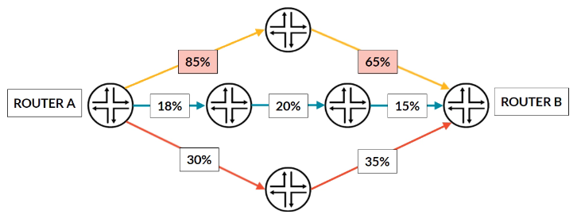
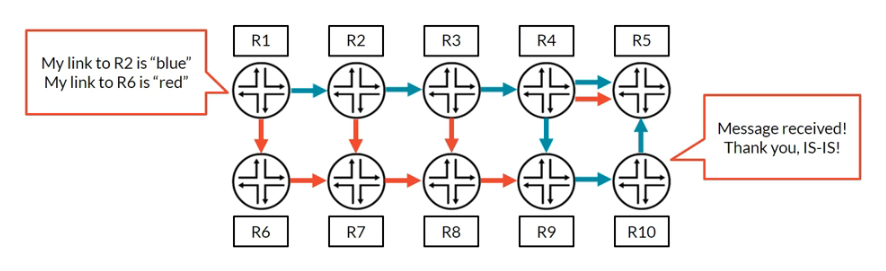
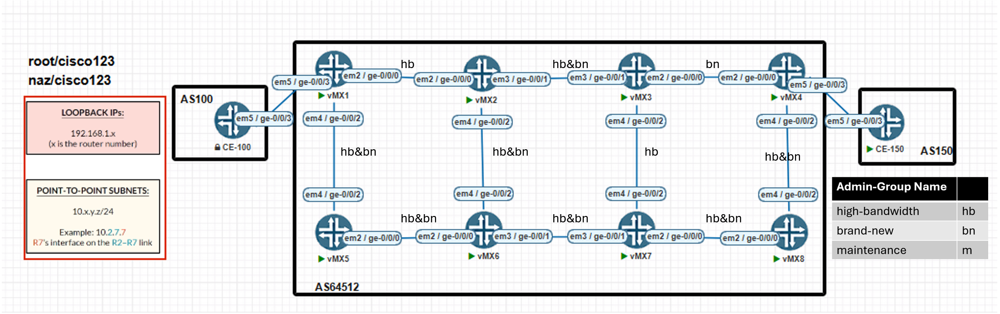

# RSVP: CSPF, Tie-Breakers and Admin Groups

**How CSPF prunes and picks paths, tie-breaking policies, and link coloring**

> Study notes by [Nazirul Roslan](https://www.linkedin.com/in/nazirulroslan) · Junos MPLS Fundamentals · Part 09

← [Previous: RSVP: LSP Priorities](08-rsvp-lsp-priorities.md) · [Index](../README.md) · [Next: LSP Failures, Errors and Session Maintenance](10-lsp-failures-errors-session-maintenance.md) →

**Contents:** [1 CSPF](#module-1-the-cspf-algorithm) · [2 Tie-Breaking](#module-2-cspf-tie-breaking-rules) · [3 Admin Groups](#module-3-administrative-groups-link-coloring) · [4 Lab](#module-4-comprehensive-lab-path-selection-with-admin-groups) · [5 Practice](#module-5-exam-practice-questions) · [6 Glossary](#module-6-glossary)

---

## Module 1: The CSPF Algorithm

**Objectives:**
- Describe how Constrained Shortest Path First (CSPF) enhances the standard SPF algorithm for traffic engineering.
- Visualize the sequential steps CSPF takes to prune the topology and calculate an LSP path.
- Define the key bandwidth terms used in CSPF calculations.

### 1.1 Introduction to CSPF

Traffic-engineered LSPs need something smarter than the plain SPF algorithm IGPs use. **CSPF** is an enhanced SPF that calculates paths from the **Traffic Engineering Database (TED)**. The TED holds richer information than a normal link-state database: bandwidth availability, admin groups and TE metrics. CSPF's main job is to **prune** (remove) links that don't meet the LSP's constraints, then run SPF on the remaining, partial topology to find the best path.

> [!NOTE]
> **Do you remember? ERO vs. RRO.** CSPF's output is the **Explicit Route Object (ERO)**, a list of strict hops the LSP must take, carried in the RSVP Path message. As the Path message crosses the network, the **Record Route Object (RRO)** is built, recording the path actually taken. A `no-cspf` LSP has no computed ERO (only the hops of an explicit path, if you configure one); otherwise the path follows the IGP hop by hop.

### 1.2 The CSPF calculation process waterfall

CSPF follows a strict, ordered process. Think of it as a waterfall: the full topology is filtered through several stages until only valid paths remain.



### 1.3 Key bandwidth terminology

| Term | Meaning |
|---|---|
| **Reservable bandwidth** | The total bandwidth an interface offers to RSVP. By default the physical link speed, but changeable with oversubscription or undersubscription. |
| **Available bandwidth** | Reservable bandwidth minus what existing LSPs have already reserved on the link. |
| **Available bandwidth ratio** | Available bandwidth relative to reservable bandwidth, as a percentage. Used for tie-breaking. |

---

## Module 2: CSPF Tie-Breaking Rules

**Objectives:**
- Describe the options available to an RSVP LSP when several equal-cost paths exist.
- Illustrate the CSPF tie-breaking decision process.
- Configure and verify the different tie-breaking policies.

### 2.1 The CSPF tie-break decision tree

When CSPF finds several paths of equal IGP cost after pruning, it follows a fixed decision tree to pick one. (The rule numbers follow Juniper's documented list of CSPF path selection rules.)



> [!NOTE]
> The original guide went straight from equal cost to hop count. Junos first prefers the path whose last-hop address is the LSP's destination address (rule 6), then the fewest hops (rule 7), then the load-balancing policy (rule 8). The rule numbers 7 and 8 in the original only make sense with rule 6 in place.

### 2.2 Tie-breaking policies

Configure one of three policies for the final decision.

> [!TIP]
> **Exam tip: it's all relative!** Fullness is **not** judged by absolute available bandwidth (say, 60 Gbps). It's judged by the **available bandwidth ratio**. A 10G link with 90% available counts as "less full" than a 100G link with only 60% available.



| Policy | Chooses | Purpose |
|---|---|---|
| **`random`** (default) | Any of the equal paths | Spreads LSPs across all equal-cost paths in a roughly even distribution. No configuration needed, but you can set it explicitly for clarity. |
| **`least-fill`** | The path with the **largest** available bandwidth ratio (the "least full") | Balances load evenly across paths based on proportional usage. |
| **`most-fill`** | The path with the **smallest** available bandwidth ratio (the "most full") | Avoids the bin packing problem: consolidates smaller LSPs onto already-used paths, keeping other paths free for future large LSPs. |

> [!NOTE]
> A path's ratio is judged by its bottleneck: Juniper describes `least-fill` and `most-fill` in terms of each path's **minimum** available bandwidth ratio across its links.

> [!NOTE]
> **Do you remember? Interface subscription.** The ratio depends on the **reservable** bandwidth. Change it with `set protocols rsvp interface <interface> subscription <percent>` to oversubscribe (e.g. 200%) or undersubscribe (e.g. 50%) a link. That directly changes the ratio used in tie-breaking.

Configure the policy directly under the LSP:

```
[edit protocols mpls]
set label-switched-path LSP_TO_R5 to 192.168.1.5 most-fill

[edit protocols mpls]
set label-switched-path LSP_TO_R6 to 192.168.1.6 least-fill
```

### 2.3 `least-fill` vs. `most-fill` visualized

All three paths from Router A to Router B have the same IGP cost. Which path is chosen?



Before any ratio is checked, **rule 7** applies: pick the path with the fewest hops. The middle blue path has 3 hops; the top and bottom paths have 2. So blue is eliminated first under **either** policy.

| Policy | Result |
|---|---|
| **`least-fill`** | Picks the largest available ratio. The top orange path (85% and 65%) beats the bottom path (30% and 35%), so the **top orange path** is selected to balance the load. |
| **`most-fill`** | Picks the smallest available ratio. Between the two remaining paths, the **bottom red path** (30%/35%) is fuller than the top path (85%/65%), so it's selected. |

---

## Module 3: Administrative Groups (Link Coloring)

**Objectives:**
- Explain how LSPs can be configured to use or avoid links based on admin group tags.
- Describe how admin groups are defined and applied.
- Understand how admin groups are advertised in the IGP.

### 3.1 Concept and configuration

**Administrative groups**, also called **link coloring** or **affinity bits**, let you put arbitrary tags on links. CSPF uses the tags as constraints to prefer or avoid paths. Configuration is a two-step process:

1. **Define admin groups globally:** under `protocols mpls admin-groups`, define up to 32 groups, mapping a name to a number from 0 to 31.
2. **Apply groups to interfaces:** under `protocols mpls interface <interface>`, apply the groups. The application is **unidirectional**: it colors the link in the outgoing direction from this router only.

> [!WARNING]
> **Critical configuration note.** The group **number** (0–31) is what the IGP advertises. The **name** is only locally significant. You **must** deploy exactly the same name-to-number mapping on every router. Mismatched mappings are a common cause of unexpected pathing.

Step 1, define global groups; step 2, apply them to an interface:

```
[edit protocols mpls]
set admin-groups HIGH_BANDWIDTH 1
set admin-groups BRAND_NEW 2

set interface ge-0/0/2.0 admin-group [ HIGH_BANDWIDTH BRAND_NEW ]
```

### 3.2 Advertisement and the 32-bit mask

OSPF and IS-IS advertise a link's admin groups (with their TE extensions) as a single **32-bit value**. Each bit maps to one of the 32 groups (bit 0 to bit 31). A bit set to `1` means the link is a member of that group, so one link can belong to several groups at once.



**Example: bitmask for group 1.** An interface in only admin group `1` has this mask:

```
00000000 00000000 00000000 00000010
```

Bit 31 is on the far left and bit 0 on the far right; the `1` sits in the bit 1 position.

> [!NOTE]
> **Bit order for admin groups:** the highest-order (last) bit is bit 31, and the lowest-order (first) bit is bit 0.

### 3.3 LSP constraints

Three kinds of admin group constraint can be applied to an LSP. Know their precedence.

| Constraint | The path must... |
|---|---|
| `include-any` | Use only links tagged with **at least one** of the listed groups |
| `include-all` | Use only links tagged with **all** of the listed groups |
| `exclude` | Avoid every link tagged with **at least one** of the listed groups |

> [!IMPORTANT]
> **Rule of precedence:** `exclude` always wins. A link tagged with an excluded group is pruned, even if it also carries a group that matches `include-any` or `include-all`.

### 3.4 Advanced concept: extended admin groups

Standard admin groups give you 32 colors. Larger networks may need more. Junos supports **Extended Administrative Groups (EAGs)**, which greatly increase the number of groups. They're advertised by the IGP in an extended admin group sub-TLV (RFC 7308) and can also be carried in BGP Link-State (BGP-LS), which suits large, multi-domain networks.

Full configuration is beyond the JNCIS-SP scope. A common use case is giving each data center or region its own EAG, so a single policy can steer LSPs towards or away from a whole site.

> [!NOTE]
> The original guide said EAGs "are defined as community values and are carried in BGP-LS". EAGs are primarily an IGP TE attribute (RFC 7308); BGP-LS is just one way to export them, for example to a controller.

---

## Module 4: Comprehensive Lab: Path Selection with Admin Groups

You'll use admin groups to enforce path selection policy. The lab simulates a real maintenance scenario: gracefully steering traffic away from a router that's about to be worked on.

The lab assumes a working 8-router topology with the following already configured (see earlier parts):
- Interface and loopback IP addressing.
- IS-IS as the IGP on all core routers, with full loopback reachability.
- MPLS and RSVP on all core-facing interfaces.

### Part 1: Topology and admin group setup

**Goal:** define three admin groups globally and apply them to specific interfaces, ready for policy-based path calculation.

**Reasoning:** a consistent, network-wide admin group definition is the foundation of predictable TE. Coloring the links lets us influence CSPF later.



| Admin group name | Short label |
|---|---|
| high-bandwidth | hb |
| brand-new | bn |
| maintenance | m |

**Configuration (all routers):**

```
[edit protocols mpls]
set admin-groups high-bandwidth 10
set admin-groups brand-new 20
set admin-groups maintenance 30
```

Assign the admin groups as shown in the diagram. Example configs:

```
# On R1
set protocols mpls interface ge-0/0/0.0 admin-group high-bandwidth

# On R4
set protocols mpls interface ge-0/0/2.0 admin-group brand-new
```

Example of the resulting `protocols mpls` interface configuration, including an `interface all` statement:

![Junos config: interface lo0.0; interface ge-0/0/0.0 with admin-group [ high-bandwidth brand-new ]; interface ge-0/0/2.0 with admin-group high-bandwidth; interface all with admin-group [ high-bandwidth brand-new ]](images/09-admin-groups-interface-config.png)

> [!NOTE]
> Because admin groups are unidirectional, each router colors only its own outgoing side of a link. Configure both ends to match the diagram, or the two directions of a link can end up with different colors.

**Verification:** on R1 and R4, confirm the admin groups are applied to the interfaces.

```
naz@R1> show mpls interface
Interface        State       Administrative groups (x: extended)
ge-0/0/0.0       Up          high-bandwidth
ge-0/0/2.0       Up          brand-new
                             high-bandwidth
...

naz@R4> show mpls interface
Interface        State       Administrative groups (x: extended)
ge-0/0/0.0       Up          high-bandwidth
ge-0/0/2.0       Up          brand-new
                             high-bandwidth
...
```

### Part 2: Constraining an LSP with `include-any`

**Goal:** create an LSP from R1 to R4 whose path uses links colored **either** `high-bandwidth` or `brand-new`.

**Reasoning:** this shows `include-any` logic. CSPF considers any path that meets at least one of the criteria, which usually gives the metrically shortest valid path.

**Configuration (on R1):**

```
set protocols mpls label-switched-path R1_TO_R4_ANY to 192.168.1.4
set protocols mpls label-switched-path R1_TO_R4_ANY admin-group include-any [ high-bandwidth brand-new ]
```

**Verification:** the top path (R1-R2-R3-R4) has the required colors and is metrically shortest, so CSPF selects it.

```
naz@R1> show mpls lsp name R1_TO_R4_ANY detail
...
          Include Any: brand-new high-bandwidth
    Computed ERO (S [L] denotes strict [loose] hops): (CSPF metric: 30)
 10.1.2.2 S 10.2.3.3 S 10.3.4.4 S 
    Received RRO (ProtectionFlag 1=Available 2=InUse 4=B/W 8=Node 10=SoftPreempt 20=Node-ID):
          10.1.2.2 10.2.3.3 10.3.4.4
...
```

### Part 3: Maintenance scenario with `exclude`

**Goal:** simulate a maintenance window by tagging transit router R3 with the `maintenance` group, and have the LSP gracefully reroute around it.

**Reasoning:** a powerful real-world use of admin groups. `exclude` combined with an `optimize-timer` lets operators drain traffic from a device non-disruptively before taking it offline.

**Configuration (on R3):**

```
set protocols mpls interface all admin-group maintenance
#or
wildcard range set interface ge-0/0/[0-2] admin-group maintenance
```

The `wildcard range` form is entered at the `[edit protocols mpls]` level. Result on R3: every core interface now carries `maintenance` alongside its existing colors.

![R3 at [edit protocols mpls]: run show mpls interface lists ge-0/0/0.0 (maintenance, brand-new), ge-0/0/1.0 (maintenance, high-bandwidth) and ge-0/0/2.0 (maintenance, high-bandwidth), after the command wildcard range set interface ge-0/0/[0-2] admin-group maintenance](images/09-admin-groups-show-mpls-interface.png)

> [!WARNING]
> On R3 the core interfaces already have their own `admin-group` statements. Settings under a specific interface override `interface all`, so `interface all admin-group maintenance` may not add `maintenance` to those interfaces. The `wildcard range` command adds it to each interface directly, as the output above shows. Always verify with `show mpls interface`.

**Configuration (on R1):**

```
# Add the maintenance as exclude in the LSP
set protocols mpls label-switched-path R1_TO_R4_ANY admin-group exclude maintenance

# Enable a fast optimization timer for the lab
set protocols mpls optimize-timer 10
```

> [!NOTE]
> `optimize-timer` is usually set per LSP (`set protocols mpls label-switched-path <name> optimize-timer <seconds>`). It's needed here because recoloring R3's links is a TED change, not a change to the LSP, so the existing LSP only moves when it's reoptimized. Tagging only R3's interfaces is enough for transit traffic: admin groups are unidirectional, but any path through R3 must leave R3 on one of its tagged links.

**Verification:** after the optimize timer expires, the LSP recalculates its path. The new ERO bypasses R3. There are two equal five-hop options (R1-R2-R6-R7-R8-R4 or R1-R5-R6-R7-R8-R4); in this run CSPF picked R1-R2-R6-R7-R8-R4.

```
naz@R1> show mpls lsp name R1_TO_R4_ANY detail 
...
    OptimizeTimer: 10
    SmartOptimizeTimer: 180
          Include Any: brand-new high-bandwidth    Exclude: maintenance
    Reoptimization in 1 second(s).
    Computed ERO (S [L] denotes strict [loose] hops): (CSPF metric: 50)
 10.1.2.2 S 10.2.6.6 S 10.6.7.7 S 10.7.8.8 S 10.4.8.4 S 
...
```

The output now also shows the `OptimizeTimer`.

> [!WARNING]
> **Common pitfall: P vs. PE routers.** Use this maintenance technique only on **pure P (provider) routers** used for transit. If you tag a **PE (provider edge)** router's links with `maintenance`, any LSPs that start or end on that PE and exclude `maintenance` are torn down too, causing an outage for the services on that PE.

### Part 4: Constraining an LSP with `include-all`

**Goal:** create a new LSP from R1 to R3 that may only use links colored **both** `high-bandwidth` **and** `brand-new`.

**Reasoning:** this shows how strict `include-all` is. Links with only one of the two colors (R1–R2 is `hb` only, R3–R7 is `hb` only) are pruned, so CSPF can't use the direct top path. The only path whose links all carry both colors is R1-R5-R6-R2-R3. If no such path existed, the LSP would fail to come up.

**Configuration (on R1):**

```
set protocols mpls label-switched-path R1_TO_R3_ALL to 192.168.1.3
set protocols mpls label-switched-path R1_TO_R3_ALL admin-group include-all [ high-bandwidth brand-new ]
```

**Verification:** the LSP takes R1-R5-R6-R2-R3. This LSP doesn't exclude the `maintenance` group, so it can still go to R3.

```
naz@R1> show mpls lsp name R1_TO_R3_ALL extensive 
...
 Include All: brand-new high-bandwidth
    Reoptimization in 8 second(s).
    Computed ERO (S [L] denotes strict [loose] hops): (CSPF metric: 40)
 10.1.5.5 S 10.5.6.6 S 10.2.6.2 S 10.2.3.3 S 
...
```

> [!NOTE]
> The original guide said "no single link in the topology has both tags, so the LSP will fail", but the diagram and the output show it coming up on R1-R5-R6-R2-R3. The reasoning above has been corrected to match.

---

## Module 5: Exam Practice Questions

**Question 1.** An LSP is configured with `admin-group exclude [ a b ]`. A link is tagged with admin group `b`. Will CSPF consider this link?

- A) Yes, because the link is not tagged with group 'a'.
- B) No, because the `exclude` statement prunes links that match at least one of the specified groups.
- C) Only if the link is also tagged with an `include` group.
- D) Yes, because `exclude` only applies if all specified groups are present.

<details><summary>Answer</summary>

**B.** `exclude` behaves like "exclude any": if a link matches any group in the list, it's pruned from the CSPF topology.

</details>

**Question 2.** Two equal-cost paths with the same hop count exist. Path A has 50 Gbps available out of 100 Gbps (50% ratio). Path B has 8 Gbps available out of 10 Gbps (80% ratio). With `most-fill`, which path is chosen?

- A) Path A, because it has more absolute available bandwidth.
- B) Path B, because it has the higher available bandwidth ratio.
- C) Path A, because it has the smaller available bandwidth ratio.
- D) A path will be chosen randomly, as `most-fill` is not the default.

<details><summary>Answer</summary>

**C.** `most-fill` picks the path with the smallest available bandwidth **ratio**. 50% is smaller than 80%, so Path A is chosen to consolidate traffic, leaving Path B freer for other LSPs.

</details>

**Question 3.** Which command creates an admin group named "Mgmt" that sets the last available bit?

- A) `set protocols mpls admin-groups mgmt 0`
- B) `set protocols mpls admin-groups mgmt 32`
- C) `set protocols mpls admin-groups mgmt 31`
- D) `set protocols mpls admin-groups mgmt 1`

<details><summary>Answer</summary>

**C.** The highest-order (last available) bit is bit 31. Group numbers run 0–31, so 32 is invalid.

</details>

---

## Module 6: Glossary

| Term | Definition |
|---|---|
| **Administrative groups** | Tags ("colors") on links that influence LSP path selection through include/exclude constraints. Also called affinity groups or link coloring. |
| **Available bandwidth ratio** | Available bandwidth compared to total reservable bandwidth on a link, used by CSPF for tie-breaking. |
| **CSPF (Constrained Shortest Path First)** | An enhanced SPF that uses the TED to calculate paths meeting constraints such as bandwidth and admin groups. |
| **`least-fill`** | Tie-breaking policy that selects the equal-cost path with the largest available bandwidth ratio, balancing load across links. |
| **`most-fill`** | Tie-breaking policy that selects the equal-cost path with the smallest available bandwidth ratio, consolidating traffic and leaving other paths free. |
| **Pruning** | CSPF removing links that don't meet an LSP's constraints before the final path calculation. |
| **Traffic Engineering Database (TED)** | A database of extended link-state information (bandwidth, admin groups and other TE attributes) used by CSPF. |

---

← [Previous: RSVP: LSP Priorities](08-rsvp-lsp-priorities.md) · [Index](../README.md) · [Next: LSP Failures, Errors and Session Maintenance](10-lsp-failures-errors-session-maintenance.md) →
