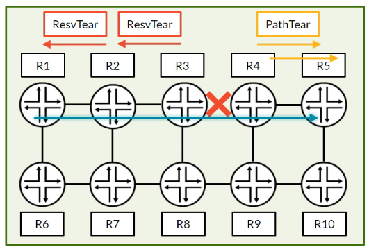

# LSP Failures, Errors and Session Maintenance

**How RSVP tears down broken LSPs, reports errors and keeps sessions alive**

> Study notes by [Nazirul Roslan](https://www.linkedin.com/in/nazirulroslan) · Junos MPLS Fundamentals · Part 10

← [Previous: RSVP: CSPF, Tie-Breakers and Admin Groups](09-rsvp-cspf-tie-breakers-admin-groups.md) · [Index](../README.md) · [Next: RSVP Primary and Secondary Paths](11-rsvp-primary-secondary-paths.md) →

**Contents:** [1 Failure and error messages](#module-1-rsvp-failure-and-error-messages) · [2 Session maintenance](#module-2-rsvp-session-maintenance) · [3 Lab](#module-3-lab-simulating-and-analyzing-an-lsp-failure) · [4 Exam practice](#module-4-exam-practice-questions) · [5 Glossary](#module-5-glossary)

---

## Module 1: RSVP Failure and Error Messages

**Objectives**

- Tell apart the messages that **tear down** an LSP from the messages that only **report errors**.
- Describe the purpose and direction of `PathTear`, `ResvTear`, `PathErr` and `ResvErr`.
- Understand that RSVP usually relies on other protocols (IGP, BFD) for fast failure detection.

### 1.1 Refresher: core RSVP messages

Before looking at failure messages, recap the two messages used to build an LSP.

| Message | Direction | Purpose |
|---|---|---|
| `Path` | Downstream (ingress → egress) | Requests the creation of an LSP and records the path taken in the RRO. |
| `Resv` | Upstream (egress → ingress) | Confirms the reservation and distributes labels back toward the ingress router. |

### 1.2 LSP teardown messages: `PathTear` and `ResvTear`

When a link or node in an LSP's path fails, the LSP must be torn down. Two messages remove the LSP state from the routers along the path.

RSVP itself is slow to detect failures. It almost always relies on faster protocols, such as the IGP (loss of adjacency) or BFD, to signal that a failure has happened.



- **`PathTear`**: sent **downstream** from the point of failure toward the egress router. In the diagram, R4 sends a `PathTear` to R5. Its job is to remove the **path state**.
- **`ResvTear`**: sent **upstream** from the point of failure toward the ingress router. In the diagram, R3 sends a `ResvTear` to R2, which forwards it to R1. Its job is to remove the **reservation state** and free any reserved bandwidth.

> [!TIP]
> **Learner's perspective: the components of downtime.** Recovery isn't instant. Total downtime is the sum of several steps: the time for the `ResvTear` to reach the ingress router, the time for the ingress to process it, the time to run a new CSPF calculation, and finally the time to signal the new path. Features like Fast Reroute are designed to cut this downtime to milliseconds.

### 1.3 Error reporting messages: `PathErr` and `ResvErr`

Unlike teardown messages, error messages do **not** tear down an LSP. Their only purpose is to report a problem. A `PathErr` is often sent at the same time as a `ResvTear` to tell the ingress router **why** the LSP was torn down.

- **`PathErr` (Path Error)**: sent **upstream** from the router that detects a problem toward the ingress router. It carries an error code describing the issue (for example "Bandwidth unavailable", "No route to destination", "Routing loop detected").
- **`ResvErr` (Reservation Error)**: sent **downstream** from the router that detects a problem toward the egress router. It's less common, but can report problems with the reservation state.

### 1.4 Message direction summary

| Message | Direction | Tears down LSP? | Purpose |
|---|---|---|---|
| `Path` / `PathTear` | Downstream (ingress → egress) | `PathTear` does | Request or tear down a path |
| `Resv` / `ResvTear` | Upstream (egress → ingress) | `ResvTear` does | Confirm or tear down a reservation |
| `PathErr` | Upstream (problem → ingress) | No | Report a path-related error |
| `ResvErr` | Downstream (problem → egress) | No | Report a reservation-related error |

> [!IMPORTANT]
> **Key takeaway:** the *Tear* messages remove state; the *Err* messages only report. `PathTear` and `ResvErr` travel downstream; `ResvTear` and `PathErr` travel upstream toward the ingress.

---

## Module 2: RSVP Session Maintenance

**Objectives**

- Explain the legacy "soft-state" model of RSVP and its limitations.
- Describe the reliable session maintenance features introduced in RFC 2961.
- Verify that the modern RSVP extensions are operational.

### 2.1 Legacy vs. modern session maintenance

The way RSVP keeps LSP state alive has evolved to improve scalability and reliability.

| Feature | Legacy "soft-state" model | Modern reliable model (RFC 2961) |
|---|---|---|
| State refresh | Periodic `Path` and `Resv` messages for every single LSP (every **30 s** by default) | Efficient **Summary Refresh (`Srefresh`)** messages refresh many LSPs in one message |
| Reliability | Unacknowledged; messages sent "best effort" | Reliable, using **Message IDs** and **Acknowledgments** |
| Failure recovery | Very slow. If a `Tear` message was lost, state only timed out after **3 missed refreshes** (the keep-multiplier) | Fast. Reliable messaging makes sure teardown messages are received and acted on quickly |
| Scalability | Poor: high control-plane overhead from per-LSP refreshes | Excellent: summary and bundled messages greatly reduce overhead |

> [!NOTE]
> The source quoted the soft-state timeout as "90 s" (3 × 30 s). That's the right order of magnitude, but the RFC 2205 state lifetime is actually (keep-multiplier + 0.5) × 1.5 × refresh-time, which with the Junos defaults (`refresh-time` 30 s, `keep-multiplier` 3) is about **157 s**. Either way, the point stands: waiting for soft state to expire is very slow.

RFC 2961 (RSVP Refresh Overhead Reduction) adds three main features: **message bundling**, **reliable message delivery** (Message ID and ACK), and **summary refresh**.

### 2.2 RSVP hello messages and timers

The RFC 2961 extensions make RSVP reliable, but many vendors (Juniper included) also use RSVP `hello` messages as a keepalive. In Junos they are sent every **9 seconds** by default. If a neighbor stops sending hellos, the adjacency times out and all LSPs crossing that link are torn down.

> [!WARNING]
> **Interoperability.** RSVP hellos are optional per the RFC. If a Junos router peers with a device that doesn't send hellos, Junos can't confirm that the neighbor supports the reliable extensions. In that case Junos falls back to the legacy soft-state refresh mechanism for all LSPs crossing that link, to stay compatible.

You can change the hello timer per interface:

```
[edit protocols rsvp]
set interface ge-0/0/0.0 hello-interval 5
```

### 2.3 Verification in Junos OS

According to the source, the reliable extensions are enabled by default in Junos 16.1 and later. Check that your router and its neighbor are using them with `show rsvp neighbor detail`:

```
naz@R1> show rsvp neighbor detail
RSVP neighbor: 1 learned
Address: 10.1.2.2, State: Up
  Last changed time: 00:15:30, Idle: 0 sec
  Hello: sent 103, received 103, interval 9 sec

Refresh reduction: operational

  Remote end: enabled, Ack-extension: enabled
```

The key line is **`Refresh reduction: operational`**: the modern, scalable session maintenance procedures are active between these two neighbors.

---

## Module 3: Lab: Simulating and Analyzing an LSP Failure

### Prerequisites

This lab assumes the 8-router lab topology used in earlier guides, already configured with:

- Interface and loopback IP addressing (loopbacks `192.168.1.x`, links `10.x.y.z/24`).
- IS-IS as the IGP on all core routers, with full loopback reachability.
- MPLS and RSVP on all core-facing interfaces.


Core interfaces (from the topology diagram):

| Link | Interfaces |
|---|---|
| R1–R2 | R1 ge-0/0/0 ↔ R2 ge-0/0/0 |
| R2–R3 | R2 ge-0/0/1 ↔ R3 ge-0/0/1 |
| R3–R4 | R3 ge-0/0/0 ↔ R4 ge-0/0/0 |
| R5–R6 | R5 ge-0/0/0 ↔ R6 ge-0/0/0 |
| R6–R7 | R6 ge-0/0/1 ↔ R7 ge-0/0/1 |
| R7–R8 | R7 ge-0/0/0 ↔ R8 ge-0/0/0 |
| Verticals | R1–R5, R2–R6, R3–R7, R4–R8 all on ge-0/0/2 |
| CEs | CE-100 ↔ R1 ge-0/0/3, CE-150 ↔ R4 ge-0/0/3 |

### Part 1: Baseline setup

**Goal:** build a working RSVP LSP from R1 to R4 as a baseline for the failure test.

**Reasoning:** you need a stable, operational LSP before you can watch how the control plane reacts to a failure.

Configuration (on R1):

```
set protocols mpls label-switched-path R1_TO_R4 to 192.168.1.4
```

Verification (on R1): confirm the LSP is `Up` and has a computed path.

```
naz@R1> show mpls lsp name R1_TO_R4
Ingress LSP: 1 sessions
To           From         State Rt ActivePath LSPname
192.168.1.4  192.168.1.1  Up    0 * R1_TO_R4
Total 1 displayed, Up 1, Down 0
```

### Part 2: Simulating a link failure

**Goal:** simulate an outage by administratively disabling a link in the LSP's path.

**Reasoning:** this makes the IGP reconverge and makes RSVP send teardown messages, so you can observe the failure process.

Configuration (on R2): disable the R2–R3 link.

```
set interfaces ge-0/0/1 disable
```

> [!NOTE]
> The original guide disabled `ge-0/0/2` on R2. In the lab topology R2's `ge-0/0/2` is the vertical link to R6, which isn't in the R1 → R2 → R3 → R4 path. The link to R3 is `ge-0/0/1`, so that's the interface to disable here.

Verification (on R2): confirm the interface is administratively down.

```
naz@R2> show interfaces ge-0/0/1 terse
Interface               Admin Link Proto    Local                 Remote
ge-0/0/1                down  down
ge-0/0/1.0              down  down
```

### Part 3: Analyzing the teardown

**Goal:** check the LSP state on the ingress router and use the logs to identify the RSVP messages that caused the teardown.

**Reasoning:** this links the theory of `ResvTear` messages to what you actually see on a live router.

Verification (on R1): the LSP is `Down` because its path is broken.

```
naz@R1> show mpls lsp name R1_TO_R4
Ingress LSP: 1 sessions
To           From         State Rt ActivePath LSPname
192.168.1.4  192.168.1.1  Down  0 * R1_TO_R4
Total 1 displayed, Up 0, Down 1
```

Check the system log for RSVP messages. You can see the `ResvTear` being received, which triggers the path failure:

```
naz@R1> show log messages | match "R1_TO_R4"
...
rpd[1234]: RPD_RSVP_LSP_DOWN: LSP R1_TO_R4 changed state to Down
rpd[1234]: RPD_CSPF_LSP_NO_PATH: No path found for LSP R1_TO_R4
rpd[1234]: RPD_RSVP_RECV_RESV_TEAR: Received ResvTear for session R1_TO_R4
...
```

> [!WARNING]
> **What you'll really see.** This topology has alternate paths (for example R1 → R5 → R6 → R7 → R8 → R4), so after the `ResvTear` CSPF will normally find a new path and the LSP comes back `Up` within seconds. You'll only catch the `Down` state briefly. To keep it down for study, pin the LSP to a strict R2–R3 path first. Also treat the log lines above as illustrative: exact syslog tags differ between releases (typical ones are `RPD_MPLS_LSP_DOWN` and `RPD_MPLS_PATH_DOWN`). To see individual RSVP messages such as `ResvTear` and `PathErr`, use `show mpls lsp extensive` (the LSP history) or RSVP `traceoptions`.

### Part 4: Verifying modern session maintenance

**Goal:** confirm the routers use the reliable RSVP extensions for session maintenance.

**Reasoning:** modern Junos uses the efficient, scalable RFC 2961 extensions by default, which is a key operational detail.

Verification (on R1): check the RSVP neighbor details (for example R5, on the link that is still carrying traffic).

```
naz@R1> show rsvp neighbor detail
RSVP neighbor: 1 learned
Address: 10.1.5.5, State: Up
  ...

Refresh reduction: operational

  Remote end: enabled, Ack-extension: enabled
...
```

---

## Module 4: Exam Practice Questions

**Question 1.** A link between two routers in the middle of an LSP fails. Which message does the router upstream of the failure send toward the ingress router?

- A) `PathTear`
- B) `PathErr`
- C) `ResvTear`
- D) `ResvErr`

<details><summary>Answer</summary>

**C.** The `ResvTear` travels upstream (toward the ingress) to remove the reservation state and tear down the LSP. A `PathErr` may be sent upstream too, but it only reports the reason; it doesn't tear anything down.

</details>

**Question 2.** Which feature, enabled by default in modern Junos, allows multiple RSVP messages to be bundled into a single PDU to reduce control-plane overhead?

- A) Soft-State Refresh
- B) Summary Refresh
- C) Message Bundling
- D) Reliable Messaging

<details><summary>Answer</summary>

**C.** Message Bundling is one of the three key features of the RSVP Refresh Overhead Reduction extensions (RFC 2961), together with reliable messaging and summary refresh, that improve scalability.

</details>

---

## Module 5: Glossary

| Term | Definition |
|---|---|
| **PathErr** | RSVP message sent upstream to report an error condition. It doesn't tear down the LSP by itself. |
| **PathTear** | RSVP message sent downstream from a point of failure to remove an LSP's path state. |
| **Refresh Reduction** | Set of extensions (RFC 2961) that make RSVP reliable and scalable, adding message bundling, acknowledgments and summary refresh. |
| **ResvErr** | RSVP message sent downstream to report an error related to resource reservation. |
| **ResvTear** | RSVP message sent upstream from a point of failure to remove an LSP's reservation state and free bandwidth. |
| **Soft State** | Legacy RSVP model where session state was kept alive by periodic, unacknowledged refreshes, leading to slow failure recovery and high overhead. |
| **Summary Refresh (Srefresh)** | RFC 2961 feature that refreshes many LSPs in a single, efficient message, greatly improving scalability. |

---

← [Previous: RSVP: CSPF, Tie-Breakers and Admin Groups](09-rsvp-cspf-tie-breakers-admin-groups.md) · [Index](../README.md) · [Next: RSVP Primary and Secondary Paths](11-rsvp-primary-secondary-paths.md) →
