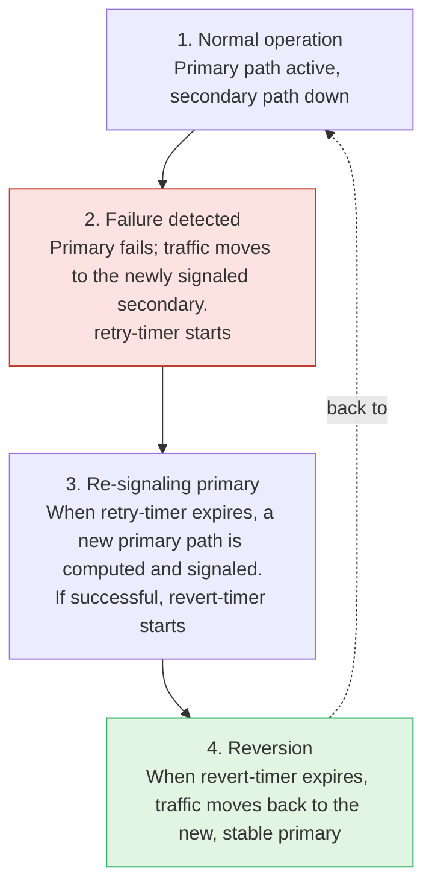

# RSVP Primary and Secondary Paths

**End-to-end path protection, revertive timers and hot-standby paths**

> Study notes by [Nazirul Roslan](https://www.linkedin.com/in/nazirulroslan) · Junos MPLS Fundamentals · Part 11

← [Previous: LSP Failures, Errors and Session Maintenance](10-lsp-failures-errors-session-maintenance.md) · [Index](../README.md) · [Next: RSVP Local Repair, Part 1](12-rsvp-local-repair-part-1.md) →

**Contents:** [1 Concepts](#module-1-primary-and-secondary-path-concepts) · [2 Revertive timers](#module-2-the-revertive-timers) · [3 Standby paths and FIB](#module-3-standby-paths-and-forwarding-table-optimization) · [4 Best practices](#module-4-best-practices-and-real-world-insights) · [5 Lab](#module-5-lab-primary-and-secondary-paths) · [6 Exam practice](#module-6-exam-practice-questions) · [7 Glossary](#module-7-glossary)

---

## Module 1: Primary and Secondary Path Concepts

**Objectives**

- Explain how pre-defined backup paths reduce downtime during a failure.
- Compare the roles of primary and secondary paths.
- Clarify what "reverting to the primary path" really means.

### 1.1 Introduction to path protection

When an LSP fails, total downtime includes the time for the failure notification (`ResvTear`) to reach the ingress router, plus the time for that router to calculate and signal a new path. To reduce this, RSVP lets you pre-define one or more backup paths for an LSP.

> [!TIP]
> **Exam tip: naming your LSPs.** On a single router, LSPs are computed first by priority, then alphabetically by name. A well-named LSP like `AAAA_VOICE_LSP` is computed before `ZZZZ_BEST_EFFORT_LSP`, which can give it first pick of network resources. Naming matters!

### 1.2 Primary vs. secondary paths

Path protection is built on primary and secondary paths, which reference **named paths** (lists of loose/strict hops and other constraints).

| Attribute | Primary path | Secondary path |
|---|---|---|
| Role | The main, preferred path under normal conditions | A backup path, used only when the primary fails |
| Number allowed | Only **one** per LSP | **Several**; tried in the order they appear in the configuration |
| Default state | Signaled and active immediately | **"Cold standby"**: not computed or signaled until the primary fails |

### 1.3 Understanding "reverting to primary"

A common point of confusion is what happens when a failed link comes back. The LSP tries to "revert to the primary path", but that does **not** mean it reuses the exact same hop-by-hop route as before. It means the ingress router re-runs CSPF to find the best available path that satisfies the **constraints** of the named primary path.

> [!NOTE]
> **Do you remember? ERO vs. RRO.** The **Explicit Route Object (ERO)** is the "plan": the hop-by-hop path computed by CSPF. The **Record Route Object (RRO)** is the "reality": the path the signaling message actually took. When a primary path is restored, a new ERO is computed from the primary path's constraints.

---

## Module 2: The Revertive Timers

**Objectives**

- Describe what the three revertive timers do and their default values.
- Visualize the state changes during failover and reversion.

### 2.1 The three timers

Failing over to a secondary path and reverting to the primary is controlled by three configurable timers.

| Timer | Default | Purpose |
|---|---|---|
| `retry-timer` | 30 seconds | How often the ingress router tries to find and signal a new, valid primary path after the original one failed. |
| `revert-timer` | 60 seconds | Once a new primary path is signaled successfully, the "hold-down" time to make sure it's stable before moving traffic back. **Setting it to 0 disables automatic reversion.** |
| `retry-limit` | 0 (unlimited) | How many times the router tries to re-signal the primary path before giving up (range 0–10 000). The default of 0 means the ingress **never stops trying**. |

> [!NOTE]
> If you set a non-zero `retry-limit` and it's reached, the ingress stops retrying until you intervene, for example with `clear mpls lsp` or a configuration change.

### 2.2 Failover and reversion states



---

## Module 3: Standby Paths and Forwarding Table Optimization

**Objectives**

- Configure a "hot-standby" secondary path.
- Explain the automatic path diversity mechanism for standby paths.
- Configure and verify pre-installation of backup paths into the forwarding table.

### 3.1 Standby secondary paths (hot standby)

The main drawback of a default secondary path is the downtime while it's being computed and signaled. A **standby** secondary path fixes this: it's pre-signaled and kept in a "hot-standby" state, ready for immediate use. You enable it with the single keyword `standby`.

> [!IMPORTANT]
> **Automatic path diversity.** When a secondary path is `standby`, Junos tries to make it diverse from the primary. Before running CSPF for the standby path, it adds a temporary, very large metric (8,000,000) to every link used by the primary. Those links become very unattractive, so CSPF picks an alternate route if one exists.

### 3.2 Pre-installing backup paths in the FIB

By default, even a hot-standby path is only in the routing table (RIB), not in the forwarding table (FIB). At failover there's still a small delay while the new path is programmed into the forwarding hardware. To remove that last delay, pre-install the backup path in the FIB.

You do this with a load-balancing policy exported to the forwarding table. You're not actually load-balancing traffic: the side effect of the policy is that all valid next hops (including the weighted backup path) are installed in the FIB, making the switchover almost instant.

```
[edit]
set policy-options policy-statement INSTALL_BACKUP then load-balance per-flow
set routing-options forwarding-table export INSTALL_BACKUP
```

> [!NOTE]
> `load-balance per-packet` is the classic keyword for this policy; newer Junos releases also accept `per-flow`. On current hardware both result in per-flow hashing.

---

## Module 4: Best Practices and Real-World Insights

**Objectives**

- Understand the design trade-offs between hot and cold standby paths.
- Learn strategies for planning bandwidth and path diversity.
- See how path protection complements other resiliency features like FRR and BFD.

### 4.1 Hot standby vs. cold standby

| | Hot standby (`standby`) | Cold standby (default secondary) |
|---|---|---|
| Use for | Mission-critical LSPs (voice, financial data) needing the fastest restoration | Less critical LSPs |
| Trade-off | Higher resource use: every standby LSP doubles the RSVP state in the network | Saves router memory and CPU, but slower failover |

### 4.2 Planning for path diversity

A secondary path must be physically diverse from the primary to avoid a single point of failure. The `standby` keyword gives automatic diversity, but the best practice for **guaranteed** separation is **admin groups (link coloring)**. Tag links in different physical conduits or regions with different colors, then configure the primary path with `include-any green` and the secondary path with `include-any blue`.

### 4.3 Combining with FRR and BFD

Primary/secondary paths give **end-to-end** path protection. They're often combined with other resiliency features for layered defense:

- **Fast Reroute (FRR):** local repair. The router immediately upstream of a failure can switch traffic onto a pre-signaled detour or bypass in under 50 ms, protecting traffic while the ingress computes and moves to the end-to-end secondary path.
- **BFD (Bidirectional Forwarding Detection):** fast failure detection. Running BFD over an LSP lets the ingress detect a data-plane failure in milliseconds, triggering the switch to the secondary path much faster than waiting for IGP reconvergence.

---

## Module 5: Lab: Primary and Secondary Paths

### Prerequisites

This lab assumes the 8-router lab topology used in earlier guides, already configured with:

- Interface and loopback IP addressing (loopbacks `192.168.1.x`, links `10.x.y.z/24`).
- IS-IS as the IGP on all core routers, with full loopback reachability.
- MPLS and RSVP on all core-facing interfaces.


### Part 1: Configuring primary and secondary paths

**Goal:** create an LSP from R1 to R4 with a primary path constrained through R2 and R3, and a secondary path constrained through R5 and R8.

**Reasoning:** this sets up baseline path protection and shows how named paths with loose hops enforce path diversity.

Configuration (on R1):

```
set protocols mpls path PRIMARY_R2_R3 192.168.1.2 loose
set protocols mpls path PRIMARY_R2_R3 192.168.1.3 loose
set protocols mpls path SECONDARY_R5_R8 192.168.1.5 loose
set protocols mpls path SECONDARY_R5_R8 192.168.1.8 loose

set protocols mpls label-switched-path R1_TO_R4 to 192.168.1.4
set protocols mpls label-switched-path R1_TO_R4 primary PRIMARY_R2_R3
set protocols mpls label-switched-path R1_TO_R4 secondary SECONDARY_R5_R8
```

Verification (on R1): the `ActivePath` is the primary, and the secondary is `Dn` (down).

```
naz@R1> show mpls lsp name R1_TO_R4 detail
...
ActivePath: PRIMARY_R2_R3 (primary)
...
*Primary PRIMARY_R2_R3
 State: Up
...
Secondary SECONDARY_R5_R8
 State: Dn
...
```

### Part 2: Testing failure and reversion

**Goal:** simulate a link failure, check that traffic fails over to the secondary path, then watch the automatic reversion.

**Reasoning:** this shows the failover and revertive-timer logic in practice.

Configuration (on R3): disable the R3–R4 link.

```
set interfaces ge-0/0/0 disable
```

Verification (on R1): the `ActivePath` is now the secondary. A new primary path (still meeting the "via R2, R3" constraint, for example R2 → R3 → R7 → R8 → R4) has been computed and is `Up`, but traffic won't revert until the 60-second `revert-timer` expires.

```
naz@R1> show mpls lsp name R1_TO_R4 detail
...
ActivePath: SECONDARY_R5_R8 (secondary)
Time remaining before reverting: 55
...
*Primary PRIMARY_R2_R3
 State: Up
...
*Secondary SECONDARY_R5_R8
 State: Up
...
```

### Part 3: Configuring a standby secondary path

**Goal:** change the LSP to use a hot-standby secondary path for faster failover.

**Reasoning:** this is the most common and effective form of path protection.

Configuration (on R1):

```
set protocols mpls label-switched-path R1_TO_R4 secondary SECONDARY_R5_R8 standby
```

Verification (on R1): the primary and the standby secondary are both `Up` at the same time.

```
naz@R1> show mpls lsp name R1_TO_R4 detail
...
*Primary PRIMARY_R2_R3
 State: Up
...
Standby SECONDARY_R5_R8
 State: Up
...
```

### Part 4: Pre-installing the backup path in the FIB

**Goal:** apply a load-balancing policy to pre-install the standby path's next hop in the forwarding table.

**Reasoning:** this last optimization gives the fastest failover by removing the FIB update delay.

Configuration (on R1):

```
set policy-options policy-statement INSTALL_BACKUP then load-balance per-flow
set routing-options forwarding-table export INSTALL_BACKUP
```

Verification (on R1): check the forwarding table for a BGP route that uses the LSP. There are now two next hops: the primary (low weight) and the standby secondary (high weight).

```
naz@R1> show route forwarding-table destination 203.0.113.0/24 extensive
...
Next-hop type: unilist
  Nexthop: 10.1.2.2 via ge-0/0/0.0, Weight: 0x1
  Nexthop: 10.1.5.5 via ge-0/0/2.0, Weight: 0x2001
...
```

> [!TIP]
> The weight is a preference, not a load-sharing ratio: the lowest weight carries all the traffic, and the higher-weight next hop is only used if the primary disappears.

---

## Module 6: Exam Practice Questions

**Question 1.** An LSP has a primary path and a standby secondary path. Both are up. By default, which table contains the next hop for the standby path?

- A) The forwarding table only.
- B) The routing table only.
- C) Both the routing table and the forwarding table.
- D) Neither table, as it's inactive.

<details><summary>Answer</summary>

**B.** By default a standby secondary path is in the routing table (RIB) but isn't installed in the forwarding table (FIB) until it's needed (unless you export a load-balance policy to the forwarding table).

</details>

**Question 2.** An engineer wants to stop an LSP from automatically switching back to its primary path after a failure. Which configuration should they use?

- A) `set ... retry-timer 0`
- B) `set ... retry-limit 1`
- C) `set ... secondary ... select manual`
- D) `set ... revert-timer 0`

<details><summary>Answer</summary>

**D.** Setting `revert-timer` to 0 disables automatic reversion. The LSP stays on the secondary path until someone intervenes manually.

</details>

---

## Module 7: Glossary

| Term | Definition |
|---|---|
| **Named Path** | User-defined, reusable path definition with a sequence of loose or strict hops, applied to an LSP. |
| **Primary Path** | The main, preferred path for an LSP, used in normal operation. |
| **Secondary Path** | A pre-defined backup path the LSP can use if its primary path fails. |
| **Standby Path** | A secondary path that is pre-signaled and kept `Up` (hot standby) for near-instant failover. |
| **Revert Timer** | How long the router waits after a new primary path is stable before moving traffic back to it (default 60 s). |
| **Retry Timer** | How often the router tries to re-signal a failed primary path (default 30 s). |

---

> 🧠 **Test yourself:** [Recall guide for this topic](../recall/R11-rsvp-primary-secondary-paths-recall.md)

← [Previous: LSP Failures, Errors and Session Maintenance](10-lsp-failures-errors-session-maintenance.md) · [Index](../README.md) · [Next: RSVP Local Repair, Part 1](12-rsvp-local-repair-part-1.md) →
