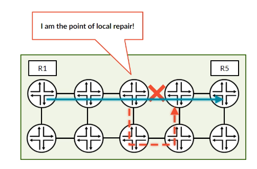
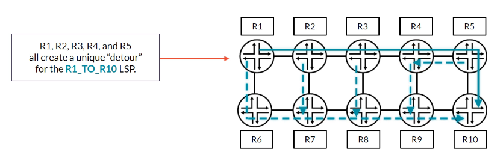
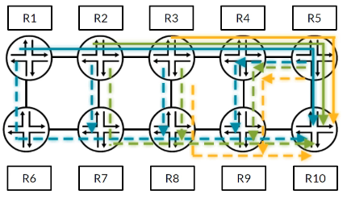
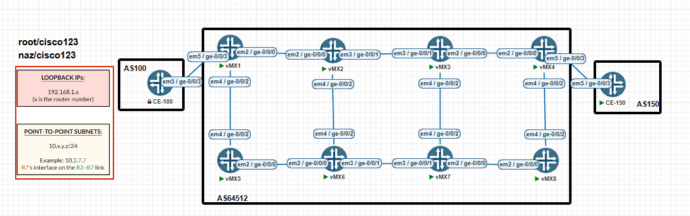

# RSVP Local Repair, Part 1

**One-to-One Backup (Fast Reroute)**

> Study notes by [Nazirul Roslan](https://www.linkedin.com/in/nazirulroslan) · Junos MPLS Fundamentals · Part 12

← [Previous: RSVP Primary and Secondary Paths](11-rsvp-primary-secondary-paths.md) · [Index](../README.md) · [Next: RSVP Local Repair, Part 2](13-rsvp-local-repair-part-2.md) →

**Contents:** [1 Local repair](#module-1-the-need-for-speed-introduction-to-local-repair) · [2 Detours vs. bypasses](#module-2-detours-vs-bypasses-one-to-one-vs-facility-backup) · [3 Link vs. node protection](#module-3-shields-up-link-vs-node-protection) · [4 Lab](#module-4-lab-configuring-one-to-one-backup-fast-reroute) · [5 Exam practice](#module-5-exam-practice-questions) · [6 Glossary](#module-6-glossary)

---

## Module 1: The Need for Speed: Introduction to Local Repair

**Objectives**

- Understand why standard RSVP LSP protection is sometimes too slow.
- Define Local Repair and Fast Reroute (FRR).
- Identify the role of the Point of Local Repair (PLR).
- Recognize the goal of sub-50 ms traffic restoration.

### 1.1 The problem with standard protection

When a primary RSVP-signaled LSP fails, the ingress router (head end) is responsible for reacting and signaling a new path. The sequence is:

1. The router next to the failure detects the link or node going down.
2. It sends an RSVP `ResvTear` upstream toward the ingress router.
3. The ingress router receives the `ResvTear`.
4. The ingress computes a new path (if one exists) and signals a brand-new LSP.

This whole sequence can take hundreds of milliseconds, or even seconds. For real-time services like VoIP, live video or financial transactions, that much packet loss is unacceptable. The industry target for carrier-grade protection switching is **under 50 milliseconds**, and head-end rerouting alone can't meet it.

### 1.2 Local repair to the rescue 🦸‍♂️

**Local Repair**, also called **Fast Reroute (FRR)**, is an MPLS traffic engineering feature built to solve this. Instead of waiting for the ingress router, FRR lets the router immediately upstream of a failure act at once. That router is the **Point of Local Repair (PLR)**.



The idea is simple but powerful: the PLR pre-computes and pre-establishes a backup path around the potential failure point. When the failure happens, the PLR doesn't need to think; it just switches traffic onto the pre-built backup path. Traffic keeps flowing while the head end signals a better, long-term replacement path in the background.

### 1.3 Key takeaways

> [!IMPORTANT]
> The main motivation for Fast Reroute is **sub-50 ms restoration**, which head-end rerouting can't achieve. FRR gets there by pre-building backup paths and letting the router closest to the fault (the PLR) make the switching decision.

Next: the two main types of backup path FRR can build.

---

## Module 2: Detours vs. Bypasses: One-to-One vs. Facility Backup

**Objectives**

- Define One-to-One backup and its backup LSP, the "detour".
- Define Facility backup and its backup LSP, the "bypass".
- Compare the scalability and resource use of both methods.
- Explain why Facility backup is more common in large networks.

### 2.1 Exam tip: critical terminology

The terms are easy to mix up, but for the JNCIS-SP exam you need them exact:

| Method | Backup LSP | Think... | Junos configuration |
|---|---|---|---|
| **One-to-One backup** | **Detour** | "One detour per LSP" | `fast-reroute` on the LSP |
| **Facility backup** (also called Many-to-One) | **Bypass** | "One bypass protects many LSPs" | `link-protection` (or `node-link-protection`) on the LSP, plus `link-protection` on the RSVP interfaces of the PLRs |

This guide focuses on **One-to-One backup (detours)**. Facility backup is covered in [Part 2](13-rsvp-local-repair-part-2.md).

> [!CAUTION]
> **Vendor caution.** In Junos, `fast-reroute` means **One-to-One** backup. Other vendors may use "fast reroute" for Facility backup. Always check the meaning from the context.

### 2.2 One-to-One backup explained

This is the method enabled by `fast-reroute` in Junos. The PLR builds a **separate, dedicated backup LSP (a detour)** for **each primary LSP** that crosses the protected link or node.



For example, if a PLR has 100 primary LSPs going over the same downstream link, it creates and maintains **100 individual detours**. Each detour is tailored to its primary LSP, starting at the PLR and rejoining the original LSP's path at a downstream router called the **Merge Point (MP)**.

> [!NOTE]
> **In summary: one-to-one detour behavior**
> - Each LSP gets its own detour at every hop (every transit router acts as a PLR for it).
> - Merge points reduce control-plane state by consolidating detours.
> - The method scales poorly in full-mesh topologies.
> - It's configured with the `fast-reroute` statement on the LSP.

### 2.3 Comparison: One-to-One vs. Facility backup

| Feature | One-to-One (detour) | Facility / Many-to-One (bypass) |
|---|---|---|
| Scalability | **Poor.** One backup LSP (detour) for every protected primary LSP; lots of state on the PLR. | **Excellent.** A single backup LSP (bypass) protects all primary LSPs that share the protected link or node. |
| State management | High: the PLR keeps state for N primary LSPs + N detours. | Low: the PLR keeps state for N primary LSPs + 1 bypass. |
| Junos configuration | `set protocols mpls label-switched-path <name> fast-reroute` | `set protocols rsvp interface <interface> link-protection` on the PLRs, plus `set protocols mpls label-switched-path <name> link-protection` (or `node-link-protection`) on the ingress |
| Resource usage | Higher control-plane overhead: each detour sends its own RSVP `Path`/`Resv` messages. | Lower overhead: one set of RSVP messages for the single bypass tunnel. |
| Use case | Simpler for a small number of critical LSPs. | The standard for large SP networks with thousands of LSPs. |

> [!NOTE]
> The original table showed `set protocols mpls lsp <name> fast-reroute`. The Junos statement is `label-switched-path`, not `lsp`. It also listed only the RSVP interface statement for Facility backup; in Junos the LSP must also request it with `link-protection` or `node-link-protection`.

### 2.4 Why is Facility backup more popular?

As the table shows, the main reason is **scalability**. In a service provider core, one fiber link can carry thousands of LSPs. Imagine a PLR having to create, signal and maintain a separate detour for every one of them: the RSVP state, processing overhead and memory use would be huge.



Facility backup solves this neatly. The PLR builds just **one** bypass tunnel to the next hop (link protection) or next-next hop (node protection). When a failure occurs, it redirects **all** affected LSPs into that single bypass. This is far more efficient and is the standard in most large deployments.

### 2.5 Key takeaways

> [!IMPORTANT]
> One-to-One backup (`fast-reroute`) creates a unique **detour** for each LSP: simple, but it scales poorly. Facility backup (`link-protection`) creates a single **bypass** that protects many LSPs: highly scalable and efficient.

Next: exactly *what* these backup paths can protect against.

---

## Module 3: Shields Up: Link vs. Node Protection

**Objectives**

- Tell apart protecting a link and protecting a node.
- Understand the path a link-protecting detour/bypass takes.
- Understand the path a node-protecting detour/bypass takes.
- Relate the ideas to a real-world analogy.

### 3.1 A tale of two detours: a road trip analogy 🚗

Imagine a road trip from **Router A** (your home) to **Router D** (your destination). The planned route goes through **Router B** and then **Router C**.

```
  (You are here)
       [R-A] ----------- [R-B] ----------- [R-C] ----------- [R-D]
      Ingress             PLR            Next hop       Next-next hop
                                      (merge point for  (merge point for
                                       link protection)  node protection)
```

> [!NOTE]
> The original diagram labeled R-A as the PLR and R-C as the merge point. In both scenarios below the PLR is **R-B** (the router just before the failure), and the merge point is R-C for link protection or R-D for node protection, so the labels are corrected here.

#### Scenario 1: link protection (a traffic jam)

You're driving from A to B when you get a traffic alert: the highway **between B and C is completely blocked**. Link protection is like having a pre-planned local back-road detour.

1. Your car (the packet) arrives at **Router B** (the PLR).
2. Router B knows the direct road to C is out. It sends you onto a backup route that goes around the jam but still puts you back on the main highway at **Router C** (the merge point).
3. From Router C you continue to D as planned.

**Key idea:** the backup path bypasses only the failed link (B → C) and rejoins the path at the immediate downstream neighbor (C). It protects against failure of the interface or fiber between two routers.

```
                                  ---[ Link Failure ]---
       [R-A] ----------- [R-B] ----------- X ----------- [R-C] ----------- [R-D]
                           |                             ^
                           |          Backup Path        |
                           +-----------------------------+
```

#### Scenario 2: node protection (a town closure)

Now imagine a different problem: the **entire town of Router C has shut down** (for example, a power failure). Your link-protection detour is useless, because it leads you straight back to the closed town.

Node protection is a smarter, longer detour.

1. Your car (the packet) arrives at **Router B** (the PLR).
2. Router B knows the whole town of C is offline. It sends you onto a completely different backup highway that **bypasses Router C entirely**, rejoining the original route at **Router D** (or even further downstream).

**Key idea:** the backup path must be computed to avoid the whole downstream node (C). It runs from the PLR (B) to a router downstream of the failure (D), so the node failure can't affect it.

```
                                                    [ Node C Failure ]
       [R-A] ----------- [R-B] ----------- [R-C] ----------- [R-D] ----------- [R-E]
                           |                   X               ^
                           |                 Backup Path       |
                           +-----------------------------------+
```

Because node protection also protects against failure of the link leading to that node, it's the more robust and usually preferred method.

### 3.2 Key takeaways

| | Link protection | Node protection |
|---|---|---|
| Avoids | Only the protected link | The whole next-hop router (and the link to it) |
| Rejoins (merge point) | Next hop | Next-next hop (or further) |
| Survives next-hop router failure? | No | Yes |

> [!IMPORTANT]
> Node protection is superior because it covers both link and node failures. For One-to-One detours, Junos tries to build node-protecting detours by default, falling back to link protection when no node-diverse path exists (for example, when the next hop is the egress).

---

## Module 4: Lab: Configuring One-to-One Backup (Fast Reroute)

### Overview and prerequisites

In this lab you configure and verify One-to-One backup for an RSVP LSP, then simulate a failure to watch the protection work. It assumes the 8-router lab topology, already configured with:

- Interface and loopback IP addressing.
- IS-IS as the IGP on all core routers, with full loopback reachability.
- MPLS and RSVP on all core-facing interfaces.



**Addressing**

| Item | Format | Example |
|---|---|---|
| Loopbacks | `192.168.1.x/32`, where x is the router number | R4's loopback is `192.168.1.4` |
| Point-to-point links | `10.x.y.z/24`, where x and y are the two routers on the link and z is the router number | On the R2–R3 link, R2 is `10.2.3.2` and R3 is `10.2.3.3` |
| CE loopbacks | CE-A `lo0.0` 100.0.0.100/32, CE-B `lo0.0` 150.0.0.150/32 | |
| CE links | CE-A to R1 100.100.100.0/24, CE-B to R4 150.150.150.0/24 | |

### Part 1: Baseline LSP setup

**Goal:** build a working RSVP LSP from R1 to R4 as a baseline for the failure test.

**Reasoning:** you need a stable, operational LSP before you can watch how the control plane reacts to a failure.

Configuration (on R1):

```
set protocols mpls label-switched-path R1_TO_R4 to 192.168.1.4
```

Verification (on R1): confirm the LSP is `Up` and has a computed path.

```
naz@R1> show mpls lsp name R1_TO_R4
Ingress LSP: 1 sessions
To              From            State Rt ActivePath LSPname
192.168.1.4     192.168.1.1     Up    0 * R1_TO_R4
Total 1 displayed, Up 1, Down 0
```

### Part 2: Enabling Fast Reroute

**Goal:** turn on One-to-One backup so that R1 (acting as PLR) builds a node-diverse detour that protects against a failure of R2.

**Reasoning:** in Junos, the `fast-reroute` statement on the LSP is all that's needed. The ingress signals the request for protection in the `Path` message, and every router along the LSP (each acting as a PLR) computes and signals its own detour using CSPF and its traffic engineering database. No per-interface statement is required for detours.

Configuration (on R1):

```
set protocols mpls label-switched-path R1_TO_R4 fast-reroute
```

> [!NOTE]
> The original guide also added `set protocols rsvp interface ge-0/0/2.0 node-link-protection` and said both statements were required. That's not correct for Junos: `node-link-protection` isn't an RSVP interface statement (it's an LSP statement that requests Facility node protection), and `link-protection` under `protocols rsvp interface` is only needed for **Facility backup (bypasses)**, covered in Part 2. One-to-One detours need only `fast-reroute` on the LSP.

Verification (on R1): check the LSP details. Look for `Fast-reroute: Ready` and the `Detour RRO`, which shows the backup path via R5.

```
naz@R1> show mpls lsp name R1_TO_R4 extensive
...
  Fast-reroute: Ready, Protection type: Node
  ...
  Detour branch count: 1
    Detour-branch type: normal, status: ready
    Path-option: (computed)
    Next-hop: 10.1.5.5, Out-interface: ge-0/0/2.0
    Detour RRO: 192.168.1.5 192.168.1.6 192.168.1.7 192.168.1.8 192.168.1.4
...
```

> [!TIP]
> Exact field names in `show mpls lsp extensive` vary by release. What matters is that the detour is up and its path avoids R2 (here R1 → R5 → R6 → R7 → R8 → R4). You can also confirm it with `show rsvp session detail`, which lists the detour and the node or link it avoids.

### Part 3: Simulating a failure and verifying the reroute

**Goal:** simulate a failure toward the primary path's next hop (R2) and confirm traffic switches immediately.

**Reasoning:** this is the real test of the FRR configuration. Disabling R1's interface to R2 forces R1 to use its pre-signaled detour.

Configuration (on R1):

```
[edit interfaces]
naz@R1# set ge-0/0/0 disable
naz@R1# commit
```

> [!NOTE]
> Disabling R1's `ge-0/0/0` is technically a **link** failure (R1–R2). Because the detour is node-diverse (it avoids R2 completely), it also covers this case. To test a true node failure, you'd take R2 down instead.

Verification (on R1): the state is now `Fast-reroute: Active`, confirming the detour is carrying traffic while the primary path is down and being re-signaled in the background.

```
naz@R1> show mpls lsp name R1_TO_R4 extensive
...
  Fast-reroute: Active, Protection type: Node
  Active detour branch:
    Path-option: (computed)
    Next-hop: 10.1.5.5, Out-interface: ge-0/0/2.0
    RRO: 192.168.1.5 192.168.1.6 192.168.1.7 192.168.1.8 192.168.1.4
  ...
  Primary-R1_TO_R4      State: Dn, ResvOwn: 1, Resv: 0, LastUsed: 00:00:10
    Short-term action: TearDown
    Long-term action: ReSignal
...
```

### Verification toolkit: One-to-One backup

| Command | What it shows |
|---|---|
| `show mpls lsp name <name> extensive` | Whether a detour is `Ready` or `Active`, and its path in the `Detour RRO` |
| `show rsvp session detail` | The detour's intent (for example "to skip node X") and detailed label information |
| `show mpls lsp ingress` | A quick summary of all ingress LSPs (add `detail` to see Fast Reroute status) |

---

## Module 5: Exam Practice Questions

**Question 1.** An engineer configures an LSP with `fast-reroute`. After commit, `show mpls lsp extensive` shows the LSP is up but no detour is built. What is the most likely cause?

- A) The IGP has not converged.
- B) There's no path from the PLR to the egress that avoids the protected link or node (or the PLR's TED lacks the information to compute one).
- C) The LSP's destination address is unreachable.
- D) The `fast-reroute` command must be applied on the egress router, not the ingress.

<details><summary>Answer</summary>

**B.** With `fast-reroute`, each PLR computes its detour with CSPF against its own TED. If the topology offers no diverse path, or the TED doesn't have the links needed (for example, TE extensions missing on a link), no detour can be signaled. A and C would stop the LSP itself from coming up, and D is wrong because `fast-reroute` is configured at the ingress.

</details>

> [!NOTE]
> The original question claimed the cause was a missing `link-protection` or `node-link-protection` statement on the PLR's RSVP interfaces. That applies to Facility backup, not to One-to-One detours: in Junos, detours need only `fast-reroute` on the LSP. The question has been reworded to match actual Junos behavior.

**Question 2.** Which statement accurately describes the scalability difference between One-to-One backup and Facility backup?

- A) One-to-One backup is more scalable because each detour is optimized for its primary LSP.
- B) Facility backup is less scalable because a single bypass failure affects all protected LSPs.
- C) One-to-One backup has poor scalability because it requires a unique backup LSP for every primary LSP, increasing state.
- D) Both methods have identical scalability.

<details><summary>Answer</summary>

**C.** The main drawback of One-to-One backup (detours) is poor scalability. A PLR must create, signal and keep state for one backup LSP for every primary LSP it protects, which is inefficient in large networks.

</details>

**Question 3.** An engineer uses Facility backup and wants an LSP protected against failure of an entire downstream router chassis. Which protection should the LSP request?

- A) Link protection
- B) Node-link protection
- C) Unprotected
- D) Non-standby protection

<details><summary>Answer</summary>

**B.** `node-link-protection` on the LSP asks the PLRs for bypasses that avoid the next-hop node entirely, rejoining the LSP at the next-next hop or further downstream, so a complete failure of the next-hop router is survived. The PLRs still need `link-protection` on their RSVP interfaces to build bypasses. Link protection only bypasses the link and rejoins at the next-hop node, which doesn't help if that node fails.

</details>

> [!NOTE]
> The original answer said node-link protection is configured on the PLR's interfaces and mentioned a `node-protection` statement. In Junos, `node-link-protection` is configured on the LSP (at the ingress); there's no `node-protection` statement.

---

## Module 6: Glossary

| Term | Definition |
|---|---|
| **Bypass** | Backup LSP used in Facility (Many-to-One) protection. A single bypass tunnel can protect many primary LSPs. |
| **Detour** | Backup LSP used in One-to-One protection. A unique detour is built for each primary LSP that needs protection. |
| **Fast Reroute (FRR)** | The overall MPLS local-protection mechanism, designed to restore traffic in under 50 ms using pre-signaled backup paths. |
| **Link Protection** | FRR where the backup path bypasses only the failed link and rejoins at the immediate downstream router. It doesn't protect against failure of that router. |
| **Merge Point (MP)** | The router where a detour or bypass rejoins the original primary LSP path. |
| **Node Protection** | Stronger FRR where the backup path bypasses the whole downstream node, rejoining at the next-next hop or further. Protects against both link and node failures. |
| **One-to-One Backup** | FRR method where a dedicated backup LSP (detour) is built for each primary LSP. Configured in Junos with `fast-reroute`. |
| **PathErr** | RSVP message sent upstream to report an error condition without tearing down the LSP by itself. |
| **Point of Local Repair (PLR)** | The router immediately upstream of a failure, responsible for detecting it and switching traffic onto the backup path. |
| **ResvTear** | RSVP message sent upstream from a point of failure to remove an LSP's reservation state and free bandwidth. |

---

> 🧠 **Test yourself:** [Recall guide for this topic](../recall/R12-rsvp-local-repair-part-1-recall.md)

← [Previous: RSVP Primary and Secondary Paths](11-rsvp-primary-secondary-paths.md) · [Index](../README.md) · [Next: RSVP Local Repair, Part 2](13-rsvp-local-repair-part-2.md) →
