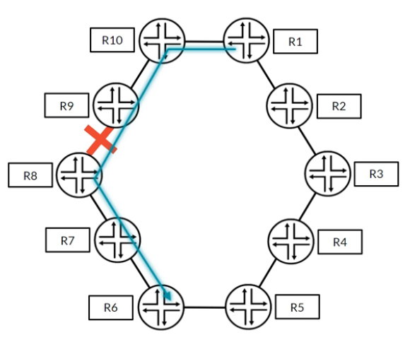
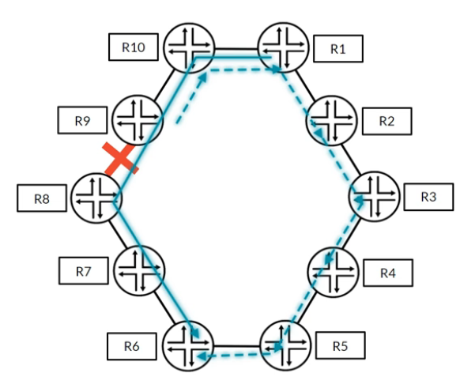
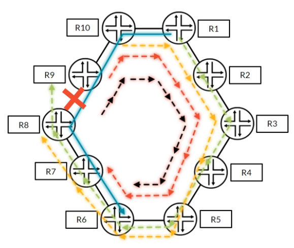
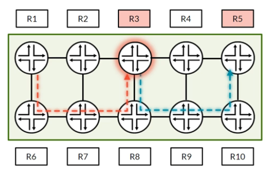

# RSVP Local Repair, Part 2

**Facility backup (link and node-link protection): bypass LSPs, label stacking, and how it compares with one-to-one backup**

> Study notes by [Nazirul Roslan](https://www.linkedin.com/in/nazirulroslan) · Junos MPLS Fundamentals · Part 13

← [Previous: RSVP Local Repair, Part 1](12-rsvp-local-repair-part-1.md) · [Index](../README.md) · [Next: RSVP LSP Optimization](14-rsvp-lsp-optimization.md) →

**Contents:** [1 Facility backup](#module-1-the-facility-backup-method) · [2 Configuration and verification](#module-2-configuration-and-verification) · [3 One-to-one vs. facility](#module-3-one-to-one-vs-facility-backup-the-definitive-comparison) · [4 Lab](#module-4-lab-comparing-local-repair-methods) · [5 Exam practice](#module-5-exam-practice-questions) · [6 Glossary](#module-6-glossary)

---

## Module 1: The Facility Backup Method

**Objectives**

- Describe the facility backup mechanism and the concept of a shared "bypass" LSP.
- Differentiate between link protection and node-link protection.
- Explain the data plane operation of label stacking in a bypass tunnel.

### 1.1 The bypass LSP concept

Facility backup takes a very different approach from one-to-one backup. Instead of building an individual detour for every LSP, it builds **one backup LSP that many LSPs can share** when a failure happens. In facility backup these shared backups are called **bypass LSPs**.

> [!NOTE]
> **What is a "facility"?** The name comes from the RFC 4090 definition of a bypass tunnel: "an LSP that is used to protect a set of LSPs passing over a common **facility**." A facility is simply a shared resource, such as a physical link or a downstream router.

### 1.2 Link vs. node-link protection

Facility backup gives you two levels of protection. The point of local repair (PLR) builds a bypass LSP that ends either at the immediate **next-hop** or at the **next-next-hop**.


| | Link protection | Node-link protection |
|---|---|---|
| Bypass ends at | Next-hop (**NHOP**) | Next-next-hop (**NNHOP**) |
| Protects against | Failure of the link to the neighbor | Failure of the link **and** of the whole downstream node |
| Configured on the LSP with | `link-protection` | `node-link-protection` |

Node-link protection is the more robust option.

> [!TIP]
> **The fallback mechanism.** Node-link protection is the preferred, more complete method, and Junos builds in a fallback. If you configure `node-link-protection` on an LSP but the PLR can't build a path to the next-next-hop (for example on the penultimate hop, where there is no NNHOP), it automatically falls back and tries to signal a link-protecting bypass to the next-hop instead. The LSP gets the best protection available at every hop.

### 1.3 The data plane: label stacking

How can one LSP be tunneled inside another? With **label stacking**. When a failure happens, the PLR does two things to each packet:

1. It performs the normal label **swap** for the original LSP, replacing the incoming label with the one the downstream router (the merge point, R3 below) expects.
2. It then **pushes** a second, outer label for the bypass tunnel, which steers the packet around the failure.


| Router | Action | Labels on packet | Notes |
|---|---|---|---|
| R2 (PLR) | Swaps and pushes | Outer `59837`, inner `123456` | Inner label is the one R3 expects. Outer label is for the bypass (next hop R7). |
| R7 | Swaps outer | Outer `4521`, inner `123456` | Only looks at and swaps the outer bypass label. |
| R8 (penultimate hop of the bypass) | Pops outer (PHP) | `123456` | Removes the bypass label and sends the packet to R3. |
| R3 (merge point) | Receives | `123456` | Receives the original LSP label and forwards as normal (swaps to `30194` toward R4). |

---

## Module 2: Configuration and Verification

**Objectives**

- Configure facility backup on core interfaces and LSPs.
- Verify the creation and status of bypass LSPs.
- Read `show route` output to confirm a backup path is installed.

### 2.1 Two-step configuration

Facility backup needs configuration in two places.

**Step 1: on the interfaces.** Enable `link-protection` under RSVP on every core-facing interface that should be able to act as a PLR. This lets the interface build bypass LSPs, and it is a prerequisite for **both** link and node-link protection.

```
set protocols rsvp interface ge-0/0/0.0 link-protection
```

**Step 2: on the LSP.** On the ingress router, request the level of protection for the LSP itself. `node-link-protection` is preferred.

```
set protocols mpls label-switched-path R1_TO_R4 to 192.168.1.4 node-link-protection
```

> [!WARNING]
> Both steps are needed. `link-protection` under `protocols rsvp interface` only allows bypasses to be built; an LSP only uses them if it asks for `link-protection` or `node-link-protection` under `protocols mpls label-switched-path`.

### 2.2 Verification toolkit

Verifying facility backup is mostly about checking the automatically created bypass LSPs.

**How Junos names bypass LSPs.** Bypass names are generated automatically from **interface addresses, not loopbacks**, so the name tells you exactly which link or node the bypass protects:

| Bypass type | Name format | Example |
|---|---|---|
| Link bypass (to NHOP) | `Bypass-><NHOP interface address>` | `Bypass->10.1.2.2` |
| Node bypass (to NNHOP) | `Bypass-><NHOP interface address>-><NNHOP interface address>` | `Bypass->10.1.2.2->10.2.3.3` |

> [!NOTE]
> The source described the format as `Bypass-><ingress-IP>-><egress-IP>`. More precisely, the first address is the protected next-hop's address on the link, and the second (node bypass only) is the next-next-hop's address. Neither is the bypass's own ingress address.

Use `show mpls lsp bypass` to see only the bypass LSPs that start on the local router:

```
naz@R1> show mpls lsp bypass
Ingress LSP: 1 sessions
To              From            State   Rt Style Labelin Labelout LSPname
192.168.1.3     192.168.1.1     Up      0  1 SE       -   300064 Bypass->10.1.2.2->10.2.3.3
Total 1 displayed, Up 1, Down 0
```

Use `show route ... detail` to confirm the backup path is installed in the routing table. The bypass next hop has the higher (less preferred) weight, `0x8001`:

```
naz@R1> show route 192.168.1.4 detail
...
Next hop: 10.1.2.2 via ge-0/0/0.0 weight 0x1, selected
  Label-switched-path R1_TO_R4
Next hop: 10.1.5.5 via ge-0/0/2.0 weight 0x8001
  Label-switched-path Bypass->10.1.2.2->10.2.3.3
...
```

> [!TIP]
> **Seeing both link and node bypasses.** In some Junos versions and topologies, `node-link-protection` makes the router build both a node-protecting bypass **and** a link-protecting bypass. `show mpls lsp bypass` shows both, and the names make the difference obvious: `Bypass->10.1.2.2->10.2.3.3` is a node bypass (to the NNHOP), while `Bypass->10.1.2.2` is a link bypass (to the NHOP).

---

## Module 3: One-to-One vs. Facility Backup: The Definitive Comparison

**Objectives**

- Compare the advantages and trade-offs of both local repair methods.
- Analyze how label stack limits affect design choices.
- Evaluate how the topology (for example, rings) changes the behavior of each method.

### 3.1 Label stack limitations

One of the biggest trade-offs is the label stack. Some hardware, especially older or lower-end devices, can only push a small number of labels (for example, 3) onto a packet.

- **Facility backup needs an extra label push.** A typical MPLS L3VPN already uses 2 labels (VPN + transport). A bypass tunnel adds a 3rd. If the LSP also crosses into another AS, a 4th might be needed, which can exceed what the hardware supports.
- **One-to-one backup needs no extra labels.** When traffic enters a detour, the transport label is simply **swapped**, not pushed. That makes it a safe choice for edge networks or devices with known label-depth limits.

### 3.2 Bandwidth and load balancing

By default, facility backup sends all protected traffic over a **single** bypass LSP, which can overwhelm the backup link. Junos lets you build several bypass LSPs to spread the protected traffic, but this adds complexity because you also have to set a bandwidth reservation for the bypasses yourself.

This configuration allows up to two bypass LSPs, each reserving 50 Mbps:

```
[edit protocols rsvp interface ge-0/0/0.0 link-protection]
set max-bypasses 2
set bandwidth 50m
```

One-to-one backup, by its nature, may spread its many detours over different paths, which gives some load distribution without extra configuration, at the cost of far more state.

### 3.3 Behavior in ring topologies

The topology can change how each method behaves quite dramatically. The examples below use a 10-router ring with an LSP from R1 to R6 (R1–R10–R9–R8–R7–R6).



**One-to-one in a ring**



In a ring, one-to-one backup is very efficient. Each hop builds a detour going the other way around the ring. Incoming detours are **merged** into the outgoing detour at each hop, so the result is one clean backup path that grows as it moves upstream.

> [!NOTE]
> Detours have a default hop limit of **6**. For a large ring like this one, raise it on the LSP:
> `set protocols mpls label-switched-path ... fast-reroute hop-limit 10`

**Facility backup in a ring**



Facility backup in a ring can be less efficient. Each node builds its own bypass to its next-next-hop. As shown, traffic can **overshoot** the final destination and then U-turn back, which adds latency and uses more bandwidth during a failure.

### 3.4 Final comparison

| Method | Protection | Labels used | Scaling | Bandwidth risk |
|---|---|---|---|---|
| One-to-one (detour) | Node/link | 1 (swap) | Poor (one detour per LSP per hop) | Lower |
| Facility (bypass) | Node/link | 2+ (stack) | Excellent (one bypass shared by many LSPs) | Higher |

---

## Module 4: Lab: Comparing Local Repair Methods

### Overview and prerequisites

This lab compares, hands-on, the control plane state created by facility backup and by one-to-one backup. It assumes the 8-router lab topology used in earlier guides, already configured with:

- Loopbacks `192.168.1.x/32` (x = router number, so R4 is `192.168.1.4`); CE-A (CE-100) `lo0.0` 100.0.0.100/32 and CE-B (CE-150) `lo0.0` 150.0.0.150/32.
- Point-to-point links `10.x.y.z/24`, where x and y are the two routers on the link and z is the router number (on the R2–R3 link, R2 is `10.2.3.2` and R3 is `10.2.3.3`). CE-A to R1 is 100.100.100.0/24 and CE-B to R4 is 150.150.150.0/24.
- IS-IS, MPLS and RSVP on all core routers.


### Part 1: Core interface setup for facility backup

**Goal:** prepare all core routers to build bypass LSPs, using an apply-group.

**Reasoning:** facility backup needs explicit configuration on the interfaces that will act as PLRs. An apply-group is the most scalable way to deploy it.

Configuration (on all routers, for example R1):

```
[edit groups]
set RSVP-PROTECTION protocols rsvp interface all link-protection

[edit]
set apply-groups RSVP-PROTECTION
```

Verification (on any router): confirm the configuration is inherited.

```
naz@R1> show configuration protocols rsvp | display inheritance
##
## Inherited from group RSVP-PROTECTION
##
interface all {
    link-protection;
}
```

### Part 2: Facility backup (`node-link-protection`) test

**Goal:** create an LSP from R1 to R4 that uses facility backup, and verify it.

**Reasoning:** this shows the main configuration and verification workflow for facility backup.

Configuration (on R1):

```
set protocols mpls label-switched-path R1-to-R4_FACILITY to 192.168.1.4 node-link-protection
```

Verification (on R1): look for the single, automatically named bypass LSP that protects the first hop (it goes around R2 to reach R3).

```
naz@R1> show mpls lsp bypass
Ingress LSP: 1 sessions
To              From            State   Rt Style Labelin Labelout LSPname
192.168.1.3     192.168.1.1     Up      0  1 SE       -   300064 Bypass->10.1.2.2->10.2.3.3
```

### Part 3: Verifying facility backup scalability

**Goal:** prove that one bypass LSP can protect several primary LSPs.

**Reasoning:** this is the core advantage of facility backup.

Configuration (on R1):

```
set protocols mpls label-switched-path R1-to-R3_FACILITY to 192.168.1.3 node-link-protection
```

Verification (on R1): run `show mpls lsp bypass` again. **No new bypass LSP was created**; the existing bypass now protects both LSPs.

```
naz@R1> show mpls lsp bypass
Ingress LSP: 1 sessions
To              From            State   Rt Style Labelin Labelout LSPname
192.168.1.3     192.168.1.1     Up      0  1 SE       -   300064 Bypass->10.1.2.2->10.2.3.3
```

### Part 4: Comparison with one-to-one backup

**Goal:** contrast the control plane state of facility backup with one-to-one backup.

**Reasoning:** a hands-on illustration of the scalability trade-off.

Configuration (on R1):

```
set protocols mpls label-switched-path R1-to-R8_FRR to 192.168.1.8 fast-reroute
```

Verification (on R1): `show rsvp session ingress` shows the two facility LSPs sharing one bypass, while the new `fast-reroute` LSP has its own detours, which don't appear as separate sessions in this output.

```
naz@R1> show rsvp session ingress
Ingress RSVP: 4 sessions
To              From            State   Rt Style Labelin Labelout LSPname
192.168.1.3     192.168.1.1     Up      0  1 SE       -   300064 Bypass->10.1.2.2->10.2.3.3
192.168.1.3     192.168.1.1     Up      0  1 SE       -   300416 R1-to-R3_FACILITY
192.168.1.4     192.168.1.1     Up      0  1 SE       -   300448 R1-to-R4_FACILITY
192.168.1.8     192.168.1.1     Up      0  1 SE       -   300480 R1-to-R8_FRR
```

> [!NOTE]
> The source said the `fast-reroute` detour "exists on the transit hops". Detours are built by **every** PLR along the path, including the ingress (R1 protects its own first hop), not only by transit routers. They aren't listed as separate lines in `show rsvp session`; use `show rsvp session detail` (look for the detour information on the protected LSP) to see them.

> [!IMPORTANT]
> **Lab outcome: facility backup**
> - One bypass LSP protects many LSPs.
> - Bypass LSPs are built at the PLR, and protected LSPs are installed with the bypass as their backup next hop.
> - Verified with `show mpls lsp bypass` and `show rsvp session`.

**Facility backup verification toolkit**

| Command | Use |
|---|---|
| `show mpls lsp bypass` | Bypass LSPs that start on this router |
| `show rsvp session` | All active RSVP sessions, including primary and bypass LSPs |
| `show mpls lsp name <name> detail` | Bypass/protection status of a specific primary LSP |
| `show route protocol rsvp detail` | Label operations and next-hop weights |

---

## Module 5: Exam Practice Questions

**Question 1.** An engineer wants to enable facility backup. Which two configuration steps are required?

- A) `fast-reroute` on the LSP and `link-protection` on the interface.
- B) `link-protection` on the LSP and `node-link-protection` on the interface.
- C) `link-protection` on the interface and either `link-protection` or `node-link-protection` on the LSP.
- D) `node-link-protection` on the LSP only.

<details><summary>Answer</summary>

**C.** Facility backup needs `link-protection` on the core interfaces (under `protocols rsvp`) so bypasses can be built, and then the LSP itself must request a protection type (`link-protection` or `node-link-protection`).

</details>

**Question 2.** Look at the output below. What can you tell about the LSPs on router R3?


- A) R3 is the ingress router for two bypass LSPs.
- B) R3 is the egress router for two bypass LSPs and a transit router for one primary LSP.
- C) R3 is a transit router for three different LSPs.
- D) R3 is only acting as an egress router.

<details><summary>Answer</summary>

**B.** The `Egress LSP` section shows two bypass LSPs ending on R3 (a node bypass from R1 and a link bypass from R2). The `Transit LSP` section shows that R3 is a transit hop for the primary LSP `R1_TO_R10`.



</details>

---

## Module 6: Glossary

| Term | Definition |
|---|---|
| **Bypass LSP** | A shared, pre-signaled backup LSP used by facility backup to protect many primary LSPs from a common failure. |
| **Facility Backup** | A scalable local repair method where one bypass LSP protects many primary LSPs. Enabled with `link-protection` on the RSVP interfaces, plus `link-protection` or `node-link-protection` on the LSP. |
| **Label Stacking** | Pushing more than one MPLS label onto a packet. Facility backup uses it to tunnel an LSP's traffic through a bypass LSP. |
| **Link Protection** | Facility backup where the bypass ends at the immediate next-hop, protecting only against link failure. |
| **Next-Hop (NHOP)** | The immediate downstream router on an LSP path. |
| **Next-Next-Hop (NNHOP)** | The router two hops downstream on an LSP path; where a node-protecting bypass ends. |
| **Node-Link Protection** | Facility backup where the bypass ends at the next-next-hop, protecting against both link and node failure. |

---

> 🧠 **Test yourself:** [Recall guide for this topic](../recall/R13-rsvp-local-repair-part-2-recall.md)

← [Previous: RSVP Local Repair, Part 1](12-rsvp-local-repair-part-1.md) · [Index](../README.md) · [Next: RSVP LSP Optimization](14-rsvp-lsp-optimization.md) →
