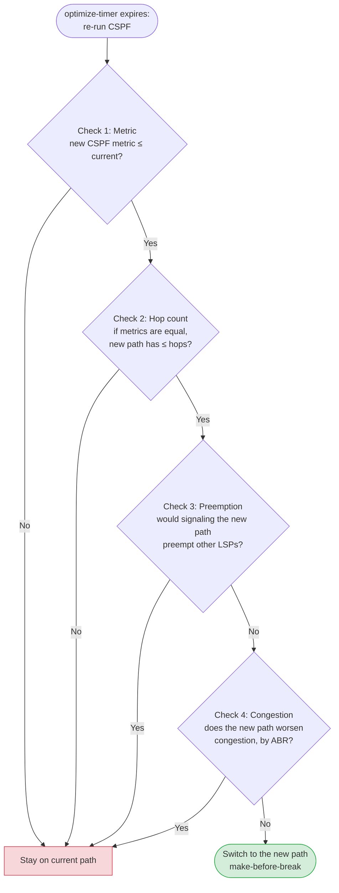
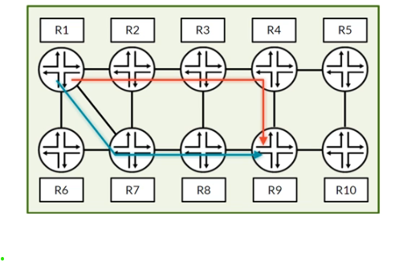
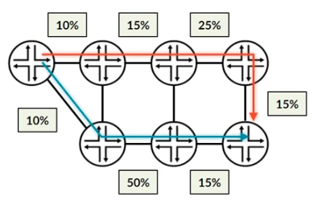

# RSVP LSP Optimization

**Moving LSPs onto better paths: the optimize timer, the four-condition algorithm and `optimize-aggressive`**

> Study notes by [Nazirul Roslan](https://www.linkedin.com/in/nazirulroslan) · Junos MPLS Fundamentals · Part 14

← [Previous: RSVP Local Repair, Part 2](13-rsvp-local-repair-part-2.md) · [Index](../README.md) · [Next: RSVP Make-Before-Break and Adaptive](15-rsvp-make-before-break-adaptive.md) →

**Contents:** [1 Use case and configuration](#module-1-lsp-optimization-use-case-and-configuration) · [2 The algorithm](#module-2-the-lsp-optimization-algorithm) · [3 Advanced considerations](#module-3-advanced-considerations) · [4 Lab](#module-4-lab-lsp-optimization) · [5 Exam practice](#module-5-exam-practice-questions) · [6 Glossary](#module-6-glossary)

---

## Module 1: LSP Optimization: Use Case and Configuration

**Objectives**

- Explain why LSP optimization is needed.
- Configure `optimize-timer` to enable periodic optimization.
- Trigger a manual, non-disruptive optimization.

### 1.1 The need for optimization

By default, once an RSVP LSP has computed and signaled a path, it stays on that path for its whole life. RSVP values **stability** above everything else. The only events that move an LSP are a network failure (forcing a teardown and re-signal) or preemption by a higher-priority LSP.

The price of this stability is that better paths are ignored when they appear. For example:

- A failed link is repaired, creating a much shorter path than the one the LSP is using now.
- A new high-bandwidth link is added to the network.
- Bandwidth on a preferred path is freed up because other LSPs are torn down.

**LSP optimization** fixes this. The ingress router periodically re-runs CSPF to check whether a better path exists and, if so, moves the LSP to it gracefully.

### 1.2 Configuration

Enable optimization with the `optimize-timer` statement (in seconds). The default is **0, which disables optimization**.

Optimize every hour (3600 s) for one LSP:

```
[edit protocols mpls]
set label-switched-path R1_TO_R4 to 192.168.1.4 optimize-timer 3600
```

Optimize every two hours (7200 s) for all LSPs on the router:

```
[edit protocols mpls]
set optimize-timer 7200
```

> [!NOTE]
> `optimize-timer` is always valid under `label-switched-path <name>`. Support for the global form directly under `[edit protocols mpls]` may depend on the Junos release; if your release rejects it, apply the timer per LSP (for example through a configuration group with `label-switched-path <*>`).

### 1.3 Manual optimization

If you don't want to wait for the timer, trigger an optimization check by hand. This is handy after maintenance or after adding capacity.

```
naz@R1> clear mpls lsp name R1_TO_R4 optimize
```

> [!TIP]
> **Is this disruptive? No.** Despite the `clear` keyword, this command is non-disruptive. Junos uses **make-before-break**: it re-runs CSPF and, if a better path exists, signals the new path, moves traffic once it is stable, then removes the old path gracefully. The LSP is never torn down.

---

## Module 2: The LSP Optimization Algorithm

**Objectives**

- Describe the four conditions the optimization process checks.
- Explain how the available bandwidth ratio (ABR) is used to judge congestion.
- Override the default IGP metric used by CSPF.

### 2.1 The four conditions for optimization

What does "better" mean to a router? It's not only a lower metric. To keep things stable, a new path must meet **all four** conditions below to be considered better than the current one.



| Check | Optimization condition | Why it matters | If it fails |
|---|---|---|---|
| 1 | CSPF metric must not be higher | Makes sure the new path isn't worse | Reject |
| 2 | If metrics are equal, the new path must not have more hops | Avoids needless complexity | Reject |
| 3 | Must not preempt other LSPs | Preserves network stability | Reject |
| 4 | Must not worsen congestion (ABR) | Protects against traffic overload | Reject |

### 2.2 Overriding the CSPF metric

By default, CSPF uses the IGP metric (from IS-IS or OSPF). You can give CSPF a different metric without touching the IGP metric, so you can influence optimization without changing normal IP routing. This is the **traffic engineering metric** (`te-metric`), set per interface in the IGP:

```
set protocols isis interface ge-0/0/1.0 level 2 te-metric 50
set protocols ospf area 0.0.0.0 interface ge-0/0/1.0 te-metric 50
```

CSPF then uses the TE metric for that link, while SPF for IP routing still uses the normal IGP metric. A named path (with loose hops) is still the way to constrain *where* the LSP goes:

```
[edit protocols mpls]
set path VIA_R2_R3 192.168.1.2 loose
set path VIA_R2_R3 192.168.1.3 loose

set label-switched-path R1_TO_R4 to 192.168.1.4
set label-switched-path R1_TO_R4 primary VIA_R2_R3
```

> [!NOTE]
> **Correction.** The source used `set protocols mpls path VIA_R2_R3 metric 50`. A Junos named path only holds a list of hops (`strict` or `loose`), so that statement isn't valid. The link-level `te-metric` is the Junos way to give CSPF a metric that differs from the IGP. Don't confuse it with `label-switched-path <name> metric`, which sets the metric of the LSP's route in `inet.3` (used when choosing between LSPs), not the metric CSPF uses to compute the path.

### 2.3 Condition 4: the congestion check in detail

The last check is the most complex, and it is often why an LSP doesn't optimize as expected. It doesn't use absolute bandwidth. It uses the **available bandwidth ratio (ABR)**.

> [!NOTE]
> **Refresher: available bandwidth ratio.** The percentage of a link's reservable bandwidth that is currently free:
> `ABR = (available bandwidth / total reservable bandwidth) × 100`.
> A link with 10 Gbps free out of 10 Gbps (100%) counts as **less congested** than a link with 80 Gbps free out of 100 Gbps (80%), even though the second link has more free bandwidth in absolute terms.

> [!NOTE]
> The source had this example the wrong way round (it called the 80% link the less congested one). A higher ABR means a less congested link.

Consider the topology below. A new, shorter path (blue, R1–R7–R8–R9) has become available for an LSP currently on the longer path (red, R1–R2–R3–R4–R9).





To compare the paths, the algorithm **reorders the links of each path from most congested (lowest ABR) to least congested (highest ABR)**. If the new path has fewer hops, it is padded with dummy links at 100%.

| | Hop 1 (worst) | Hop 2 | Hop 3 | Hop 4 (best) |
|---|---|---|---|---|
| Old path (reordered) | 10% | 15% | 15% | 25% |
| New path (reordered) | 10% | 15% | 50% | 100% (dummy) |

The algorithm then compares each column. Every link on the new path has an equal or better ABR than its counterpart on the old path, so the new path **passes** the congestion check and the optimization is accepted.

```
Old path ABR: 10% -> 15% -> 25% -> 15%            sorted: 10, 15, 15, 25
New path ABR: 10% -> 50% -> 15% (+ dummy 100%)    sorted: 10, 15, 50, 100
Every new-path column >= old-path column  ->  accepted
```

---

## Module 3: Advanced Considerations

**Objectives**

- Describe the main caveats and enhancements of LSP optimization.
- Use aggressive optimization to skip some of the algorithm's checks.
- Optimize backup paths such as detours and bypasses.

### 3.1 `optimize-aggressive`

To force an LSP onto a new path based purely on the best metric, use `optimize-aggressive`. The router then performs only **condition 1** (the metric check) and ignores the hop-count, preemption and congestion checks. It's a powerful tool for maintenance, or when you need to move traffic off a path whatever the other conditions say.

```
naz@R1> clear mpls lsp name R1_TO_R4 optimize-aggressive
```

**`optimize-aggressive` in short**

- Ignores the hop-count, preemption and congestion checks.
- Looks only at the better CSPF metric.
- Use it when link metrics change or you want a full path refresh.
- Command: `clear mpls lsp name <name> optimize-aggressive` (Junos also has an `optimize-aggressive` configuration statement under `protocols mpls`, so that timer-driven optimization behaves the same way; check support in your release).

### 3.2 Optimization caveats

Two subtle behaviors explain many unexpected optimization results:

- **Paths with 5 or more hops:** if both the old and new paths have five or more hops, the congestion check is simplified. It only compares the **four links with the lowest ABR** from each path.
- **Interaction with `least-fill`:** if the LSP uses the `least-fill` CSPF tie-breaker, a fifth condition is added: the new path must be **at least 10% better** in available bandwidth ratio than the current path. This stops the LSP flapping between two similarly loaded paths.

> [!WARNING]
> **Optimization caveats**
> - Paths with ≥5 hops only evaluate the 4 lowest-ABR links.
> - With `least-fill`, the new path must be at least 10% less utilized.
> - Detour and bypass LSPs can also be optimized (manually or with timers).

> [!NOTE]
> **Refresher: `least-fill`.** A CSPF tie-breaker. When several equal-cost paths exist, the router picks the path with the highest available bandwidth ratio (the "least full" path), spreading LSPs proportionally across the network. (The default tie-breaker is `random`; the other option is `most-fill`.)

### 3.3 Optimizing backup LSPs

You can also optimize the backup paths themselves, so detours and bypasses can take advantage of new, faster links.

Optimization for one-to-one detours and for facility bypasses:

```
[edit protocols rsvp]
set fast-reroute optimize-timer 7200

set interface ge-0/0/0.0 link-protection optimize-timer 3600
```

> [!TIP]
> Rule of thumb: set the `fast-reroute` (detour) optimize timer **longer** than the primary LSPs' timer, because one primary LSP can create many detours, and optimizing them all often increases state and CPU load. Since one bypass protects many LSPs, it is generally safe to optimize bypasses **more** often.

---

## Module 4: Lab: LSP Optimization

### Overview and prerequisites

This lab demonstrates the optimization algorithm hands-on. It assumes the 8-router lab topology used in earlier guides, already configured with:

- Loopbacks `192.168.1.x/32` (x = router number, so R4 is `192.168.1.4`); CE-A (CE-100) `lo0.0` 100.0.0.100/32 and CE-B (CE-150) `lo0.0` 150.0.0.150/32.
- Point-to-point links `10.x.y.z/24`, where x and y are the two routers on the link and z is the router number (on the R2–R3 link, R2 is `10.2.3.2` and R3 is `10.2.3.3`). CE-A to R1 is 100.100.100.0/24 and CE-B to R4 is 150.150.150.0/24.
- IS-IS, MPLS and RSVP on all core routers.


> [!NOTE]
> **Interface correction.** In the lab diagram, R2's link to R3 is `ge-0/0/1` (`ge-0/0/2` on R2 goes down to R6). The source configured the metric on R2's `ge-0/0/2.0`, which wouldn't touch the R2–R3 link; the steps below use `ge-0/0/1.0`.

### Part 1: Forcing a suboptimal path

**Goal:** force an LSP onto a longer path to create something to optimize.

**Reasoning:** making the direct R2–R3 link unattractive with a high IGP metric pushes the LSP onto a longer route.

Configuration (on R2):

```
set protocols isis interface ge-0/0/1.0 level 2 metric 1000
```

Configuration (on R1):

```
set protocols mpls label-switched-path R1_TO_R4 to 192.168.1.4
```

Verification (on R1): the LSP is up on the long path through the bottom routers.

```
naz@R1> show mpls lsp name R1_TO_R4 extensive | find RRO
    Received RRO (ProtectionFlag...):
          10.1.5.5 10.5.6.6 10.6.7.7 10.7.8.8 10.4.8.4
```

> [!NOTE]
> With the R2–R3 link penalized, several 5-hop paths have the same cost (for example R1–R5–R6–R7–R8–R4 and R1–R2–R6–R7–R3–R4), so CSPF's tie-breaker decides which one you get. Your RRO may differ from the one shown; what matters is that the LSP avoids R2–R3.

### Part 2: Standard optimization (`optimize-timer`)

**Goal:** watch the LSP move to the better path automatically once it's available.

**Reasoning:** enable the optimizer, then restore the original metric to trigger the algorithm.

Configuration (on R1):

```
set protocols mpls label-switched-path R1_TO_R4 optimize-timer 30
```

Configuration (on R2):

```
delete protocols isis interface ge-0/0/1.0 level 2 metric 1000
```

Verification (on R1): after about 30 seconds, the LSP has moved to the shorter path.

```
naz@R1> show mpls lsp name R1_TO_R4 extensive | find RRO
    Received RRO (ProtectionFlag...):
          10.1.2.2 10.2.3.3 10.3.4.4
```

### Part 3: Simulating a failed congestion check

**Goal:** create a new path that is better by metric but **fails the congestion check**, so optimization doesn't happen.

**Reasoning:** this is a common real-world case where an LSP doesn't optimize as expected because of the algorithm's built-in stability checks.

The congestion check compares **reserved** bandwidth, so the LSP needs a bandwidth request and the short path needs to be loaded with other reservations. The steps below assume 1 Gbps links.

Configuration: first push the LSP back to the long path and give it a bandwidth reservation.

On R2:

```
set protocols isis interface ge-0/0/1.0 level 2 metric 1000
```

On R1:

```
set protocols mpls label-switched-path R1_TO_R4 bandwidth 100m
```

Wait for the optimizer to move the LSP onto the long path (the short path now has a worse metric, so condition 1 moves it). Then, on R2, fill the R2–R3 link with a second LSP pinned to that link with a strict hop, and restore the metric:

```
set protocols mpls path R2-R3-DIRECT 10.2.3.3 strict
set protocols mpls label-switched-path R2_FILLER to 192.168.1.3 bandwidth 850m primary R2-R3-DIRECT
delete protocols isis interface ge-0/0/1.0 level 2 metric 1000
```

Now the short path wins on metric (condition 1), but its R2–R3 link has only about 15% of its bandwidth free, while every link on the long path is about 90% free. The reordered comparison fails in the worst-link column, so condition 4 rejects the move.

Verification (on R1): wait for the optimizer. The LSP does **not** move, because the new path is heavily congested.

```
naz@R1> show mpls lsp name R1_TO_R4 extensive | find RRO
    Received RRO (ProtectionFlag...):
          10.1.5.5 10.5.6.6 10.6.7.7 10.7.8.8 10.4.8.4
```

> [!NOTE]
> **Lab correction.** The source's Part 3 re-applied metric 1000 and set `subscription 1` on the R2–R3 link. That can't show a failed congestion check: with metric 1000 the short path fails condition 1 (it's metrically worse), and `R1_TO_R4` had no bandwidth, so a lower subscription doesn't change its ABR comparison. It would also have made Part 4 pointless, since `optimize-aggressive` picks the best metric, which would still be the long path. The steps above keep the author's goal and expected result, with a setup that actually triggers condition 4.

### Part 4: Forcing the move with `optimize-aggressive`

**Goal:** override the algorithm's safety checks.

**Reasoning:** shows a powerful tool for manual intervention during maintenance or for specific traffic engineering goals.

Command (on R1):

```
naz@R1> clear mpls lsp name R1_TO_R4 optimize-aggressive
```

Verification (on R1): the LSP has moved to the shorter path, because the aggressive option ignored the congestion check. (There is still enough free bandwidth on R2–R3 for its 100 Mbps.)

```
naz@R1> show mpls lsp name R1_TO_R4 extensive | find RRO
    Received RRO (ProtectionFlag...):
          10.1.2.2 10.2.3.3 10.3.4.4
```

> [!IMPORTANT]
> **Lab outcome: LSP optimization**
> - High IGP metrics can force an LSP onto a suboptimal path.
> - `optimize-timer` lets an LSP move gracefully to a better path when one becomes available.
> - Standard optimization fails if the new path is too congested.
> - `optimize-aggressive` overrides the safety checks and moves the LSP on metric alone.

**Optimization verification commands**

| Command | Use |
|---|---|
| `show mpls lsp name <name> detail` | Optimize timer and LSP status |
| `show mpls lsp name <name> extensive` | LSP history log, including re-optimization and make-before-break events |
| `show rsvp session` | Current sessions (during a switch you briefly see both instances) |
| `clear mpls lsp name <name> optimize` | Re-run CSPF and optimize gracefully |

> [!NOTE]
> The source listed `show mpls lsp statistics` for "optimization events". That command shows per-LSP traffic counters (when MPLS statistics are enabled), not optimization events; the event history is in the `extensive` output. It also said `show rsvp session` shows path metrics, which it doesn't.

---

## Module 5: Exam Practice Questions

**Question 1.** Which command enables LSP optimization every 30 minutes?

- A) `set protocols mpls optimize-timer 30`
- B) `set protocols mpls label-switched-path <name> optimize-timer 1800`
- C) `set protocols rsvp optimize-timer 1800`
- D) `clear mpls lsp optimize-timer 30`

<details><summary>Answer</summary>

**B.** `optimize-timer` is set in **seconds** (30 minutes = 1800 seconds) and belongs under `protocols mpls` (per LSP here). A uses minutes instead of seconds, C is the wrong hierarchy, and D is an operational command that doesn't exist.

</details>

**Question 2.** A new path for an LSP has a better metric but fails the congestion check. Which command forces the LSP onto the new path?

- A) `clear mpls lsp name <name> optimize`
- B) `set protocols mpls label-switched-path <name> optimize-aggressive`
- C) `clear mpls lsp name <name> optimize-aggressive`
- D) It is not possible to force the move.

<details><summary>Answer</summary>

**C.** `clear mpls lsp name <name> optimize-aggressive` makes the router evaluate the path on CSPF metric alone, ignoring the other three checks, and does it immediately.

</details>

---

## Module 6: Glossary

| Term | Definition |
|---|---|
| **LSP Optimization** | Lets an ingress router periodically recompute an LSP's path to look for a better route. |
| **Optimize Timer** | The `optimize-timer` statement: the interval, in seconds, between periodic optimization checks (default 0 = off). |
| **Make-Before-Break** | The new path is fully signaled and established **before** traffic moves to it and the old path is torn down, for a hitless transition. |
| **Optimize Aggressive** | Makes the optimization algorithm consider only the CSPF metric and ignore the hop-count, preemption and congestion checks. |
| **Smart Optimize Timer** | `smart-optimize-timer` (default 180 s): when an LSP has been moved off its optimal path by a failure, Junos tries to move it back after this shorter timer instead of waiting for the full `optimize-timer`. It works together with `optimize-timer`. |

> [!NOTE]
> The source described the smart optimize timer as a delay that holds off optimization after a topology change. Its purpose is generally the opposite: it lets an LSP return to its original path **sooner** after a failure is repaired. Check the documentation for your release.

---

> 🧠 **Test yourself:** [Recall guide for this topic](../recall/R14-rsvp-lsp-optimization-recall.md)

← [Previous: RSVP Local Repair, Part 2](13-rsvp-local-repair-part-2.md) · [Index](../README.md) · [Next: RSVP Make-Before-Break and Adaptive](15-rsvp-make-before-break-adaptive.md) →
