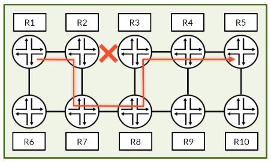
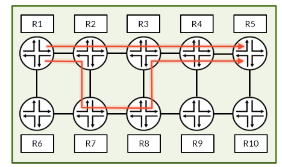
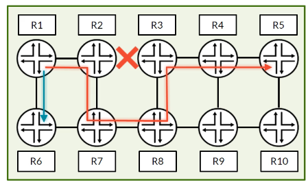
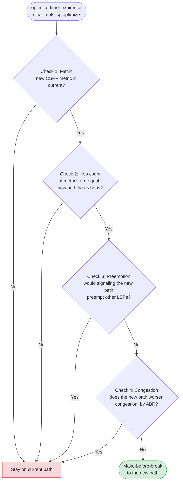
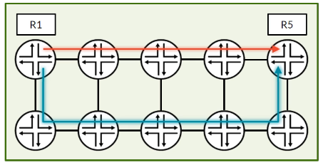

# RSVP Make-Before-Break and Adaptive

**Hitless path changes, the bandwidth double-counting problem, Shared Explicit reservations and policy-based LSP steering**

> Study notes by [Nazirul Roslan](https://www.linkedin.com/in/nazirulroslan) · Junos MPLS Fundamentals · Part 15

← [Previous: RSVP LSP Optimization](14-rsvp-lsp-optimization.md) · [Index](../README.md) · [Next: Co-Routed Bidirectional LSPs](16-corouted-bidirectional-lsps.md) →

**Contents:** [1 Make-before-break](#module-1-the-make-before-break-mechanism) · [2 Double counting and SE](#module-2-the-double-counting-problem-and-shared-explicit) · [3 Optimization workflow](#module-3-rsvp-lsp-optimization-the-complete-workflow) · [4 Policy-based steering](#module-4-policy-based-traffic-steering) · [5 Soft state](#module-5-lsp-path-validity-and-soft-state) · [6 Lab](#module-6-lab-policy-based-traffic-steering) · [7 Exam practice](#module-7-exam-practice-questions) · [8 Glossary](#module-8-glossary)

---

## Module 1: The Make-Before-Break Mechanism

**Objectives**

- Describe the make-before-break mechanism for hitless path changes.
- Explain how two versions of the same LSP can exist at the same time.
- Identify the log entries and `show` commands that verify make-before-break.

### 1.1 The challenge of LSP optimization

LSP optimization lets a router periodically re-evaluate an LSP's path and move it to a better route when one appears. But how does the move happen **without disrupting user traffic**?

The standard process after an LSP failure tears down the old path before signaling a new one, which always causes some downtime. For mission-critical applications that isn't acceptable. The answer is a technique that avoids the tear-down entirely.



*The red LSP is forced onto a longer path by the link failure between R2 and R3.*

### 1.2 The make-before-break mechanism

**Make-before-break (MBB)** means the ingress router "makes" the new LSP before it "breaks" the old one. During the transition there is a short period with **two live copies of the same LSP** in the network.



*A new, shorter path (top) is signaled while the old path is still active.*

The network and Junos can tell the two apart. They share the same LSP name and the same **Tunnel ID**, but each has a different **LSP ID**. The shared Tunnel ID is what lets the routers recognize both as belonging to the same LSP (the same RSVP session).

`show rsvp session`: two LSP instances during make-before-break.

```
naz@R1> show rsvp session

Ingress RSVP: 2 sessions
To              From            State Rt Style Labelin Labelout LSPname
192.168.1.5     192.168.1.1     Up    01 FF    -      20      R1_TO_R5
192.168.1.5     192.168.1.1     Up    01 SE    -      33      R1_TO_R5
Total 2 displayed, Up 2, Down 0
```

> [!NOTE]
> Normally both instances of an LSP use the same reservation style (both `FF`, or both `SE` when the LSP is `adaptive`). A mixed pair like the one above is what you see, for example, right after adding `adaptive` to a running LSP: the old instance was signaled FF and the new one SE.

> [!TIP]
> **Learner's perspective.** Think of it like changing a tire on a moving car. The new tire (new path) is brought in and attached while the old one is still on the road. Once the new one is stable, the car's weight shifts onto it and the old tire is removed. The car (your traffic) never stops.

### 1.3 Verifying make-before-break with logs

The clearest proof that a transition was graceful is the LSP's history log. These entries confirm that the optimization ran, a new path was computed, and make-before-break started and completed.

Example log from `show mpls lsp name <name> extensive`:

```
naz@R1> show mpls lsp name R1_TO_R5 extensive
...
11 Mar 30 10:10:58.979 CSPF Reroute due to re-optimization
13 Mar 30 10:10:58.980 Originate make-before-break call
20 Mar 30 10:10:59.587 Make before break: Switched to new instance
...
```

> [!IMPORTANT]
> **Key takeaways.** Make-before-break gives hitless LSP transitions by briefly running two versions of the same LSP. They share a Tunnel ID and differ by LSP ID. Verify with two sessions in `show rsvp session` and the log entries above. By default, though, MBB isn't foolproof: the next module shows a hidden bandwidth reservation problem and how to fix it.

---

## Module 2: The Double-Counting Problem and Shared Explicit

**Objectives**

- Explain why the default RSVP behavior can prevent optimization.
- Differentiate between the Fixed Filter (FF) and Shared Explicit (SE) reservation styles.
- Describe how the `adaptive` statement enables SE.

### 2.1 The LSP that couldn't find a path

By default, RSVP treats two versions of the same LSP as completely separate reservations. That's fine in some cases, but during optimization it causes **bandwidth double-counting**.



Assume 1 Gbps links:

- The red LSP reserves **600 Mbps** on its detour path R1–R2–R7–R8–R3–R4–R5.
- The blue LSP reserves **600 Mbps** on the R1–R6 link.
- So the R1–R2 and R1–R6 links each have only **400 Mbps** free.

Now the R2–R3 link comes back, making R1–R2–R3–R4–R5 the better path for the red LSP. But the old path has already reserved 600 Mbps, **including on R1–R2** (and R3–R4, R4–R5). The new path also needs 600 Mbps. Because RSVP treats the two versions as separate by default, it looks for an **extra** 600 Mbps on R1–R2. That link only has 400 Mbps free, so optimization fails and the LSP stays on its suboptimal path. (It can't avoid R1–R2 by going through R6 either, because the blue LSP has used up that link.)

> [!NOTE]
> The source listed the old path as R1–R7–R8–R9–R10–R5. In the diagram, the red LSP's detour is R1–R2–R7–R8–R3–R4–R5, which is why it shares the R1–R2 link with the new path.

### 2.2 Solving the problem: reservation styles

RSVP **reservation styles** tell the network how to handle bandwidth for two versions of the same LSP. There are three (Wildcard Filter, Fixed Filter and Shared Explicit); for RSVP-TE you mainly meet two:

| Style | Behavior |
|---|---|
| **Fixed Filter (FF)** | The **default**. Each sender (LSP instance) gets its own reservation, even when they share a Tunnel ID. This causes the double-counting problem. |
| **Shared Explicit (SE)** | A listed set of senders **shares one reservation**. The old and new versions of the same LSP share the reserved bandwidth on common links, so nothing is double-counted. |

The **`adaptive`** statement in Junos enables the SE style. It is highly recommended in RSVP-TE networks for this reason.

### 2.3 `adaptive` and `soft-preemption`

`adaptive` matters for more than optimization. Any time an LSP is re-signaled with make-before-break (optimization, a bandwidth change, or re-routing after it has been preempted), SE lets the new instance share bandwidth with the old one on common links.

> [!NOTE]
> **`adaptive` vs. `soft-preemption`.** You may remember `soft-preemption` from the LSP priorities module: instead of tearing down a lower-priority LSP immediately, the router lets it keep forwarding while its ingress finds a new path with make-before-break. The source said `adaptive` is generally preferred over `soft-preemption`. More accurately, they solve different problems and work well together: `soft-preemption` avoids the hard teardown of a preempted LSP, while `adaptive` makes the resulting make-before-break (and any other re-signal) avoid double-counting bandwidth.

Enable the Shared Explicit style for an LSP:

```
[edit protocols mpls]
set label-switched-path R1_TO_R5 adaptive
```

> [!IMPORTANT]
> **Key takeaways.** The default Fixed Filter style can stop LSP optimization in bandwidth-constrained networks, because it double-counts reservations during make-before-break. `adaptive` enables Shared Explicit, so the two LSP versions share one reservation. Next, the full optimization workflow.

---

## Module 3: RSVP LSP Optimization: The Complete Workflow

**Objectives**

- Describe the full four-step optimization algorithm.
- Understand the role of the available bandwidth ratio (ABR).
- Know the `optimize-aggressive` command and other caveats.

### 3.1 The full LSP optimization workflow

When a router tries to optimize an LSP (because the `optimize-timer` expired or you ran a manual command), it follows a four-step algorithm. A new path is "better" only if it passes **all four** checks. If any check fails, the LSP stays where it is, to keep the network stable.



### 3.2 Condition 4: the congestion check in detail

The last check is the most complex and the most common reason an LSP doesn't optimize. The router reorders the links of each path from most congested (lowest available bandwidth ratio, ABR) to least congested, then checks whether the new path has an equal or better ABR at every position. A shorter new path is padded with dummy links at 100%.

| | Hop 1 (worst) | Hop 2 | Hop 3 | Hop 4 (best) |
|---|---|---|---|---|
| Old path (reordered) | 10% | 15% | 15% | 25% |
| New path (reordered) | 10% | 15% | 50% | 100% (dummy) |

The new path passes: every link has an ABR equal to or better than its counterpart on the old path.

### 3.3 Manual optimization commands

You don't have to wait for `optimize-timer`. Trigger optimization with `clear`:

`clear mpls lsp name <name> optimize`: a standard, graceful optimization check.

```
naz@R1> clear mpls lsp name R1_TO_R5 optimize
```

`clear mpls lsp name <name> optimize-aggressive`: moves the LSP based on the best metric alone, skipping the other checks.

```
naz@R1> clear mpls lsp name R1_TO_R5 optimize-aggressive
```

### 3.4 Optimization gotchas

> [!WARNING]
> **Common optimization caveats**
> - **Paths with ≥5 hops only evaluate the 4 lowest-ABR links.** This simplifies the congestion check for long LSPs.
> - **With `least-fill`, the new path must be at least 10% less utilized.** This stops LSPs flapping between two equally good paths.
> - **Detour and bypass LSPs can be optimized too.** Configure `optimize-timer` under `protocols rsvp fast-reroute` or under `protocols rsvp interface <name> link-protection`.
> - **Verifying bandwidth reservations.** The reserved bandwidth is in the `Sender Tspec` object; see it with `show rsvp session detail`.

> [!IMPORTANT]
> **Key takeaways.** Optimization is a deliberate, multi-step algorithm designed to keep the network stable. Knowing the four checks, especially the congestion check, lets you predict what an LSP will do. Manual commands and `optimize-aggressive` give you more control, but know the caveats. Next: using LSPs for traffic engineering with policy-based steering.

---

## Module 4: Policy-Based Traffic Steering

**Objectives**

- Explain why creating LSPs isn't enough to control where traffic goes.
- Configure a routing policy that maps traffic to a specific LSP.
- Use `install-nexthop lsp` to steer traffic.

### 4.1 The need for deterministic traffic flow

By default, once a router has a route, it forwards over the best available next hop, which may be one of several equal-cost LSPs. That makes load-balancing unpredictable. To make sure critical traffic uses a specific engineered path, you have to tell the router explicitly which LSP to use for which traffic.



*The red LSP is the main path; the blue LSP is the backup path.*

### 4.2 Policy-based steering with `install-nexthop lsp`

The solution is a simple routing policy exported to the **forwarding table**. It uses normal match conditions (a destination prefix, a BGP community, a next hop, and so on) together with the **`install-nexthop lsp <name>`** action, which makes the router install that specific LSP as the next hop for the matching routes.

> [!NOTE]
> **Syntax correction.** The source wrote the action as `install-nexthop-lsp <name>`. The Junos policy action is `install-nexthop lsp <name>` (with a space; there are also `install-nexthop strict lsp <name>` and `install-nexthop lsp-regex <regex>`). The chosen LSP must already be one of the route's next hops: the route has to resolve over several LSPs to the same egress, which in practice means giving those LSPs equal metrics.

> [!TIP]
> **SME review.** Matching on BGP communities is very scalable and common in service provider networks. The origin of the route (for example, a customer or a PE) tags its importance, and routers can then apply the right traffic engineering policy without being configured with specific prefixes.

Example policy: map a specific prefix to a chosen LSP.

```
[edit policy-options]
set policy-statement TRAFFIC_STEERING term PREFIX_MATCH from route-filter 150.1.0.150/32 exact
set policy-statement TRAFFIC_STEERING term PREFIX_MATCH then install-nexthop lsp R1-to-R4-prefix-match
```

> [!IMPORTANT]
> **Key takeaways.** Policy-based steering gives you deterministic control over which LSP carries which traffic, instead of the default, often unpredictable, load-balancing. Next, a quick review of how RSVP keeps LSP paths alive over time.

---

## Module 5: LSP Path Validity and Soft State

**Objectives**

- Understand RSVP's soft-state model for LSP maintenance.
- Explain the role of Path and Resv messages and their timers.
- Describe how Hello messages detect failures faster.

### 5.1 The RSVP soft-state model

RSVP is a **soft-state** protocol. LSPs aren't set up and then forgotten: their state has to be refreshed continuously by the routers along the path. This keeps the network aware of each LSP's health.

Two message types do the refreshing:

- **Path messages** travel **downstream** (toward the egress). They carry the desired path and bandwidth request.
- **Resv messages** travel **upstream** (toward the ingress). They confirm the reservation and carry the labels.

Refreshes are sent **hop by hop**: each router refreshes the state with its neighbor on its own timer, rather than the ingress and egress re-sending end to end.

> [!NOTE]
> **Refresh time and keep-multiplier.** Each router keeps a state block per LSP. If it stops receiving refreshes for it, the state times out and is removed. In Junos the defaults are **`refresh-time` 30 seconds** and **`keep-multiplier` 3**. Per RFC 2205, the state lifetime is `(keep-multiplier + 0.5) × 1.5 × refresh-time`, which with the defaults is about **157 seconds**.

> [!NOTE]
> **Correction.** The source said the default refresh time is "often 20 minutes with refresh reduction", giving a 60-minute timeout. The Junos default refresh time is 30 seconds. Refresh reduction (RFC 2961) makes refreshes cheaper (message IDs, summary refresh); it doesn't change the default to 20 minutes.

### 5.2 Faster failure detection with Hello messages

Path and Resv refreshes are fine for long-term state, but far too slow to detect failures. For that RSVP uses lightweight **Hello messages**.

Hellos are exchanged between directly connected RSVP neighbors (the Junos default `hello-interval` is **9 seconds**). If a router stops hearing Hellos from a neighbor, it declares the neighbor down and reacts: for example, it starts local repair (fast reroute), sends a **PathErr upstream** toward the ingress, and a **PathTear downstream** for the affected LSPs.

> [!NOTE]
> **Corrections.** The source said a router sends a "PathTear upstream" on neighbor failure: PathTear travels **downstream**; the upstream notification is PathErr (or ResvTear). It also described Hellos as giving sub-second detection. With the default 9-second interval, Hello-based detection takes tens of seconds. For sub-second detection, use **BFD** with RSVP (`protocols rsvp interface <name> bfd-liveness-detection`), or rely on the physical link going down.

> [!IMPORTANT]
> **Key takeaways.** RSVP is soft-state: periodic Path and Resv refreshes maintain LSP state, while Hellos (or BFD for real speed) detect neighbor failures faster. Together they keep LSPs stable and resilient. Now, the policy-based steering lab.

---

## Module 6: Lab: Policy-Based Traffic Steering

### Overview and prerequisites

This lab demonstrates RSVP policy-based traffic steering. You build two LSPs from R1 to R4 and use routing policy on R1 to map traffic toward two prefixes behind R4 onto a specific LSP each, one matched by **prefix** and one by **BGP community**.

- **Prerequisites:** the 8-router lab topology with IS-IS, MPLS and RSVP already configured on the core routers.
- **CE-150:** the destination network for this lab, connected to R4 (AS 150). It advertises two loopback prefixes.
- **R1:** the ingress router, where the steering policy is applied.


> [!NOTE]
> **Lab correction.** The source's lab advertised CE-100's loopbacks (which sit behind R1 itself) and then pinged R4's loopback. Those routes never resolve over an LSP from R1, and the test traffic's destination wasn't matched by the policy, so the steering couldn't take effect. It also had the BGP AS numbers mixed up (`peer-as` is the **neighbor's** AS). The lab below keeps the author's LSPs, policy structure and goals, but steers traffic toward prefixes behind R4, learned by R1 over IBGP. Addresses for the R4–CE-150 link (R4 `150.150.150.4`, CE-150 `150.150.150.150`) follow the pattern of the CE-100 link; adjust them to your lab.

### Part 1: Initial LSP setup on R1

**Goal:** build two RSVP LSPs from R1 to R4 with different paths, bandwidth and priorities, as targets for the steering policy.

**Reasoning:** you need two working, distinct LSPs to show steering. Their different priorities show how they could serve different classes of traffic.

Configuration (on R1):

**LSP `R1-to-R4-prefix-match`** (for prefix-based steering). `priority 3 0` sets setup priority 3 and hold priority 0 (lower number = higher priority). `primary` links it to a named path.

```
set protocols mpls label-switched-path R1-to-R4-prefix-match to 192.168.1.4 bandwidth 600m priority 3 0
set protocols mpls label-switched-path R1-to-R4-prefix-match primary R1-R2-R3-R4
```

The named path. `loose` lets CSPF reach each listed hop through any intermediate routers.

```
set protocols mpls path R1-R2-R3-R4 192.168.1.2 loose
set protocols mpls path R1-R2-R3-R4 192.168.1.3 loose
set protocols mpls path R1-R2-R3-R4 192.168.1.4 loose
```

**LSP `R1-to-R4-via-R6-community`** (for community-based steering), with less bandwidth (`400m`) and lower priority (`priority 5 3`), for best-effort traffic.

```
set protocols mpls label-switched-path R1-to-R4-via-R6-community to 192.168.1.4 bandwidth 400m priority 5 3
set protocols mpls label-switched-path R1-to-R4-via-R6-community primary R1-R5-R6-R7-R8-R4
```

Its named path takes the longer route along the bottom row, via R5 and R6:

```
set protocols mpls path R1-R5-R6-R7-R8-R4 192.168.1.5 loose
set protocols mpls path R1-R5-R6-R7-R8-R4 192.168.1.6 loose
set protocols mpls path R1-R5-R6-R7-R8-R4 192.168.1.7 loose
set protocols mpls path R1-R5-R6-R7-R8-R4 192.168.1.8 loose
set protocols mpls path R1-R5-R6-R7-R8-R4 192.168.1.4 loose
```

Give both LSPs the **same metric**, so both are installed as next hops for `192.168.1.4` in `inet.3`. (By default an LSP's metric is its IGP path cost, so the longer LSP would lose and couldn't be selected by the policy.)

```
set protocols mpls label-switched-path R1-to-R4-prefix-match metric 10
set protocols mpls label-switched-path R1-to-R4-via-R6-community metric 10
```

Verification (on R1): both LSPs are up and signaled on their paths, and `inet.3` has both as next hops.

```
naz@R1> show mpls lsp name R1-to-R4-prefix-match
naz@R1> show mpls lsp name R1-to-R4-via-R6-community
naz@R1> show rsvp session
naz@R1> show route table inet.3 192.168.1.4
```

### Part 2: CE-150 and BGP route sourcing

**Goal:** give CE-150 two loopback prefixes, advertise one plainly and one with a BGP community, and carry both to R1.

**Reasoning:** this gives us routes with different attributes to match in R1's steering policy. Because R4 advertises them to R1 with itself (`192.168.1.4`) as the BGP next hop, R1 resolves them over the LSPs to R4.

Configuration (on CE-150):

Loopback with two /32 addresses:

```
set interfaces lo0 unit 0 family inet address 150.1.0.150/32
set interfaces lo0 unit 0 family inet address 150.0.0.150/32
```

EBGP to R4. `peer-as` is the **neighbor's** AS (the core is AS 64512). A default route back to R4 lets CE-150 answer the test pings.

```
set routing-options autonomous-system 150
set routing-options static route 0.0.0.0/0 next-hop 150.150.150.4
set protocols bgp group EBGP type external
set protocols bgp group EBGP neighbor 150.150.150.4 peer-as 64512
set protocols bgp group EBGP export [ EXPORT_LO0_PREFIX_MATCH EXPORT_LO0_COMMUNITY ]
```

Export policy for the prefix-match route (`150.1.0.150/32`):

```
set policy-options policy-statement EXPORT_LO0_PREFIX_MATCH term 1 from protocol direct
set policy-options policy-statement EXPORT_LO0_PREFIX_MATCH term 1 from route-filter 150.1.0.150/32 exact
set policy-options policy-statement EXPORT_LO0_PREFIX_MATCH term 1 then accept
```

Export policy for the community-match route (`150.0.0.150/32`), tagged with `community_lsp_steer`:

```
set policy-options policy-statement EXPORT_LO0_COMMUNITY term 1 from protocol direct
set policy-options policy-statement EXPORT_LO0_COMMUNITY term 1 from route-filter 150.0.0.150/32 exact
set policy-options policy-statement EXPORT_LO0_COMMUNITY term 1 then community add community_lsp_steer
set policy-options policy-statement EXPORT_LO0_COMMUNITY term 1 then accept
set policy-options community community_lsp_steer members 65100:100
```

Configuration (on R4): EBGP to CE-150 and IBGP to R1, with next-hop self so R1 sees `192.168.1.4` as the next hop.

```
set routing-options autonomous-system 64512
set protocols bgp group EBGP type external
set protocols bgp group EBGP neighbor 150.150.150.150 peer-as 150
set protocols bgp group IBGP type internal
set protocols bgp group IBGP local-address 192.168.1.4
set protocols bgp group IBGP neighbor 192.168.1.1
set protocols bgp group IBGP export NHS
set policy-options policy-statement NHS term 1 from protocol bgp
set policy-options policy-statement NHS term 1 then next-hop self
```

Configuration (on R1): IBGP to R4.

```
set routing-options autonomous-system 64512
set protocols bgp group IBGP type internal
set protocols bgp group IBGP local-address 192.168.1.1
set protocols bgp group IBGP neighbor 192.168.1.4
```

Verification (on R1): R1 has learned both routes, with protocol next hop `192.168.1.4` resolved over both LSPs, and `150.0.0.150/32` carries community `65100:100`.

```
naz@R1> show bgp summary
naz@R1> show route 150.1.0.150/32 detail
naz@R1> show route 150.0.0.150/32 detail
```

### Part 3: Policy-based steering on R1

**Goal:** direct traffic matching a destination prefix or a BGP community onto the chosen RSVP LSP.

**Reasoning:** this switches on the traffic engineering logic, using the LSPs from Part 1 and the BGP routes from Part 2.

Configuration (on R1):

**Steering policy `TRAFFIC_STEERING`.** `PREFIX_MATCH` matches `150.1.0.150/32` and installs the `R1-to-R4-prefix-match` LSP as its next hop. `COMMUNITY_MATCH` matches routes tagged `community_lsp_steer` and installs `R1-to-R4-via-R6-community`. `DEFAULT_ACCEPT` lets everything else be installed normally.

```
set policy-options policy-statement TRAFFIC_STEERING term PREFIX_MATCH from route-filter 150.1.0.150/32 exact
set policy-options policy-statement TRAFFIC_STEERING term PREFIX_MATCH then install-nexthop lsp R1-to-R4-prefix-match
set policy-options policy-statement TRAFFIC_STEERING term PREFIX_MATCH then accept
set policy-options policy-statement TRAFFIC_STEERING term COMMUNITY_MATCH from community community_lsp_steer
set policy-options policy-statement TRAFFIC_STEERING term COMMUNITY_MATCH then install-nexthop lsp R1-to-R4-via-R6-community
set policy-options policy-statement TRAFFIC_STEERING term COMMUNITY_MATCH then accept
set policy-options policy-statement TRAFFIC_STEERING term DEFAULT_ACCEPT then accept
set policy-options community community_lsp_steer members 65100:100
```

> [!NOTE]
> The `accept` in each steering term is added because `install-nexthop` isn't a terminating action; without it, evaluation would fall through to the next term. R1 also needs its own definition of `community_lsp_steer` to match on it.

**Apply the policy to the forwarding table.** Forwarding-table export policies control what the routing table installs in the forwarding table on this router.

```
set routing-options forwarding-table export TRAFFIC_STEERING
```

Verification (on R1): the forwarding table now shows the chosen LSP as the next hop for each matched route, rather than both LSPs.

```
naz@R1> show route forwarding-table destination 150.1.0.150/32 extensive
naz@R1> show route forwarding-table destination 150.0.0.150/32 extensive
```

### Part 4: Generate traffic and verify steering

**Goal:** send test traffic toward both prefixes and confirm each flow uses the intended LSP.

**Reasoning:** the final, most important check that the whole setup works, showing traffic engineering in action.

From R1, send traffic to each prefix. `traceroute` shows the path taken (and the MPLS labels on each hop):

```
naz@R1> ping 150.1.0.150 source 192.168.1.1 count 5
naz@R1> traceroute 150.1.0.150 source 192.168.1.1
naz@R1> ping 150.0.0.150 source 192.168.1.1 count 5
naz@R1> traceroute 150.0.0.150 source 192.168.1.1
```

Expected result: traffic to `150.1.0.150` goes through R2 and R3, and traffic to `150.0.0.150` goes through R5, R6, R7 and R8.

You can also watch the labeled packets leave R1 on each core-facing interface. Because the test traffic is sourced by R1's Routing Engine, `monitor traffic` can see it:

```
# Interface toward R2: prefix-matched traffic
monitor traffic interface ge-0/0/0.0 size 1500 no-resolve
# Interface toward R5: community-matched traffic
monitor traffic interface ge-0/0/2.0 size 1500 no-resolve
```

> [!NOTE]
> `monitor traffic` only captures traffic sent or received by the Routing Engine, not transit traffic forwarded by the PFE. That's why this version tests from R1 itself. The source's step of deactivating one CE export policy and activating the other isn't needed here, since CE-150 advertises both prefixes at once.

> [!IMPORTANT]
> **Lab outcome: policy-based traffic steering**
> - You can build and run several LSPs with different characteristics to the same egress.
> - Routing policy with `install-nexthop lsp` steers traffic onto a chosen LSP, matching on destination prefix or BGP community.
> - This is a deterministic, scalable way to apply traffic engineering in a service provider network.

**Policy-based steering verification commands**

| Command | Use |
|---|---|
| `show mpls lsp extensive` | LSPs are up and have active paths |
| `show bgp summary` | BGP sessions are established |
| `show route <prefix> detail` | Routes are learned with the right attributes (for example, the BGP community) |
| `show route forwarding-table destination <prefix> extensive` | The most important one: confirms the LSP next hop installed in the forwarding table |

---

## Module 7: Exam Practice Questions

**Question 1.** Which two values uniquely identify two co-existing versions of the same LSP during a make-before-break transition?

- A) Name and LSP ID
- B) LSP ID and Tunnel ID
- C) Tunnel ID and Name
- D) Name and Reservation Style

<details><summary>Answer</summary>

**B.** The Tunnel ID identifies the LSP (it is the same for a given LSP name) and groups the two instances together. The LSP ID is different for each instance, which lets the network tell the old path from the new one.

</details>

**Question 2.** An LSP has an `optimize-timer` but doesn't move to a newly available shorter path. The new path has a lower IGP metric, but the old path is using most of the bandwidth on a shared link. What is the most likely cause, and what fixes it?

- A) The LSP is configured with `fast-reroute`. Use `link-protection` instead.
- B) The LSP uses the default Fixed Filter reservation style. Configure the LSP with `adaptive`.
- C) The LSP is configured with `node-link-protection`. Use `link-protection` instead.
- D) The LSP has no `primary` path. Add a `primary` path.

<details><summary>Answer</summary>

**B.** By default RSVP uses the Fixed Filter (FF) style, which double-counts bandwidth during optimization. `adaptive` enables Shared Explicit (SE), so the old and new LSP versions share the same reservation and optimization can succeed.

</details>

**Question 3.** Which of these RSVP features benefits from the make-before-break and Shared Explicit behavior provided by `adaptive`?

- A) Local repair
- B) LSP preemption
- C) Primary and secondary paths
- D) Fast reroute

<details><summary>Answer</summary>

**B.** When an LSP is preempted gracefully (for example with `soft-preemption`), its ingress re-signals it on a new path with make-before-break. With `adaptive`, the new instance can share bandwidth with the old one on common links instead of double-counting it. This is its main benefit beyond optimization. (Local repair and fast reroute use detours or bypasses, and primary/secondary paths are separate path instances, so SE sharing isn't what makes them work.)

</details>

---

## Module 8: Glossary

| Term | Definition |
|---|---|
| **Adaptive** | The `adaptive` statement: enables the Shared Explicit (SE) reservation style, so an LSP's old and new instances share bandwidth during make-before-break (optimization, re-routing after preemption, and so on). |
| **Fixed Filter (FF)** | The default RSVP reservation style. Each LSP instance gets its own reservation, even during make-before-break. |
| **Make-Before-Break (MBB)** | A new LSP path is signaled and established before the old path is torn down, for a hitless transition. |
| **Shared Explicit (SE)** | An RSVP reservation style that lets two versions of the same LSP share one bandwidth reservation, preventing double-counting. |
| **Soft State** | State (such as an LSP's path) must be refreshed periodically; if refreshes stop, it times out and is removed. |
| **LSP ID** | Identifies each instance of an LSP. Distinguishes the two concurrent versions of an LSP during make-before-break. |
| **Tunnel ID** | Identifies the LSP (the RSVP session). Shared by the old and new instances during make-before-break. |
| **Soft Preemption** | Lets a preempted lower-priority LSP keep forwarding while its ingress finds a new path, instead of being torn down immediately. |
| **`install-nexthop lsp`** | Routing policy action that installs a specific LSP as the next hop for matching routes, normally in a forwarding-table export policy. |

---

← [Previous: RSVP LSP Optimization](14-rsvp-lsp-optimization.md) · [Index](../README.md) · [Next: Co-Routed Bidirectional LSPs](16-corouted-bidirectional-lsps.md) →
