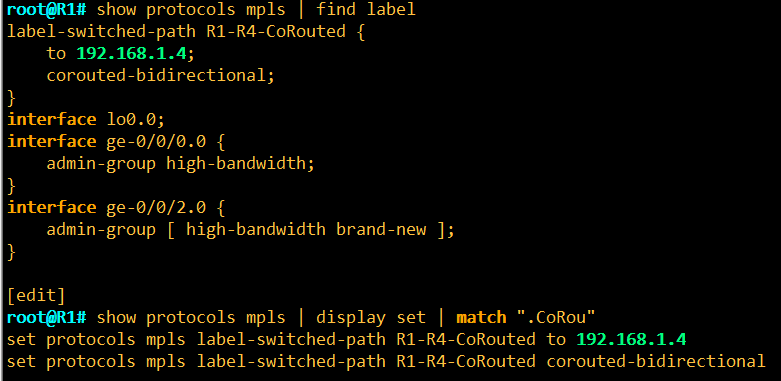
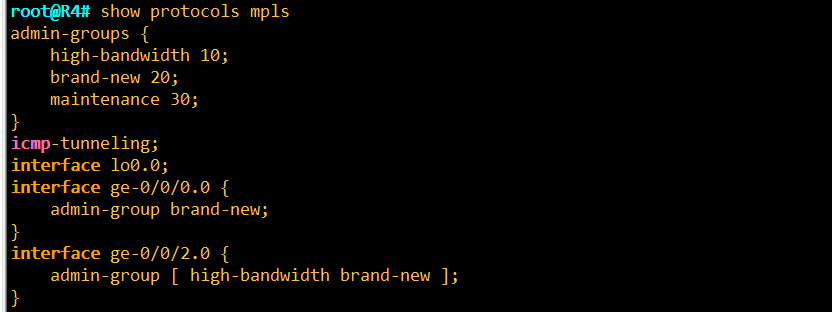
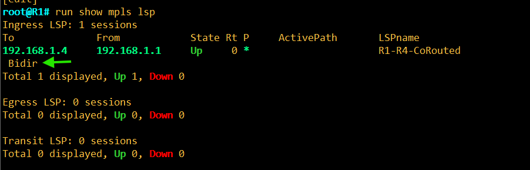
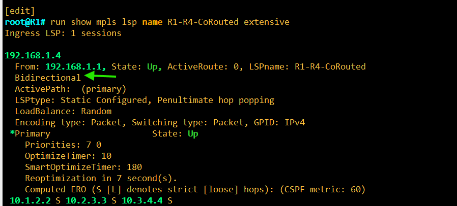
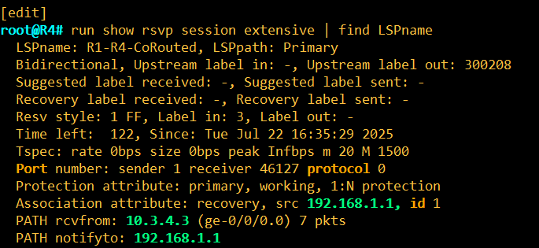
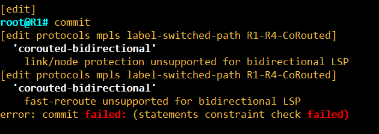
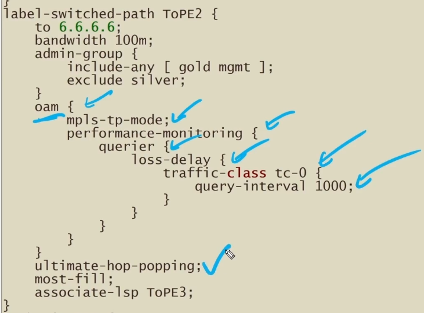
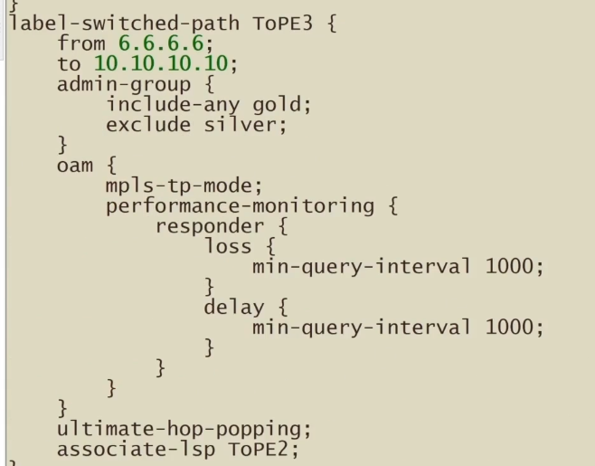

# Co-Routed Bidirectional LSPs

**Lab notes: one RSVP LSP that carries traffic in both directions over the same path, plus MPLS-TP performance monitoring on associated LSPs**

> Study notes by [Nazirul Roslan](https://www.linkedin.com/in/nazirulroslan) · Junos MPLS Fundamentals · Part 16 (bonus lab notes)

← [Previous: RSVP Make-Before-Break and Adaptive](15-rsvp-make-before-break-adaptive.md) · [Index](../README.md)

**Contents:** [1 Why bidirectional](#1-why-bidirectional-lsps) · [2 Configuration](#2-configuring-a-co-routed-bidirectional-lsp) · [3 Verification](#3-verification) · [4 Limitation: no FRR](#4-limitation-no-local-protection) · [5 Performance monitoring](#5-associated-bidirectional-lsps-with-performance-monitoring) · [6 Takeaways](#6-key-takeaways)

---

## 1. Why bidirectional LSPs?

Every RSVP LSP in Parts 04–15 is **unidirectional**: R1 → R4 is one LSP, and R4 → R1 needs a second, completely independent LSP. The two can take different paths, which is fine for most IP traffic but a problem for:

- **Transport-style services** (MPLS-TP, circuit emulation) that expect symmetric latency.
- **OAM and performance monitoring**, where delay and loss measurements only make sense if both directions share the same links.
- **Simpler operations:** one LSP to configure, one path to troubleshoot.

Junos offers two models:

| | Co-routed bidirectional | Associated bidirectional |
|---|---|---|
| LSPs | **One** RSVP session signals both directions | **Two** unidirectional LSPs, bound together |
| Path | Guaranteed identical in both directions | Each LSP computes its own path |
| Configured with | `corouted-bidirectional` on the ingress | `associate-lsp <name>` on each LSP |
| Section | 2–4 | 5 |

---

## 2. Configuring a co-routed bidirectional LSP

The lab reuses the 8-router topology and admin groups from [Part 09](09-rsvp-cspf-tie-breakers-admin-groups.md): **high-bandwidth** (hb), **brand-new** (bn) and **maintenance** (m).


### R1 (ingress)

The only new statement is `corouted-bidirectional`:

```
root@R1# show protocols mpls | find label
label-switched-path R1-R4-CoRouted {
    to 192.168.1.4;
    corouted-bidirectional;
}
interface lo0.0;
interface ge-0/0/0.0 {
    admin-group high-bandwidth;
}
interface ge-0/0/2.0 {
    admin-group [ high-bandwidth brand-new ];
}
```

As `set` commands:

```
set protocols mpls label-switched-path R1-R4-CoRouted to 192.168.1.4
set protocols mpls label-switched-path R1-R4-CoRouted corouted-bidirectional
```



### R4 (egress)

R4 has **no LSP configuration** for the reverse direction. It only needs MPLS and RSVP on its interfaces (as for any LSP). The reverse direction is signaled automatically as part of the same RSVP session.

```
root@R4# show protocols mpls
admin-groups {
    high-bandwidth 10;
    brand-new 20;
    maintenance 30;
}
icmp-tunneling;
interface lo0.0;
interface ge-0/0/0.0 {
    admin-group brand-new;
}
interface ge-0/0/2.0 {
    admin-group [ high-bandwidth brand-new ];
}
```



> [!NOTE]
> The admin-group names must map to the **same numbers on every router**, because only the number (the bit position) is flooded in the IGP. R4 uses 10, 20 and 30 here. Make sure the other routers in the lab use the same values.

---

## 3. Verification

### On the ingress: `show mpls lsp`

The LSP shows the **Bidir** flag:

```
root@R1# run show mpls lsp
Ingress LSP: 1 sessions
To              From            State Rt P     ActivePath       LSPname
192.168.1.4     192.168.1.1     Up     0 *                      R1-R4-CoRouted
 Bidir
Total 1 displayed, Up 1, Down 0
```



### On the ingress: `show mpls lsp name ... extensive`

```
root@R1# run show mpls lsp name R1-R4-CoRouted extensive
Ingress LSP: 1 sessions

192.168.1.4
  From: 192.168.1.1, State: Up, ActiveRoute: 0, LSPname: R1-R4-CoRouted
  Bidirectional
  ActivePath:  (primary)
  LSPtype: Static Configured, Penultimate hop popping
  LoadBalance: Random
  Encoding type: Packet, Switching type: Packet, GPID: IPv4
 *Primary                    State: Up
    Priorities: 7 0
    OptimizeTimer: 10
    SmartOptimizeTimer: 180
    Reoptimization in 7 second(s).
    Computed ERO (S [L] denotes strict [loose] hops): (CSPF metric: 60)
 10.1.2.2 S 10.2.3.3 S 10.3.4.4 S
```



What to look for:
- **Bidirectional** confirms the LSP was signaled as co-routed.
- The **Computed ERO** (R1 → R2 → R3 → R4) is the path used in **both** directions.
- `LSPtype: Static Configured` means configured by hand on the ingress (it's still RSVP-signaled), as in [Part 05](05-rsvp-basic-lsp.md).
- `OptimizeTimer: 10` shows an optimize timer is set on this LSP (see [Part 14](14-rsvp-lsp-optimization.md)).

### On the egress: `show rsvp session extensive`

R4 sees the session as bidirectional and allocates an **upstream label** for the reverse direction:

```
root@R4# run show rsvp session extensive | find LSPname
  LSPname: R1-R4-CoRouted, LSPpath: Primary
  Bidirectional, Upstream label in: -, Upstream label out: 300208
  Suggested label received: -, Suggested label sent: -
  Recovery label received: -, Recovery label sent: -
  Resv style: 1 FF, Label in: 3, Label out: -
  Time left:  122, Since: Tue Jul 22 16:35:29 2025
  Tspec: rate 0bps size 0bps peak Infbps m 20 M 1500
  Port number: sender 1 receiver 46127 protocol 0
  Protection attribute: primary, working, 1:N protection
  Association attribute: recovery, src 192.168.1.1, id 1
  PATH rcvfrom: 10.3.4.3 (ge-0/0/0.0) 7 pkts
  PATH notifyto: 192.168.1.1
```



Reading the output:

| Field | Meaning |
|---|---|
| `Bidirectional` | This session carries both directions |
| `Upstream label out: 300208` | Label R4 pushes when sending **back toward R1** (the reverse direction) |
| `Label in: 3` | Forward direction: R4 advertised implicit null, so R3 pops (PHP) |
| `Resv style: 1 FF` | Fixed Filter reservation |
| `Protection attribute` / `Association attribute` | GMPLS-style objects used for bidirectional LSPs, linking the session to its ingress (src 192.168.1.1) |
| `PATH rcvfrom: 10.3.4.3` | The Path message arrived from R3, matching the ERO |

> [!TIP]
> **How the reverse label works:** in a normal LSP, labels are only allocated downstream-to-upstream (in the Resv). In a co-routed bidirectional LSP, each router also includes an **upstream label** in the Path message, telling its upstream neighbor which label to use for traffic flowing back. That's how one signaling exchange builds both directions over the same hops.

---

## 4. Limitation: no local protection

Trying to add fast reroute or link/node protection to a co-routed bidirectional LSP fails at commit:

```
root@R1# commit
[edit protocols mpls label-switched-path R1-R4-CoRouted]
  'corouted-bidirectional'
    link/node protection unsupported for bidirectional LSP
[edit protocols mpls label-switched-path R1-R4-CoRouted]
  'corouted-bidirectional'
    fast-reroute unsupported for bidirectional LSP
error: commit failed: (statements constraint check failed)
```



> [!WARNING]
> **Exam/lab gotcha:** the local repair methods from [Part 12](12-rsvp-local-repair-part-1.md) and [Part 13](13-rsvp-local-repair-part-2.md) (`fast-reroute`, `link-protection`, `node-link-protection`) are **not** supported on co-routed bidirectional LSPs, at least on the release used in this lab. Protect them with end-to-end path protection (for example a standby secondary path, [Part 11](11-rsvp-primary-secondary-paths.md)) instead. Check your Junos release notes, since support can change.

---

## 5. Associated bidirectional LSPs with performance monitoring

The second model binds **two unidirectional LSPs** into a pair with `associate-lsp`. Each keeps its own path and constraints, but the pair can run **MPLS-TP OAM**, including loss and delay measurement.

> [!NOTE]
> These configs come from a different lab (loopbacks 6.6.6.6 and 10.10.10.10, admin groups gold, silver and mgmt), so they don't match the topology above.

### The forward LSP (querier side)

```
label-switched-path ToPE2 {
    to 6.6.6.6;
    bandwidth 100m;
    admin-group {
        include-any [ gold mgmt ];
        exclude silver;
    }
    oam {
        mpls-tp-mode;
        performance-monitoring {
            querier {
                loss-delay {
                    traffic-class tc-0 {
                        query-interval 1000;
                    }
                }
            }
        }
    }
    ultimate-hop-popping;
    most-fill;
    associate-lsp ToPE3;
}
```



### The reverse LSP (responder side)

```
label-switched-path ToPE3 {
    from 6.6.6.6;
    to 10.10.10.10;
    admin-group {
        include-any gold;
        exclude silver;
    }
    oam {
        mpls-tp-mode;
        performance-monitoring {
            responder {
                loss {
                    min-query-interval 1000;
                }
                delay {
                    min-query-interval 1000;
                }
            }
        }
    }
    ultimate-hop-popping;
    associate-lsp ToPE2;
}
```



### What each part does

| Statement | Purpose |
|---|---|
| `associate-lsp` | Binds this LSP to its reverse partner, forming an associated bidirectional pair |
| `oam mpls-tp-mode` | Enables MPLS-TP style OAM on the LSP |
| `querier` / `loss-delay` | This end **sends** loss and delay measurement queries (here for traffic class tc-0, every 1000 ms) |
| `responder` | This end **answers** queries; `min-query-interval` limits how often it accepts them |
| `ultimate-hop-popping` | The egress (not the penultimate hop) pops the label, so OAM packets reach the endpoint still labeled. Required for MPLS-TP OAM |
| `most-fill` | CSPF tie-breaker (see [Part 09](09-rsvp-cspf-tie-breakers-admin-groups.md)) |
| `from 6.6.6.6` | Sets the LSP's source address |

> [!IMPORTANT]
> Performance monitoring needs **both** ends: a querier on one LSP and a responder on its associated partner. Without `ultimate-hop-popping`, the penultimate router would strip the label and the OAM exchange would break.

---

## 6. Key takeaways

> [!IMPORTANT]
> - `corouted-bidirectional` on the **ingress only** builds one RSVP session that carries traffic both ways over the **same path**. The egress needs no LSP config.
> - Verify with the **Bidir** flag (`show mpls lsp`), **Bidirectional** in the extensive output, and the **Upstream label** on the egress (`show rsvp session extensive`).
> - Co-routed bidirectional LSPs don't support `fast-reroute` or link/node protection (commit fails).
> - `associate-lsp` pairs two independent unidirectional LSPs. Add `oam mpls-tp-mode` + `performance-monitoring` (querier on one, responder on the other) and `ultimate-hop-popping` for loss and delay measurement.

---

← [Previous: RSVP Make-Before-Break and Adaptive](15-rsvp-make-before-break-adaptive.md) · [Index](../README.md)
